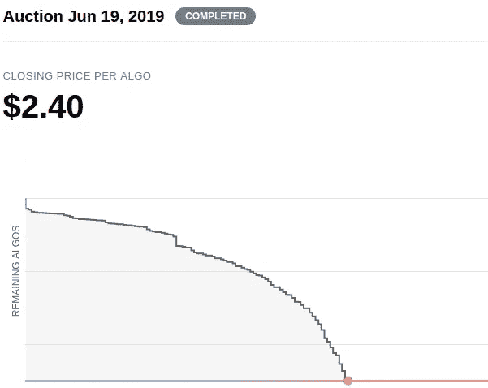
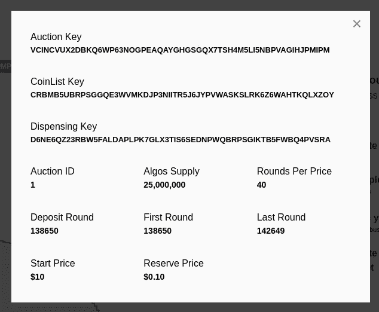
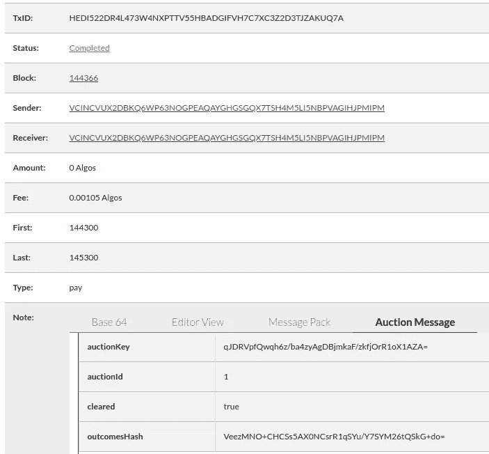

# 第一次阿尔格兰德荷兰拍卖会——透明？

> 原文：<https://medium.com/hackernoon/first-algorand-dutch-auction-transparent-873afa1c0fd5>



[https://auctions.algorand.foundation/algorand/auction](https://auctions.algorand.foundation/algorand/auction)

上周三，6 月 19 日，是第一次阿尔格兰德基金会荷兰拍卖会；因此，第一个算法被发布。

# 快速回顾——荷兰式拍卖是如何运作的

阿尔格兰德基金会有最好的资源让你了解他们的阿尔戈拍卖是如何运作的:

*   [Algo Auctions](https://algorand.foundation/algo-auctions) ，了解拍卖机制。
*   [Token Dynamics](https://algorand.foundation/token-dynamics) ，了解第一次拍卖如何符合长期计划和规则。
*   [荷兰拍卖如何运作](https://www.youtube.com/watch?v=0xlLgteeqQE)，一个更好理解它们的短片。

简单来说，拍卖的目标是找到市场愿意为拍卖的 Algos 数量支付的价格(称为清算价格)。

你可能已经看过了，**这个过程据说是公平的，但是为什么呢？**

首先，每个人支付相同的价格。即使你在拍卖达到清算价格之前出价，你也要支付清算价格。

第二，参与拍卖的每个人都有相同的实时信息。每个人在做投标决定时都处于同一条船上。

然而，即使我们认为这听起来很公平，但最终结果的透明度呢？我们应该相信阿尔格朗基金会关于谁以什么价格收到了多少阿尔格朗的结果吗？

在本文中，我将解释并给出一个您可以自己执行的步骤，即**检查官方公布的拍卖结果。**

# 我们在这里想做什么？

提及拍卖结果的阿尔格兰德基金会官方博客文章可以在[这里](https://algorand.foundation/june192019winnings)找到。在那篇文章中，他们声称:

> 这个文件的 hash 已经提交到 Algorand 区块链的 Block 144366，Transaction hedi 522 dr 4 l 473 w 4 nxpttv 55 hbadgifvh 7 c 7 xc 3 z 2d 3 tjzakuq 7 a。
> 
> hash 为 kxt 3 gmgtxyehbevtsl 5 bufmuowusmlx 5 r 3j gbtn 2 wuckig 7 HNA，可以通过以下方法获得:sha 512 _ 256(" aO " | | auction 1 . outcomes)

为了证实这一说法，我们应该详细理解公开承诺的含义。

*auction1.outcomes* 文件是一个包含拍卖结果的二进制文件。这代表拍卖结束时，每个投标人赢得了多少算法。现在，让我们假设这个文件是正确的。

为了简洁和唯一地表示这个结果，Algorand Foundation 构造了一个*提交散列*，它是对文件应用 *SHA512_256* 散列函数的结果(带有一个前缀，表示提交对应的是哪种结果)，从而产生输出:*kxt 3 gmgtxyehbevtsa l5 bufmuowuwusml x 5r 3j gbtn 2 wuckig 7 HNA。*

随后，他们将这个散列结果发布在 Algorand 区块链中，这可以在块 144366 内的[事务](https://algoexplorer.io/tx/HEDI522DR4L473W4NXPTTV55HBADGIFVH7C7XC3Z2D3TJZAKUQ7A)中找到。

即使阿尔格兰德基金会网站遭到黑客攻击，有人试图通过提供一个新的伪造的 *auction1.outcome* 文件来欺骗人们，让他们认为现在的结果是不同的，这也很容易被发现，因为这个文件的哈希与提交给阿尔格兰德区块链的哈希不匹配。由于区块链是一种不可变的数据结构，并且分叉在设计上是不可能的，所以*auction 1 . output*不能被改变，并且继续与提交的散列匹配。

然而，如果这个 *auction1.outcome* 没有被正确计算呢？如何才能透明地检查结果？

我们可以使用[*auction minion*](https://github.com/algorand/go-algorand/tree/6cbbcda734906f3f64a63356f199d6189964b782/cmd/auctionminion)*，它在最近开源的*go-algrand*资源库中可用。(感谢工程研究副总裁 Naveed Ihsanullah 告诉我这件事)。*

*这与基金会管理拍卖和计算结果使用的命令行工具相同，所以让我们自己尝试使用它，看看最终的输出哈希是否与链上提交的哈希匹配。使用这一工具，我们可以以可验证和透明的方式验证结果，原因有二:*

*   *代码是开源的，所以我们可以检查拍卖计算是如何进行的。*
*   *用于计算的这个工具数据源将是我们自己的节点分类帐，所以我们不信任一些外部实体节点，因此也不信任外部数据。*

*简而言之，我们将从源代码编译该工具，然后该工具将使用我们的节点中包含的拍卖投标数据来重新生成拍卖结果。重新生成的拍卖结果的散列， *auction1.outcome，*可以与阿尔格兰德基金会在区块链提交的结果相比较。如果散列是相同的，那么我们确认拍卖结果也是相同的。*

# *逐步验证步骤*

*让我们在 Ubuntu 机器上完全从零开始。为了使这些步骤易于重现，所有指向源代码的链接都将指向特定的提交，而不是可能改变的分支。*

## *步骤 1 —在 MainNet 上运行归档节点*

*为此，我们有两个选择，从 Algorand 开发者网站下载最新的二进制文件，或者从源代码构建。*

*对于第一个选项，您应该遵循[开发者网站](https://developer.algorand.org/docs/introduction-installing-node)中描述的步骤。一个重要的考虑是节点的*数据*文件夹应该有一个 *config.json* 文件，其中*存档*标志应该设置为*真(*默认为*假)。*该标志应在节点首次启动前设置，否则本地数据将处于不一致状态。*

*归档行为是必要的，因为默认的节点行为是只在本地保留最近几百轮数据块，以最大限度地降低节点的存储需求。如果拍卖发生在这个最小保留范围之前 *auctionminion* 将找不到拍卖块。*

*您可以从位于`data`文件夹中已经存在的 *config.json.example* 文件生成 *config.json* 。*

*启动节点，等待它完成同步:*

```
*ignacio@ihagopian:~/node$ ./goal node status
Last committed block: 193153
Time since last block: 2.2s
**Sync Time: 0.0s**
Last consensus protocol: [https://github.com/algorandfoundation/specs/tree/5615adc36bad610c7f165fa2967f4ecfa75125f0](https://github.com/algorandfoundation/specs/tree/5615adc36bad610c7f165fa2967f4ecfa75125f0)
Next consensus protocol: [https://github.com/algorandfoundation/specs/tree/5615adc36bad610c7f165fa2967f4ecfa75125f0](https://github.com/algorandfoundation/specs/tree/5615adc36bad610c7f165fa2967f4ecfa75125f0)
Round for next consensus protocol: 193154
Next consensus protocol supported: true
**Genesis ID: mainnet-v1.0**
Genesis hash: wGHE2Pwdvd7S12BL5FaOP20EGYesN73ktiC1qzkkit8=*
```

*如果您选择第二个选项(为了额外的透明性),在构建源代码后从运行节点(下一步)。*

## *步骤 2-从源代码下载并构建 go-algorand*

*确保安装了`golang 1.12.x`；如果不是这种情况，请遵循这里的步骤。*

*然后我们应该`git clone`这个`go-algorand`存储库并运行一个 bash 脚本，确保项目的所有依赖项都被安装。*

```
*mkdir -p ${GOPATH}/src/github.com/algorand
cd ${GOPATH}/src/github.com/algorand
git clone [https://github.com/algorand/go-algorand](https://github.com/algorand/go-algorand)
cd go-algorand
git checkout f105c21953cfd1e5dcd26ac28018f0a66b4b7930
sh ./scripts/configure_dev.sh #or use `bash` instead of `sh`*
```

*因为有一个关于额外依赖缺失的公开问题，你现在应该执行`sudo apt-get install autoconf`来准备构建树。*

*现在，构建项目:`make install`，这需要一段时间，并将在`$GOPATH/bin`中生成一堆二进制文件。*

*如果在步骤 1 中您想从编译的源代码运行节点，您应该在某个地方创建一个`data`文件夹，并且应该包含:*

*   **mainnet 的 genesis.json* 文件，可以从[这里](https://github.com/algorand/go-algorand/blob/f105c21953cfd1e5dcd26ac28018f0a66b4b7930/installer/genesis/mainnet/genesis.json)得到。*
*   **config.json* 文件配置有*档案*设置为*真*，如步骤 1 所述。*

*然后运行:`$GOPATH/bin/goal node start -d <pathPreparedDataFolder>`并让它像上面提到的那样同步。*

## *第 3 步—准备拍卖 minion*

*转到`$GOPATH/bin`，在那里你应该会看到`auctionminion`编译后的二进制文件。现在运行`auctionminion -init`。这将创建一个`auctionminion.state`文件。*

*像这样编辑文件:*

```
*{
 “AuctionKey”: “VCINCVUX2DBKQ6WP63NOGPEAQAYGHGSGQX7TSH4M5LI5NBPVAGIHJPMIPM”,
 “AuctionID”: 1,
 “StartRound”: 130000,
 “AlgodURL”: “[http://127.0.0.1:8080](http://127.0.0.1:8080)",
 “AlgodToken”: “!!your algod.token value here!!”
}*
```

**AuctionKey* 和 *AuctionID* 值是我们要计算结果的拍卖的关键字和 ID。如果你进入拍卖网页，你可以点击*信息*部分，看到拍卖数据:*

**

*[https://auctions.algorand.foundation/algorand/auction](https://auctions.algorand.foundation/algorand/auction)*

*此图像也解释了为什么*开始回合*应设置为低于*第一回合*值*。*我们可以将 *StartRound* 设置为 1，但是这将不必要地扫描大量的块，直到到达拍卖开始(你可以自由选择)。*

*最后， *AlgodURL* 和 *AlgodToken* 可以在*algod.net*和 *algod.token* 中的节点*数据*文件夹中找到。*

## *步骤 3 —运行 auctionminion 并查看结果！*

*确保该节点正在运行并且同步，正如我们稍后检查的那样，并运行`auctionminion`(无标志/选项)。实际上，只要 *carpenter* 日志跟踪显示您的节点超出了 block 145000，您就有足够的数据在本地完成拍卖结果验证。*

*检查输出的最后一行是否是:*

```
*Expected outcomes hash (if settled without cancelling): VeezMNO+CHCSs5AX0NCsrR1qSYu/Y7SYM26tQSkG+do=*
```

*请注意 *auctionminion* 更新 *auctionminion.state* 为下一次拍卖做准备。如果您想要重新运行此拍卖证明，您需要恢复 *auctionminion.state* 文件的 *AuctionID* 和 *StartRound* 值。*

## *步骤 4 —验证结果*

*我们计算了拍卖结果并得到了结果散列`VeezMNO+CHCSs5AX0NCsrR1qSYu/Y7SYM26tQSkG+do=`。如果我们看到拍卖的结算[交易](https://algoexplorer.io/tx/HEDI522DR4L473W4NXPTTV55HBADGIFVH7C7XC3Z2D3TJZAKUQ7A)，正如我们之前看到的，我们可以注意到这个值与*outcomesha:*中的值相匹配*

**

*[https://algoexplorer.io/tx/HEDI522DR4L473W4NXPTTV55HBADGIFVH7C7XC3Z2D3TJZAKUQ7A](https://algoexplorer.io/tx/HEDI522DR4L473W4NXPTTV55HBADGIFVH7C7XC3Z2D3TJZAKUQ7A)*

*这是个好消息。我们的拍卖结果与提交给区块链的结果相匹配。*

*你可能想知道为什么阿尔格兰德基金会说结果哈希是`KXT3GMGTXYEHBEVTSAL5BUFMVUOWUSMLX5R3JGBTN2WUCKIG7HNA` [，就像我们在](https://algorand.foundation/june192019winnings)之前看到的那样？如果您对 baseXX 编码有很好的直觉，您会意识到它是相同值的 base32 编码。*

*您可以按如下方式进行检查:*

```
*ignacio@ihagopian:~$ echo VeezMNO+CHCSs5AX0NCsrR1qSYu/Y7SYM26tQSkG+do= | base64 — decode | base32
KXT3GMGTXYEHBEVTSAL5BUFMVUOWUSMLX5R3JGBTN2WUCKIG7HNA====*
```

# *结论*

*在本文中，我们验证了阿尔格兰德基金会的首批拍卖结果。为了在不信任外部二进制文件或数据的情况下做到这一点，我们从源代码编译了一个同步归档节点，并使用`auctionminion`工具来计算结果。*

*即使我们不仔细检查计算结果的代码的逻辑，我们也知道拍卖结果是可复制的，并且不可撤销地被提交给区块链。如果您愿意，您可以检查源代码以了解逻辑是如何流动的。*

*此外，你可能有兴趣了解更多关于链上拍卖的机制，除了`auctionminion`之外还有其他组件参与。*