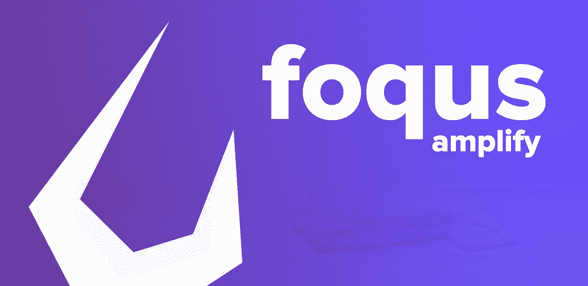
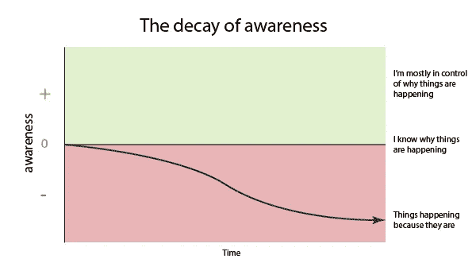
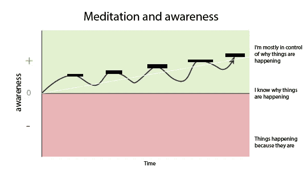
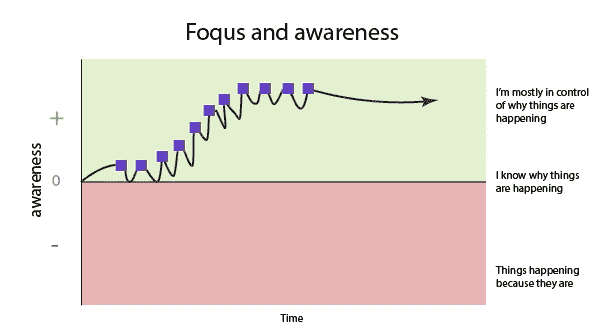

# 第一天使用我自己的应用

> 原文：<https://medium.com/hackernoon/first-day-using-my-own-app-2a1f72a335a3>

## 我敢说，结果是惊人的

声明:如果你对历史不感兴趣，你可以直接跳到“第一天:我的经历”。

## 历史:背景故事

去年年底，我养成了一个不健康的习惯，和朋友出去玩，浪费了很多时间和金钱。我每周会花 2-3 个晚上外出(通常是周五和周日)。

除了这一层不健康的糟糕决定之外，我还采纳了一个更有趣的决定:大约在午夜时分，尽管非常危险，我会放弃我的朋友们，独自在城市中散步。

## 确定我的优先事项

出去，我敢说，被一种没有生产力的气氛包围着……我自己也没有生产力，会让我处于一种放松的反思状态。

> 我在做什么？为什么我要做我正在做的事？我想做什么？

…该去散步了。这些问题的答案在我第三次散步的时候变得清晰起来，也就是我停止这个习惯的时候:

1.  我在浪费时间和金钱。
2.  我误以为这是消磨时间的最佳方式，也是社交的好方法。
3.  建造东西，建立有价值的社交网络。

这(3)就是我如何确定我的两个主要优先事项的结尾。*“如果你有三个以上的优先事项，你就没有了”——吉姆·科林斯*

## 一个转折点

2018 年 11 月 28 日(碰巧是我的生日)，作为对沉溺于不毛之地的抗议——我参加了城里的两场聚会。我为这两次聚会做过摄影，从两次聚会中学到了很多东西。我回到家，感觉非常有效率。

它回避了一个问题:我是如何，或者为什么在那一天变得如此富有成效。有什么不同？

这是正念。那一天我活在当下。众所周知，20 多岁的男性过生日是徒劳无益的，这一点我在那天之前就知道了，当天我就知道了——我完全意识到了。

开悟来了:*得胜的勇士先胜后战，战败的勇士先战后谋。—孙子兵法*

在我生日之前，我还没有赢得我的日子。我只是危险地走着，随着时间的流逝而生活。

## 应用程序来了

生日过后我变得贪婪。我希望每天都有这种意识。

没有闪耀的顿悟时刻…真的很简单。"如果我每天提醒自己几次要有效率会怎么样？"。当然，这是可行的，但是不够强大——我最终会关掉提醒。

我稍微改变了一下:“如果不管我在做什么，我可以问自己是否在朝着我的目标努力，会怎么样？”，答对了！替我卖了它。原因如下:

1.  这将促使我对自己诚实，并立即承担责任。
2.  我将能够记录这些回答并汇总它们，并允许我衡量自己的工作效率。

我对它能为我做的最大的事情视而不见。

# 第一天:我的经历

我在 2019 年 1 月 4 日凌晨将该应用发布到[谷歌 Play 商店供下载](https://play.google.com/store/apps/details?id=com.foqus.app)。我自然是第一个用户。

## 提示 1 [上午 11 点]

我周五早上 8 点就开始工作了，本来很有效率，这时应用程序问我:“你目前正在做一些有助于实现目标的事情吗？”答案显然是肯定的。

没什么特别的——但是我无法掩饰我的兴奋，因为它把“海滩路”,我们办公室的位置，添加到了我曾经工作过的地方的列表中。

## 提示 2 [下午 4 点]

也就是粗鲁的提示。在喝完下午 4 点的工作啤酒和回家路上持续的疲惫之后，我躺在床上查看我的手机——它就在那里:“你目前正在做一些对你的目标有帮助的事情吗？”这很难——休息很重要，但我很诚实——我打算稍后再喝一杯，所以我拒绝了。

有趣的是后来发生的事。虽然我最初的意图是去喝一杯，但我问自己“为什么？”——那是因为我有一种错觉，以为自己的精力已经耗尽了……这说不通，因为外出需要精力。

我不敢相信我每天对自己说的谎言。

所以相反，我:

1.  小睡一会儿，20 分钟后醒来
2.  阅读 4 篇中等文章(这[一篇](/thrive-global/how-to-achieve-your-10-year-plan-in-the-next-6-months-f8c1cc54888e?fbclid=IwAR3pzAsW71T2G7xkJhuvDjrzW6WKhddX1NzF_8qpiV5tIBRdTgsy23zgdAE)确实突出)
3.  看了一个关于 UX 的 Udemy 课程，并根据我在课程中学到的知识对一个项目做了一些润色
4.  我玩了 5 场 Dota 游戏作为休息，同时听了 5 个关于[独立黑客](https://www.indiehackers.com/podcast)的 1 小时长的播客。真的推荐这些！

## 提示 3 [晚上 9 点]

这件事发生在我玩 Dota 的时候。我在听播客，所以我把它标为是。

## 意外的胜利

我今天早上 7 点醒来。如果我出门的话，这可能比我醒来的时间早 4 个小时。

当我醒来时，我看到我床上所有的设备(我还不能改掉这个习惯)，我的第一反应是打开它们查看通知—

其中一个要检查的通知是我是否有效率提示。一想到提示，我就进入了意识模式。“等等……”我想，“我应该决定我今天的优先事项。”

于是我照做了。我有一个朋友的设计工作要做，我可能应该去散步，读点东西…在那个笔记上，我可能也应该写点东西；嗯…我写了这个。

## 应用程序的真正力量

虽然这款应用还处于非常早期的阶段，而且它的用户界面非常简单，几乎没有经过设计；它的力量不是来自它本身，而是来自使用它的人；或者更准确的说，用户的心理。

提示或白天的正念点充当锚，类似于冥想，但在更高的频率下微剂量。

根据我的经验，下面是一个例子

Unanchored awareness

无意识地度过你的一天。我们的世界被设计成让平衡变得冲动。疲惫和分心会让你更加盲目地随波逐流。(不管是好是坏)

Meditation: Longer times practicing mindfulness

在正念冥想中，随着时间的推移，你最终会使用神经可塑性模型来训练大脑变得更加正念。这并不是专门针对生产力，而是针对你的总体心理健康。

Foqus: More frequent, shorter bursts of mindfulness

这款应用程序让你在一天中的多个时间点重新进入对自己工作效率的感知状态。这个周期更加不稳定，因此可能会让人精疲力尽(这是一个需要解决的有趣问题)；但是，这是专门针对生产力和锚定你对它。

## 结论

自从它出版以来，它已经改变了我的游戏规则。我只使用了 24 小时，但我会继续记录我的经历；希望能得到真实的数据来支持我在上面的图表中使用的伪科学:)

在这里下载应用:[https://play.google.com/store/apps/details?id=com.foqus.app](https://play.google.com/store/apps/details?id=com.foqus.app)

**我正忙着发布 facebook 应用程序，请我在 facebook 上将您添加为测试人员**