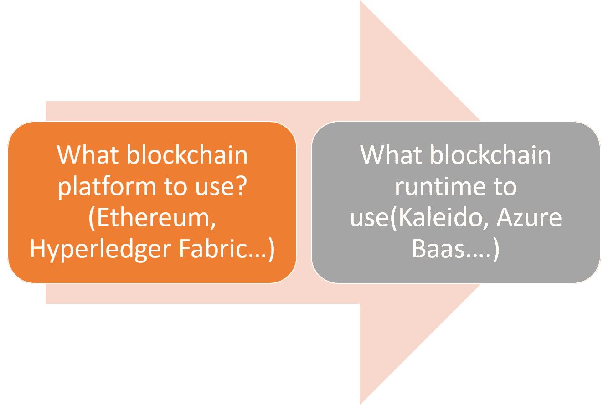
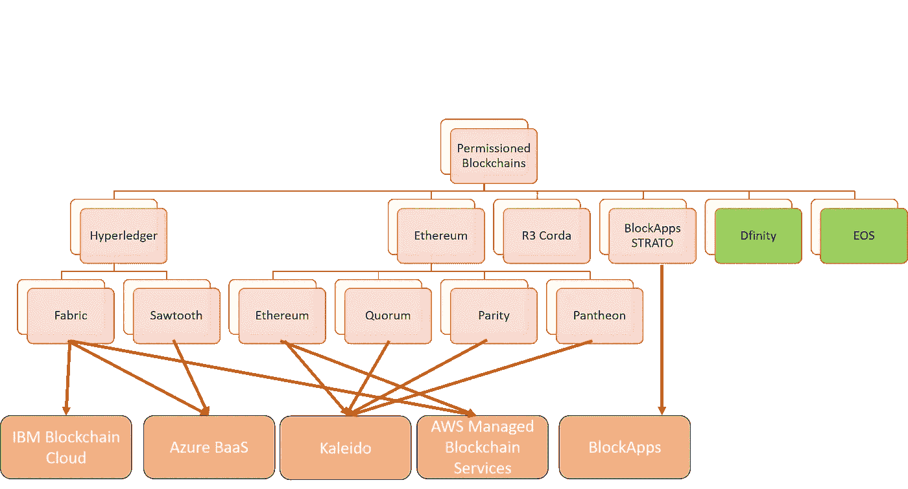

# 许可区块链解决方案的五大挑战以及可以帮助您解决这些挑战的工具和协议

> 原文：<https://medium.com/hackernoon/five-challenges-of-permissioned-blockchain-solutions-and-the-tools-and-protocols-that-can-help-you-d3e9cf49818a>

实现许可的区块链解决方案既迷人又极具挑战性。每天，主流媒体上都有新的文章声称区块链技术将如何改变许多行业，但现实并没有那么迷人。虽然区块链为已建立的企业业务流程带来了巨大的价值，但大多数许可的区块链实现都没有通过试验阶段。在最初的兴奋之后，大多数团队意识到大规模实现许可的区块链应用程序需要大量的技术技能和相当多的基础设施建设，以便将新的 Web3 技术集成到现有的企业堆栈中。

在过去的一年里，我们 Invector Labs 的团队[接触了高度复杂的许可区块链场景，每个场景都有自己的一系列基础设施挑战。在与经历过几次软件革命的技术专家分享我们的经验时，他们中的许多人将 web 应用程序的实现与 Netscape 的早期或者 Oracle 或 IBM DB2 时代初期的数据库系统的实现相提并论。在这些情况下，这些技术的真实应用程序的用例比相应的基础设施发展得更快。这种动态与最近的转型技术运动(如云或移动计算)形成鲜明对比，在这些技术运动中，基础架构从一开始就非常稳固。](http://invectorlabs.com/)

许可的区块链解决方案的真正挑战是什么？从身份、数据存储、集成或消息传递等核心基础设施领域，到部署和管理智能合同的流程；许可的区块链应用程序需要开发者设置正确的构建模块才能有效。在 Invector Labs，我们有幸试验了许多新的区块链协议或工具，我们经常使用这些协议或工具来解决许可区块链实施的挑战。不幸的是，工具和技术的组合看起来完全不同，取决于底层的区块链堆栈。

通向任何许可的区块链应用的道路始于两个基本决定:

第一个问题的答案将决定您的区块链应用程序的核心开发堆栈。目前，像 Hyperledger Fabric 这样的堆栈或 Ethereum 的变体(如 Quorum 或 Parity)是许可的区块链解决方案的主要选择，R3 Corda 或 Hyperledger 锯齿这样的平台也有一定程度的吸引力。至少在理论上，像 [Dfinity](https://dfinity.org/) 或 [Hashgraph](https://www.hedera.com/) 这样的新兴堆栈似乎非常适合许可的区块链解决方案，但它们尚未在实践中得到证明。

第二个问题的答案将决定许可的区块链应用程序的核心基础结构。供应和维护本地区块链网络远非易事，大多数许可的区块链堆栈不能与 Docker 或 Kubernetes 等平台很好地集成。区块链即服务(BaaS)平台，如 [Azure BaaS](https://azure.microsoft.com/en-us/solutions/blockchain/) 、 [Kaleido](https://kaleido.io/) 或最近的 [AWS 产品](https://aws.amazon.com/blockchain/)，可以真正简化区块链网络的供应和管理，并允许开发人员专注于构建 dApps，而不是基础设施。

下图说明了上述两个问题的决策过程。

# 许可区块链应用的真正挑战

选择区块链平台和相应的运行时只是旅程的开始。任何比美化的数据库更复杂的许可的区块链解决方案都将经历大量底层平台无法直接解决的基础设施挑战。下面我们来探究几个。

# 综合

如果您在许可的区块链应用程序中使用智能合约，您将面临与 API 的链外系统通信的挑战。Oracles 是区块链体系结构中处理外部通信的组件。然而，实现 Oracles 是一项开发密集型的工作。我们发现有几种技术在这方面很有帮助:

**[**chain link**](https://chain.link/)**:**chain link 提供了一个简单的编程模型，用于将比特币或以太坊智能合约连接到外部输入。该框架还避免了依赖“集中预言”作为单点故障。**

**[**菱体**](https://rhombus.network/) **:** 作为甲骨文竞赛的最近参赛者，菱体为以太坊智能合约连接外部数据系统提供了一个非常优雅的模型。Rhombus 支持基于激活模式的不同 Oracle 架构，如计划或按需以及推或拉数据访问模式。**

****[**Oraclize**](http://www.oraclize.it/)**:**Oraclize 专注于将 API 和数据系统连接到不同的区块链，如以太坊、EOS、Hyperledger Fabric 或 BlockApps。Oraclize 的编程模型不如其他一些替代方案丰富，但它通过对不同区块链的强大支持弥补了这一点。****

# ****数据存取****

****许可区块链对写信息很有用，但对读信息就没那么有用了。大多数现实世界许可的区块链解决方案需要与区块链中记录的数据进行交互，但这些数据既难以访问又难以理解。以下是一些有助于应对这一挑战的协议:****

****[**图**](https://thegraph.com/) **:** 图提供了一种将以太坊智能合约处理的数据公开为 GraphQL 端点的机制。这允许外部应用程序使用熟悉的 GraphQL 语法查询区块链数据。****

# ****数据保密****

****许多许可的区块链场景在具有强数据隐私约束的监管行业中运行。因此，保护和实施链上数据的访问控制是许可区块链解决方案的一项关键要求。下面，我列出了一些我们发现在这方面有用的技术:****

****[**法定人数:**](https://www.jpmorgan.com/global/Quorum) 法定人数区块链使用一种零知识证明的形式为私有事务提供本地支持。****

******[**Aztec**](https://www.aztecprotocol.com/)**:**最近公布的 Aztec 协议提供了以太坊智能合约中零知识隐私的坚实实现。******

# ****数据存储****

****区块链并不是存储大量数据的最佳工具。许可的区块链解决方案需要外部数据存储并不少见。不幸的是，许多适用于公共区块链的分散存储解决方案并不适用于许可的区块链场景。以下是这方面的一些解决方案:****

******[**BigchainDB**](https://www.bigchaindb.com/)**:**BigchainDB 提供了一种针对事务的存储和查询进行优化的去中心化数据库模型。BigchainDB 中的数据可以使用 MongoDB 查询语言进行查询，该语言支持丰富的数据访问交互。******

****[**IPFS 专用网络:**](https://ipfs.io/) IPFS 是区块链应用程序最受欢迎的存储系统，但通常被视为公共区块链解决方案。但是，IPFS 支持将通信限制在一组众所周知的节点上的专用网络配置。****

****[**AWS 量子账本**](https://aws.amazon.com/qldb/) **:** 我们对即将推出的 AWS 量子账本数据库非常感兴趣。没有共识的不变性的想法在许多许可的区块链场景中肯定是实用的，如果没有什么，量子账本可以成为私人分散应用的补充存储模型。****

# ****身份****

****许可的区块链解决方案的主要区别之一是网络中参与者的身份是相对众所周知的。因此，许多复杂的共识计算协议在这些场景中是多余的，根本不需要。此外，大多数企业已经有了用户目录，他们希望在许可的区块链解决方案中加以利用。下面列出的技术有助于在许可的区块链解决方案中处理身份:****

******[**uPort**](https://www.uport.me/)**:**uPort 一直在稳步构建一系列在分散应用中管理身份的协议和解决方案。当前堆栈与以太坊智能合约兼容，可以在许可的区块链应用中使用******

******[**Azure BaaS:**](https://azure.microsoft.com/en-us/solutions/blockchain/)Azure 团队在扩展不同区块链的核心协议以利用 Azure Active Directory 身份方面做得非常出色。这项工作最近的一个例子是在以太坊应用中实现[权威证明共识协议。](https://docs.microsoft.com/en-us/azure/blockchain/templates/ethereum-poa-deployment)******

****在消息传递、测试、版本控制等领域，许可的区块链应用程序面临着更多的挑战。本文中列出的协议和工具是我们在现实世界的实现中发现的一些最有效的解决方案，但是还有许多新兴的技术栈可能在不久的将来变得相关。****