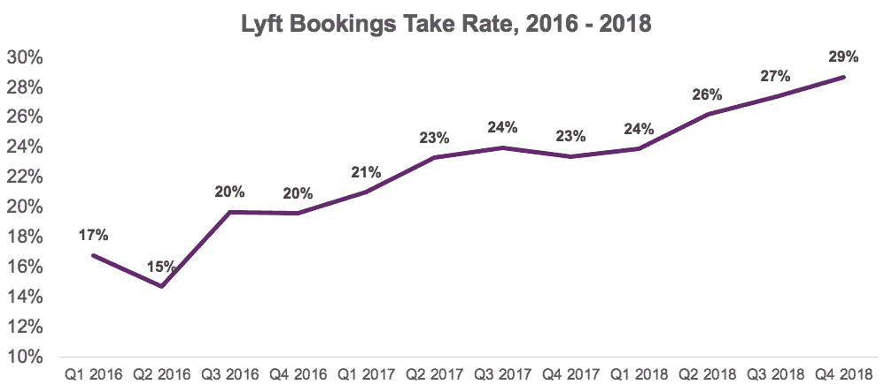
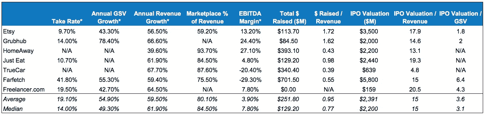
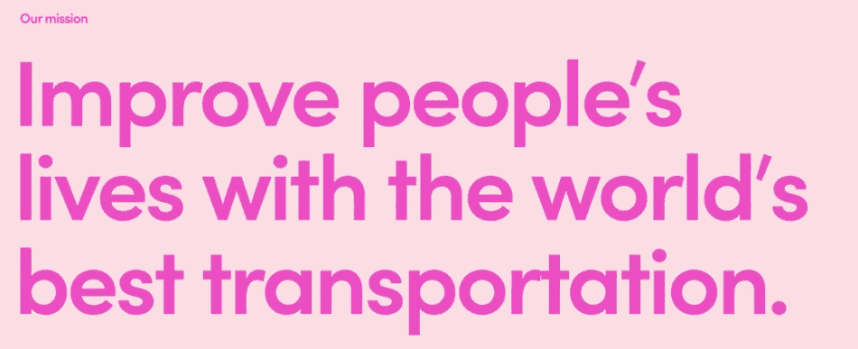
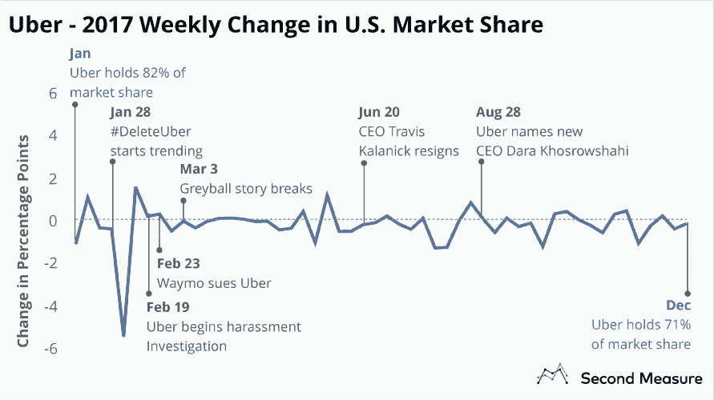
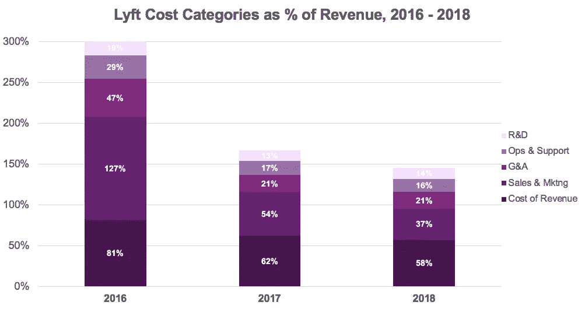
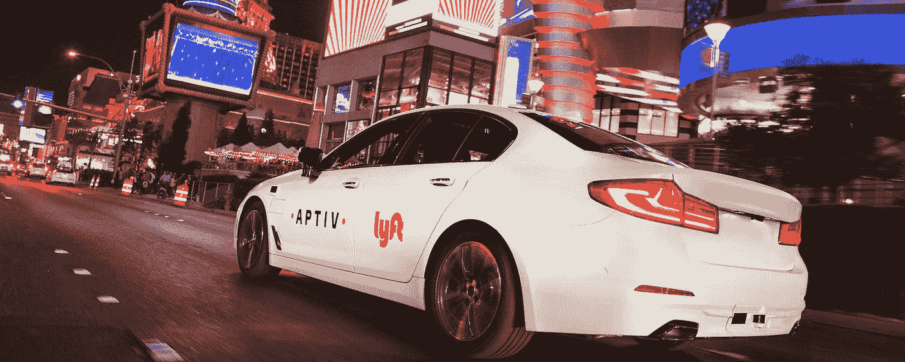
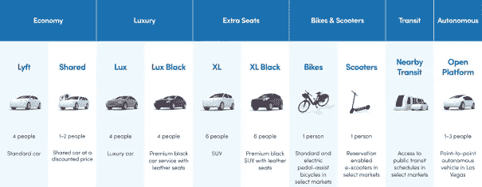
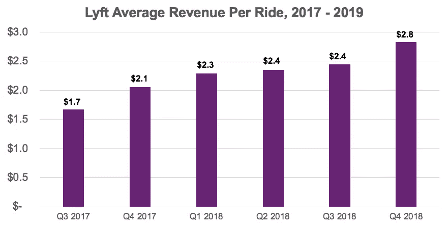

# Lyft 的 S-1 中的五件令人惊讶的事情

> 原文：<https://medium.com/hackernoon/five-surprising-things-in-lyfts-s-1-4a226114b5d9>

像几乎所有科技界的人一样，我们很兴奋地看到 Lyft 的 S-1 上周五下跌。拼车行业从根本上改变了数百万人(包括我们！)每天四处走走，考虑到 Lyft 和优步成立不到十年，这是一项令人难以置信的成就。很少看到一种产品在相对较短的时间内达到几乎无处不在的程度，这感觉像是一个独特的机会，可以看到一家转型的消费科技公司在公开市场上首次亮相。

Image from Lyft’s S-1.

我们将为您保存对 S-1 的逐页分析，相反，我们想强调我们读到的最令人惊讶的五件事，以及它们对 Lyft 业务的建议。鉴于拼车业务中没有上市公司，一旦优步的 S-1 上市，我们可能会更多地了解 Lyft 的真实财务状况。但是，我们在适当的时候将 Lyft 的进展与其他公开市场进行了比较，以给出该公司一些关键指标的背景。

**附注——如果你正在点播或市场领域从事早期创业，请联系 twins@crv.com——我们很乐意与你交谈！**

**1。lyft 25%以上的接受率(净收入/预订量)高得惊人。**对于核心的拼车业务，Lyft 的预订量是从乘客那里收取的总金额。然而，Lyft 并没有将所有的预订作为收入——公司向司机支付工资，因此 Lyft 的净收入是(向骑手报价的票价)-(支付给司机的工资)。对于纯市场，我们通常将 5-15%的预订(或 GMV)视为净收入——在我们对八个公共市场的分析中，我们看到的平均比例为 14%。2018 年，Lyft 的收入收取率约为 27%，高于 2016 年的 18%。

Graphic created from data in Lyft’s S-1.

Lyft 的提成率上升有两个原因——该公司是:(1)给乘客更少的折扣，从司机那里拿更高的提成；以及(2)支付更少的司机奖励(鼓励他们开车的奖金)。Lyft 认为这些趋势是全行业的——随着拼车的成熟，所有平台都降低了交易价格，以吸引乘客和司机参与。Lyft 预测这一比例将会上升，因为他们认为激励措施有更大的改进空间。他们还预计他们的自行车/滑板车业务会增长(这一收入在 2018 年是非物质的)，这是 100%的净收入——Lyft 拥有并运营这些车辆。

虽然优步的财务状况尚未公开，但据报道，该公司去年的付费率接近 25%，这表明高付费率可能是拼车的系统性问题。在[一篇关于市场 KPI 的精彩文章](/@algovc/10-marketplace-kpis-that-matter-22e0fd2d2779)中，Accel 的 Andrei Brasoveanu 提到，如果你的市场是一个“关键分销渠道”，就有能力收取更高的费用对于 rideshare 来说，情况确实如此，因为对于司机来说，建立自己的网络几乎是极其困难的，特别是与 Etsy 这样的市场相比，卖家可以在自己的网站、实体市场或商店列出商品。

In conjunction with Upwork’s IPO last year, we analyzed other public marketplace take rates — which vary, but tend to be higher when a marketplace has a core distribution advantage.

因此，在某些方面，Lyft 和优步收取更高的费用似乎是公平的——除了为他们的司机赢得客户，他们还处理监管、客户服务和保险(我们稍后会谈到这一点！)—卖家服务比你在典型的在线市场上找到的服务要密集得多。

**2。一个“使命驱动的品牌”被描绘成击败优步的方式。** Lyft 的领导层一直强调成为良好企业公民的重要性，但我们惊讶地发现，这被如此强烈地强调为一种竞争优势。S-1 中的常用词/短语包括*社会责任*(10x)*真实性*(5x)*同理心* (4x)和*使命驱动* (4x)。

Lyft’s mission statement, pictured above in the S-1, is similar in concept but differs in tone from Uber’s mission statement (on the company’s website): “We ignite opportunity by setting the world in motion.”

Lyft 将其最近的美国市场份额增长(2018 年 12 月为 39%，高于 2016 年 12 月的 22%)归功于这一与消费者产生共鸣的品牌。至少在一些市场上，Lyft 确实受益于优步的失败(还记得吗？)，S-1 概述了 Lyft 的信念，即“用户越来越多地选择基于品牌亲和力和价值一致性的拼车平台。”

Second Measure’s graphic above shows how Uber’s U.S. market share fluctuated during the company’s rocky year of 2017\. Second Measure estimates market share using a sample of credit card data — while their 18% estimate for Lyft’s market share at the beginning of 2016 is somewhat close to the 22% stated in the S-1, they estimated that Lyft only had [29% market share](https://blog.secondmeasure.com/datapoints/rideshare-industry-overview/) in January 2019 — compared to 39% stated in the S-1.

S-1 还详细介绍了 Lyft 围绕企业责任的一些具体行动和活动(现在和未来):

*   100%的小费都给了司机，到目前为止已经发放了 7 . 5 亿美元
*   通过 Lyft 的“围捕和捐赠”计划向慈善机构捐赠了 1000 万美元(来自 70 万骑行者)
*   在自然灾害、紧急情况和投票日为服务不足的社区提供免费乘车服务
*   乘车是碳中和的——Lyft 是碳补偿的最大自愿购买者之一
*   与城市合作，为低收入居民提供自行车/滑板车骑行服务
*   计划每年投入 1%的利润或 5000 万美元用于社会影响工作

**3。巨额保险和激励成本冲击了利润率。** Lyft 的毛利率为 42%(高于 2016 年的 19%)，但该公司的 EBITDA 利润率为-45%(高于-201.7%)。根据公开市场的数据，这些数字相对较低，通常 EBITDA 利润率为 5-10%，这反映出 Lyft 比纯软件市场复杂得多。

到目前为止，对盈利能力影响最大的是商品销售成本(2018 年收入的 58%)和销售和营销(收入的 37%)。在 COGS 中，2018 年保险成本增加了 3.19 亿美元，而支付处理成本仅为 1.1 亿美元，平台托管成本为 7500 万美元。Lyft 团队在 S-1 中详细列出了保险需求——该公司为每位驾驶员提供 100 万美元的商业汽车责任，通过他们自己的保险子公司和第三方提供商进行管理。

Graphic created from data in Lyft’s S-1.

截至 2018 财年，Lyft 在保险索赔支付账户中持有近 8.65 亿美元(比 2017 年的 3.6 亿美元翻了一倍多)。S-1 将 2018 年 Q1 奥运会的保险成本大幅增加归因于“索赔频率和严重程度的增加”，尽管该公司在估计储量时似乎仍有些谨慎。从 2016-2018 年，只有 20-35%的年度储备以亏损形式支付。

利润的第二大拖累是销售和营销，这是司机推荐和骑手激励(折扣)成本的分配，占 2018 年所有销售和营销支出的 36%。Lyft 在 2018 年支付了 2.966 亿美元的目标骑手和司机奖励，几乎是 2017 年 1.556 亿美元的两倍(仅比 2016 年的 1.41 亿美元略有增加)。

**4。Lyft 在 AV 上投入了大量资金——并且比他们看起来更接近优步。**优步在自动驾驶方面的工作得到了大量宣传，尤其是在该公司与 Waymo 就收购 Otto 的旷日持久的诉讼期间。但 Lyft 也在自动驾驶汽车上下了大赌注，这种汽车在 S-1 中被提到了 100 多次。Lyft 通过与 Aptiv(前身为 nuTonomy)的合作，已经在拉斯维加斯完成了近 35，000 次自动驾驶(由一名人类安全驾驶员陪同)。

Lyft has completed 35k monitored autonomous rides through its partnership with Aptiv — image from Lyft’s [blog](https://blog.lyft.com/posts/lyft-aptiv-5000).

在 Lyft 的 4700 名员工中，“数百人”在该公司位于帕洛阿尔托的 AV 实验室工作，该实验室是 5 级工程中心。Lyft 计划建立自己的 AV 系统，并与能够在 Lyft 开放平台上建立的第三方开发者合作。去年，Lyft 披露了其对计算机视觉初创公司 Blue Vision Labs 的[7200 万美元](https://www.theverge.com/2018/10/23/18014200/lyft-self-driving-car-acquires-blue-vision-lab-ar)收购，以及其与一家汽车制造商的[五年协议](https://www.theverge.com/2018/3/14/17121186/lyft-magna-self-driving-car-announcement)建立 AV tech——这两项都在 S-1 中提到。

作为这些努力的结果，Lyft 希望在未来五年内通过 AV 为“部分”游乐设施提供服务，并在未来十年内通过 AV 为大多数游乐设施提供服务。相比之下，优步在部署自动驾驶技术方面采取了更积极的战略——在 2016 年以 7 亿美元收购奥托后，该公司在四个北美市场开始了 AV 测试(至少有一个没有 DMV 许可)。优步[最初计划](https://jalopnik.com/uber-wanted-to-put-you-in-a-driverless-car-by-the-end-o-1824207644)在 2018 年年底前部署无人驾驶汽车服务，但新任首席执行官达拉·科斯罗萨西(Dara Khosrowshahi)缩减了计划。与 Lyft 在 S-1 中的预测类似，Khosrowshahi 在 2018 年初表示，优步自主服务于[大部分](https://techcrunch.com/2018/01/23/uber-ceo-hopes-to-have-self-driving-cars-in-service-in-18-months/)城市骑行的能力仍需 10-15 年。

**5。自行车和踏板车的收入现在“不重要”——但可能很快就会。**你可能还记得 Lyft 在 2018 年末以 2.5 亿美元收购了美国最大的自行车共享公司 Motivate。根据 S-1 的说法，此次收购为 Lyft 带来了 200 名新员工，并承诺在未来五年内向纽约自行车共享生态系统投资 1 亿美元。根据 S-1 中的提及频率(“自行车和踏板车”出现了 105 次)，提供短途电动汽车运输对 Lyft 实现多式“运输即服务”的使命至关重要。

Image from Lyft’s S-1 — Lyft’s transportation as a service (TaaS) network spans local transit (info provided for free in the app), short-distance bikes and scooters, and a range of longer-distance vehicles.

Lyft 没有披露自行车和滑板车的收入，只是表示这对 2018 年“不重要”——鉴于收购发生在 11 月，这并不令人惊讶。然而，Lyft 在 S-1 中披露，rideshare 和自行车/滑板车之间的每次骑行活动收入“没有实质性差异”，这让我们对该业务线有了更多的了解。因为 Lyft 在拼车上的占用率为 28%，在自行车和滑板车上的占用率为 100%，这意味着拼车的平均预订量是滑板车的 3.5 倍。

Graphic created from data in Lyft’s S-1.

Lyft 没有概述 S-1 的每次乘坐收入，但根据 2016-2018 年的乘坐次数和收入数字，我们计算出它为 2.80 美元。由于 Lyft 的自行车/滑板车共享服务是从 2018 年第四季度开始部署的，这意味着自行车/滑板车的平均预订价格约为 3 美元。解锁费用为 1 美元，骑行费用为每分钟 0.15 美元，这意味着平均骑行时间约为 13 分钟。

这与 Bird、Lime、Jump 和其他主要电动汽车运营商公开披露的数据相对一致，尽管我们不知道 Lyft 的车辆利用率与竞争对手相比是什么样的。在 S-1 中，Lyft 列出的对自行车和踏板车运营的担忧包括:对第三方制造商的依赖和潜在的质量问题，与天气相关的不确定季节性，以及围绕新市场电动汽车发布的“负面公众看法”。

Lyft 没有透露扩大自行车和滑板车服务的具体计划，只是增加了一个将乘客连接到当地交通或 Lyft 共享乘车的试点。出于折旧目的，该公司估计滑板车的使用寿命为 12 个月(这似乎有些乐观，因为[最近的一份报告](https://oversharing.substack.com/p/shared-scooters-dont-last-long)表明平均寿命接近一个月)，截至 2018 年年初，价值 2300 万美元的滑板车尚未部署。该公司列出了 2018 年总计 6800 万美元的自行车和踏板车车队采购成本。

感谢阅读！我们很想知道你对 Lyft S-1 中任何特别令人惊讶或有趣的事情的想法——欢迎给我们发电子邮件至 twins@crv.com[或发推特给我们](mailto: twins@crv.com)[@ venture wins](http://twitter.com/venturetwins)。

喜欢这个帖子？**为它鼓掌**帮助更多人看到我们的故事，并分享给你的朋友们！

有兴趣阅读我们的更多内容吗？你可以订阅我们的每周时事通讯，**加速版**，了解更多关于千禧一代和 Z 世代的趋势:[https://accelerated.carrd.co/](https://accelerated.carrd.co/)