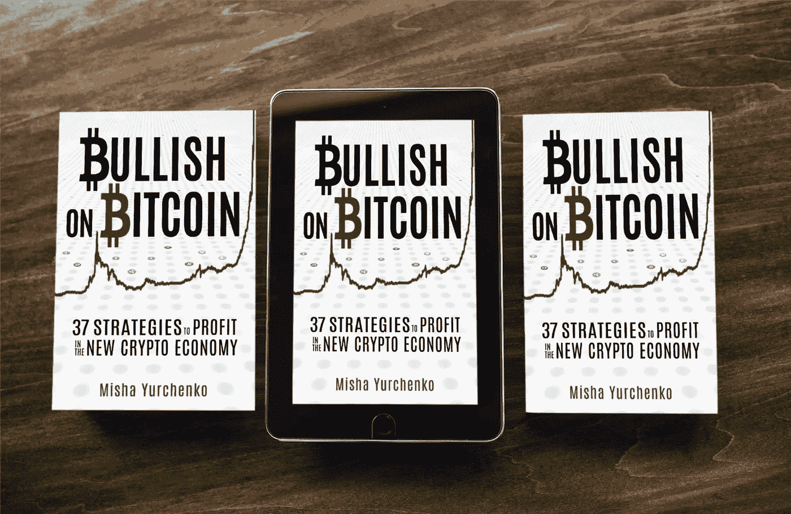
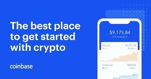
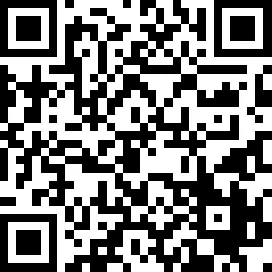

# 李小龙教给我的关于交易密码的五件事

> 原文：<https://medium.com/hackernoon/five-things-bruce-lee-taught-me-about-trading-crypto-a171134cdb68>

> ***#1。“我不怕练过一万次踢腿的人，我怕的是练过一万次踢腿的人。”***

聪明的交易者有很多工具可供选择。无论你是购买还是建立交易工具，你的交易系统都会提供所有的必需品，但是不要误认为工具的丰富意味着你应该使用所有的工具。是的，首先要实验，但是一个人不可能掌握所有的方法，也不应该去尝试。

通过精通*一两个*策略，你可以获得优势。优势是你坚持的过程。摧毁对手的是你致命的飞向咽喉的侧踢，而不是你接二连三的随机移动。你想掌握让你持续战胜市场的交易策略——不是用分散的方法或一系列半强有力的动作，而是用一个 K.O

最好的交易者和投资者会发现他们的优势，每天磨练他们的技能。他们会尽可能地阅读关于他们选择的方法的一切，观看所有的 Youtube 视频，听所有的播客，并与比自己更有经验的人交谈。

你可以成为寻找退化的小盘股的专家，专注于在长期内获得 100 倍的收益…你可能擅长在其他交易者不敢去的地方持刀捕捉大的血腥下跌。或者你可能非常擅长设置聪明的止损，训练你的思维低买高卖。也许你会成为设置有利可图的采矿设备、打桩或其他方面的技术专家。也许你会忽略所有交易，把铲子卖给金矿商，建立一个利基市场和一个有利可图的比特币相关商品和电子商务业务。

可能性是无穷无尽的，但关键是找到你的致命一踢，并一遍又一遍地练习。

> ***#2。“混乱之中蕴藏着机遇。”***

像大萧条或 2008 年房地产泡沫这样的大黑天鹅事件为聪明的投资者提供了充足的机会，当其他人都在抛售时，他们可以趁虚而入买入。这些都是明显的例子，说明当市场情绪低落时，混乱会占上风，人们会做出情绪化的决定。在这些时期，恐惧达到了顶点，因为人们不知道价格会有多低。这些极端事件为任何愿意冒险的人提供了最大的机会。

活动的规模不一定要很大，这样你才能利用这个机会。幸运的是，在新的市场和行业中，存在大量的混乱。这是一个在采取行动和制定一个体面的计划之前花时间观察的问题。这比大多数人做的都多。例如，当 ETH 或 BTC 或任何其他硬币宣布分叉时，通常人们会蜂拥购买硬币来获得他们的免费货币。空投也一样。然后，当媒体拿起 ICO 时，每个人都疯狂地购买硬币，结果却在几天后硬币随后的下跌中遭到破坏。

精明的交易者跟踪这些事件的日期，并在媒体得到消息前买入。他们设定一个目标，密切关注市场，卖出以获得好的回报，而不是一味追求最好的结果。他们已经把一个潜在的情绪化和混乱的情况组织成了一个非情绪化的买卖。他们并没有因此而失眠。

通常情况下，混乱的条件是可以确定的。当获得加密交换时，这可能会造成一些恐慌。如果投资者的币因为收购而被套牢或者退市(这种情况时有发生)怎么办？在这种情况发生之前，最好是分散投资，或者把你不愿意失去的钱拿出来。赚钱的艺术也是不赔钱的艺术。新闻中报道的每一个事件，公司收购、新区块链项目、政府监管、合作公告、硬币上市、硬币退市、法律纠纷、技术故障、背书、空投、分叉，以及你能想到的几乎任何事情都有可能扰乱价格。保持警惕，监控价格变动，并尽可能管理相关的价格风险。

> ***#3“清空你的心，无定形。不成形，像水一样。如果你把水放进杯子里，它就变成了杯子。你把水放进瓶子里，它就变成了瓶子。你把它放在茶壶里，它就变成了茶壶。现在，水可以流动，也可以崩溃。做我的水朋友。”***

我们不应该把我们的欲望强加给市场。相反，我们应该保持不变，准备好去市场带我们去的地方。如果你观察宏观趋势，发现我们正处于熊市，不要因为“希望”就像在牛市一样交易——这不是策略。接受市场的现状，考虑到今天的大浪可能明天就会崩溃。

当我们根据我们的欲望设定利润目标时，我们基本上是在把我们的欲望推向市场。选择一个任意的数字，比如 100 万美元，并说我们想在一年内赚那么多，这是没有意义的。虽然这是一个很好的整数，但你不可能预测你会赚多少。

你不是在交易像黄金这样的贵金属，它的价格在五年内几乎没有变化。你交易的是高度不稳定的加密货币，可能会在一夜之间消失。好消息是你可以赚到远远超过 100 万美元的钱，而坏消息是你只能赚到其中的一半。不要把你的思想放在一个盒子里。

那些对密码有基本知识/兴趣的人倾向于将他们的兴趣作为他们身份的一个突出方面。观察 Twitter 上的聊天记录:“比特币的家伙也是如此；而某某则是涟漪；某某喜欢以太坊。”

因此，对许多人来说，加密不仅仅是一种兴趣/活动，而是他们是谁，而不是他们做什么。这些数字币好像真的消费很多。这导致这些“分析师”采取了一种不灵活的立场，他们无法理性地分析市场，做出与之前的信念相反的决策。

> ***#4“吸收有用的，丢弃无用的，加上专门属于自己的。”***

当你看加密新闻对特定货币进行“价格分析”时，你是在浪费时间。媒体每天都有文章配额，最容易写的文章类型是试图预测未来，但本质上什么也不说。你可以放心地忽略这些文章。你最好学会在没有媒体的情况下自己做决定的技巧。但是，在某些情况下，您应该关注新闻，例如，评估市场情绪。

当一个加密项目受到很多负面媒体的关注时，事情是否属实，或者更有可能的是媒体正在做它所做的事情(写点击诱饵文章)，硬币实际上已经成熟，可以涨价了？这不一定是经验法则，但我们在媒体上看到的可能是一个好迹象，表明我们应该反其道而行之。

当我进入招聘市场时，在科技巨头中，许多人告诉我这是一个旋转的旋转门。四年来，我通过发展自己的网络，帮助谷歌、亚马逊和脸书等科技公司找到并留住顶尖人才。这需要我会见成千上万的人，审阅无数的简历，并向求职者咨询他们的职业生涯。我与这些科技公司密切合作，与他们的招聘经理成为朋友，从产品、盈利到销售策略，向他们请教各种问题。虽然我不太有资格在 Github 上评估产品的技术规格，但我相信我对招聘人才的动态有相当程度的洞察力，这无疑为这些公司的成功做出了贡献。

我的一个朋友非常擅长管理几个交易机器人。他甚至建造了自己的。他已经到了有利可图的地步，尽管他被骗了，赔了钱，他比大多数人更了解交易机器人。当有人告诉他“你不能从交易机器人中赚钱”或“风险太大”时，他会左耳进右耳出。他已经证明这不是真的，至少在他的案例中不是。每个人都应该花时间深入至少一个领域，利用现有的技能，找到个人兴趣和机会的独特交叉点。如果你真的喜欢，那就简单多了！

> ***#5“成功的战士是普通人，拥有激光般的专注。”***

你不需要有三个电脑屏幕，大量的交易资金或者成为技术分析大师来赚钱。练习日常踢腿(努力提高一项技术，而不是分散自己)或扫地的艺术，只需要每天做少量的动作。而是提高 1%。关键是要刻意去做。我们错误地高估了我们需要开始做的事情。这是一小步。

沃伦·巴菲特和其他著名的投资者一样，每天连续阅读数小时。他读书不只是为了好玩。他知道信息不对称会让他在游戏中占得先机，所以他每天都在多学一点。

区块链和加密货币市场每天都会涌现出新的媒体和分析网站，加剧了信息过载。保持现状会让任何人不知所措，这也是为什么我不建议选择 20 种策略并努力精通它们的另一个原因。你最多只能算平庸，永远不会有优势。

要求你获得任何种类的知识不对称的行为是非常基本的。消费关于某个特定主题的信息，尽可能多地了解它。越新的主题越好，因为不太可能有很多人有时间真正掌握它。例如，如果您认为安全令牌和 sto 是未来的趋势，您可以采取一些小的措施，这些措施会随着时间的推移而变得复杂。开始建立一个 STO 领域的公司名单，跟踪他们的活动，加入他们的邮件列表。伸出手，直接与他们的创始人交谈，参加他们的活动，参与真正的对话，在对话中你可以“了解情况”，走在潮流的前面。当其他人在交易他们的钱的时候，你正在建立一个知识基础和优势。

这些小行动也可以包括……为你的博客(或其他东西)采访 10 个 STO 公司的人，参加一个区块链的活动，每天阅读一篇关于 sto 的文章，找到业内专家并与他们建立关系/带他们出去喝咖啡/打个 skype 电话，与他人分享你所学到的东西。每天、每周都这样做，你就会拥有优势。

确定被低估的加密项目的最佳估价框架和工具是什么？你如何做出更明智的投资，并停止亏损？关于成为更好的交易者，李小龙教了我们什么？

*我采访了几十位投资者、交易者和企业家，问了他们这些问题以及更多更多的问题。从奖金到赚取代币的头像,《看好比特币》概述了几十种交易、投资、创造和探索新的去中心化经济的策略。*

## [今天在亚马逊上买这本书](http://mybook.to/bullishonbitcoin)

如果你有兴趣注册一个密码交易所，这里有两个最大的。请随意使用下面的我的会员/推荐链接，在注册时获得退款和轻微折扣:

[Bitfinex 注册](https://bitfinex.com/?refcode=PEfOSCzd)

[比特币基地报名](https://www.coinbase.com/join/yurche_p)

**此处接受加密提示(ERC-20 代币)**

0xb651287c66fE21eD88cf60fA84f63acae55520fe