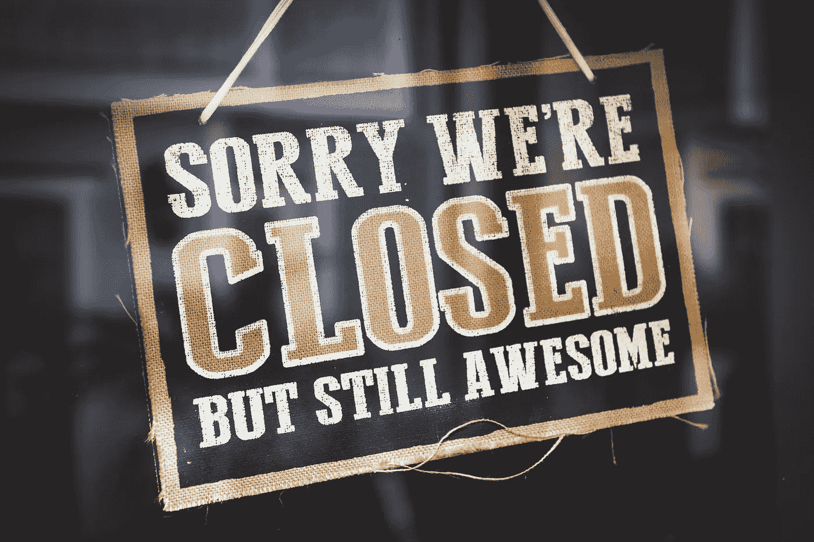

# Fiverr 收购 ClearVoice:为什么自由撰稿人不能欢欣鼓舞

> 原文：<https://medium.com/hackernoon/fiverr-acquired-clearvoice-why-freelance-writers-cant-rejoice-63aed3ce6d75>

Photo by [Tim Mossholder](https://unsplash.com/photos/v5re1loi264?utm_source=unsplash&utm_medium=referral&utm_content=creditCopyText) on [Unsplash](https://unsplash.com/search/photos/closed-store?utm_source=unsplash&utm_medium=referral&utm_content=creditCopyText)

这对自由作家来说是好消息还是坏消息？

让我们用一个常识性的方法来为我们的自由撰稿人伙伴们想出一个有用的、不带偏见的答案。

首先，Fiverr 和 ClearVoice 没有合作或合并。强调这一点很重要。Fiverr 买下了 ClearVoice，简单明了。说实话，ClearVoice 将在一段时间内(有限的)作为 Fiverr 业务结构中的“独立实体”运营。

因此，这并不是 oDesk 和 Elance 通过业务融合来产生一个新名字为 Upwork 的自由职业平台的例子。这种情况更类似于自由职业者 dot com 消费 vWorker 的时候。

为什么我要举这些例子？它们在多大程度上与我一开始问的问题相关？让我们找出答案。

# 有人还记得 vWorker 吗？

一方面，我们有一个强调质量的小型在线工作场所——clear voice。另一方面，我们有一个自由职业巨头——Fiverr，它在价格和工作模式的恶性竞争中建立了自己的声誉。

现在，这次收购最有可能的结果是什么？你认为 Fiverr 会采用 ClearVoice 的商业模式还是相反？

# **大鱼吃小鱼！**

一些自由撰稿人可能会说，*但是，嘿，等等，Fiverr 已经承诺，对于 ClearVoice 的客户和自由撰稿人来说，业务将照常进行*。真的！但是，ClearVoice 不可能无限期地保持其业务独立性，这也是事实。

你买一家公司不只是为了欣赏它。对吗？你有一些计划。你自己的商业计划不必与你新收购公司的目标和优先事项保持一致。

这正是发生在 vWorker 身上的事情。这曾经是自由职业界的先驱之一。有一天，一个自由职业巨人带着他们无法拒绝的提议来了。剩下的就是自由职业者的历史了，没有人记得 vWorker。

# **在商业收购中没有情感的空间**

很快，Fiverr 就会说，*好了，ClearVoice 的伙计们，你们玩够了，现在是时候按照我们的规则来玩了。*

Fiverr 的问题是他们从第一天起就没有改变他们的“商业模式”。没有五块钱的五元不是五元。

在 Fiverr 上，你可以花 5 美元买到一篇文章。在 ClearVoice 上，你可以做同样的事情，但价格是 50 美元甚至 500 美元。

当自由撰稿人过去每 5 个词收费 5 美元，而在 Fiverr 上面对新的现实时，他们将不得不为此写 500 个词，那么我们将会有一个地狱般的自由派对。

# 我亲爱的自由作家们，一切都不一样了，这都要怪 Fiverr

Fiverr 刚刚在写作演出领域淘汰了它的竞争对手。我认为 ClearVoice 作家的离开只是时间问题。一些自由撰稿人可能会决定留下来，在 Fiverr 上试一试。祝你好运，因为在无数五美元的写作工作的无尽海洋中，你将需要它。

我也有充分的理由相信 Fiverr 的客户不会理解 ClearVoice 作者带来的高质量标准。他们追求尽可能低的价格。这就是为什么他们首先购买 Fiverr 上的演出。

以前的 ClearVoice 客户会怎么样？他们会在其他地方雇佣优秀的作家。他们在 ClearVoice 上工作的原因是他们不介意为高质量的工作支付额外的费用。五镑不会使他们改变旧习惯。

那么，我亲爱的自由撰稿人伙伴们，接下来你打算去哪里工作呢？

你已经在打包行李了吗？

*关注我的* [*LinkedIn*](https://www.linkedin.com/in/michaelabrooks/) *和*[*Quora*](https://www.quora.com/profile/Michael-Brooks-94)*来了解更多自由职业者和创业者可以互相帮助和学习的方式。*