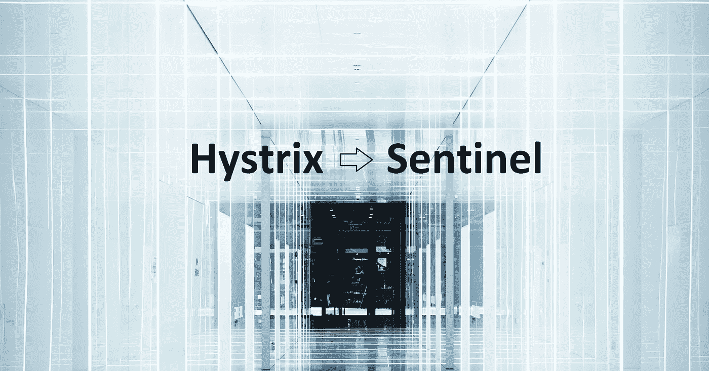
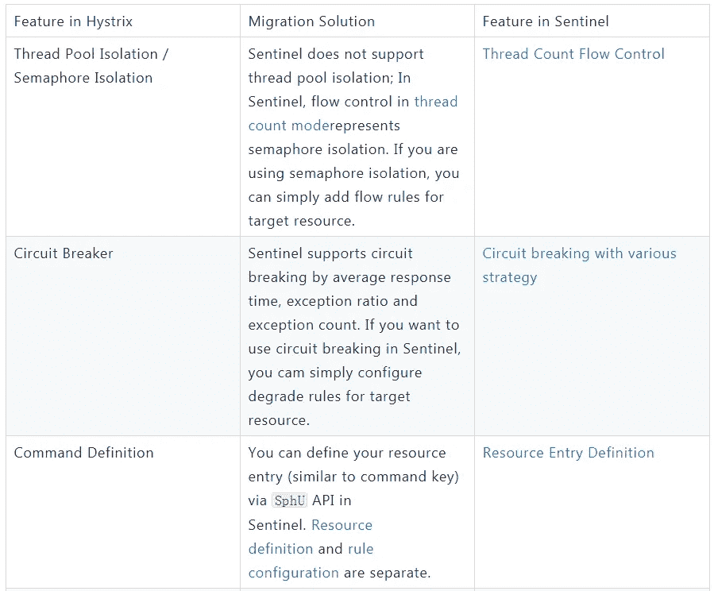
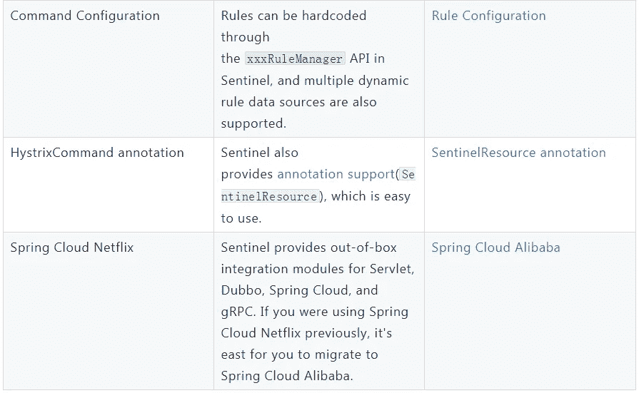

# 微服务的流量控制:从 Hystrix 迁移到 Sentinel

> 原文：<https://medium.com/hackernoon/flow-control-for-your-microservices-migration-from-hystrix-to-sentinel-fdcdda50917a>

*由于没有来自 Hystrix 的更多更新，阿里巴巴技术团队提议将 Sentinel 作为替代方案。这是* [***哨兵开源***](/@alitech_2017/alibaba-open-source-series-6ec06ca2a402) *系列的一部分。*



随着微服务越来越流行，服务之间的稳定性变得越来越重要。微服务系统中广泛使用流量控制、容错、系统负载保护等技术，以提高系统的健壮性，保证业务的稳定性，最大限度地减少因接入流量过大和系统负载过重造成的系统中断。

Hystrix 是网飞的一个开源延迟和容错库，最近在其 GitHub 主页上宣布不再开发新功能。建议开发者使用其他仍然活跃的开源项目。那么有哪些选择呢？

上次我们介绍了 Resilience4j 和 Sentinel: [网飞·海斯特里克斯的两个开源替代产品](/@alitech_2017/resilience4j-and-sentinel-two-open-source-alternatives-to-netflix-hystrix-d75bc89f3b03)

本文将帮助您从 Hystrix 迁移到 Sentinel，并帮助您快速使用 Sentinel。



# hystrix 命令

Hystrix 的执行模型采用命令模式设计，将业务逻辑和回退逻辑封装到一个命令对象中(`HystrixCommand` / `HystrixObservableCommand`)。一个简单的例子:

```
public class SomeCommand extends HystrixCommand<String> { public SomeCommand() {
        super(Setter.withGroupKey(HystrixCommandGroupKey.Factory.asKey("SomeGroup"))
            // command key
            .andCommandKey(HystrixCommandKey.Factory.asKey("SomeCommand"))
            // command configuration
            .andCommandPropertiesDefaults(HystrixCommandProperties.Setter()
                .withFallbackEnabled(true)
            ));
    } @Override
    protected String run() {
        // business logic
        return "Hello World!";
    }
}// The execution model of Hystrix
// sync mode:
String s = new SomeCommand().execute();
// async mode (managed by Hystrix):
Observable<String> s = new SomeCommand().observe();
```

Sentinel 不指定执行模型，也不关心代码是如何执行的。在 Sentinel 中，您应该做的只是用 Sentinel API 包装您的代码来定义资源:

```
Entry entry = null;
try {
    entry = SphU.entry("resourceName");
    // your business logic here
    return doSomeThing();
} catch (BlockException ex) {
    // handle rejected
} finally {
    if (entry != null) {
        entry.exit();
    }
}
```

在 Hystrix 中，定义命令时通常需要配置规则。在 Sentinel 中，资源定义和规则配置是分开的。用户首先通过 Sentinel API 为相应的业务逻辑定义资源，然后在需要时配置规则。详情请参考[文件](https://github.com/alibaba/Sentinel/wiki/How-to-Use)。

# 线程池隔离

线程池隔离的好处是隔离比较彻底，可以针对一个资源的线程池进行处理，不会影响到其他资源。但缺点是线程数量很大，线程上下文切换的开销非常大，尤其是对于低延迟调用。Sentinel 没有提供这么重的隔离策略，而是提供了一个相对轻量级的隔离策略——线程计数流控制作为信号量隔离。


# 信号量隔离

Hystrix 的信号量隔离是在命令定义时配置的，例如:

```
public class CommandUsingSemaphoreIsolation extends HystrixCommand<String> { private final int id; public CommandUsingSemaphoreIsolation(int id) {
        super(Setter.withGroupKey(HystrixCommandGroupKey.Factory.asKey("SomeGroup"))
            .andCommandPropertiesDefaults(HystrixCommandProperties.Setter()
                .withExecutionIsolationStrategy(ExecutionIsolationStrategy.SEMAPHORE)
                .withExecutionIsolationSemaphoreMaxConcurrentRequests(8)));
        this.id = id;
    } @Override
    protected String run() {
        return "result_" + id;
    }
}
```

在 Sentinel 中，信号量隔离是作为一种流控制模式(线程计数模式)提供的，因此您只需要为资源配置流规则:

```
FlowRule rule = new FlowRule("doSomething") // resource name
    .setGrade(RuleConstant.FLOW_GRADE_THREAD) // thread count mode
    .setCount(8); // max concurrency
FlowRuleManager.loadRules(Collections.singletonList(rule)); // load the rules
```

如果您正在使用 Sentinel dashboard，您也可以轻松地在 dashboard 中配置规则。

# 断路

Hystrix 断路器支持误差百分比模式。相关属性:

*   `circuitBreaker.errorThresholdPercentage`:门槛
*   `circuitBreaker.sleepWindowInMilliseconds`:断路器断开时的睡眠窗口

例如:

```
public class FooServiceCommand extends HystrixCommand<String> { protected FooServiceCommand(HystrixCommandGroupKey group) {
        super(Setter.withGroupKey(HystrixCommandGroupKey.Factory.asKey("OtherGroup"))
            // command key
            .andCommandKey(HystrixCommandKey.Factory.asKey("fooService"))
            .andCommandPropertiesDefaults(HystrixCommandProperties.Setter()
                .withExecutionTimeoutInMilliseconds(500)
                .withCircuitBreakerRequestVolumeThreshold(5)
                .withCircuitBreakerErrorThresholdPercentage(50)
                .withCircuitBreakerSleepWindowInMilliseconds(10000)
            ));
    } @Override
    protected String run() throws Exception {
        return "some_result";
    }
}
```

在 Sentinel 中，您只需要为想要自动降级的资源配置断路规则。例如，对应于上述 Hystrix 示例的规则:

```
DegradeRule rule = new DegradeRule("fooService")
    .setGrade(RuleConstant.DEGRADE_GRADE_EXCEPTION_RATIO) // exception ratio mode
    .setCount(0.5) // ratio threshold (0.5 -> 50%)
    .setTimeWindow(10); // sleep window (10s)
// load the rules
DegradeRuleManager.loadRules(Collections.singletonList(rule));
```

如果您正在使用 [Sentinel 仪表板](https://github.com/alibaba/Sentinel/wiki/Dashboard)，您也可以在仪表板中轻松配置断路规则。

除了异常比率模式，Sentinel 还支持基于平均响应时间和分钟异常的自动断路。

# 注释支持

Hystrix 提供注释支持来封装命令并对其进行配置。下面是一个 Hystrix 注释的示例:

```
// original method
@HystrixCommand(fallbackMethod = "fallbackForGetUser")
User getUserById(String id) {
    throw new RuntimeException("getUserById command failed");
}// fallback method
User fallbackForGetUser(String id) {
    return new User("admin");
}
```

Hystrix 规则配置与命令执行捆绑在一起。我们可以在`@HystrixCommand annotation`的`commandProperties`属性中配置命令的规则，比如:

```
@HystrixCommand(commandProperties = {
        @HystrixProperty(name = "circuitBreaker.errorThresholdPercentage", value = "50")
    })
public User getUserById(String id) {
    return userResource.getUserById(id);
}
```

使用 Sentinel 注释类似于 Hystrix，如下所示:

*   添加注释支持依赖:`sentinel-annotation-aspectj`并将方面注册为 Spring bean(如果使用的是 [Spring Cloud Alibaba](https://github.com/spring-cloud-incubator/spring-cloud-alibaba) 那么 bean 会被自动注入)；
*   给需要流量控制和断路的方法添加`@SentinelResource`注释。您可以在注释中设置`fallback`或`blockHandler`功能；
*   配置规则

具体可参考[注释支持文档](https://github.com/alibaba/Sentinel/blob/master/sentinel-extension/sentinel-annotation-aspectj/README.md)。标记注释的示例:

```
// original method
@SentinelResource(fallback = "fallbackForGetUser")
User getUserById(String id) {
    throw new RuntimeException("getUserById command failed");
}// fallback method (only invoked when the original resource triggers circuit breaking); If we need to handle for flow control / system protection, we can set `blockHandler` method
User fallbackForGetUser(String id) {
    return new User("admin");
}
```

然后配置规则:

*   通过 API(例如`DegradeRuleManager.loadRules(rules)`方法)

```
DegradeRule rule = new DegradeRule("getUserById")
    .setGrade(RuleConstant.DEGRADE_GRADE_EXCEPTION_RATIO) // exception ratio mode
    .setCount(0.5) // ratio threshold (0.5 -> 50%)
    .setTimeWindow(10); // sleep window (10s)
// load the rules
DegradeRuleManager.loadRules(Collections.singletonList(rule));
```

*   通过[哨兵仪表盘](https://github.com/alibaba/Sentinel/wiki/Dashboard)

# 集成

Sentinel 拥有与 Web Servlet、Dubbo、Spring Cloud 和 gRPC 的集成模块。用户可以通过引入适配器依赖来快速使用 Sentinel，并进行简单的配置。如果你之前一直使用春云网飞，你可以考虑迁移到[春云阿里](https://github.com/spring-cloud-incubator/spring-cloud-alibaba)。

# 动态配置

Sentinel 为动态规则管理提供了动态规则数据源支持。Sentinel 提供的`ReadableDataSource`和`WritableDataSource`接口简单易用。

Sentinel 动态规则数据源提供扩展模块，以便与流行的配置中心和远程存储集成。目前支持 Nacos、ZooKeeper、Apollo、Redis 等多种动态规则源，可以覆盖多种生产场景。

***(Original article by Zhao Yihao 赵奕豪)***

# 阿里巴巴科技

关于阿里巴巴最新技术的第一手深度资料→脸书: [**【阿里巴巴科技】**](http://www.facebook.com/AlibabaTechnology) 。Twitter:[**【AlibabaTech】**](https://twitter.com/AliTech2017)。