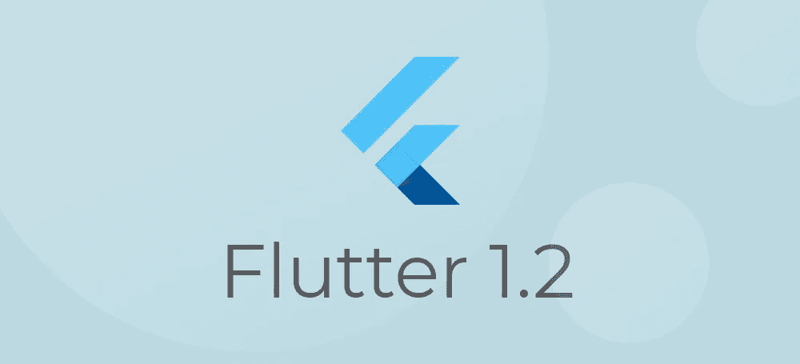
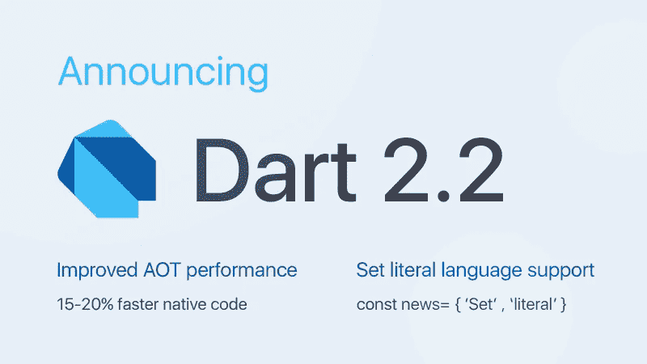

# Flutter 1.2:这个版本有什么新内容？

> 原文：<https://medium.com/hackernoon/flutter-1-2-whats-new-in-this-release-799062b36c36>

随着 Flutter 的引入，移动跨平台开发达到了一个新的高度。自从谷歌团队在去年 12 月发布 Flutter 1.0 以来，这种讨论就从未停止过。当我们谈论和讨论最近的参与者时，Flutter 1.2 已经出来了！

Flutter 1.2 是 Google Flutter 的首次功能更新。它于 2 月 26 日在巴塞罗那举行的世界移动通信大会上发布。所以，让我们看看这次有什么新的！

# Dart 2.2

飞镖的使用已经被证明是颤振游戏的一个主要改变者。Dart 为 Flutter 应用程序提供的性能增强是巨大的。记住这一点，新的 Flutter 版本包括 Dart 2.2 SDK，以获得更快的性能。

在 Dart 2.2 中，他们专门致力于提高提前(AOT)代码的性能。在微基准测试中，开发人员可以看到性能提高了[11–16%。有了](https://github.com/flutter/flutter/pull/27789#issuecomment-464234710) [Dart 2 通用前端(CFE)](/dartlang/announcing-dart-2-2-faster-native-code-support-for-set-literals-7e2ab19cc86d) ，构建新的语言特性变得很容易。一个例子是引入了一组文字语言特性。开发人员现在可以使用{ }编写集合文字。'

# 材料和 Cupertino 部件集

Flutter 承诺在 iOS 和 Android 上实现像素级的完美设计。为了巩固他们提供原生应用的承诺，Flutter 对其材料和 Cupertino 小部件集进行了重大改进，以防止用户界面方面的错误。

当我们深入挖掘时，可以注意到对次要细节的关注已经被大量实施。他们扩展了对浮动光标文本编辑的支持，以获得忠实的 UI 表示。新的动画缓解功能是另一个显著的变化，使颤振更令人印象深刻。还引入了新的键盘事件和鼠标悬停支持来支持桌面级操作系统。

# 应用内购买和 Android 应用捆绑包

在 Flutter 1.2 中支持应用内购买和 Android 应用捆绑。新的 Android 应用程序捆绑包有助于减少应用程序的大小，并支持应用程序的动态交付等新功能。尽管听起来令人兴奋，但 Flutter 团队也仔细地对地图、视频播放器和 webview 进行了许多错误修复。

# 开发人员的新工具

使用 Flutter 的主要好处之一是它的灵活性。编程语言从一开始就支持各种开发工具，如 Visual Studio 代码、Android Studio 等。

Flutter 1.2 有一套新的基于网络的[编程工具](https://flutter.github.io/devtools/)，让开发者的生活变得简单。这些工具包括小部件检查器、时间线视图、源代码级调试器和日志视图。这些工具可以与 Visual Studio 代码和 Android Studio 的其他扩展和插件一起安装。

颤振 1.2 承诺改善性能，质量和稳定性。第一个更新版本完善了现有小部件的视觉效果和功能。随着争论的继续，谷歌的团队一直在寻找改进这项技术的方法。

那么，接下来我们能期待什么呢？随着蜂鸟的发布，超越移动的颤振已经在进行中。敬请关注更多颤振更新！

*原载于*[*https://www . sayone tech . com/blog/flutter-new-feature-release/*](https://www.sayonetech.com/blog/flutter-new-feature-release/)*。*