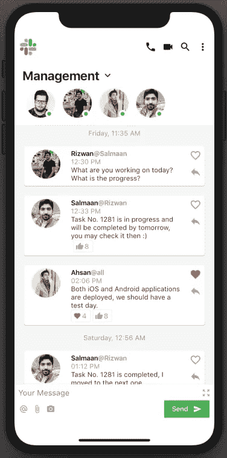
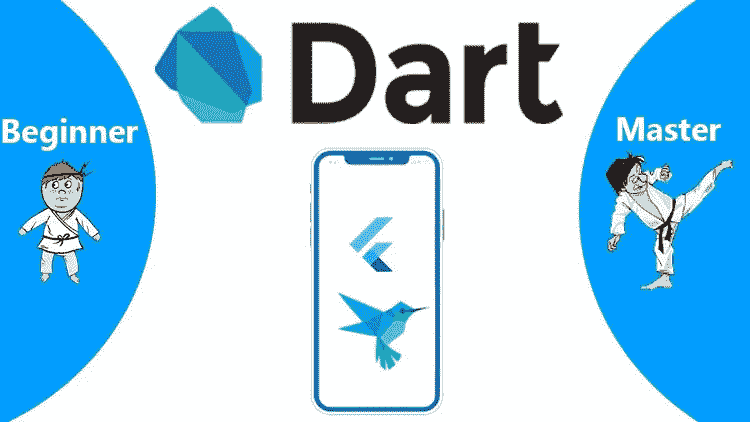
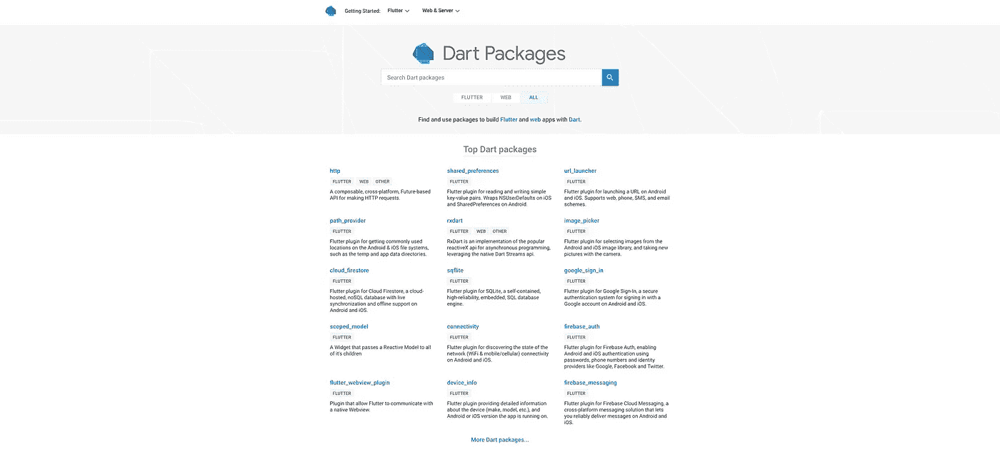
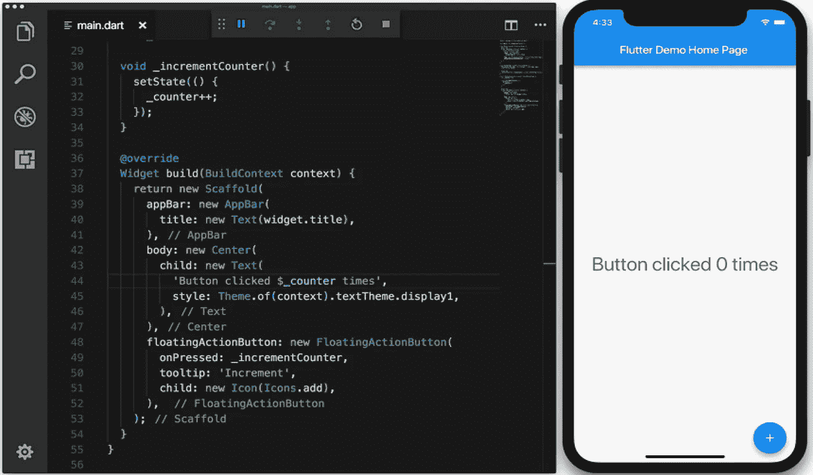
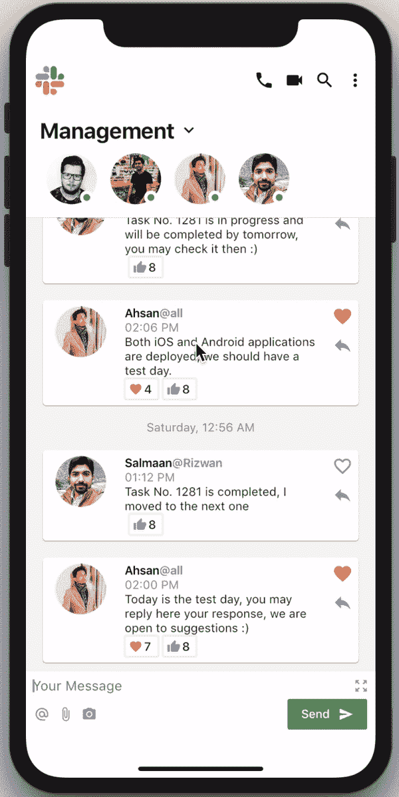

# flutter——Slack 重新设计挑战:我从中学到了什么。

> 原文：<https://medium.com/hackernoon/flutter-slack-redesign-challenge-what-i-learnt-from-it-ef3719fa1d3f>

探索 UI 在 flutter 中的威力，我决定创造一些很酷的东西。在浏览 up-laps 的时候看到了 slack 应用的概念。

链接:[https://www.uplabs.com/posts/slack-redesing-challenge](https://www.uplabs.com/posts/slack-redesing-challenge)

**在这里我揭示了颤动的力量。**

Slack Redesigned using Flutter SDK

我的 flutter 重新设计与 up-labs 版本不完全相同，但非常相似，我把它作为动力。我使用默认的图标和颜色来保持简单。

我作为一个业余爱好者使用了 flutter 一段时间，并制作了几个软件包。
在完成这个重新设计的挑战后，我很乐意在本文中分享我的经验。

# 什么是颤振，飞镖或倒挂金钟

听说过谷歌新的移动设备操作系统吗？ **Fuchsia OS** 。谷歌没有做出任何公开声明，而是悄悄地在 GitHub 上推出了一个名为 Fuchsia 的开源库。

所有用于 **Fuchsia OS** 的应用程序都将使用 Flutter SDK 编写。因此，最好为下一波技术冲击市场做好准备，在这个市场中，跨平台开发将是下一件大事。

这个开源的移动 SDK **(Flutter)** 也可以用来从相同的代码库创建 Android 和 iOS 应用。

# Flutter 让挑战变得非常简单

是啊！没有太多的代码，我在比预期更短的时间内完成了挑战。我花了原生 android 或 iOS 大约一半的时间。你猜怎么着，这个应用已经可以在两个平台上运行了。

You are already in the karate suit when you are equipped with dart 🥊🥋

# 热重装

我会把它写成最好的特写。使用 flutter 时，您不必等待 Gradle 或 XCode 构建来反映 UI 更改。你可以马上看到变化。由于我的工作主要与 UI 相关，这对我帮助很大。

Hot reload

# 跨平台

写一次，建立两次。为 Android 和 iOS 使用一个代码库，或者我应该说是三个，包括 fuchsia。这绝对可以节省你的时间和资源。
已经有很多工具和 SDK 存在，但是并不像预期的那样令人惊讶或顺利。文档并不完整和全面，他们错过了很多东西，但当 flutter 参加比赛时，事情发生了变化。
更不用说还有一个项目蜂鸟，它也将使 flutter 能够构建 web 应用程序。

Google maps using flutter

# 颤动群落

Flutter 社区提供广泛的文档和社区支持来帮助解决您可能遇到的任何问题。
Flutter 的一个基本原则是，硬件能做的任何事情，你在 Flutter 中也应该能做。虽然总是有能力挖掘平台特定的库，随着 Flutter 包的不断增长，大多数开发者会在:[https://pub.dartlang.org/flutter](https://pub.dartlang.org/flutter)找到他们需要的东西

pub.dartlang contains thousands of plugins

# 较少代码

在本地开发中，工作被分成布局和代码。布局应该用 XML 或故事板编写，作为视图，然后在代码中引用。Dart 通过将布局和代码放在一个地方来解决这个问题。因为 Flutter 中的所有东西都是一个小部件，所以布局也是在 Dart 中创建的。

These 50 lines contain all the code, including UI

颤振意味着代码更少。代码越少，错误就越少。使用 Dart，通常 100%的代码在 iOS 和 Android 应用程序之间共享。

# 结论

Dart 编译成本机代码，不需要访问 OEM 部件，因为 Flutter 有自己的部件。这意味着应用程序和平台之间的沟通更少。

Flutter 使得在几个小时内构建这个应用程序变得非常容易。我已经在 github 上传了代码:

 [## salmaan Ahmed/slacredesingflutter

### 探索 UI 在 flutter 中的威力，我决定创造一些很酷的东西。在浏览的时候看到了颤振的概念…

github.com](https://github.com/salmaanahmed/SlackRedesignFlutter) 

如果你喜欢，请鼓掌，别忘了成为 Git Hub 上的观星者:)

The redesign challenge made easy :)