# 在几分钟内弹出窗口小部件和布局-第一部分

> 原文：<https://medium.com/hackernoon/flutter-widgets-and-layouts-in-minutes-ffd4d2f0d443>

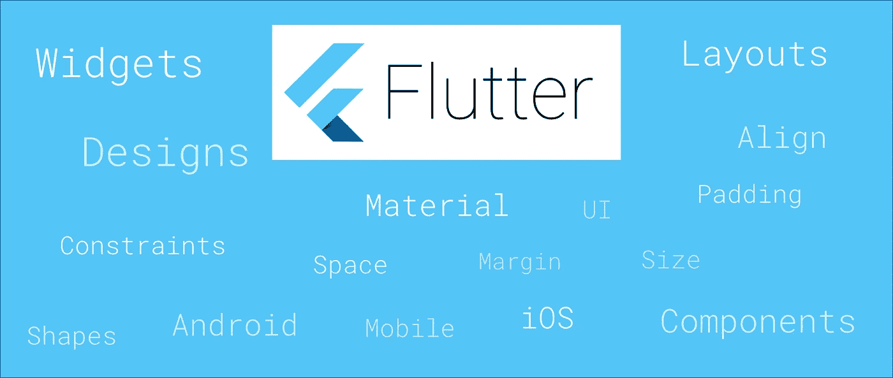

尝试过快速学习吗？。你觉得可能吗？

现在，介绍[**FlutterExamples**](https://github.com/TakeoffAndroid/FlutterExamples)**，**精选范例、设计、布局和部件的终极清单。

github—[https://github.com/TakeoffAndroid/FlutterExamples](https://github.com/TakeoffAndroid/FlutterExamples)

有什么特别的？

创建这个 repo 背后的想法是在几分钟内尽可能容易地更快地学习 flutter UI。那么，怎么做？我知道大家都很震惊。让我们看一些受欢迎的例子来分析这一点。

相信我！不解释！没有理论依据！

**容器**


```
Container(
 padding: const EdgeInsets.all(0.0),
 color: Colors.cyanAccent,
 width: 80.0,
 height: 80.0,
),
```

**居中**

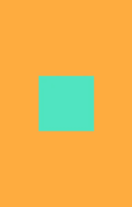

```
Center(child: Container(
  padding: const EdgeInsets.all(0.0),
  color: Colors.cyanAccent,
  width: 80.0,
  height: 80.0,
))
```

**对齐**


Bottom Align (Left, center and right)

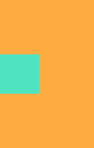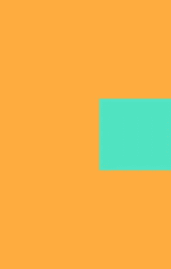

Center Align (Left, center and right)

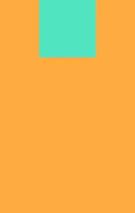

Top Align (Left, center and right)

```
Align(
  alignment: Alignment.center, 
  child: Container(
  padding: const EdgeInsets.all(0.0),
  color: Colors.cyanAccent,
  width: 80.0,
  height: 80.0,
))
```

**填充**

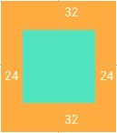

```
Padding(
  padding: EdgeInsets.fromLTRB(24, 32, 24, 32) ,
  child: Container(
  padding: const EdgeInsets.all(0.0),
  color: Colors.cyanAccent,
  width: 80.0,
  height: 80.0,
))
```

**尺寸框**

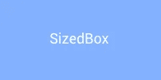

```
SizedBox(
  width: 200.0,
  height: 100.0,
  child: Card(
    color: Colors.indigoAccent,
    child: Center(
        child: Text('SizedBox',
            style: TextStyle(color: Colors.white)
         )
       )
     )
   )
```

**展开**

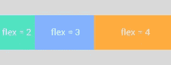

Row

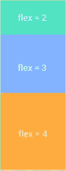

Column

```
Row(
  mainAxisAlignment: MainAxisAlignment.center,
  mainAxisSize: MainAxisSize.max,
  crossAxisAlignment: CrossAxisAlignment.center,
  children: <Widget>[
    Expanded(
      child: Container(color: Colors.cyan, height: 80),
      flex: 2,
    ),
    Expanded(
      child: Container(color: Colors.indigoAccent, height: 80),
      flex: 3,
    ),
    Expanded(
      child: Container(color: Colors.orange, height: 80),
      flex: 4,
    ),
  ],
),
```

**平面按钮**

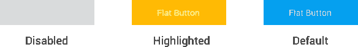

```
FlatButton(
  onPressed: () {
    debugPrint('I am Awesome');
  },
  textColor: Colors.white,
  color: Colors.blueAccent,
  disabledColor: Colors.grey,
  disabledTextColor: Colors.white,
  highlightColor: Colors.orangeAccent,
  child: Text('Flat Button'),
),
```

**凸起按钮**

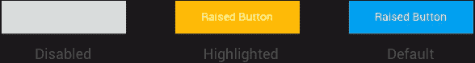

```
RaisedButton(
  onPressed: () {
    debugPrint('I am Awesome');
  },
  textColor: Colors.white,
  color: Colors.blueAccent,
  disabledColor: Colors.grey,
  disabledTextColor: Colors.white,
  highlightColor: Colors.orangeAccent,
  elevation: 4.0,
  child: Text('Raised Button'),
),
```

**图标按钮**

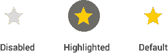

```
IconButton(
  onPressed: () {
    debugPrint("Starred Me!");
  },
  color: Colors.orangeAccent,
  icon: Icon(Icons.star),
  disabledColor: Colors.grey,
  highlightColor: Colors.black38,
),
```

**浮动动作按钮**


FAB (Default)


FAB (Mini)

```
return Scaffold(
  floatingActionButton: new FloatingActionButton(
    mini: true,
    child: new Icon(Icons.add),
    onPressed: () {},
  ),
);
```

**文本字段**

**下线条样式**


```
TextField(
  decoration: InputDecoration(
  hintText: "Enter your name!",
  hintStyle: TextStyle(fontWeight: FontWeight.w300, color: Colors.blue),
  enabledBorder: new UnderlineInputBorder(
      borderSide: new BorderSide(color: Colors.blue)),
  focusedBorder: UnderlineInputBorder(
    borderSide: BorderSide(color: Colors.orange),
  ),
  ),
)
```

**外部线条样式**

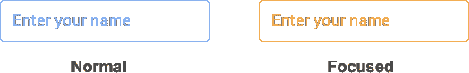

```
TextField(
  decoration: InputDecoration(
  hintText: "Enter your name!",
  hintStyle: TextStyle(fontWeight: FontWeight.w300, color: Colors.blue),
  enabledBorder: new OutlineInputBorder(
      borderSide: new BorderSide(color: Colors.blue)),
  focusedBorder: OutlineInputBorder(
    borderSide: BorderSide(color: Colors.orange),
  ),
  ),
)
```

更多收藏的小工具可以在 [**这里**](https://github.com/TakeoffAndroid/FlutterExamples) 找到