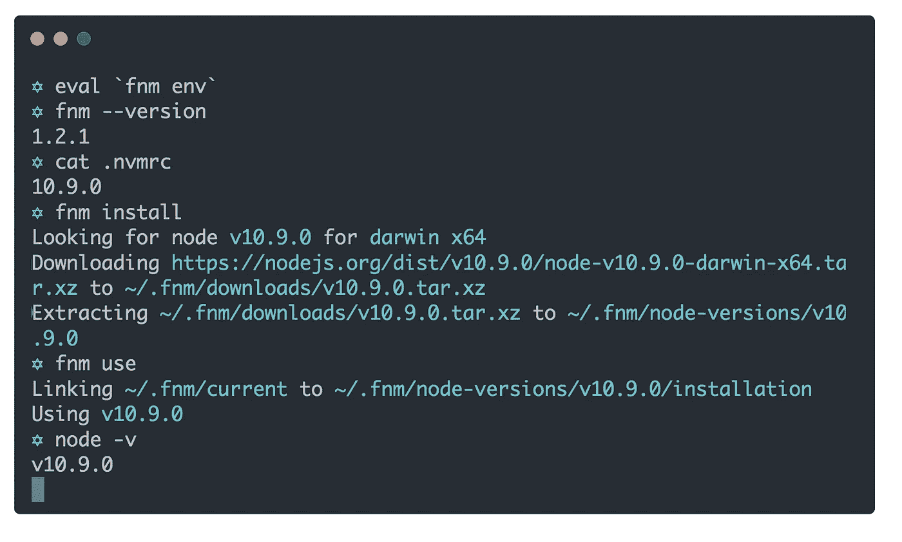

# 🚀fnm:快速简单的 Node.js 版本管理器

> 原文：<https://medium.com/hackernoon/fnm-fast-and-simple-node-js-version-manager-df82c37d4e87>

## GitHub 上现在有一个超快速的 NVM 替代方案开源了

TL；dr: [fnm](https://github.com/Schniz/fnm) 是一个非常快的 [Node.js](https://hackernoon.com/tagged/node.js) 版本管理器，比 NVM 快~ 40 倍。支持`.nvmrc`文件和[鱼壳](https://fishshell.com/)开箱。它可以在 Linux 和 Mac 上运行，并作为一个单独的可执行文件发布——而且它在 GitHub 上是开源的！

# 所以，

两周前，我在终端上打开了一个新标签，痛苦地抱怨道:“天哪！每次我打开一个新的终端都需要一秒钟！”。队友看我的眼神很搞笑。“这显然是次优的，有损我的专注，我认为这是 NVM 的错。”

在我对我的`.zshrc`文件进行搜索，检查哪一行花费的时间最多之后，我发现是 NVM 出了问题。这是 NVM 的初始化。我使用 NVM 已经很多年了，我一直想写一个简单的替代品，因为我的用例非常简单:

*   我希望能够下载任何节点版本(如`nvm install`)
*   我希望能够在它们之间轻松切换(就像`nvm use`)

这些任务不难解决。Node.js 二进制文件以 tarballs 的形式发布在他们的网站上，切换版本不应该仅仅是改变一个符号链接。那么，NVM 为什么这么慢？

我想把它写成一个简单的 Bash 脚本，就像 NVM 一样，但是我希望它有趣。此外，并不是所有的机器都安装了 Bash，否则在与 Bash 集成时可能会出现问题。我已经使用[鱼壳](https://fishshell.com/)很多年了，为了使用 NVM，我不得不使用一个修复东西的包装器。这并不容易。另一方面，使用真正的可执行文件可以在任何 shell 上工作！

# 第一个原型

我的第一个原型是一个打字脚本应用程序。我用 [Zeit 的 pkg](https://github.com/zeit/pkg) 把它打包，使它成为一个自包含的可执行文件，因为我不想对 Node 有依赖性。我想让它在没有安装 Node 的系统上工作(所以 Node 的第一个版本将使用 fnm 安装！)

Node 的启动时间对我来说不够好。仅仅生成一个“hello world”就需要大约 200 毫秒，这对于服务器来说是好的，对于不经常使用的命令行实用程序来说也是好的，但是有些人在每个`cd`上都使用`nvm`，所以他们的节点版本总是同步的。每个`cd`200 毫秒的惩罚是疯狂的，会使工具无法使用。

所以看起来我需要用一种编译过的语言来写它(所以不依赖于主机系统)，并且有一个快速的启动时间。想到了四种语言:Go、Rust、Crystal 和 Reason/OCaml。

# 一款原生推理 App

我选择理智是有很多原因的(呵呵)，[有些写在另一个帖子](https://hackernoon.com/the-programming-language-im-looking-for-948d93f7a396)。我使用了`[esy](https://esy.sh/)`和`[pesy](https://github.com/jordwalke/pesy)`，这两个很棒的软件包让 Node.js 开发人员可以轻松开发 native Reason/OCaml 应用程序的工作流程。

`esy`工作起来像一个超级的`[yarn](https://yarnpkg.com/)`:它从 npm 或者 OPAM (OCaml 包管理器)安装包，然后[把它存储在一个全局缓存](https://esy.sh/docs/en/how-it-works.html)。它还为您管理 OCaml 运行时/依赖项的沙箱，因此不同的 OCaml 安装不会相互中断。`pesy`直接从`package.json`文件中为 OCaml 的构建工具 [Dune](https://dune.build/) 生成构建配置。

当使用这两个包时，感觉就像节点开发一样——所有东西都用一个`package.json`文件工作，只需要最少的配置。它也可以帮助其他节点开发人员，就像它帮助我一样，为项目做出贡献，因为 Reason 语法非常接近 JS '，工具链感觉非常类似于 JavaScript。

我制作了第一个原型，并测试了它的性能。我有两个测试文件，一个使用 NVM，一个使用 fnm。两个测试都产生了一个普通的 Bash，称为目标的“初始化”(NVM/fnm)，然后使用目标切换到目录中的`.nvmrc`文件中指定的节点版本。我对每个二进制文件运行了 10 次，结果令人惊讶:

*   NVM 的测试用例在我的机器上运行了大约 600 毫秒
*   fnm 的测试用例在我的机器上运行了大约 15 毫秒

所以在那次测试中，在我的 MacBook Pro 上， **fnm 比 NVM** 快 40 倍。尽管不太科学，但这是相当大的数字。

[A real-time animated video is on the repo’s README](https://github.com/Schniz/fnm)

# 向公众发布

当我开始从事 fnm 的工作时，我加入了 Reason Discord 服务器，并向人们寻求帮助。发现那个社区*这么好看*。当我决定发布时，我在`#native-development`频道上写了一条短信，立即得到了很好的反馈，告诉我这是一个很棒的想法。

社区方面是 JavaScript 的如此重要的一部分，Reason 的社区感觉比 JS 的还要好——可能因为社区仍然很小，但是它非常受欢迎。

我把 fnm 作为开源发布到 GitHub，发了关于它的推特，然后睡觉了。当我醒来的时候，

*   我的推特通知着火了🔥
*   回购有 500 多颗星💯💯💯💯💯
*   fnm 在黑客新闻上排名第一🏆
*   Reddit/HackerNews 上没人骂我傻逼！🤡(罕见的景象)

这是一件大事。

# 现在怎么办？

fnm 仍然缺少一些功能。以下是我们想补充的几件事:

*   Windows 支持
*   版本别名
*   支持下载最新的 LTS
*   每外壳使用
*   放弃对`tar`和`curl`的依赖
*   …以及更多！

因此，如果您觉得您已经准备好使用它并开始更快地工作，或者您是一名愿意为开源项目做出贡献的 JS/Reason 开发人员，[下载 fnm 并加入我们的 GitHub](https://github.com/Schniz/fnm) ！