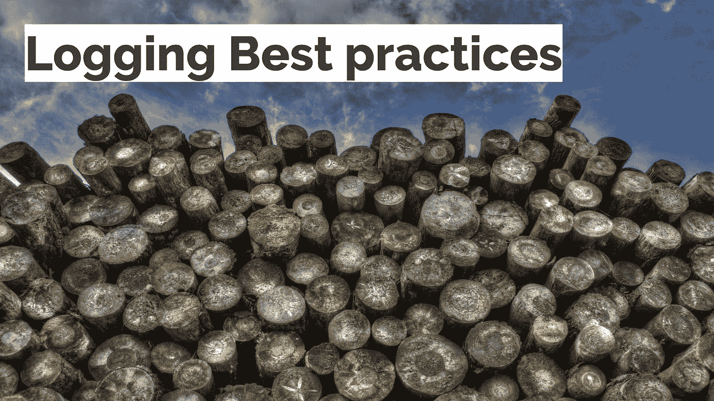

# 记录最佳实践以充分利用应用程序级记录—幻灯片

> 原文：<https://medium.com/hackernoon/follow-these-logging-best-practices-to-get-the-most-out-of-application-level-logging-slides-453ae3cd901c>

Image from Pixabay

应用程序级别的日志是应用程序与您交流的唯一方式。拥有具有值得称赞的搜索能力的适当日志就像在黑暗的房间里有一个手电筒。

在出现任何问题的情况下，充分利用日志是非常被低估的。作为软件工程师，我们可以利用来自[应用程序](https://hackernoon.com/tagged/application)的日志来解决问题