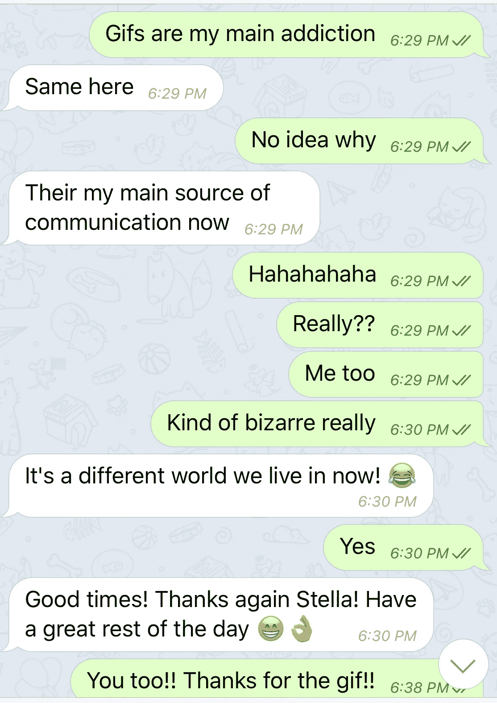

# 看在 GIF 的份上

> 原文：<https://medium.com/hackernoon/for-the-love-of-gif-644b7305bf3a>

GIF Source from [Reaction Gifs](https://www.reactiongifs.com/tom-delonge-wtf/)

## 昨天我在 [pixEOS](https://www.pixeos.io) 电报频道和一个叫 Jason 的家伙聊天，这是一个奇怪的时刻，我意识到我们都使用 gif 来表达我们的情感，而不是任何其他媒介，甚至是与人面对面交谈。

message with Jason

他还告诉我，他退出了所有其他社交媒体平台，所以 Telegram 是他剩余的与人沟通的方式，他说他经常使用 gif*。我不太记得我自己的 GIF 瘾是从什么时候开始的，但现在已经有一段时间了。我认为 gif 是我生活中如此重要的一部分，这有很多原因。*

## *你会说 GIF 吗？*

*Giphy search: Tim and Eric*

*Giphy search: mind blown*

*Azealia Banks*

*Nicholas Cage*

*Oprah*

*另一件奇怪的事情正在发生:自从我离开脸书，我以前的许多艺术家平台被更新的平台所破坏，我觉得自己作为一个艺术家真的很分散，我的东西分散在网络上。我过去发布文章的一些平台现在陷入了困境，因此，我的文章只是挂在网络中间，由于缺乏人的关注而枯萎…..即使在脸书，我也有很多我的艺术作品和随意的图像，不知何故，我仍然对它们念念不忘，但是离开脸书对我的心灵产生了奇迹。*

## *我更喜欢 gif 是因为一个主要原因:我用 gif 来表达我的情感，和我互动的人比我的任何“艺术”都多。*

*我每天都在网上工作。在互联网上与人交流是我的主要工作。*

*我已经开始分享我的 Giphy 频道作为我的“艺术家作品集”,因为 Giphy 不会去任何地方。人们希望分享一些表达他们情感的简短的东西，这似乎是跨国家和文化的普遍现象。用一张 GIF 图片来传达一种情绪反应比写一篇长篇大论要容易得多。*

*在某些方面，我觉得 GIF 已经成为我的主要交流工具，我仍然在朝着我最终的 GIF 创作努力(我还没有做出任何一个我认为真正非凡的 GIF)。每次我看到一些东西，我都会悄悄地问自己，“我想知道它在 GIF 中会是什么样子？”*

*下面是我的 [GIF 频道](https://giphy.com/channel/stellabelle)(当然是 GIF 格式的):*

## *gif 有能力创造个性化的迷因*

*我相信 gif 是现代人类的集体意识。分享是我们的工作。重组它们对我们来说也是很自然的事情。很多人(包括我自己)也对这个眨眼 182 ***WTF*** GIF 感受强烈。我对鲻鱼(和大量的鲻鱼假发收藏)有一种奇怪的痴迷，我也喜欢“WTF”和“dafuq”的表达。作为一个对人类现状深感不满的批判者，我花了很多时间对自己说“wtf”。我想我已经看过这个 GIF 循环几百次了(我们稍后会谈到这个注意力问题)。*

*GIF Source from [Reaction Gifs](https://www.reactiongifs.com/tom-delonge-wtf/)*

*所以，正如你所看到的，它被移植到了黑客帝国的主题上，这真的很歇斯底里，每次都让我发笑。这就像我们这一代人，我们所有人目前都在进入人工智能的领域，但我们中没有人真的准备好了:*

*From [Reddit Reaction GIFs](https://www.reddit.com/r/reactiongifs/comments/6jgt0n/mrw_i_shoot_someone_in_the_chest_and_he_gets_back/)*

*然后是荷马·辛普森的漫画:*

*在我看到《黑客帝国一号》后，我受到启发，为我正在为之工作的 [PixEOS 项目](https://www.pixeos.io)创建了我自己的汤姆·德隆格 ***WTF*** GIF。这个花了我很长时间，因为我手工剪切了 WTF Tom DeLonge GIF 的每一帧，然后在 Giphy 中重新组装:*

*[From Stellabelle’s Giphy Channel](https://giphy.com/channel/stellabelle)*

## *这张 GIF 对我有意义。*

*我觉得 [pixEOS 项目](https://www.pixeos.io)是由真正丰富多彩、积极向上的人组成的，而那些习惯了某种恶劣和欺诈环境的加密人员在第一次进入 pixEOS 电报频道时会感到震惊。我们用善良杀人，上面的 GIF 表达了那个条件。至少我 ***是这么觉得*** 的。*

## *那个 WTF 汤姆·德隆格·吉夫已经有了自己的生活，并穿越了像我这样的人的集体心理。*

*这就像这些情感的小片段被发送到我们的潜意识中，在那里它们编织出有意义的新故事，以及超越最初创造的情感影响。我从没看过那个眨眼 182 的视频。我都没意识到这个 GIF 是从那个来的。在我看来，它来自别人的梦，然后进入我的梦，在它与我自己的经验叙事重组后，它重组并讲述了一个不同的故事。*

## *注意力持续时间短*

*像许多互联网上的人一样，我有一种注意力持续时间短和过分关注细节的奇怪组合，过度集中问题，也许是过度集中和注意力不集中的组合…..我很容易被新的东西吸引，不管是一个新的想法，还是 GIF，或者其他什么，然后我会沉迷一段时间。一旦我耗尽了它，我就转移到别的事情上。*

*我渴望总是学习新的东西。我对 GIF 的痴迷完全符合这种情况，并助长了这种情况。我更喜欢制作会动的艺术品，比如视频，但是我可以做得很快。我宁愿花一天时间做 10 张 gif，也不愿花 10 天时间做一个高质量的视频。这解释了为什么我如此关注 gif。*

*当我最终做出一张我引以为豪的 GIF 时，我会把它写出来。在那之前，看看我的 Giphy 频道，看看我在做什么:[https://giphy.com/channel/stellabelle](https://giphy.com/channel/stellabelle)*

*我现在参与的项目 [pixEOS](https://www.pixeos.io) ，目前正在举办 [GIF 大赛](https://trybe.one/pixeos-gif-contest-10000-pixeos-in-prizes/)，一直持续到 2019 年 1 月 19 日。如果你的 GIF 赢了，就可以得奖。为 pixEOS 举办 GIF 大赛就像梦想成真。*

*干杯，
Stellabelle*