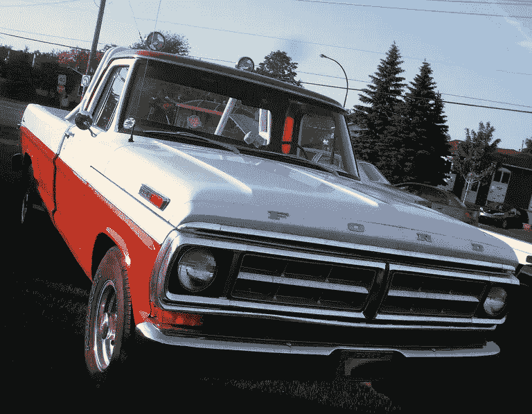
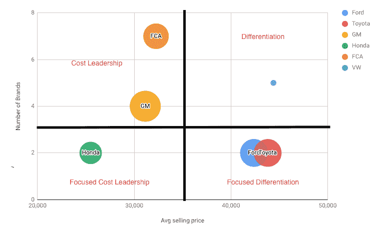

# 福特

> 原文：<https://medium.com/hackernoon/ford-21786477981d>

*注意:这篇文章改编自我在 MBA 战略&实践模块中写的一篇文章(你可以在这里看到***)。**

**

*Image from [here](https://www.thoughtco.com/ford-f-series-pickup-trucks-1973-1979-3273774).*

*在美国，很少有公司能像福特一样代表经典的白手起家的美国梦。我之前[写过](https://hackernoon.com/edsels-waterfall-2997e57c453b)关于他们早期分化失败的文章，但这次我想探究他们今天做得怎么样。由于福特是一家在多个领域经营的全球性公司，本文的重点是福特汽车公司在新的轻型汽车美国市场(乘用车、SUV、轻型卡车)的战略分析。*

# *这个行业很残酷，而且注定会变得更糟*

*[生产的最小有效规模](https://en.wikipedia.org/wiki/Minimum_efficient_scale) (MES)非常高，导致高资本要求。最小的主流生产商每年的销量不到 30 万辆，与黄估计的汽车制造业的 MES 为 25 万-30 万辆一致([链接](https://www.jstor.org/stable/4177434?seq=1#page_scan_tab_contents))。这使得新进入者很少，而且通常狭隘地专注于利基市场。这也解释了为什么特斯拉只有在[达到大约 30 万年产量](https://www.statista.com/statistics/715421/tesla-quarterly-vehicle-production/)后才开始盈利。*

*转换成本接近于零，汽车价格昂贵，这使得购买者对价格敏感，在经济衰退时往往会推迟购买。汽车制造商成功地用品牌来抵御这种威胁——大约一半的人认为他们忠于汽车品牌。尽管如此，这个行业仍然被消费者的口味所主导——亨利·福特在 T 型车颜色选择上的著名的[名言](https://www.goodreads.com/quotes/tag/model-t)在今天已经不再适用了。欧洲和美国消费者口味的巨大差异，或者约 15%的美国人[考虑在 2018 年](https://www.statista.com/statistics/512998/number-of-hybrid-electronic-vehicles-owned-by-persons-in-affluent-american-households/)购买电动汽车的事实，都很好地说明了这一点，而十年前这一数字仅为 0。*

*增加市场压力的另一个因素是市场饱和——美国的车辆拥有率和里程驱动率似乎在 2006 年左右达到顶峰。*

*面对一个由价格敏感的客户驱动的停滞不前的市场，由于有限的市场力量和监管审查，没有串通的机会，汽车制造商的投资资本回报率不出所料地低:普华永道的 2017 年[研究](https://www.strategyand.pwc.com/trend/2017-automotive-industry-trends)表明全行业资本回报率只有 5%，低于他们的资本成本。*

*全行业转向电动汽车将需要大量资本投资，以维持最低效率规模，并建设必要的充电基础设施。负债累累的公司将无法很好地做到这一点，并因此面临生存威胁。*

# *福特如何应对这一局面？*

*下图说明了行业战略集团(见[该电子表格](https://docs.google.com/spreadsheets/d/13dANUp9ExKRip7Bk1AwLDtAt_uigpV0UnUT16UlQPoE/edit?zx=y4mqbghhd4qx#gid=0&range=B13)了解来源详情)。制造商是根据两个维度绘制的:平均售价和品牌数量。制造商品牌的数量被用来估计制造商是追求一个广泛的战略还是一个狭窄的战略。泡沫的大小代表市场份额。*

**

*由于价格是一个关键的决定因素，FCA、通用汽车和本田似乎都在追求成本领先战略，而竞争通常是最激烈的。福特似乎已经避免了这场战斗，我们接下来将探究如何避免。*

*福特 2017 年在美国销售的 258 万辆汽车中，有 110 万辆是皮卡(详见[年报](https://shareholder.ford.com/investors/financials/annual-reports/default.aspx))。这是一个很好的细分市场:卡车的平均售价更高，排放要求更低，消费者更喜欢卡车细分市场中的美国品牌— [超过 85%的卡车销售是由“三大”制造商](https://www.cnbc.com/2018/04/26/ford-is-basically-giving-up-on-us-car-business-and-gm-is-not-far-behind.html)完成的。此外，消费者越来越倾向于卡车——2012 年销量超过了汽车。福特是这一利润丰厚的细分市场的顶级玩家，2017 年 254 亿美元的广告支出巩固了这一地位，[仅次于通用](https://www.statista.com/study/15984/automobile-advertising-in-the-us-statista-dossier/)。如果我们考虑通用汽车有一个广泛的品牌战略，福特可能是最大的汽车广告支出者。*

*总之，**福特在当前的市场条件下处于有利地位。**接下来，我们将考虑行业变革的关键驱动因素，并提出福特能够适应的方法。*

# *直接销售*

*为了获取更多的价值，福特应该考虑整合他们的经销商，直接销售给消费者。在美国大多数州，特许经营是法律所要求的，但正如特斯拉所展示的，这是可以做到的。其他制造商可能会跟进，如果他们不跟进，福特将处于严重的竞争劣势。*

# *自动驾驶*

*随着 Waymo 宣布开始运营自动驾驶出租车服务，以及通用汽车的 Cruise 子公司宣布将于 2019 年推出，自动驾驶似乎处于一个拐点:自动驾驶出租车服务可能会在十年内变得普遍。*

*因此，出租车价格将大幅下降，很大一部分城市人口将不再拥有汽车。新车需求将进一步下降，但也将从结构上改变竞争环境:自动出租车服务将主导购车，增加他们的议价能力。当它们成为福特销售的重要组成部分时，自动驾驶出租车公司可能会尝试收购汽车制造商进行垂直整合。与公共汽车类似，终端消费者将不再关心他们驾驶的是什么品牌的汽车，从而扼杀了福特的品牌“护城河”。德勤在他们的 2017 年[研究](https://www2.deloitte.com/content/dam/Deloitte/us/Documents/consumer-business/us-auto-the-future-of-the-automotive-value-chain.pdf)中将这种情况称为“硬件平台提供商”，让人想起 PC 制造商在 90 年代的命运。*

*因此，福特应该大力投资开发自己的自主移动服务。他们正在努力，但自己动手可能会有挑战性。如果他们落后于竞争对手太多，他们可能会考虑投资于一个他们不是直接竞争对手的现有玩家。例如，FCA 最近宣布了与英特尔和宝马的[合作。](https://www.bloomberg.com/news/articles/2017-08-16/fiat-chrysler-joins-bmw-intel-coalition-for-self-driving-autos)*

# *带电*

*电动汽车生产中的一个关键技术挑战是储能和充电能力。电池产能需要[大幅增加](https://www.bcg.com/en-ch/publications/2018/future-battery-production-electric-vehicles.aspx)以满足不断增长的电动汽车车队的需求。*

*一个关键的战略决策是是否拥有电池生产或外包。这取决于电池供应商市场将如何演变:它会整合，让少数关键供应商拥有对福特的巨大议价能力，还是所有汽车制造商都将电池生产外包，从而创造一个巨大的商品化市场，电池供应商将没有太多的议价能力。*

*目前只有特斯拉在追求内部电池生产:大众、通用、本田和 FCA 决定从外部采购。从短期到中期来看，外部采购是更好的选择——它的资本密集程度较低，大多数竞争对手也在这样做，这在电池生产中创造了有限的竞争优势机会。鉴于福特的高杠杆率，他们自己可能负担不起，所以长期电池供应合同可能是可行的。*

*另一个需要考虑的关键方面是未来的“加油站”会是什么样子。制造商应该建立自己的网络，还是将这项活动外包给他人？福特已经与戴姆勒、大众和宝马达成协议，共同在欧洲建设充电网络，但没有消息称美国也达成了类似的协议。通用汽车将他们的美国充电网络外包给了 evgo。*

*与电池制造类似，福特可能负担不起这需要的大量资本投资，与戴姆勒、大众或宝马等不是其直接竞争对手的公司结盟是有意义的。另一个合作的候选人可能是石油公司——重新规划加油站比从头开始要求更低，石油公司有与福特类似的动机这样做——生存。*

*总之，我认为[埃隆可能是对的](https://www.businessinsider.com/elon-musk-good-chance-ford-doesnt-survive-next-recession-2018-11)——**事情对福特来说看起来不妙。**虽然他们目前做得不错，但他们似乎没有为即将到来的行业变化做好准备。最近宣布的[大众联盟](https://www.theverge.com/2019/1/15/18183498/ford-volkswagen-alliance-trucks-vans-detroit-auto-show-2019)可能是应对这些挑战的正确方向上的一步(利用你盟友的资源，而不是建立你自己的)，尽管它也有过于依赖大众的风险。*