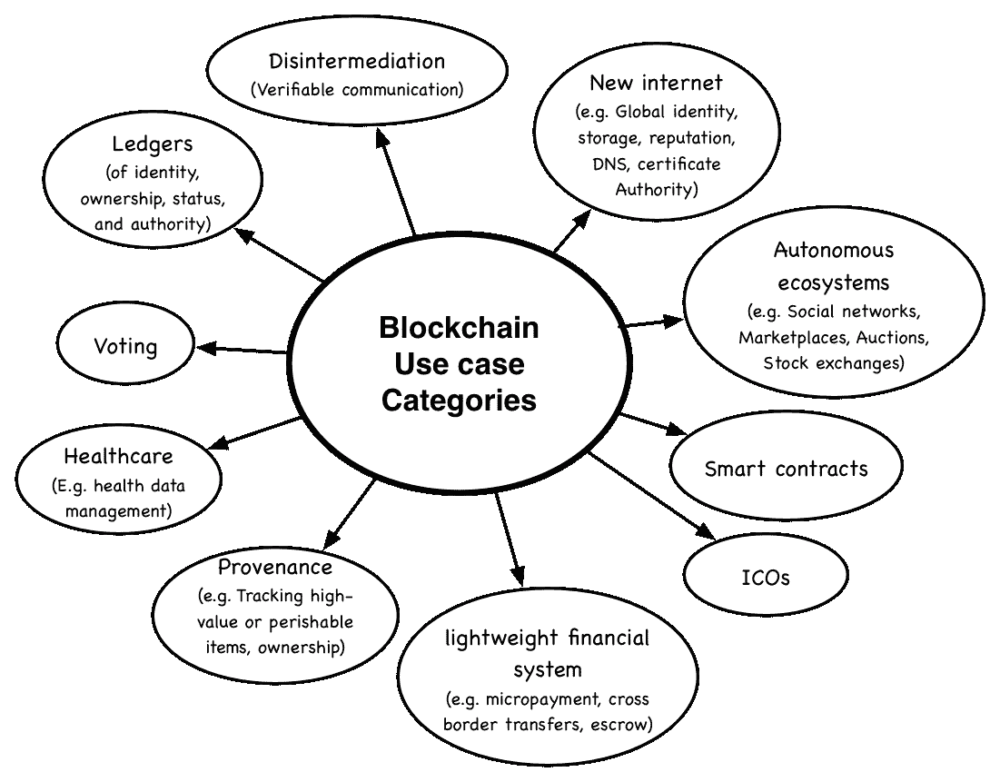
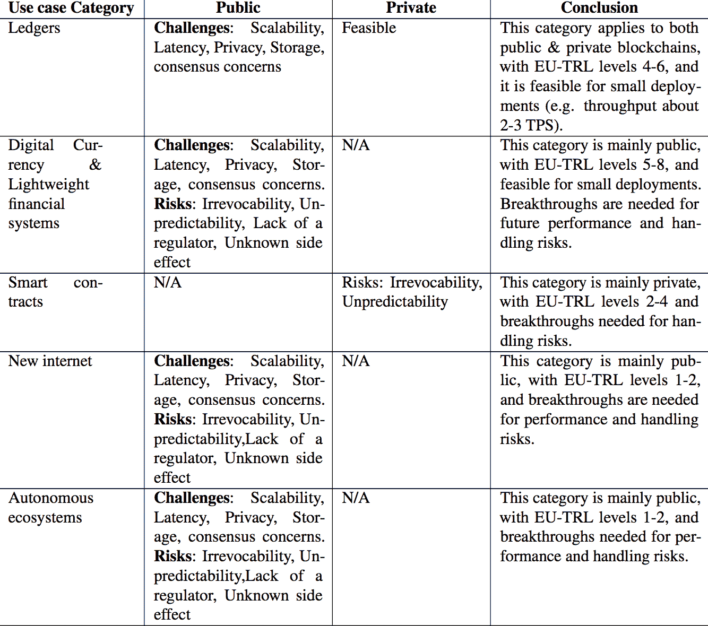
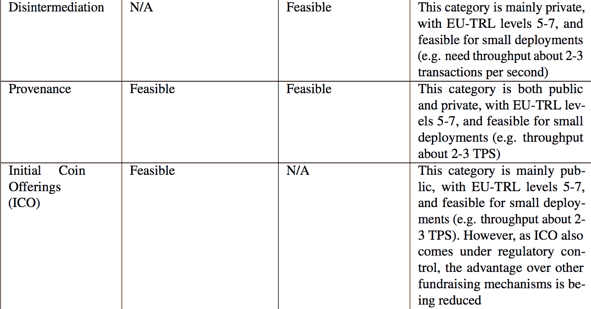
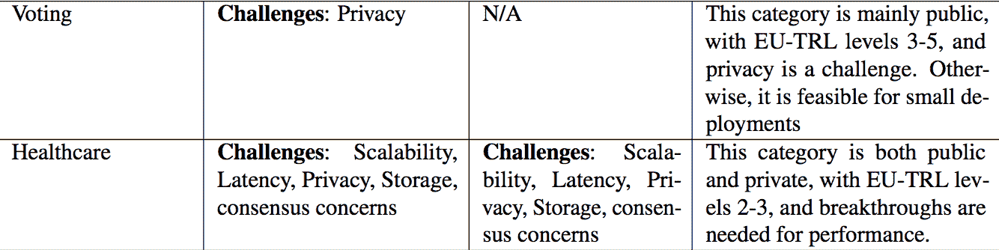
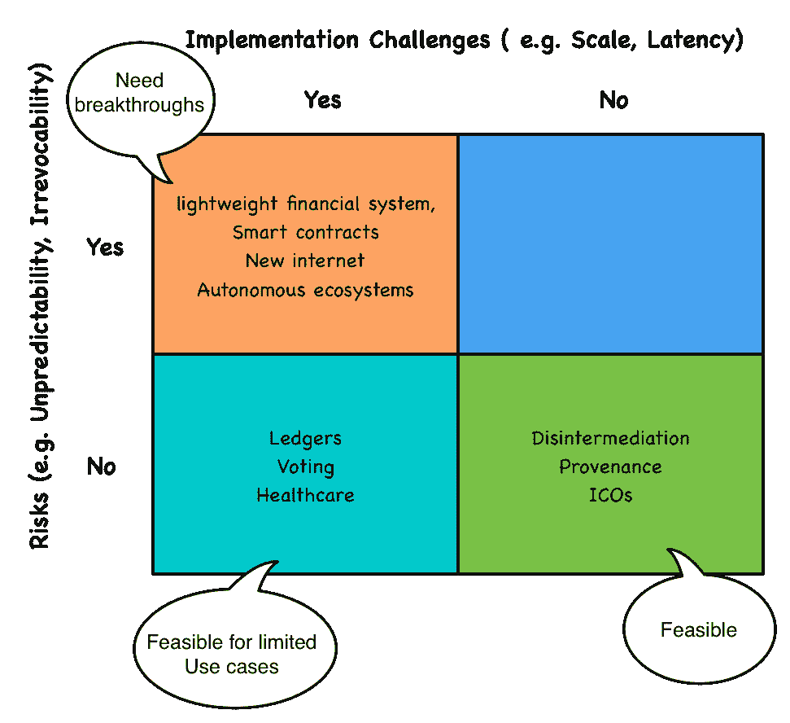

# 区块链未来:分离可行性、希望和登月计划

> 原文：<https://medium.com/hackernoon/forecasting-the-future-of-blockchain-fefe0b521e3d>

区块链已经抓住了企业和政府组织的想象力。但是很难区分这项技术的宣传和真正潜力。考虑到这一点，我们想采取一种系统的方法来评估它。为此，我们使用了新兴技术分析框架(ETAC ),该框架通过探索影响、可行性、风险和未来时间表，对新兴技术进行了广泛的分析。

此外，在我们做研究的时候，我们很快了解到区块链是多种多样的，很难全面地谈论区块链。因此，在我们的评估中，确定了 10 个类别的区块链用例。

这些用例类在下图中被识别。

下面是我们对采用区块链的影响、挑战和风险的观察总结，以及上述每个使用案例是如何受到影响的。

# 影响

区块链提供了不可变的去中心化账本。我们可以用这个账本来提高信任度。这以三种主要方式发生。

首先，区块链为每个参与者提供了一个标识符和管理可验证声明的方法，比如他的姓名、学历和生日等证书。例如，我们可以使用区块链可以使用两个 W3C 规范:分散标识符(DID)和可验证声明来实现上述安全场景。这使得互不认识的双方能够验证对方并知道他的属性，从而建立信任。这有几个好处。

1.  它让我们能够取代当前耗时、昂贵且较弱的信任替代方案，如中介和政府检查。
2.  它更快，通常在一秒钟内建立信任。
3.  它更加安全，由加密算法和普查数据保护。
4.  由此产生的系统更便宜、更灵活。

区块链为多方提供了一种以可审计的方式进行沟通或合作的方式。这再次消除了在双方之间建立信任的昂贵过程(例如律师或其他中介)。这也有助于最终的系统更具成本效益和灵活性。

区块链是分权制的。没有一个用户或一小组用户可以改变区块链，这为我们提供了管理超关键系统的可靠资源。这种提升的信任级别支持以前不可能实现的用例，例如全球声誉和投票)。

# 挑战和风险

在评估区块链时，我们区分了挑战和风险。我们所说的挑战是技术上的限制，很可能在未来得到解决。相比之下，风险是区块链固有的性质，不太可能改变。

## 技术挑战

对于区块链，我们确定了四个技术挑战:有限的可扩展性和延迟、有限的隐私、存储限制和不可持续的共识。让我们仔细看看其中的每一项。

***可扩展性和延迟有限。*** 在撰写本文时，一笔比特币交易大约需要 8 分钟，每秒只能支持大约 2 到 3 笔交易。我们评估的大多数用例在这些限制下是不可行的。例如，为了处理全球规模的系统，如分散的互联网，区块链每秒需要处理数万次交易。但值得注意的是，这是由共识算法的选择决定的。私有区块链实现已经提出了更快的算法，尽管它们提供的保证较少。

***有限的隐私。*** 区块链提供伪匿名。但是，通过分析事务图和其他相关信息，通常可以将用户与事务联系起来。一旦一个交易与一个用户相关联，他的所有交易都是已知的。

***存储约束。*** 用目前的算法，每个节点必须存储区块链的全部历史。这导致了很高的事务延迟。存储完整历史的需要也阻止了轻量级节点(如物联网设备)加入区块链网络。久而久之，历史变得更大加剧了这个问题。

***不可持续的共识。*** 目前的共识方法比较繁琐，消耗了大量的能量。例如，如果考虑作为一个国家，比特币的能源消耗将在世界上排名第 39 位，高于澳大利亚。

## **风险**

接下来，我们确定了比特币的五大风险:不可撤销性、经常性缺失、被误解的副作用、比特币价格波动以及监管回应不明确。

***无可挽回。*** 交易的不可撤销性是一个重大风险。对于使用案例，如比特币和土地注册，资源从一个所有者传递到另一个所有者，只有当前所有者才有能力将其分配给新的所有者。对于这个用例以及类似的用例，不可撤销性可能会带来灾难性的后果。然而，对于大多数其他用例，这可以通过撤销原始事务的恢复事务来解决。

***调节器失神。*** 另一个风险是监管者缺位。在某些用例中，调节器起着关键作用。例如，在股票市场或股票发行的情况下，监督确保所有各方都受到保护。如果没有监管机构，可能不容易发现和避免金字塔计划和其他类型的欺诈。虽然不受欢迎，但监管机构在许多系统中发挥着至关重要的作用。目前形式的基于区块链的系统不支持监管机构。此外，鉴于不可挽回性，填补缺失的监管者角色要么是不可能的，要么代价高昂。

**被误解的副作用。区块链的影响不仅仅局限于计算机科学。我们需要了解区块链的经济、社会和政治副作用。**

**比特币价格的波动。另一个风险是比特币价格的波动。然而，许多人认为这是因为它是新的；它的内在价值很难判断，它会随着时间的推移而稳定下来(见 Barker (2017))。由于比特币的价值很高，交易费用也很高，这使得它们对许多用例没有吸引力，例如小额支付。由于交易成本，比特币的通缩性质和广泛的变革性用例似乎是冲突的。这个问题会随着时间而升级。**

**不明确的监管回应。**正如我们在“影响”中所讨论的，区块链改变了目前受法规和法律管辖的许多互动和交易。因此，我们很可能会看到未来管理区块链及其使用的法规和法律。这些机构的回应尚不明确，相关的不确定性给任何采用比特币的人都带来了风险。

# 用例分析

对于我们关注的十个用例中的每一个，我们都确定了与公共和私有实现相关的挑战和风险。此外，在我们的结论中，我们包括每个用例的欧盟技术准备水平(EU-TRL)。下表总结了我们的分析。

下图直观的展示了同样的信息。

从上面的分析中，我们做出了六个断言。

1.  区块链的潜在影响是真实的。如果成功，区块链科技可以改变我们的日常生活方式。
2.  我们相信这项技术已经为数字货币、轻量级金融系统、分类账(身份、所有权、地位和权威)、出处(例如供应链和其他 B2B 场景)和非中介化的有限应用做好了准备，我们相信这将在未来三年内发生。
3.  对于其他用例，区块链面临着重大挑战，如性能、不可撤销性、监管需求和缺乏普查机制。这些都是难题，至少需要 5 到 0 年才能找到这些问题的答案。
4.  目前还不清楚区块链是否能在 5 年多的时间里保持目前的努力水平。有许多创业公司，他们冒着在市场准备好之前就耗尽资金的风险。初创公司的失败会抑制进一步的融资和投资。
5.  与集中式和半集中式替代方案相比，区块链提供的分散化的价值和需求尚不明确。

在我们最近发表的论文《[区块链的用例中心调查:现状和未来方向](https://peerj.com/preprints/27529/)》中，可以找到我们使用 ETAC 的区块链分析的详细回顾。

要获得 ETAC 和 ETAC 新兴技术分析的更新，请订阅我们的[全球技术展望更新简讯](https://wso2.com/subscribe/global-technology-outlook-update)。