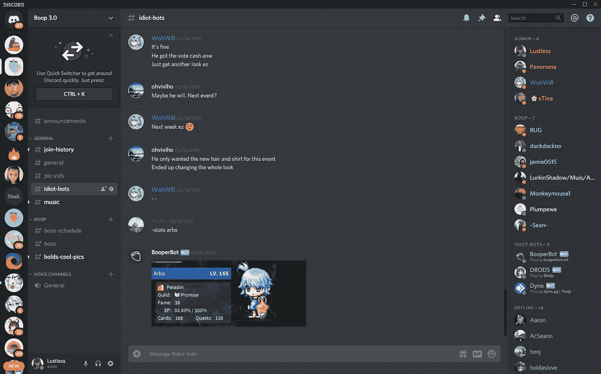

# 忘记懈怠。Discord 是我用过的最好的消息应用。

> 原文：<https://medium.com/hackernoon/forget-slack-discord-is-the-best-messaging-app-ive-ever-used-9351a035069>

随着 Slack 的首次公开募股成为热门话题，我不得不说…他们的数字令人失望。不，我明白了，他们肯定有一些最好的 UX。Teams，Chime，Hipchat，Skype，都是…嗯，和 Slack 比起来“有提升的空间”。很高兴我们意见一致。Discord 作为语音通信和消息服务已经存在三年了，他们的产品是…