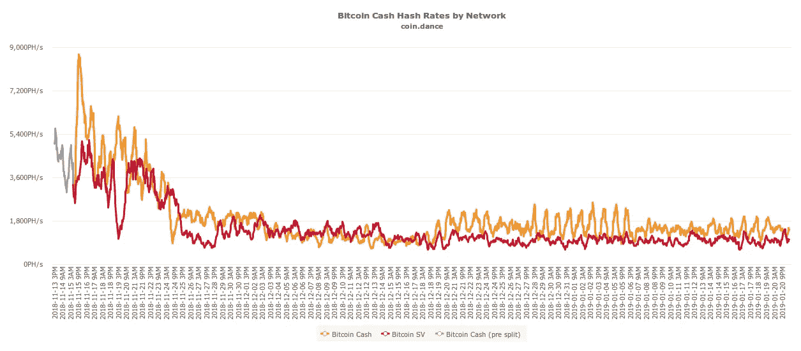
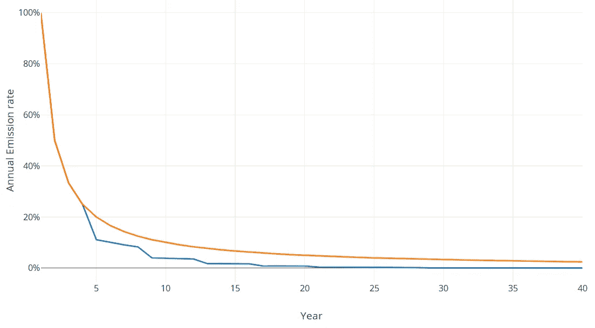
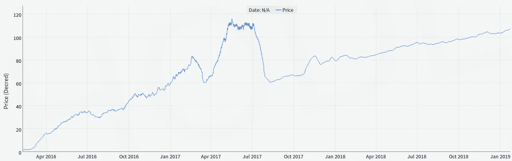

# 重访福克经济学:它们现在在哪里？

> 原文：<https://medium.com/hackernoon/forkonomy-revisited-where-are-they-now-73fbfbec6b4d>

## 一年的 51%已经过去了，让我们回来看看我们勇敢而充满希望的少数民族网络。

【注:这是原 [Forkonomy](/@parallelind/towards-an-analytical-discipline-of-forkonomy-summer-2018-e6da993ee3f9) 论文(现于[黑客正午](https://hackernoon.com/towards-an-analytical-discipline-of-forkonomy-summer-2018-e6da993ee3f9))于 2018 年夏季在【pllel.com】上撰写并自发表后的后续评论，带有[最后修改 8 月 10 日](http://www.pllel.com/industries/wp-content/uploads/180810-forkonomy-v3.pdf)。数字来自于 2018 年 9 月的 [#forkonomy tweets](https://twitter.com/hashtag/Forkonomy?src=hash) 、原文和演讲幻灯片来自于 [ETC 峰会 Forkonomy talk](https://www.youtube.com/watch?v=d_7f16_29Mc) 。]

**简介:ELI5 Forkonomy**

“ [Forkonomy](http://www.pllel.com/industries/project-update-forkonomy-aka-blockchains-time-travel/) ”是一个淋浴的想法，虽然这个想法最初看起来很尴尬和古怪，但回想起来，它只是我以前和现在在[时间(小)](https://pubs.acs.org/doi/abs/10.1021/ic0623112)、[时间(大)](https://www.sciencedirect.com/science/article/abs/pii/S0009261403012880)、[光](https://pubs.acs.org/doi/abs/10.1021/ic900924w)、[空间(小)](https://pubs.acs.org/doi/abs/10.1021/jo801557e)、[空间(大)](https://sterrewacht.nl/events/phdtheses/bisschop/chap3.pdf)和[加密货币](http://pllel.com)领域的爱好的汇总。将一个工作可靠的加密货币网络视为一个热力学系统，它在能量平衡的焓(采矿)和熵(分叉，时间)之间具有自己的内部同步性(目标块间时间，确定性硬币供应时间表),这非常简单。

研究分裂成不兼容但相似的网络派系的代码库和分类帐的方法无疑是从并行行业的[令牌空间](http://www.pllel.com/industries/project-update-classification-approaches-for-cryptographic-assets/)加密资产分类研究中扩散出来的。将这些与来自遥远物体的陈旧光的天文观察和恒星分类工具结合起来，如 Hertzsprung-Russell 图，该图使用恒星的物理属性来理解可能的命运，并且有可能浪费夏季周末通过连接天体和密码点来寻求进一步的概念相似性和预测工具，希望通过家族相似性捕捉可能的未来。

写论文和粗略地处理链数据以寻找模式和潜在的启发是一件非常有趣的事情，在这个过程中，我不经意地冒了几次险。人们可能会称它们为 *forkcasts* (呻吟)，对 PoW 加密货币的可能命运做出一些*fork-looking*的预测(再次呻吟)，这些加密货币无法吸引大多数 hashrate，因为它们特殊的哈希算法，激进的 fork 运动在不满的增长网络中煽动，以及潜在的缓解措施。2018 年 9 月，我在首尔举行的第二届以太坊经典峰会上发表了关于 forkonomy 的演讲，除了讨论 BTC/BCH 的情况和正在进行的 BTCP*cluster fork*(好吧，对不起)之外，还对 ETC 的积极和消极未来进行了猜测，并特别强调了随着熊市的延续，少数链对热力学攻击的敏感性。让我们看看我们的三对兄弟明星——BTC/BCH、ETC/ETH、ZCL/BTCP——看看他们在爱情的热力牵引下是如何发展的。

Suggested celestial soundtrack “Prima Mater — Eternities (Remix of Carl Brown). Source: [https://carlbrown.bandcamp.com/track/year-after-year-prima-mater-eternities-remix](https://carlbrown.bandcamp.com/track/year-after-year-prima-mater-eternities-remix)

他们现在在哪里？

BTC/BCH

自从我们上次见面以来，两个变成了三个！谁会想到一群衣衫褴褛的抗议者因为各种原因聚集在一起，却无法达成共识？在另一次网络分裂之后，进一步分裂已经很小的哈希拉和[各种敌对](https://breakermag.com/the-bitcoin-cash-hash-war-by-the-numbers/)链分裂的任何一方都让 BSV 和巴布(又名“新 BCH”)的前景看起来相当黯淡。由于 fork 事件是有计划的和有争议的，存在连锁攻击和积极的市场行动的威胁，因此围绕该事件有预期的戏剧量。在撰写本文时，BCH 的每个 spawn 命令约 1 EH/s，而 BTC 的长期范围为 30-50eh/s，市场定价 BTC 为 3500 美元，BSV 为 75 美元，BAB 为 125 美元。数据来自【www.blockchair.com 和 [www.coincap.io](http://www.coincap.io) 。

BCH (grey), BAB (Orange) and BSV (red) network hashrates. Source: [cash.coin.dance](http://www.Cash.Coin.Dance)

鉴于 2018 年 8 月 BTC 和 BCH 之间的价格和 hashrate 之差约为 10-15:1，BSV/巴布分割和由此产生的负和影响在 2019 年 1 月下旬撰写本文时已将这一差延长至 30-40:1。对于 51%的攻击来说，当时的脆弱网络现在面临着严重的风险。不管 Nicehash 和 Amazon EC3 等分布式市场上有多少 SHA-256 hash，单个实体聚集 3%的 BTC hash rate 并进行单独攻击**、**是可行的，特别是考虑到目前搁置/未出售的 ASIC 库存数量。

有趣的故事:在早期的草稿中，我对 BCH 的未来写了一个更加黯淡的预测，但在收到评论说它可能走得太远后，我缩减了它。哈！尽管如此，2018 年夏天一些关于 BCH 家族发现自己处于越来越不舒服的境地——在连锁安全和矿工贿赂之间——的预测还没有成为现实(见下面的推文)，除了在 BAB 上进行[检查。这两个网络都表现出日益增长的网络基础设施、哈希拉和人类领导力的集中化，因此预计会有进一步的强制性“升级”。很多，有时是在很短的时间内。](https://blog.bitmex.com/bitcoin-cash-abcs-rolling-10-block-checkpoints/)

至于比特币，熊市已经对 BTC 比特币产生了影响，结束了一个远远超出价格范围的抛物线趋势。虽然今天 BTC 的价格大约是夏天的一半(大约 7000 美元对大约 3500 美元)，但当时和现在的网络哈希拉都在 30-40 EH/s 范围内。在 ASIC 时代，比特币 PoW 的安全模型在很大程度上仍未经测试，唯一明显的网络弱点是外部实体的政治、技术和监管行动，矿商/代工厂寡头垄断，加密漏洞和实施中破坏共识的代码错误，如[CVE-2018–17144](https://bitcoincore.org/en/2018/09/20/notice/)。在矿商补贴减少成为费用市场发展的紧迫问题之前还有一段时间，一切都取决于 BTC 价格提供必要的激励。

至于侧链和链外支付渠道等 L2 附属物将如何通过提供替代交易途径来最小化对区块链的写入以及随之而来的对块空间的需求，从而对此产生影响，这个问题仍未解决。补充说明最近推出的 Grin——基于新颖的 MimbleWhimble 区块链结构的网络——具有恒定、无限的硬币发行率(60/分钟),通过展示有效通货膨胀率的平滑和陡峭的初始下降，可以更好地缓解比特币补贴减半制度中交易费市场的缺乏。

Monetary Policies of BTC (blue) and Grin (orange) as demonstrated by effective annual supply increase. Source: [https://plot.ly/~Bobby_Digital/1/](https://plot.ly/~Bobby_Digital/1/)

**ii) ETC/ETH**

在基于以太坊的网络领域，这是多事之秋。预期的 Ethash FPGAs 和 ASICs 还没有在野外被大量发现，但它们的影响可能已经被感受到了。看看 nonce 指纹最终是否会像 [BTC](https://twitter.com/100trillionUSD/status/1081217034485149697) 和 [XMR](https://twitter.com/khannib/status/1082280569449447424) 那样明显，这将会很有趣。

少数 Ethash 链 MUSIC、ELLA 和 PIRL 遭受了 51%的攻击和深度链重组，exchange 重复支出是攻击者获得投资回报的典型方法。PIRL 已经采取了一种方法，通过基于客户端的解决方案来减轻这些危害，这种解决方案会惩罚试图重新加入网络并广播一系列快速块的离线节点( [PIRLguard](/pirl/pirlguard-innovative-solution-against-51-attacks-87dd45aa1109) )。UBQ 改为[改变其哈希算法](https://blog.ubiqsmart.com/introducing-ubqhash-8fa515befd7)以避免 Nicehash / ASIC 敏感性。

尽管这项工作的一个大主题是研究少数群体战力链对攻击和防御策略的脆弱性，并且这项工作在 2018 年秋季的 ETC 峰会上提出，但令人惊讶的是以太坊经典本身也成为这些攻击的牺牲品。阅读下面 Phyrooo 和 Pyskell 的文章，将多数攻击的*的暂时破坏性放到上下文中。然而，在加密货币早期阶段，对交易所的利用严重阻碍了少数电力网络的上市，除非采取预防措施，要求确认交易被认为是最终的。看到像 Cryptopia 这样的 altcoin 交易所上市的小型电力网络不断被利用(最近暂停运营)是一个普遍的警告信号，特别是对于除了投机和交易以外几乎没有价值主张的项目。*

* [## 51%的攻击不是网络故障

### 关于以太坊经典区块链最近的事件，我决定写一点关于 51%的攻击，因为有…

medium.com](/ethereum-classic/51-attacks-arent-a-network-failure-81a7e197bfd9)  [## 你的交易所需要更多的确认:BitConf 措施

### 在加密货币中，我们通常建议不要接受零确认交易，但我们完全乐意接受…

medium.com](/@pyskell/your-exchange-needs-more-confirmations-the-bitconf-measure-872b69babc8f) 

ETC 将采取什么途径来减轻攻击还有待观察，利益相关方正在以理性的方式讨论通常的各种选择——我出席了事后电话会议，并重申了我的观点，即在膝跳反应中改变挖掘算法可能不是惩罚攻击者阻止的最佳选择。看起来，ETH 试图过渡到一个分块的、利益相关网络的持续延迟——从而将 Ethash 的大多数遗留给 ETC 或另一个尚未出生的时间表——加剧了这个问题，以及长期的熊市和大量可调度的 hashrate。

也有关于 ETH 在等待 Casper 时采用“抗 ASIC”算法 (ProgPoW)的讨论，在最近失败的君士坦丁堡网络升级之前，出现了一个[亲 ProgPoW 活动家分支派别](/ethereumprogpow/my-political-decision-to-hardfork-ethereum-for-progpow-implementation-and-here-is-why-19e5b66bb985)，其表面目标是拒绝 EIP-1234 将采矿奖励从每块 3 ETH 减少到 2 ETH。似乎不可避免的是，ETH-ASIC 和 ETH-ProgPoW 派系中的任何一方(或双方)将会尝试一个分叉，如果网络没有朝着有利于他们的方向发展的话。此外，由于君士坦丁堡升级在第 11 小时被取消，所谓的“[难度炸弹](https://twitter.com/econoar/status/1085355924779200512)”现在已经在 ETH 上激活，之前被硬分叉多次延迟。

就社交层网络政治而言，ETH 和 ETC 都有不同类型的问题。ETH 的各种利益相关者在关键技术设计选择方面意见不一，例如在重要会议上的[国家租金](https://twitter.com/greg_colvin/status/1072370832754819072)和内部人的指控[不对称/不透明](/@lrettig/how-open-is-too-open-bfc412cf0d24)。ETC 可能正遭受“公地悲剧”的场景，因为迄今为止领先的核心开发公司 ETCDEV 因资金短缺而关门，伴随着对 Github 资源库和经验丰富的核心开发人员等宝贵网络资源的权力斗争的怀疑。

ETH 和 ETC 之间的价格比率大约是 20-30:1，类似于上面讨论的 BTC/巴布-BSV 比率，但是 ETC 在隧道的尽头有一盏额外的灯-或者它是一个"[友好的幽灵](https://ethresear.ch/c/casper)"谁将消除矿工留在 ETH 的激励？数据来自[www.blockchair.com](http://www.blockchair.com)和 [www.coincap.io](http://www.coincap.io) 。

*我将把下面几条记录我 ETC 峰会演讲的推文留在这里。我们必须等待，看看 ETH 在 PoW 方面会发生什么，以观察 Ethash 生态系统下游的影响。*

ZCL/BTCP

最近几个月，BCH/BSV/巴布、BTG 和 BTCP 等分类账分支的市值和矿商激励之间的脱节被广泛讨论(比如这里的[)但去年夏天并没有这么明显。事实上，我收到了一位评论家对我的断言的严厉批评，即与代码库分叉相比，少数分类账分叉的市值被严重夸大了。下面这条推文让人们意识到，在 BTCP 的土地上，一切都不太好。](https://blog.goodaudience.com/bitcoin-market-value-to-realized-value-mvrv-ratio-3ebc914dbaee)

通过合并 ZCL 和 BTC 的 UTXO 集合，BTCP 旨在利用比特币的名称，同时大力激励 ZCL 持有者和买家。这也很有效，在 2018 年的最后一次“垃圾反弹”中，ZCL 以美元计算上涨了 100 倍，然后开始了漫长的价格下跌，跌幅超过 99%。ZCL 仍然作为一个半僵尸化的连锁店蹒跚而行，其他剥离分类账分叉和分叉合并的尝试。客户端软件变得相当过时和破损，使得在冬季运行一个节点变得困难，事实上也很难找到对等点和同步链。

由于 2100 万枚比特币上限中只有 50 万枚未被供应，BTCP 发现自己实际上领先比特币一半。由于象征性的固定价格较低，矿商没有足够的动力来捍卫产业链，而且由于有大量的平等资源可用，发动热力学攻击将是微不足道的。事实上，论文中的每小时成本估计不得不不断下调，从最初的 600 多美元/小时，到时间机器带我们走向任何比特币类网络最悲观的未来，补贴减半，供应限制固定。**这是 BTTF2 中 Biff 成名的时间线。**

Biffcoin Private even had an 80s movie franchise!

不出所料，[攻击不可避免](https://www.coindesk.com/this-college-freshman-is-out-to-51-attack-your-cryptocurrency)。ZCL 只占 ZEC 的 5 %, BTCP 还要低一个数量级。有了 Equihash ASICs，他们就成了活靶子。这两款代币的价格区间都在 1 美元至 1.50 美元之间，ZCL 前叉 ATH 约为 200 美元。数据来自 coincap.io 和 [www.coinmetrics.io](http://www.coinmetrics.io) 。

BTCP 福克卡斯特:很有可能升级的 REKT。这条白矮星链的下一步是什么？几乎所有你能想到的缓解措施都已经讨论过了——Horizen 的链式选择规则更新 [*似乎对它们起作用*](https://twitter.com/robviglione/status/1082744461984260096) *。*

其他有趣且相关的东西！去年夏天我缠着管理 BTCP 和 ZCL 节点的 CoinMetrics 的巫师们最近发现了一桩大劫案，在将 BTC UTXOs 插入账本时，约 200 万枚硬币被秘密添加到 BTCP 的屏蔽池中。事实上，我在让 BTCP 客户端正常运行时遇到了很多问题，因为操作时的几千个块太大了，经常在解析数据进行分析时使我的工作站崩溃。BTCP 是所有可能的世界中最糟糕的。

**iv)杂项**

**分叉网络上的资产**

在关于“头重脚轻”网络的安全风险的论文中有一个简短的说明，例如以太坊可以允许比基本协议令牌更大的非本地令牌“价值”。阅读下面 Joe Looney 的伟大文章，更全面地理解其中包含的各种危险。让我们想一想，非本土资产是如何被分流者用作谈判筹码的。在一个分类账分叉网络上提出兑现资产可能会以难以预测的方式扭曲霍德勒的动机。

 [## 加密商品的真实成本

### 从许多方面来说，这些令牌的“真实性”是令牌发行者和…

medium.com](/@joelooney/the-real-cost-of-cryptogoods-dd156f5df056) 

**#forkgov:抗叉与治理**

在最初的论文中，Tezos 和 Decred 被讨论为通过以不同方式抑制分叉来解决网络治理的网络。从高层次的角度来看，让我们解决最普遍的问题:这两个概念有意义地兼容吗？如果我们想到宇宙中的任何自然过程——从天体到部落——随着增生和社区的规模和复杂性的增长，[可扩展性](http://unenumerated.blogspot.com/2017/02/money-blockchains-and-social-scalability.html)挑战显著增加。[在协议升级期间最小化意外的链分裂是一个有价值的目标。](/tezos/amending-tezos-b77949d97e1e)然而，否认一种允许派系优雅有序退出的机制有利于保护网络效应的护城河，但代价是内部不和谐，这种不和谐可能会随着时间的推移而增长。听起来熟悉吗？

人们可以用几种不同的方式来看待分类账分叉，好的、坏的或中性的:

[好] A/B/…/Z 测试不同的技术、经济或哲学方法，又名“让市场来决定，叉自由宝贝！”

关于 [Metcalfe](https://en.wikipedia.org/wiki/Metcalfe%27s_law) 或(IMO 更相关) [transactome-informed 网络资本理论【Gogerty 之后，对新生货币协议的网络效应有害。](https://papers.ssrn.com/sol3/papers.cfm?abstract_id=3281845)

[中性]随着这些网络的发展和成熟，熵和/或有限的社会可扩展性是不可避免的。要让所有利益相关方充分保持一致以实现最佳网络健康是不现实的。

因此，协议层的分歧抵制和具有投票机制的有效公共论坛肯定是有用的工具，但有一个问题是，民主(*多数人的暴政*)是否应该在所有情况下实施。如果在特佐斯爆发“街区规模”式的内战，或者在看不到可接受的妥协的情况下颁布法令，那么在所有情况下，现状仍然是最好的情况吗？

我的观点是，fork-resistance 将在很大程度上重新分配不满的表现，而不是提供一种持久的治疗方法，本地网络治理机制[可能会被现任者或被罢免者博弈](http://asymmetries.pllel.com)。需要更多的时间来观察这两个网络中关于技术发展的决策是如何展开的。Decred 似乎与[相当抗攻击的混合 PoW/PoS 系统](/@richardred/the-role-of-decred-voters-in-defending-against-majority-attacks-ec658af0a8fd)坐在一起，但网络中有一些“排斥性力量”导致 DCR 计价的获得 PoS 奖励和参与提案投票所需的赌注费用不断上升，拒绝小股东使用该机制。

随着持续发行，对门票和赌注奖励的需求自然会增加，因为越来越多的硬币持有者希望减轻稀释。由于[门票价格是动态的，根据需求而定](https://docs.decred.org/proof-of-stake/proof-of-stake/)，这就产生了向上的压力，使得越来越多的硬币持有者买不起门票。在撰写本文时，允许小股东参与 PoS 的“[票据分割](/decred/dcr-ticket-splitting-all-you-need-to-know-b8edc6b65db3)”可从一些股份池和自组织集合中获得，但该流程尚未在参考客户中实现自动化。另一方面，在持续的熊市中，美元票价从 2018 年 1 月和 5 月的约 8-1 万美元降至 2019 年 1 月下旬的约 2 千美元，因此那些从加密货币领域以外进入的资本可能不会被吓住。来自[dcrdata.org](http://www.dcrdata.org)和 [coincap.io](http://www.coincap.io) 的数据。

50 day moving average of DCR staking ticket price. Source: https://explorer.dcrdata.org/charts#ticket-price

此外，根据 Parallel Industries 的 [TokenSpace 分类研究](http://www.pllel.com/industries/project-update-classification-approaches-for-cryptographic-assets/)，赌注奖励类似于股息，基于令牌的治理特权类似于股东权利，这使得 Decred 看起来比纯 PoW 系统更接近于传统的[资本资产的定义](https://jpm.iijournals.com/content/23/2/86)。这可能是也可能不是一个问题，取决于监管如何展开。Tezos 有这些潜在的问题，加上代币销售带来的监管风险。Decred 的空投可能没有尽可能公平地分配硬币，但无疑会吸引比象征性销售或溢价更低的合规负担。

**《活动家叉子》&《创始人叉子》**

更进一步来说，这些不和谐的团体可能会在一个网络内部开展一场*游击*运动，将注意力集中在他们的事业上。去年夏天，在网络推出之前，一些反 KYC 的 Tezos 派别出现在社交媒体上，然而自推出以来，事情已经平静下来。一个显然仍打算创建 Tezos 分支的派别改变了策略，成为网络内的[委托利益攸关方](https://twitter.com/tzlibre/status/1014850588901888000)，同时继续表达异议——也许这种“*分支行动主义*”可以被解释为对 Tezos 的“分支抵抗”的回应。

那么，叉子活动家还能做什么呢？看看正在进行的 ICO *虚荣的篝火*吧，这很大程度上是由于高摩擦*无用令牌*的销售考虑不周，侵犯/试图规避世界各地的各种法规。一旦国债被清算(由他们自己，或由立法者)，开发停止，取消代币发行者和代币本身的前景确实很有吸引力——我们会看到一波“ *unfounder forks* ”吗

**结论&未来方向**

和天文学一样，在经济学中没有结论。只有无尽的观察，因为熵推动时间前进。需要做更多的工作来分析从 nodes 收集的区块链数据，特别是关于 ZCL 和 BTCP 的数据。对候选网络试探法和工具的探索仍在继续。既然 Decred 的政治提案和投票系统已经开始运作，对它的研究也会很有趣。

Which is your favourite fork?

**致谢**

感谢 [Richard Red](https://medium.com/u/9ee466259862?source=post_page-----73fbfbec6b4d--------------------------------) 提供关于 Decred 的 PoS 和票务机制的详细信息和资源。

# 感谢阅读。在你走之前！

> 如果你觉得这篇文章有趣，请👏并在你能分享的地方分享。记住，你最多可以鼓掌 50 次——这对可见度和温暖模糊的感觉真的有很大的影响。欢迎大家来 www.pllel.com 和 T2 的推特上闲逛。*