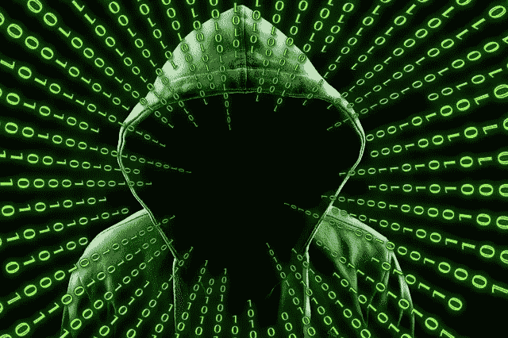
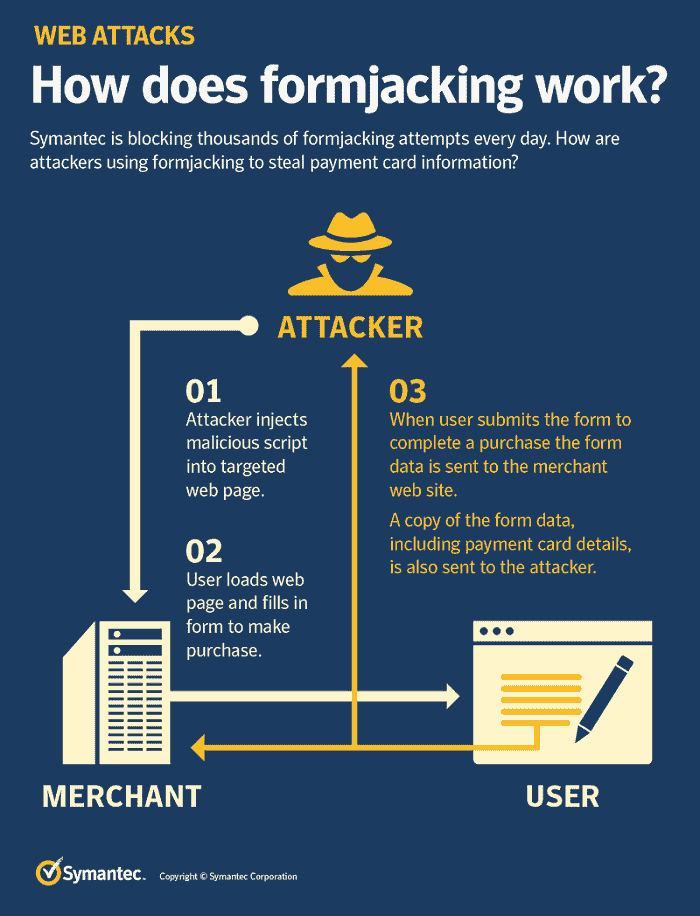

# 劫持表单:黑客窃取信用卡信息的新宠(以及如何避免)

> 原文：<https://medium.com/hackernoon/formjacking-hackers-new-favorite-way-to-steal-credit-card-information-and-how-to-avoid-it-dbc2971961d1>

您已将喜爱的产品添加到购物车中。现在，是时候把你的信用卡从钱包里拿出来付款了。由于该网站是安全的，并且您过去已经在该电子商务网站上购物过，所以您在结账时输入您的信用卡/借记卡信息之前不会想太多。

但是你有没有想过，当你在你最喜欢的网上商店付款时，你的信用卡信息会被窃取？

是的，我的朋友，黑客可以窃取你的卡细节，让你破产。事实上，窃取卡的详细信息已经成为黑客盗取网购者钱财的新工具。这种不道德的恶意技术的术语是*劫持表单*。

# **究竟什么是顶格？**

劫持表格和 ATM 机取款几乎一样，唯一的区别是它发生在网上。在输入信用卡或借记卡详细信息后，当电子商务网站的用户点击提交或其等效按钮时，黑客向电子商店注入的恶意 javascript 代码会收集用户的信用卡详细信息，并将这些信息发送到黑客的服务器。

一旦黑客掌握了用户的信用卡详细信息，他/她就可以利用这些信息进行信用卡欺诈，或者在黑暗网络上将这些信息出售给其他网络罪犯。

赛门铁克制作了一个信息图来解释这一过程。

Fromjacking 不是一个小威胁。据[赛门铁克](https://resource.elq.symantec.com/LP=6819)称，劫持表单攻击激增，平均每月有 4800 个网站遭到攻击。

英国航空公司、Ticketmaster、Newegg 和 Feedify 等知名品牌公开报道了黑客组织 Magecart 报告的劫持表单事件。

# **mage cart 是谁？**

Magecart 是七名主要盗卡网络罪犯的俗称。Magecart 威胁集团对最近针对 Ticketmaster、Feedify、英国航空公司、Everlast、国家共和党参议院委员会、Newegg、Oxo 和 Groopdealz 的攻击负责。所有这七个都使用相同的工具集版本，但是它们的策略和技术不同。

RiskIQ 和 Flashpoint 创建了一个关于不同 Magecart 组的详细文档。你可以从[这里](https://www.riskiq.com/research/inside-magecart/)获取 PDF。从这份报告中，你可以了解每个组织的战术、目标和受害者，以及这些组织之间的不同之处。你还将了解不断增长的犯罪黑社会，帮助这些团体的工作和他们的运动赚钱。

# **如何避免顶模**

Magecart formjacking 网络罪犯使用恶意 JavaScript 窃取客户的信用卡信息。当他们利用客户支付表单时，基于 web 浏览器的脚本拦截器可以提供针对表单劫持攻击的保护。

以下是一些适用于流行浏览器的有效脚本拦截器:

*   ScriptSafe 可以很好地阻止 Google Chrome 和基于 Chrome 的浏览器(如 Vivaldi)的脚本
*   NoScript 对于阻止 Firefox 的侵入性脚本是有效的
*   Safari 用户可以使用 JS 拦截器

由于较小的在线购物网站可能不像较大的网站那样具有较高的保护级别，因此避免从小玩家那里购物可能是保持在线安全的一种积极方式。但是对像英国航空公司这样的领先品牌的攻击证明没有一个是安全的。但是，任何小网站都比大网站更容易受到攻击。

很多时候，攻击者会使用第三方工具和应用程序。如果你是网站所有者，你应该在安装软件更新之前测试它。

此外，你应该寻找工具，检查你的网站实时和通知你，如果有任何变化。