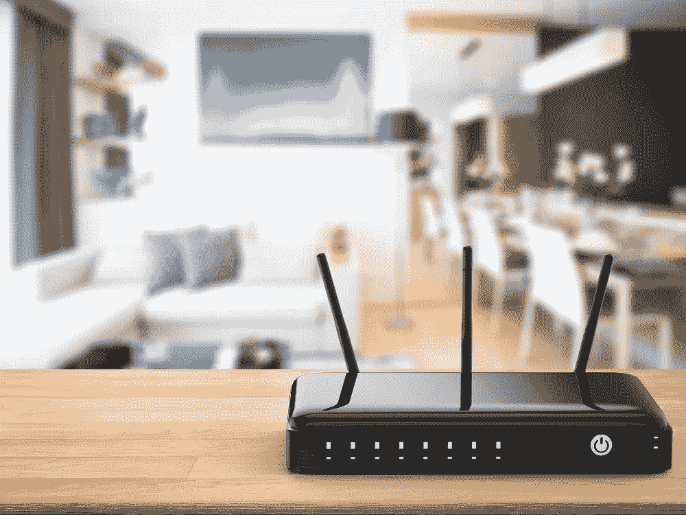
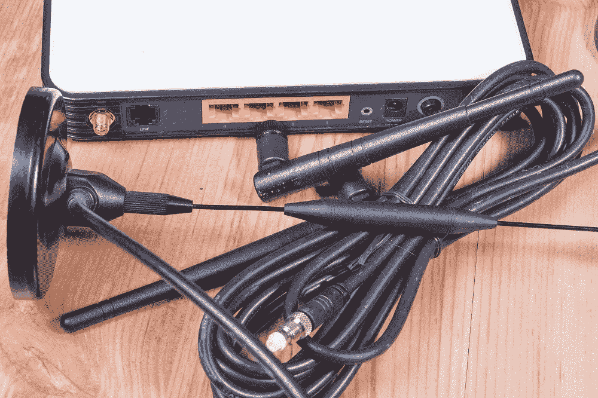

# 提高家庭 WiFi 性能的四个简单方法

> 原文：<https://medium.com/hackernoon/four-dead-simple-ways-to-improve-home-wifi-performance-b1f1de0950bd>

Photo: escapejaja / Adobe Stock

在过去的十年里，WiFi 已经成为互联网连接的首选媒介，让我们所有人都能与我们的数字生活保持联系。随着无线互联网接入的增长，我们期望我们的无线网络能够容纳的设备的数量和类型也在增长，在许多地方，频谱拥塞正在成为一个棘手的问题。这是硬件供应商如此热衷于将新的 [WiFi 6 标准](https://www.howtogeek.com/368332/wi-fi-6-what%E2%80%99s-different-and-why-it-matters/)引入市场的主要原因之一，该标准是从头开始设计的，旨在应对拥挤的无线环境和越来越多的同时设备连接。

当然，期望 WiFi 6 一夜之间成为无线网络的主导类型是不现实的——尤其是当你考虑到世界各地仍有数百万 802.11g(用现代的说法是 WiFi 3)在运行的事实。这意味着用户在一段时间内仍将不得不忍受不太理想的 WiFi 环境，即使他们的设备数量和带宽需求继续增长。

然而，用户可以通过一些方法来改善他们现有的 WiFi 性能。尤其是家庭用户，他们可能会从一些他们甚至没有意识到的网络技术中受益。它甚至没有必要搜索互联网寻找[电子元件](https://jp.rs-online.com/web/c/semiconductors/discrete-semiconductors/zener-diodes/)或选择昂贵的，ISP 提供的解决方案。为了有所帮助，这里有四个简单的方法来提高 WiFi 性能，特别是对家庭用户。

# 从正确的地方开始

Photo: phonlamaiphoto / Adobe Stock

通常情况下，缓慢的家庭 WiFi 网络部分是由于接入点(AP)或无线路由器放置不当造成的。由于大多数家庭用户依赖于 ISP 提供的硬件，他们几乎总是在有备用同轴电缆插孔的地方安装 WiFi 设备，或者在他们第一次注册服务时 ISP 安装人员碰巧放置设备的地方。几乎在所有情况下，这都是一个错误。当提供信号的接入点位于中心位置且不靠近任何障碍物时，WiFi 效果最佳。这意味着将 WiFi AP 放在墙边(同轴电缆插孔所在的地方)会自动带来速度和稳定性的损失。如果可能的话，主家庭接入点应该尽可能靠近用户希望用 WiFi 信号覆盖的区域的中心。

# 当心邻居

Photo: elnur / Adobe Stock

除了设备位置，家庭 WiFi 连接缓慢的第二大原因是无线信道拥塞。为了解决这个问题，使用 [WiFi 网络扫描仪](https://www.networkworld.com/article/2925081/8-free-wi-fi-stumbling-and-surveying-tools.html#slide1)进行现场调查，以确定哪些无线信道的重叠信号最少。在拥挤的网络环境中(如公寓楼或其他城市环境)，选择一个稍微不太拥挤的频道也能产生很大的影响。每个 WiFi 路由器或接入点都允许用户指定的频道，因此利用它是显而易见的。

# 利用现有的家庭布线

Photo: Mirek / Adobe Stock

家庭网络中保守得最好的秘密之一是，现在几乎每个 ISP 提供的家庭路由器都支持一种网络技术，这种技术能够将家庭的同轴电缆变成一个完全可维护的数据回程网络。网络标准被称为 MoCA(或 DirecTV 用户的 DECA)，它可以帮助家庭用户使用他们墙上现有的同轴电缆为他们的家庭 WiFi 网络[添加第二个 AP。在大多数情况下，将 MoCA 设备添加到家庭网络非常简单，只需在现有的家庭路由器中打开该功能，然后将支持 MoCA 的 AP 添加到家中的另一个同轴电缆位置。经过一些简单的配置，家里的 WiFi 覆盖会好很多，而且不会牺牲任何可用的吞吐量。](https://www.actiontec.com/wifihelp/wifibooster/how-does-moca-work/)

# 转向网状网络

在 MoCA 不是一个选项的情况下，对于使用慢速 WiFi 遇到困难的家庭用户来说，下一个最好的选择是转向网状网络。简而言之，支持网状网络的无线路由器和接入点会创建多个 WiFi 连接点，这使得设备更容易克服其他竞争信号，以保持稳定的网络连接。当然，代价是网状网络本身使用无线信号来形成端点之间的连接，因此总吞吐量会有一些损失。然而，在大多数情况下，开销不足以引起任何问题，因此网状网络仍然是减缓家庭 WiFi 速度的可行解决方案。

# 底线

Photo: Ronen / Adobe Stock

几乎在每种情况下，这里提到的解决方案(或它们的组合)都足以克服最困难的无线网络环境，在家中的任何地方提供坚如磐石的高速 WiFi 连接。最重要的是，它们是如此简单的解决方案，以至于您不需要网络认证就可以付诸实践，也不需要对现有设置进行任何重大改造。其中，只有网状网络解决方案需要大量投资，即使这样，要让您所依赖的无线设备正常工作，付出的代价也很小。底线是，虽然我们都在等待 WiFi 6 的到来，并(希望)一劳永逸地解决我们所有的拥堵问题，但你不必再忍受糟糕的 WiFi 性能了。