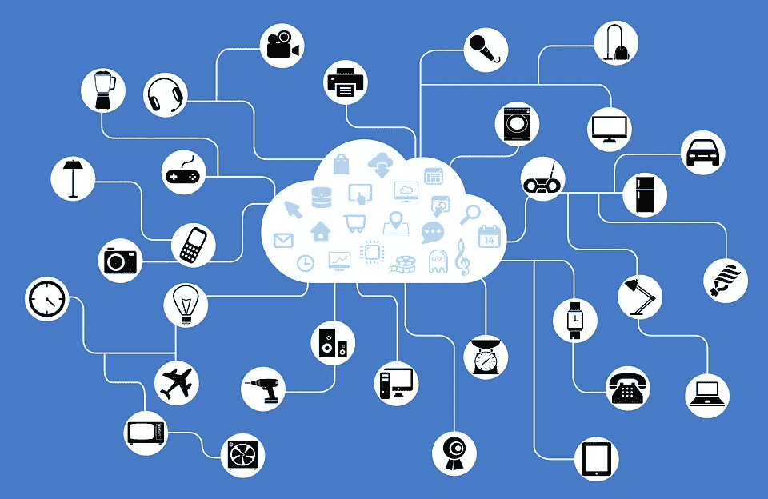

# 未来五年，iOS 应用开发将如何发展？

> 原文：<https://medium.com/hackernoon/four-exciting-areas-ios-app-development-will-evolve-over-the-next-five-years-23dc5c11f562>

## 对即将发生的事情的一瞥，引发利益相关者为变革做好准备

A not-so-far future. ([Picture source](https://www.storyblocks.com/stock-image/businessman-with-city-and-wireless-communication-network-background-abstract-image-visual-internet-of-things-s_q4zhpxigj0450i55))

近年来，世界被 10-15 年前不存在的技术趋势弄得晕头转向。更有趣的是通过这些概念创造未来的方式。如果你认为你已经看到了迄今为止 iOS 上开发的和当前可用的应用程序，那么你绝对会对未来五年 iOS 应用程序开发**的发展感到震惊。**

**这里有 4 个你可以注意的地方:**

## **1.人工智能**

**人工智能(AI)是一种独特的范式转换器。每天，iOS 应用程序开发世界中有远见的人都在创造新的基于人工智能的应用程序。例如，星巴克(Starbucks)发布了一款名为 My Starbucks Barista 的 iOS 应用，它可以根据你当天想要的咖啡或小吃的类型为你下单。其他人工智能 iOS 应用程序正在金融领域工作，通过口头指令进行货币交易。**

**在未来几年，你可以期待在 iOS 上看到更多的人工智能应用，这些应用将挑战几乎所有事情的传统方式。将会有一些应用程序，你可以委托你的日常选择。在这方面有非常广泛的可能性。**

## **2.增强现实**

****

**增强现实(AR)和 AI 一样神奇。AR 在几年前大受欢迎，当时 Pokémon GO 向世界介绍了生活在我们世界中的虚拟怪物。这款怪物狩猎游戏非常受欢迎，2016 年收入约 9.5 亿美元，2017 年接近《T4》的 9 亿美元。**

**未来几年，AR 有望在游戏和赛事中产生更加惊艳的趋势。这种趋势发展将在未来几年的 iOS 应用程序中得以体现。**

## **3.物联网**

****

**物联网(IoT)随着时间的推移不断完善。今天，您可以将外部灯、门铃、门锁、家庭安全系统、扬声器、电视和 Apple TV 流媒体设备、手表、电话和平板电脑以及冰箱都连接到互联网，以便您可以从任何地方控制它们。虽然 iOS 应用程序的开发并没有改善物联网体验，只是为了让你可以看到冰箱里还剩多少食物，但物联网正在改善你根据现有信息做出的选择的质量。**

**物联网正在简化各种行业，如酒店行业、汽车行业、零售行业，观察未来几年的趋势如何发展是很有趣的。此外，当与人工智能结合时，物联网有可能彻底改变全球人民的客户体验。**

## **4.基于云的应用**

****

**In the cloud. ([Picture Source](https://www.storyblocks.com/stock-image/cloud-computing-stick-shows-network-or-internet-storage-svolghmdwj6gn6ywy))**

**一些 iOS 应用程序开发专家预测，基于云的应用程序是 iOS 开发的下一件大事。他们表示，在未来几年内，超过一半的国际企业和组织将拥有至少一个基于云的本地应用程序 。**

**这一预测的奇怪之处在于，这个市场的近 80%将被谷歌、微软和(当然)亚马逊占据。这就给苹果留下了大约 20%的空间，这意味着如果一个 iOS 应用程序开发者想要在这个 1780 亿美元的市场中占有相当大的一块，那么越早越好地磨练必要的 iOS 应用程序开发技能。**

**此外，苹果可能会在未来几年凭借一些创新主宰这个领域，就像他们在许多案例中所做的那样。我们都知道苹果过去取得的成就以及他们今天的能力。**

## **结论**

**总之，在 iOS 应用程序开发世界中，上述领域并不是唯一可以期待惊人增长和发展的领域。还有其他几个显示出前景的领域，如可穿戴设备、跨平台功能、移动支付和 [**区块链技术**](https://www.investinblockchain.com/what-is-blockchain-technology/) 趋势。这些领域中的任何一个都可以轻松开发出未来十年最令人惊叹的 iOS 应用。**

**这篇文章不是关于预测未来，它更多的是关于识别潜在的高增长领域，并在它们还年轻的时候利用它们。**

> **这篇文章是与迈克尔·凯利共同撰写的，他是[燃料](https://fueled.com/)公司的公关总监。**