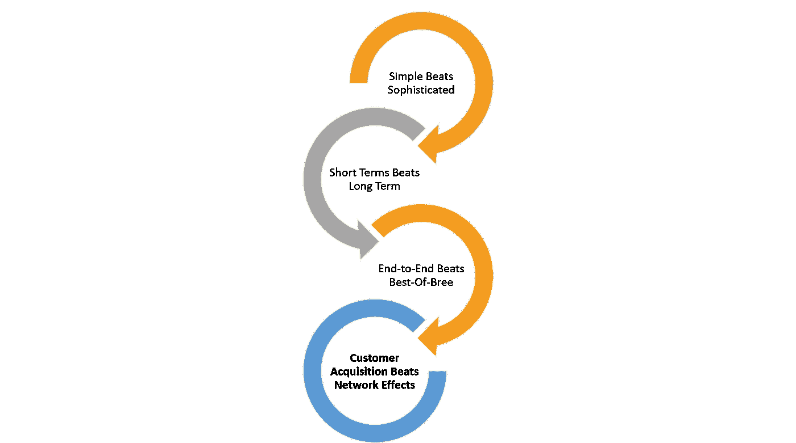
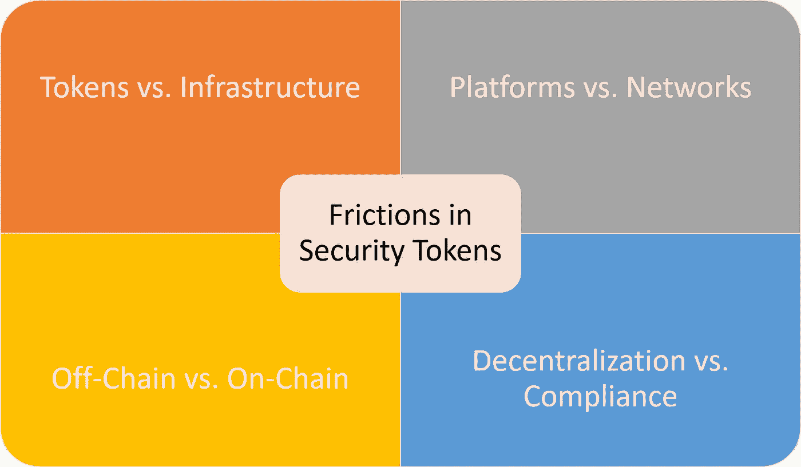

# 四个健康的摩擦将引导安全令牌的未来

> 原文：<https://medium.com/hackernoon/four-healthy-frictions-that-will-guide-the-future-of-security-tokens-2387c15affb4>

安全令牌是一个非常年轻的行业，仍在努力寻找其核心身份。任何突破性技术趋势的早期总是以不同思想流派之间的摩擦为标志，这种摩擦会将市场推向一条或另一条道路。举一些最近的例子，云计算的最初几年见证了两大思想流派的碰撞:亚马逊网络服务(AWS)等公司专注于在存储或计算等领域构建纯粹的基础设施即服务(IaaS ),而微软 Azure 和一批已不存在的初创公司则致力于构建更高级别的服务。最终，AWS 被证明更有影响力，迫使 Azure 等平台推出自己的基础设施即服务产品。类似的摩擦也可以在移动应用的演变中找到，比如原生对 HTML5 的趋势，甚至在区块链空间的公共对许可的区块链等领域。尽管我们正处于安全令牌的早期阶段，但已经存在一些非常明显的摩擦点，可能会在不久的将来影响市场的发展。

了解早期技术市场中现有的摩擦点非常重要，因为这有助于我们对该领域的发展做出假设。从历史上看，新生技术市场中产生的摩擦给了我们一些重要的教训，这些教训可能适用于安全令牌。重要的是要明白，这些原则是针对早期技术市场的，它们不一定长期适用。

**简单战胜复杂:**早期的科技市场似乎遵循奥卡姆剃刀哲学原理，偏爱第一波用例的最简单解决方案。在云计算中，构建 IaaS 从根本上来说比 PaaS 简单(相信我，我是有经验的😉)而且，在移动计算领域，本地应用比移动网络应用更简单。简化技术价值主张允许供应商在新技术趋势将面临绝大多数市场怀疑的时候吸引更多早期采用者。在安全令牌的上下文中，具有最简单技术方法的平台可能在这些早期阶段获得更多的采用。

**短期正确胜过长期正确:**在科技市场早期被证明是错误的趋势，可能会随着市场的发展而变得相关。回到我们的云例子，微软的 PaaS 战略在最初的惨败后成功地重新浮出水面，像 AWS 或 Google Cloud 这样的供应商很快就采用了它，即使它代表了偏离他们最初的道路。然而，除非一家公司拥有令人难以置信的良好资本，否则在短期内获得正确的市场定位比长期战略更重要。从安全令牌的角度来看，我们可能会看到高度复杂的解决方案最初无法获得牵引力，一旦市场发展，这些解决方案就会变得相关。

**端到端击败同类最佳**:在早期的技术市场，提供端到端解决方案的供应商比专业解决方案更有可能进入市场。例如，在移动领域，苹果 IOS 堆栈与开发工具包、应用商店和监控服务等组件的集成体验，在任何一个领域都比独立解决方案更具吸引力。就安全代币而言，具有代币发行、上市甚至融资综合经验的平台更有机会在早期实现相关性。

**客户获取胜过网络效应:**早期技术市场，顾名思义，在采用方面是小的。从这个意义上说，我们在成熟市场中看到的许多网络效应在技术趋势的早期周期中完全不相关。在云计算时代，除了被 Salesforce 收购的 Heroku 之外，大多数专注于构建开发人员社区的开源云堆栈都在 AWS 和微软开发的客户获取机器面前失败了。

现在，我们已经了解了控制早期技术市场的一些动态，让我们将其中一些原则推广到安全令牌领域。

# 安全令牌中的四个关键摩擦

如果我们分析安全令牌市场第一年的相关发展，我们可以将其中的每一个都归结为不同市场力量之间的一些重要摩擦。在目前的市场阶段，我认为有四个关键的摩擦动力将对该领域的发展产生重大影响。

## 令牌与基础架构

发行新的安全令牌或建设支持基础设施之间的摩擦是这个新生市场的核心。许多技术市场，如 web 或移动计算，主要是由应用程序用例驱动的，而应用程序用例反过来会影响基础架构构建块的创建。云或网络安全等其他市场受到基础设施突破的更大影响，这些突破会触发新应用的创建。

安全令牌似乎更符合应用驱动的市场，但平衡远非微不足道。新代币的发行是空间发展的最终体验，并且新代币可能会影响加密证券的新基础设施的创建。然而，没有区块链基础设施块的正确协议，只能创建这么多令牌。毫无疑问，基础设施和令牌之间的摩擦是安全令牌空间中最重要的动态。

## 分权与合规

权力下放是区块链运动的核心精神之一。一个允许系统信任数学和密码而不是人类的模型代表了计算机科学行业的一个重大发展。然而，这种方法不一定能很好地满足法规遵从性。从概念上讲，遵从性隐含地涉及对特定实体的信任，以断言关于特定规则的领域知识。在这样一个以分散共识的形式做出决策的世界里，我们怎么能做到这一点呢？

安全令牌的诞生是为了给加密资产带来合规性，因此，它们可能不得不在一个荒谬的分散生态系统中引入某种重新集中化。然而，这并不意味着安全令牌平台必须是完全集中的解决方案。在我看来，忽视区块链的分散计算模型可能是安全令牌对整个加密生态系统造成的最大伤害。传统合规性需要集中化，可编程合规性不一定需要。在去中心化和遵从性之间找到正确的平衡是安全令牌空间面临的另一个存在性争论。

## 链上与链下

为了补充前面的观点，许多现有的发行加密证券的过程采用“链外捷径”来加速它们的上市时间。与智能合约形式的链上业务流程相比，加密证券中有多少业务流程需要在链下实现？

以智能合约的形式抽象出不同的安全令牌构建块，不仅可以充分利用区块链的基础，还可以实现可用于新形式证券的可编程接口。虽然依赖传统的链外流程似乎是短期内的正确选择，但可编程智能合约是安全令牌未来的关键。

## 网络与产品

目前，安全令牌已经发展成为一个孤立产品的集合，主要集中于加密证券的发行和上市。这种方法与主要围绕参与者网络概念的区块链协议形成鲜明对比。如果没有网络，可以在安全令牌环境中实现的协议就只有这么多。此外，网络的缺乏使得安全令牌市场非常容易受到进入该领域的现有者的攻击。

网络效应在安全令牌中的价值非常明显，但实现却不明显。如何在密码证券的生命周期中建立一个参与者的网络生态系统？在我看来，实现这一目标需要新的协议和基础设施构建模块。许多人会认为，安全令牌的新区块链将是这个市场网络的最终体现。