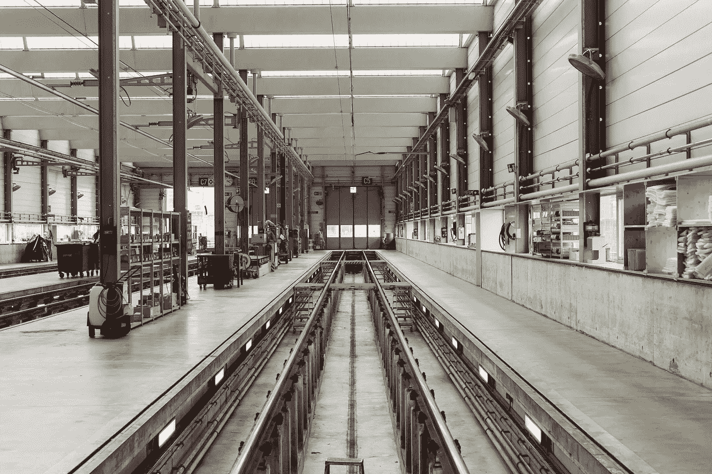
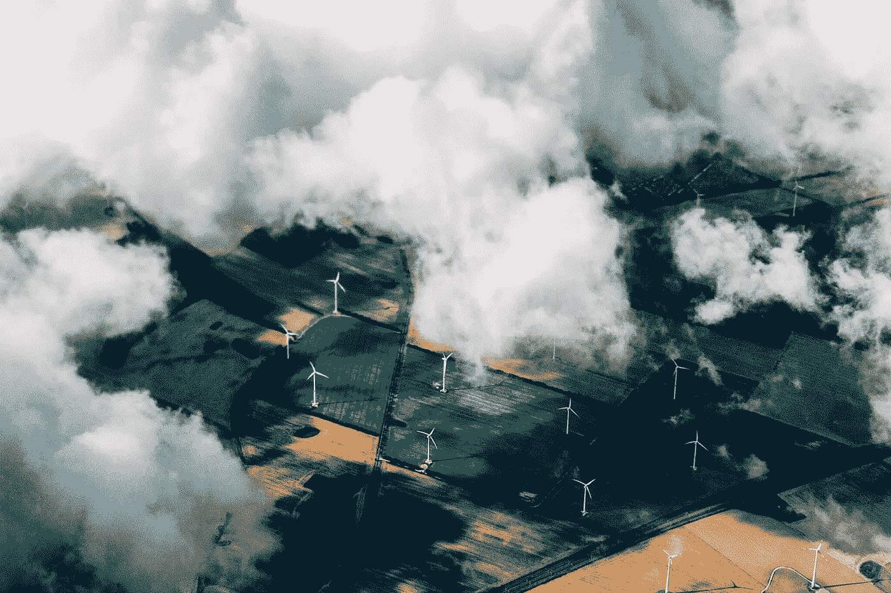

# 四个大规模区块链试点

> 原文：<https://medium.com/hackernoon/four-massive-scale-blockchain-pilots-876eafdefcf8>

## 汽车行李箱、金枪鱼、智能工厂和啤酒厂的能源

**保时捷**、**博世**、 **WWF** 和柏林最大的天然气商 **GASAG** 有什么共同点？他们都与区块链的创业公司合作开展了试点项目。在下面的文章中找到他们的项目描述和从他们的项目中获得的主要经验。

# 1.**诱饵对盘子**

## WWF & Viant.io(始于 2017 年 1 月)

**WWF** 和[**viant . io**](https://viant.io/)**(一家 ConsenSys 公司)合作了一个 trace&trace 用例，用于更透明的金枪鱼捕捞。**

*   ****当前项目状态**:生产，投放市场**
*   ****下一个项目阶段**:发布更加具体用例的透明性、可追溯性、可交易性平台。**
*   **世界自然基金会的支持:世界自然基金会支持该项目的资本投资，同时也提供项目管理和渔业专业技术。**

> ***完全可追溯性的最大挑战之一是多参与者* ***流程图*** *所花费的时间。此外，大型企业正在学习如何为消费者带来透明度，以及如何与他们建立一对一的数字关系。***

**Viant.io 联合创始人 Dragos Rizescu 的关键观点**

> ***使用区块链技术的第一步是* ***利用数字可追溯性平台*** *，该平台可以捕获可追溯性所需的 kde。二、* ***数据的真实性*** *很重要:任何信息系统的好坏都取决于其数据的质量。* ***下游供应链参与者的合作*** *是采用区块链可追溯性的重要约束。***

**—西太平洋和中太平洋金枪鱼项目经理 Bubba Cook 的主要收获**

****

# **2.**机器即服务****

## **博世& zkSystems(始于 2019 年 1 月)**

****

**Photo by [Samuel Zeller](https://unsplash.com/photos/77oXlGwwOw0?utm_source=unsplash&utm_medium=referral&utm_content=creditCopyText) on [Unsplash](https://unsplash.com/search/photos/factory?utm_source=unsplash&utm_medium=referral&utm_content=creditCopyText)**

**[**ZK systems**](http://zksystems.io/)‘区块链使博世有可能为其客户提供按使用付费和多个利益相关方共享机器等功能。**

*   ****当前项目状态**:原型**
*   ****下一个项目阶段**:在[博世互联世界](https://bosch-connected-world.com/hackathon/)展示用例“机器即服务”的原型，并在 2018 年 5 月的博世互联体验黑客马拉松上提供 zkSystems 的 API**
*   ****博世**的支持:博世力士乐提供了工业硬件，他们在上面安装了 Zksystems 的客户端。**

> ***到目前为止，我们学到的重要知识是* ***考虑一家大公司内不同的利益相关者*** *并想办法让他们都参与进来。还有很重要的一点，就是要了解* ***客户的脉络*** *—光有技术是不够的。***

**zkSystems 首席执行官 Diana Rees 的关键观点**

> ***到目前为止，从项目中学到的关键知识是，我们需要致力于解决* ***现实世界的痛点*** ***和以用户为中心的好处*** *s。对于 zkSystems，我们的方法一直是关注前沿技术如何帮助我们创造真正的价值，而不是炒作。***

**Janette Kothe 的关键观点，博世力士乐的商业模式创新**

****

# **3.**来自啤酒厂的能源****

## **GASAG & Lition(始于 2017 年 12 月)**

****

**Photo by [Thomas Richter](https://unsplash.com/photos/B09tL5bSQJk?utm_source=unsplash&utm_medium=referral&utm_content=creditCopyText) on [Unsplash](https://unsplash.com/search/photos/green-energy?utm_source=unsplash&utm_medium=referral&utm_content=creditCopyText)**

**柏林初创公司 [**Lition**](https://lition.de/) 与柏林主要天然气供应商 **GASAG** 合作，推出了一个以区块链为动力的运营能源市场。使用他们的平台，你可以从柏林的电厂购买能源。只有德国的东西。**

*   ****当前项目状态**:与来自 30 多个城市的客户和收入一起生活**
*   ****下一个项目阶段**:在大众市场扩张**
*   ****GASAG**支持:支持运营、电厂的 P2P-exchange 和共同工作空间。作为潜在投资的一部分，Lition 目前也得到了财政支持。**

> ***实验技术需要茁壮成长，技术需要专注。但在某个时间点，它需要带来* ***有形的商业价值*** *。我们意识到，只有当我们展示这一点时，人们才会感到兴奋。***

**Lition 首席执行官 Richard Lohwasser 的关键观点**

> **新技术对每个人来说都是新的。然而，只有每一方都有广阔的视野和对未来的清晰愿景，这一未知领域才能被宣称。**

**GASAG 战略部 Andreas Lampel 的关键观点**

****

# **4.通过区块链访问保时捷**

## **保时捷数字和赛恩(始于 2017 年 8 月)**

****保时捷数字实验室**用柏林初创公司 [**XAIN**](http://xain.io) 测试了各种区块链应用。在其他应用中，他们测试了通过区块链共享的数字身份证访问汽车后备箱。**

*   ****当前项目状态**:第一个项目关闭**
*   ****下一个项目阶段**:进入与 AI 相关的新项目**

> ***最大的挑战之一是真正迈出坚实的一步，因为公关项目可以用一个好名字来支持你，它不会在业务方面帮助你。最大的挑战是在初始 POC* *之后寻找下一个项目* ***。我们建议尽早与客户互动，并建立一个非常紧密的反馈回路！*****

**—赛恩基金会董事会成员 Simon Schwerin 的关键观点**