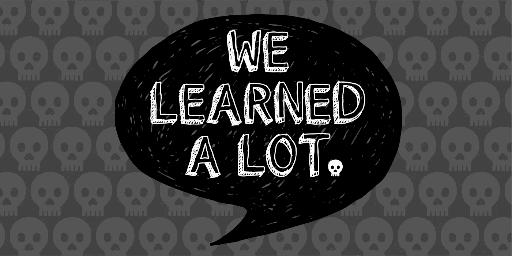

# 四个词可能会扼杀你的创业

> 原文：<https://medium.com/hackernoon/four-words-that-could-kill-your-startup-f5726f787dcf>

## **还有七句可以挽回的话。**

*由* [*大卫·弗兰科尔*](https://twitter.com/dafrankel) *，管理合伙人*

“我们学到了很多。”

当对投资者说的时候，这句话几乎总是“我们已经花光了几乎所有的资本，没有传统的牵引力，但需要更多的钱”的委婉说法。这四个字会让一个风投的灵魂不寒而栗——如果你的现金/时间快用完了，这是你应该说的话。

## “我们已经确定了一个特定的客户”

当然，你可能会在寻找市场路线的过程中四处奔波，但现在你已经找到了一个愿意付钱的人。不是一个类别，不是一家公司，而是会给你开支票的个人。

## “这就是我们要建造的”

你已经失去了尝试的奢侈，成长缓慢，你需要提出一个清晰的产品愿景来扭转你的公司。你需要用名词和动词来说话，而不是副词或形容词。

## “我们已经减少了 80%的燃烧量”

砍掉那些不能让你的公司生存下去的东西。你不是在从现在开始的一年内进行投资，而是在为下一个季度而奋斗。任何不能帮你达成关键交易的人或事都必须离开。立刻。

## “再增加 25%就能让我们到达下一个里程碑”

你应该可以从你现有的投资者群体中获得相对较小的后续投资，从而达到你的下一个里程碑。沉没成本谬论实际上是你的朋友。

## “我们想打开最后一份条款清单”

现在不是对估值抱有过高期望的时候。虽然从你所获得的合法知识中获得荣誉是件好事，但现在不是努力的时候。消除投资者心中的摩擦。

## “我们还剩六个月的资金”

你越早意识到自己陷入困境，就越有可能说服投资者为扭亏为盈提供资金。没有人愿意资助一家垂死挣扎的初创公司。

## "以下是你应该对这笔交易感到兴奋的 3 个理由！"

用一套鼓舞人心的谈话要点武装你的投资者，让他们相信你的计划。你要激发你的风投和他们的合伙人的信心。

我保证你不会是第一个卑躬屈膝回到投资者身边的创始人。然而，你如何处理这个过程将决定你是否会被注销或重新投资。现在理解动态是成功的一半。