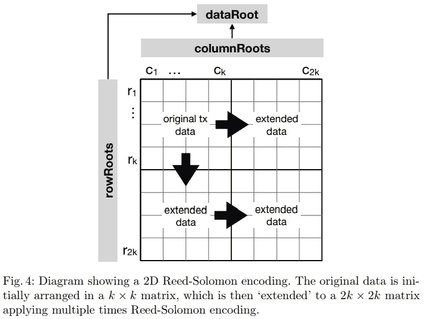
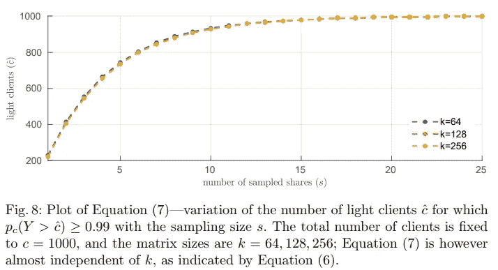

# 防欺诈证据—安全的链上可扩展性

> 原文：<https://medium.com/hackernoon/fraud-proofs-secure-on-chain-scalability-f96779574df>

Photo by [rawpixel](https://unsplash.com/photos/HJENWbX4t-Q?utm_source=unsplash&utm_medium=referral&utm_content=creditCopyText) on [Unsplash](https://unsplash.com/search/photos/fraud?utm_source=unsplash&utm_medium=referral&utm_content=creditCopyText)

安全扩展区块链是一个需要解决的重要问题。如果做不到这一点，可能会损害公共区块链技术的现实影响。

在这里，我将给出一个关于*欺诈证据*及其如何帮助的*轻松对话*，但是在一些关于可伸缩性的介绍之前。

# 区块链可扩展性迷你回顾

如果我们稍微研究一下这些数字，我们通常会发现，Visa 和 MasterCard 的交易吞吐量至少比大多数公共区块链高出 2-3 个数量级。比特币的交易吞吐量为每秒 6–7 笔交易(tps)，而 Visa 的交易吞吐量在 2000–20000 TPS 的范围内。这些数字在互联网上重复出现，所以不要全信；*接受*数量级的差异。

比较 Visa 和比特币的吞吐量是相当不公平的，因为它们的设计优先级顺序不同。公共区块链因权力下放而降低了吞吐量。这种优先级顺序是设计好的。

> 在公共领域，区块链权力下放是王道。

关于如何解决这个问题有很多想法，这些想法可以根据区块链堆栈的层进行分组。此外，您还可以了解*链上*与*链下*解决方案。

o *n 链*解决方案的例子包括[增加块尺寸](https://en.bitcoin.it/wiki/Block_size_limit_controversy)和[分片](https://github.com/ethereum/wiki/wiki/Sharding-FAQs)。另一方面，*链外*解决方案的例子有*侧链*，例如[比特币闪电网络](https://lightning.network/)或[以太坊等离子](https://plasma.io/)。

# 欺诈证据

来自 [Mustafa Al-Bassam](https://en.wikipedia.org/wiki/Mustafa_Al-Bassam) 、 [Alberto Sonnino](https://sonnino.com/) 和 [Vitalik Buterin](https://es.wikipedia.org/wiki/Vitalik_Buterin) 的[最近的一篇论文](https://arxiv.org/pdf/1809.09044.pdf)讨论了一种解决方案，该方案在不损害去中心化和安全性的情况下，降低了*轻节点*与*全节点*的数量之比。

用他们自己的话说:

> 欺诈和数据可用性证据是实现区块链链上扩展(例如，通过分片或更大的数据块)的关键，同时有力地保证了链上数据的可用性和有效性。

论文的全部细节涉及*稀疏 Merkle 树*、 *Reed-Solomon* 作为*纠删码*和*随机抽样*分析。如果你对此毫无头绪，不要担心。

这篇文章的目标是用简单的英语解释大图，提到那些工具如何适合这个难题。

## 欺诈证据的类比

在进入区块链背景下的欺诈证据之前，进行以下心理练习可能是有用的。

假设你加入了一个网络，其中多个对等点共享一个包含大质数的数据库。这个网络中的每个节点都非常努力地添加新的大质数，并与其他节点共享。

如果我们是这个网络中的对等体，我们有两个选择:

1.  相信新数字是质数。
2.  对于每一个新的素数候选，运行一些素性测试，以确保我们的数据库是一致的。

如果网络是由可信的对等体组成的，那么选择第一个选项是很有吸引力的，因为对大素数候选者进行素性测试是很昂贵的。此外，如果要测试的新数字的比率高于我们的计算能力，这个问题会变得更糟，因此我们可能会落后。

相反，如果我们的网络是不可信的，那么选择第一个选项是有风险的。如果某个恶意的对等体试图欺骗网络并提交一个大的*复合数字*会怎么样？在我们的数据库中有*复合数字*是不可接受的。

如果我们知道其他对等体可以向我们发送证据，证明我们数据库中的某个数字不是质数，那该怎么办？对于任何给定的数 *n* ，证明将意味着发送一个小于 *n* 且大于 1 的数来除 *n。*

*   我们可以避免对数据库中的每个新数字进行素性测试。如果在某个时间阈值之后我们没有收到防欺诈证明，我们可以认为该数字是质数。
*   如果至少有一个对等体正在检查这些号码，它可以向整个网络警告新添加的非素数的号码。
*   证明的大小很小。
*   验证证据很快。
*   我们可以惩罚将该数字添加到数据库中的同伴的不当行为。

这个想法类似于造假证明。其他人可以证明当前系统状态是错误的，而不是验证系统的所有规则。

## 轻型节点与完整节点

为了理解为什么欺诈证据在区块链有价值，我们应该考虑一个重要的事实。为了验证一个新的块，我们应该获得对应于该块的数据，然后自己运行完整的验证。

我们可以把区块链想象成国家机器。区块链的当前状态对应于处理最后一个已知块之后的状态。当一个新的块出现时，我们处理它的事务并定义新的当前状态。完成这项工作的节点称为*全节点*。

网络中的其他参与者可能不接受成为*全节点*。如果一个节点运行在 Android 设备上，它的资源是有限的，比如计算能力、存储和带宽。这些节点被命名为*光节点*，因为它们只下载块头，而不是与之相关的所有数据。

*Light-nodes* 可以利用块头中保存的少量信息进行一些最小限度的验证，例如，检查块的*工作证明*。*工作证明*检查并不意味着事务有效，也不意味着新状态有效。他们相信大多数*全节点*是诚实的，因为它们是进行真正验证的节点。

如前所述，增加数据块大小是一种针对扩展问题的链上解决方案。如果我们增加每个块中的最大事务量，那么吞吐量会更高。另一方面，它迫使*全节点*投入更多资源以不落后。

没有人想买一台高端笔记本电脑或超级计算机来运行一个*全节点*；因此将会有更少的*全节点*。以上暗示了大多数*光节点*信任一小部分*全节点*，这可能会刺激他们做出不诚实的行为。**增加块大小并不荒谬，但这并不安全。**

如果*光节点*在不信任大多数*全节点*的情况下收到一个块无效的证明怎么办？。

如果我们读一下这篇论文，我们会发现它谈到了两种防欺诈的方法:

*   *状态转换欺诈证明。*
*   *数据可用性欺诈证据*。

他们每个人都试图构建一个证据，证明一些不希望的情况已经发生。

# 状态转换欺诈证据

让我们回到区块链作为国家机器的概念上来。在应用块中的所有事务后，创建新的状态。

本文描述的第一个核心概念是包含事务间的中间状态。我们可以在每个事务之间添加一些中间 Merkle 根，而不是在每个块的末尾只有一个 Merkle 根。

如果*全节点*检测到一个新的块具有无效的状态转换，它可以告诉*轻节点*以下信息:

1.  嘿，我发现这个街区是错误的。
2.  在从块的开始处理了 *n-1* 个事务后，如果我处理下一个事务，那么状态的 Merkle 根就不同于下面矿工说的*中间状态*。
3.  我给你发了一堆 Merkle 样张，上面有最少的数据，你可以自己检查。

在大多数区块链的许多地方，Merkle 证明是证明某些数据对应于一个块的重要工具。*光节点*只需要信任它已经拥有的块头。

我们不需要保存每个事务之间的中间状态。一种选择是每两次、五次或更多次交易保存它们。这样做会节省状态树中的空间，但会使欺诈证明变大，因为在状态之间需要更多的 Merkle 证明。

像这样的欺诈证明是强大的，因为只有一个诚实的*全节点*可以向任意数量的*轻节点*证明一个块是无效的；不需要多数。如果在某个时间阈值之后，一个*光节点*没有接收到防欺诈，那么该阻止是有效的似乎是合理的。

对于期望的全节点行为来说，包括分别针对有效和无效欺诈证据的经济激励和惩罚是必不可少的。

# 数据可用性问题

状态转换的欺诈证据很棒，但是它们依赖于一个关键的假设:所有的块数据都是可用的。如果 block miner 只发布了块头而没有对应的正确数据，那么就无法证明它是错误的。同样，如果我不知道两个数的和，我也不能证明它们是错的。

而且，即使 99%的数据都是可用的，剩下的 1%可能对于证明一个块是无效的是必不可少的。我们需要 100%的数据可用性。对于块验证，这是一个严格的要求，因为数据可能由于多种原因而不可用，而不仅仅是恶意节点故意造成的。正确的理由是使恶意节点难以获得数据。

> 这将 100%的数据可用性问题转化为 50%的数据可用性问题。维塔利克·布特林

所提出的解决方案使用[纠删码](https://en.wikipedia.org/wiki/Erasure_code)，特别是多维[里德-所罗门](https://en.wikipedia.org/wiki/Reed%E2%80%93Solomon_error_correction)码。简而言之，这意味着将块数据从 M 个组块转换成 N 个组块(M < N)，使得 N 的任意 M 个组块足以重构原始数据。特别地，该论文建立了 N=2*M。多维特性允许重构部分数据，而不需要恢复所有的 M 个块。此外，这个部分数据有自己的 Merkle 根，这将有助于证明数据是否正确可用(稍后将详细介绍)。

这篇论文提供了一个更有帮助的方法来看待这个观点:

Page 13 of the paper

这个强大的工具与使用*随机采样*提取数据一起，为原始数据的重建提供了强有力的数学保证。我们可以在论文中找到完整的数学证明，但这里有一个重要结论的摘录:

Page 21 of the paper

简单地说，假设你有 1000 个*光节点*对扩展数据块进行*随机抽样*。增加样本量将确保，最终，他们会要求恶意方不愿意分享的一大块。从而为检测数据可用性问题提供了更多的确定性。

在论文中，他们还讨论了数据可用性中的另一种欺诈证明，特别是证明了挖掘者错误地生成了 Reed-Solomon 码。由于我们需要 N 个块中的 M 个来重建块数据的分区，这可能足以检测 N 个块是否匹配分区的相应 Merkle 根。

# 结论

欺诈证明和纠删码是衡量公共区块链的有用工具。他们授权*轻节点*在不信任大多数诚实的*全节点*的情况下，在丢弃块时拥有自己的意见。

此外，解决数据可用性问题不仅可以构建欺诈证据，还可以解决其他问题:

> [即使简洁的零知识证明可以用于验证正确性，攻击者能够发布不可用的块并将其包含在链中仍然是非常糟糕的，因为这种事情的发生否认了所有其他验证器完全计算状态的能力，或者使块与不再可访问的状态部分交互。](https://github.com/ethereum/research/wiki/A-note-on-data-availability-and-erasure-coding)

很快，

*   Merkle 证明对于证明数据属于一个块是必不可少的。
*   *中间状态*大大减少了证明状态转换错误所需的 Merkle 证明的数量。
*   能够天真地构造 Merkle 证明意味着 100%的数据可用性保证，这是不可取的。
*   擦除代码加上随机采样提供了强有力的数学保证，可以从数据块中获得所有需要的数据，特别是如果矿工没有恶意的话。
*   由于 Reed-Solomon 码加上部分数据的 Merkle 根的多维特性，试图通过共享错误信息来欺骗网络的挖掘者可以被检测到。

提到的论文以及与论文相关的帖子还表明 [zk-SNARKS/zk-STARKS](https://en.wikipedia.org/wiki/Non-interactive_zero-knowledge_proof) 是证明正确的状态转换和数据可用性的其他选项。但是那些是不同的令人兴奋的怪物。

我在本文中提到的大部分内容都是对这些资源中完整思想的简单总结。我从阅读它们中学到了很多，所以我鼓励你也这样做！