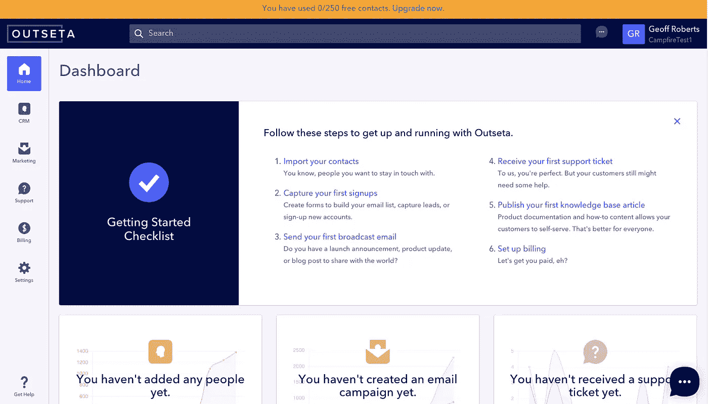
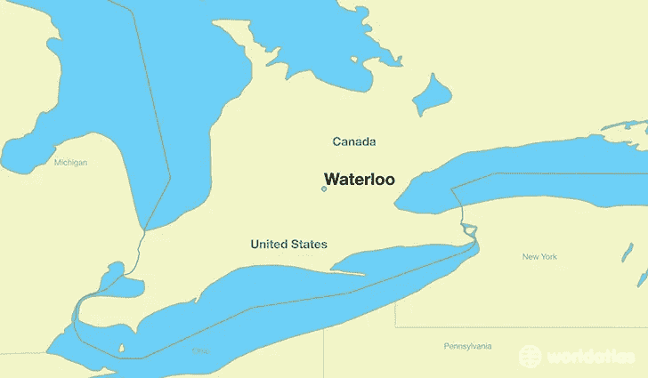

# 免费试用还是免费增值？在韦斯·布什的帮助下，用户在六个月内从 0 增加到 10 万

> 原文：<https://medium.com/hackernoon/free-trial-or-freemium-going-from-0-to-100-000-users-in-six-months-with-wes-bush-f9fb4a7cd032>

韦斯·布什是 SaaS 的一名营销人员，他迅速赢得了“免费试用与免费增值的较量”的名声他通过自己的顾问公司 [*【流量就是货币】*](https://trafficiscurrency.com/)*[*帮助 SaaS 领导人推出并优化免费试用和免费增值模式，也是产品主导峰会*](https://www.productledsummit.com/) *的创始人。**

**我和 Wes 聊了聊他的免费试用 vs. freemium 框架，我们自己的获客流程，还有加拿大滑铁卢的初创场景。**

**

*Geoff Roberts: 好吧，首先，就在刚才，我们从未谋面，但我在网络圈子里认识了你，你是免费试用和免费增值的人。告诉我你早期的职业道路，以及你是如何决定聚焦于这个特殊问题的。*

***韦斯·布什:**我觉得我真的是跌跌撞撞地进入了这个领域，在过去的七年里，我一直在做营销和需求挖掘工作。当涉及到为企业创造需求和线索时，我几乎尝试了所有的方法。但直到我推出了一款免费增值产品，我们的用户在六个月内从 0 增加到了 10 万，我对这种可能性感到非常惊讶。我们提供了如此多的价值，我真的开始把免费增值和免费试用模式视为一个企业的超级铅磁铁。你可以让这个销售线索磁铁也变成你企业的客户。所以有一次我意识到我只是看到了这就是未来。*

*人们想在购买前先试一试，即使你看着像好市多这样的企业，你也想得到一些样品来测试一下，看看你是否真的喜欢它。或者你正在考虑买一种昂贵的古龙水或香水，你想在实际购买之前尝试一下，因为你可能会讨厌它，再也不想穿它了。因此，这是建立信任以及了解解决方案是否适合您的一种非常好的方式。*

*杰夫·罗伯茨:很好的类比。你提到的在六个月内从 0 到 100，000 用户的业务是什么？在该公司提供免费增值模式之前，你在做什么？*

*Wes Bush: 那是在 [Vidyard](https://www.vidyard.com/) 进行的，当时我们确实进行了免费试用，但不是最成功的。很多 B2B SaaS 产品的免费试用，当你注册时，真的没有太多的价值，除非你连接你的数据或上传一些东西，在 Vidyard 就是这种情况。你不会很快看到价值，因为你没有任何视频，除非你注册了免费试用，并期望你会立即上传视频，否则你不会看到价值。因此，我们建立了一个免费增值产品来帮助人们非常快速地创建视频——只需三秒钟就可以录制视频，然后视频将被记录在你的免费试用中。所以它实际上是一个免费增值产品，是对你的免费试用的补充。*

***杰夫罗伯茨:**明白了，有道理。当你今天与早期 SaaS 公司交谈时，你看到他们在决定免费试用还是免费增值模式时最常犯的一两个错误是什么？*

*韦斯·布什:我看到人们犯的最大错误是与其他创始人交谈。我知道这听起来很奇怪，但是只是听取别人对你应该做什么的意见真的不是一个决定你应该做什么的好框架。许多其他创始人基于他们的个人经历来推荐，事实是你有不同的业务、不同的市场和不同的受众。为了给自己做出明智的决定，你需要考虑很多事情。*

> *“我看到人们犯的最大错误是与其他创始人交谈。”韦斯·布什*

*Geoff Roberts: 我认为，许多公司在决定进行免费试用时都会遇到的一个问题是，你是在试用前还是在试用结束时收集信用卡信息，这也是我现在正在与我们的一家企业进行的一个问题。什么时候提前询问支付信息是有意义的？*

*韦斯·布什:根据经验，我总是建议不要提前索要信用卡。有很多关于整体转换率的研究，如果你着眼于底线收入，如果你不马上要求信用卡，它通常会高得多。你将会有更多的人进入你的免费试用，虽然他们成为付费用户的比例会低很多，但总的数量会高很多。*

*然而，在某些情况下，提前收集信用卡信息是很有意义的。有些公司处理大量的垃圾邮件，这是一个完美的使用案例——如果你有一大堆垃圾邮件发送者注册你的产品，这是一个很好的阻止门。还有那些季节性很强的产品。所以，让我们考虑一个搜索引擎优化产品，如果你是一个人的乐队或产品，那么你可能只想对你的网站进行搜索引擎优化审计，也许一年一次。所以你只需注册一次免费试用，然后你就再也不会回来了，因为你不想支付重复的费用。很多这样的产品会看到人们回来，只是用不同的电子邮件来注册相同的产品。所以他们会说，好吧，你必须付费才能玩，因为你会无限期地注册这个免费试用，除非我们在这里增加一些摩擦。*

*杰夫·罗伯茨:说得好。因此，对于决定走免费增值路线的人来说，问题很快就变得没问题了，我如何在销售过程中创造一种紧迫感？我们让人们在更长的时间内接触到产品，但我们仍然有获得客户的目标，需要让买家尽早行动。就如何创造这种紧迫感而言，你对免费增值公司有什么建议？*

***韦斯·布什:**我见过很多公司这样做。你不必只有一个 100%免费增值的产品，你可以创造一个混合的解决方案。我见过一些公司非常成功地做到了这一点，他们首先提供免费试用，让你在 7 天或 14 天内使用许多关键功能，但最后如果你不升级，你实际上就得到了一个永远免费的计划。*

*例如， [Clearbit 的](https://clearbit.com/)免费版进入你的 Gmail，丰富你的联系人。我认为这是提供免费计划的一个非常聪明的方式，因为它本质上是免费广告。它们在你的 Gmail 里，你多久检查一次邮件？如果你是一名职业人士，你每天都会在那里多次看到 Clearbit。你也要想想怎么让你的免费增值产品放大你的付费产品。因此，Clearbit 位于您的电子邮件中，他们正在使用您的大量数据来丰富他们自己的数据。因此，通过赠送免费产品，Clearbit 让他们自己的付费产品变得更有价值。*

*但回到你的问题，如何让人们升级你的免费增值产品…很大一部分归结于定价，如果你以你的产品为主导，一个有趣的事情是，你的客户获取模式真的与你的收入模式密切相关。如果你不放弃一些功能，你的客户获取模式就会受到影响，因为现在你的优惠力度变小了。另一方面，如果你放弃太多，你的免费增值产品什么都有，人们没有理由升级，现在你的收入模式就完蛋了。您需要解决这个问题并保留一些功能，所以从升级的角度来看，最好的方法是根据价值指标来定价。*

*来自 ProfitWell 的 Patrick Campbell 说有两种类型的价值标准，首先是功能价值标准。如果我是 [Wistia](http://www.wistia.com) ，这是你可以在平台上托管的视频数量，所以你可以用它作为一个价值指标。如果有人上传了三个视频，好吧，现在你必须升级，一旦这三个视频上传，你应该能够真正理解产品的价值。另一方面，您可以使用基于结果的方法来评估指标。因此，这可能是人们实际上是如何观看你的视频的，或者有多少人访问了你的网站——你实际上只是在尝试选择指标，以便当产品被使用时，你与客户一起成长。这是增加你的扩张收入和升级率的好方法。*

# *免费试用与免费增值框架*

***杰夫·罗伯茨:**太棒了。让我们过渡到您与我分享的免费试用与免费增值框架。它是什么，你为什么开发它，你如何在日常工作中使用它？*

***Wes Bush:** 是的，所以我建立的决定免费试用和免费增值问题的框架主要集中在你们业务的四个主要领域。第一部分是你的市场战略，所以它真正侧重于了解你想如何在市场中定位你的业务。例如，假设你想颠覆一个由 Adobe Photoshop 这样的工具主导的现有市场。Photoshop 真的很复杂，你可以花一整年的时间来学习这个程序，但仍然有很多方法来提高你的 Photoshop 能力，因为你可以用它做很多事情。但事实是，许多人实际上并没有充分利用 Photoshop 的全部功能，这就是为什么像 [Canva](https://www.canva.com/) 这样的公司能够让制作图形变得非常简单，并能够占据这个市场的很大一部分。*

*第二，海洋环境——这是一个真正竞争激烈的领域吗？如果这是一个竞争激烈的市场，比如说电子邮件营销，每个人都有免费试用或免费增值服务，这几乎是购买过程中提供试用或免费增值产品的期望。如果你正在创建一个新的类别，这是一个非常好的地方，但通常免费试用或免费增值模式并不是最适合的，因为你必须教育人们这么多。这就像 Salesforce 与云的结合——最初很多人不明白。他们的销售团队有大量的异议，当你创建一个新的类别时，你实际上想听到这些。如果你试图马上自动化你的整个漏斗，你将会错过很多有价值的反馈。*

*接下来是你想关注的受众——你需要自下而上还是自上而下的方法？我所说的自上而下是指你是在努力瞄准高管团队，还是从自下而上的角度来看，你是在瞄准经理还是日常工作人员？如果你的目标是自上而下的方法，并使用免费试用或免费增值模式，对于那些高管来说，根据你的工具的复杂程度来真正实现价值将会非常困难，因为他们可能不会每天都使用这个工具。自下而上的方法非常适合免费试用或免费增值模式。这就是为什么你会看到 Slack 这样的公司从底层成长起来。开发团队中的某个人会说，嘿，让我们开始使用 Slack 吧。他们会把它发给一群同事，然后在内部传播给其他团队。然后到了升级的时候，这真的很容易，因为他们的团队中已经有大约 30、40 人了解并喜欢这个产品，并从中获得了价值。*

*那么框架的最后一部分就是时间价值。现在，如果你有很长的时间来评估，那么免费试用或免费增值模式将会非常困难，实际上我建议不要这样做。您希望确保尽快实现价值。我认为免费增值模式需要更快，因为你在很大程度上使用的是这种非牵手的方式，你需要人们在没有人为干预的情况下尽快实现价值。这是我的高层次框架——我很乐意听取你们的想法。你是怎么发现它穿过它的？*

*[以下是 Outseta 对免费试用与免费增值框架的回答](https://docs.google.com/document/d/1-FmOBGdyw4vSX5zxxFXqWj7x3h9wlLwE-WH9bpzI3_A/edit)*

***杰夫·罗伯茨:**是的，所以这对我来说是有逻辑意义的——在大多数情况下，我有点明白每个问题背后的含义。出于几个原因，我决定为 Outseta 选择一个免费增值模式，而你的框架给了我们 10-2 分，支持免费增值，所以它在这个意义上验证了我的想法。*

*有几个因素，首先是我们的销售目标市场。我们的目标是非常早期的 SaaS 初创企业，他们通常会在开门的那天找到我们。就何时开始使用 CRM、何时建立计费系统以及何时发送第一封电子邮件而言，这些公司往往有着非常不同的时间表。因此，我们希望为公司提供足够的时间来适应产品，并在他们需要时采用其核心功能，而不是说嘿，你有 7 或 14 天的时间来了解产品的所有不同方面。*

*第二个因素是产品确实很大。它基本上是在一个平台上交付的三到四个众所周知的软件类别，当我们考虑入职流程时，每个人都将从不同的地方开始。并不是每个人都想先发送电子邮件活动，有些人想先在 CRM 中记录交易，有些人想先设置账单。所以我觉得我们需要在入职过程中向人们展示我们的每个核心功能。*

*因此，我们面临的一个难题是，人们的起点不同，我们如何快速向他们展示价值？当我们不知道他们首先想做什么时，我们应该首先向他们展示什么行动？如果您第一次登录我们的产品时看到初始的入职屏幕，我们会说，嘿，您可以导入您的联系人，您可以设置您的客户支持电子邮件收件箱，您可以发送电子邮件活动，创作一篇基于知识的文章，这些都是该产品帮助执行的关键操作。相对于更具体地说明我们希望用户做什么，你对这种方法有什么看法？*

**

*Outseta’s onboarding dashboard*

***韦斯·布什:**我总是喜欢用多米诺骨牌的方式来看待入职——你能让人们做的最小的动作是什么，让他们在未来走向成功？如果你想到 Hubspot，它在某种意义上类似于 Outseta，有营销方面和 CRM。Hubspot 的销售产品非常值得一提，因为它是一个 Chrome 扩展，你可以在不到五分钟的时间内完成设置。通过推介该产品，你的客户关系管理系统会填满你的所有联系人，这样你现在就有了营销对象。这就像一个梯子，或者你一次推一块多米诺骨牌，越往前走越容易。*

*对于你的产品，我的建议是看看你拥有的所有功能，你需要有人做的第一件事是什么，以便让他们进入下一步？也许你从销售开始，然后跟进营销，然后是订阅或类似的事情。*

> *“我总是喜欢以多米诺骨牌的形式来看待入职——你能让人们做的最小的动作是什么，以此为他们未来的成功做准备？”韦斯·布什*

*Geoff Roberts: 我认为最明显的是进口合同。例如，您需要 CRM 中的联系人来发送电子邮件活动；这也是我们定价模型的基础。我想说的唯一一种可能不是正确的初始行动的情况是，一家公司还没有任何联系人，这在我们的用户群中很常见，但多米诺骨牌类比是有意义的。*

***韦斯布什:**好吧，真棒。*

*杰夫·罗伯茨:所以当我浏览你的框架时，我们的一个回答是“免费试用”,这是基于潜在市场的总规模。如果你有一个较小的可调市场，你建议免费试用，而不是免费增值。这是为什么呢？*

***韦斯·布什:**这里的一个问题是，免费增值的转化率非常低——通常你会看到 1%到 3%注册了你的免费增值产品的人实际上变成了付费客户。因此，在这种情况下，这是一个很好的指标，表明你的市场足够大，可以支持这一点吗？如果你有一个非常小的市场和 1-3%的低转换率，你可能会有 100 或 1000 个客户，然后被封顶。*

*杰夫·罗伯茨:有道理。回到我们自己的定价模式，关于我们自己的定价，我们听到的反馈之一是有一部分买家……我们称他们为独立创业者，或独立黑客，或制造商，他们非常不愿意为任何产品付费，直到他们达到带来收入的地步。他们将使用 Trello 板来跟踪他们的销售过程，Hubspot CRM，MailChimp 的免费版本，并将忍受任何存在的痛苦，直到他们赚到钱，然后将建立一个真正的技术栈。*

*我们提供了一个免费增值计划，我们给你 250 个联系人，但可以访问每一个功能-这里的想法是知道这些企业有不同的实施时间表，我们给他们所有的时间，他们需要设置一切，配置他们的帐户，并确定他们是否喜欢所有的功能。然后，一旦他们开始认真使用该产品，他们将很快超过 250 联系限制，并升级到付费计划。我们听到的反馈是，这些人中有许多人打算在他们带来收入之前进行 250 次联系，所以他们不想在真正需要之前每月支付 99 美元。*

*我们正在考虑的一个实验是为整个平台提供一种免费的方式，但随后通过我们的支付处理系统处理更大比例的支付。这将使我们的定价模式与最重要的基于结果的价值指标(收入)保持一致，例如，我们将获得比 2.9%的条带费用略高的提成。想知道您对此有何看法，以及我们如何才能更好地吸引对价格非常敏感的细分市场？*

*韦斯·布什:我强烈建议以任何有助于获得收入的产品特性为卖点。因此，在大多数情况下，这将是销售工具，你只是想帮助他们达到他们愿意支付的程度，因为你的产品已经帮助他们创造了收入。我绝对同意 250 个联系人的一些观点。在这种情况下，我肯定会考虑你可以给人们的第一个工具是什么？也许你免费赠送其中一个，这是一个销售工具，然后你帮助他们建立这些联系，这样他们甚至不必导入任何联系——他们已经在那里了。这样，你就有了下一个升级的踏脚石，即营销产品，这只是旅程的自然延伸。*

***杰夫·罗伯茨:**是的，有道理。我认为，我们面临的另一个挑战是，考虑到产品的范围，定价要保持简单明了。接触似乎是一个很好理解的衡量人们从产品中获得的价值的方法。我们从客户那里听到的和看到的是，一旦你采用我们的付费定价计划，产品就很便宜，比竞争对手便宜得多。我们仍在努力应对的部分是入门级客户，以及我们如何能够吸引他们，相对快速地向他们展示价值，同时又不会让他们永远升级。*

***韦斯布什:**好的明白了。*

# *安大略省的创业现场和坏加拿大人韦斯*

*杰夫·罗伯茨:所以让我们换个话题——我看到你在安大略省的滑铁卢。你能告诉我滑铁卢的创业场景吗？*

***韦斯布什:**滑铁卢的创业场景其实真的很刺激。在加拿大所有的城市中，它的初创企业密度最高，我认为这是因为我们周围有一些非常棒的工程大学，所以你可以聘请很多非常优秀的人才来创业。越来越多的成功公司开始成长，然后他们的员工转移到其他公司，建立他们，所以真正令人兴奋的是看到滚雪球效应，以及它是如何变得越来越大的。*

*杰夫·罗伯茨:你是在安大略省出生并长大的还是……*

*韦斯·布什:对，我出生在安大略省，并在那里长大。你去过吗？*

**

*杰夫·罗伯茨:没有，我来自波士顿地区。我去过加拿大很多地方，但我没去过安大略或滑铁卢。*

*韦斯布什:确保你在夏天去。*

*杰夫·罗伯茨:是啊，不是开玩笑。你最喜欢的加拿大事物是什么？你是冰球迷吗？总的来说，你喜欢加拿大的什么？*

*韦斯·布什:所以我觉得我不是一个好加拿大人。我不喜欢冬天，我不太喜欢像曲棍球这样的运动。这一点也不像加拿大，但是我喜欢山地自行车，喜欢森林，喜欢在大自然中闲逛，喜欢湖泊。安大略省有如此多的湖泊。我喜欢这部分。*

*杰夫·罗伯茨:非常酷。如果你不是免费试用对免费增值的家伙，你还能看到自己在做什么？你的职业生涯还有什么其他方向可以走？*

***韦斯·布什:**我想我还是会做一些非常相似的事情。我喜欢行为心理学，因为弄清楚是什么让人们做某些事情并解构它是如此令人着迷，无论是解构习惯还是人们为什么在网上购买一种产品。但是，是的，我仍然可能在类似的领域做一些事情。*

*杰夫·罗伯茨:工作之外，告诉我一些关于你自己的、你的网络观众不一定知道的事情，这些事情会让韦斯活起来。*

*韦斯·布什:关于我，我经常旅行。我实际上建立了独立于地点的业务，所以我现在实际上在泰国。我真的尽我所能避开冬天，所以我做了很多事情去尝试和探索新的地方，在这些令人兴奋的地方尝试新的食物。我也在努力学习骑摩托车。那很有趣。*

*杰夫·罗伯茨:到目前为止，泰国的食物怎么样？*

***韦斯布什:**真的很好。我不确定你是否喜欢泰国菜-*

*杰夫·罗伯茨:喜欢它。你在泰国呆了多久了？*

*韦斯·布什:我已经在这里呆了几个月了，我通常会在这里或洛杉矶地区之间旅行，所以希望有一天我们能见面。然后是多伦多，所以我每年都去。*

*Geoff Roberts: 太好了，这就是我要问你的所有问题，我会让你离开的。去吃点泰国菜吧！很有趣。*

*韦斯·布什:同样，非常感谢邀请我。*

*Outseta 让 SaaS 的初创企业很容易迅速尝试免费试用和免费增值定价模式。创建您的免费账户。*

**原载于 2019 年 3 月 18 日*[*https://www.outseta.com*](https://www.outseta.com/posts/free-trial-or-freemium-wes-bush)*。**