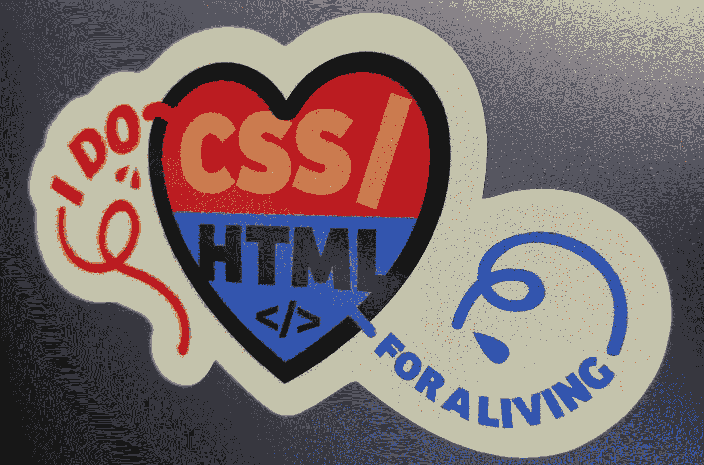
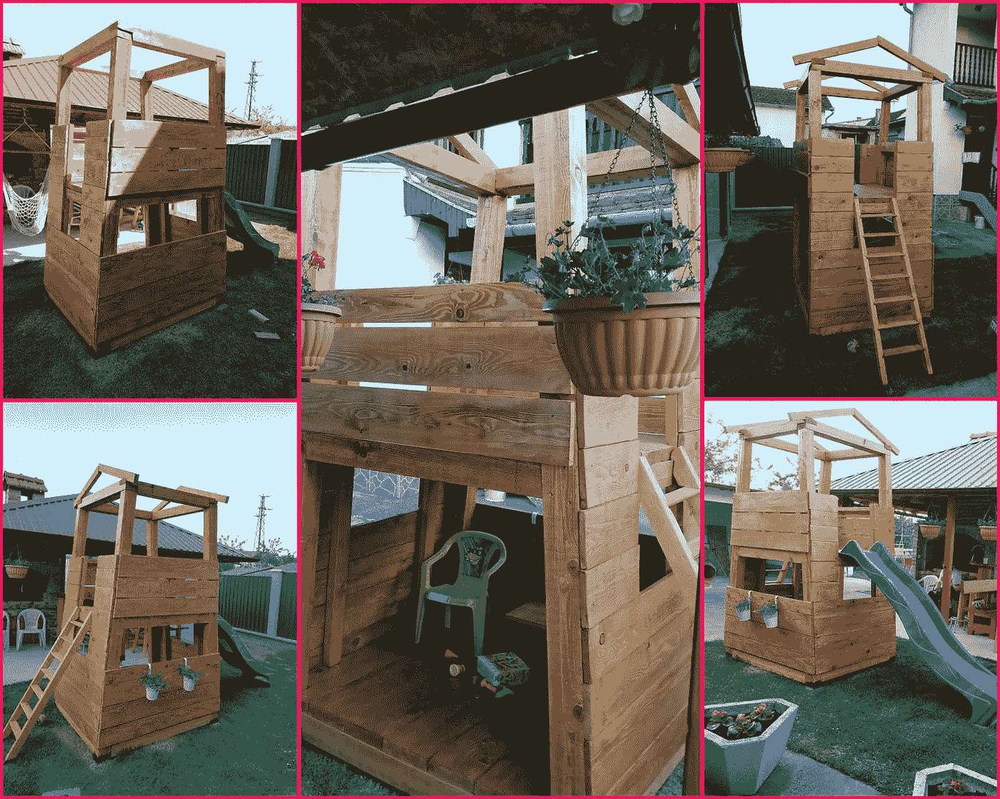

# 从我从事自由职业的第二年开始

> 原文：<https://medium.com/hackernoon/freelance-insights-and-review-39f1de9acf1>

## 自由职业见解

## 去年的今天，我写了我自由职业生涯的第一份年度回顾。现在是时候回顾我自由职业的第二年了。

# 客户

去年，我和八个不同的客户一起做了十几个项目。一半的客户来自顶级网络，另一半通过 T2 我的网站与我接触。

每个项目都按时成功交付。每个客户[都对我的工作给予了积极的反馈](https://www.silvestar.codes/#Testimonials)，其中一些还给我带来了新的项目。我一直在与来自西班牙、沙特阿拉伯、德国和美国的客户合作。

# 客户的项目

我对我的投资组合今年的表现很满意。每一个项目都有其挑战性和实现性。

去年，我为以下网站构建了静态页面和样式指南:

*   [卡尔弗特](https://www.silvestar.codes/portfolio/calvert/)，以及
*   国际、IT 软件和服务客户，以及
*   沙特 VPS 服务器和云托管公司。

我一直在制作和维护由静态页面生成器驱动的网站，比如 Jekyll 和 Hugo:

*   [多米诺数据实验室](https://www.silvestar.codes/portfolio/dominodatalab/)，
*   [多米诺数据实验室版本](https://www.silvestar.codes/portfolio/dominodatalab-rev/)，
*   [机器学习库](https://www.silvestar.codes/portfolio/machine-learning-libraries/)，以及
*   [西翼](https://www.silvestar.codes/portfolio/westwing/)。

我一直致力于开发、维护和优化 WordPress 主题:

*   [特拉斯年鉴 2018](https://www.silvestar.codes/portfolio/yearbook-trase/) ，
*   [TheGrio](https://www.silvestar.codes/portfolio/thegrio/) ，还有
*   [Domino 数据实验室弹出窗口](https://www.silvestar.codes/portfolio/dominodatalab-pop-up/)。

我可以说，构建静态站点、页面和样式指南是我的服务的主要需求。

I do CSS/HTML for a living sticker

我甚至会说我的主要技能是 HTML 和 CSS，就像我最喜欢的贴纸上写的那样。

# 辅助项目

我也一直在做我的项目。我已经发布了 [SPRO](https://starter.silvestarbistrovic.from.hr/) ，一个用于创建完美 Gulp 开发环境的包。这是我之前的包[启动项目](https://starter.silvestarbistrovic.from.hr/starter-project/)的副产品，带有一些很酷的终端扩展。

我在 Skillshare 上发布了两个不太成功的课程。第一个课程是[关于使用 SPRO 包](https://skl.sh/2EcUlRt)，第二个课程是[关于用 Hugo](https://skl.sh/2ILioJ8) 静态页面生成器做一个网站。

在过去的一年里，我在我的网站上投入了大量的精力。我已经更名和重新设计了网站。我对它进行了优化，使其性能更高，dev.to community 帮助很大。我所要做的就是[寻求一点点帮助](https://dev.to/starbist/lets-make-my-website-even-better-37a5)。此外，我已经将我的网站迁移到一个新的域名， *silvestar.codes* 。我必须说我对这个结果感到激动。😊

除了电脑，我喜欢在家里做些事情。我最喜欢的是木工。

Playhouse

今年，我为女儿建了一个玩具屋。这是我喜欢做的事情。远离代码，时不时地把手弄脏，让我更加珍惜我的日常工作。

# 远程工作

如果你是一名远程工作者，你应该知道这是多么具有挑战性。在家工作让人分心。当你有了一个孩子，这种干扰会增加 100 倍。这就是为什么我去年租了一间办公室。我现在已经在我的办公室工作了一年，我认为这是个好主意。将家庭和工作环境分开让我更清楚地专注于工作。另外，我的家人和朋友尊重我的工作时间，因为我不再整天呆在家里。

> 大多数客户都尊重我的时间表，只要我们至少有一个小时的重叠时间，在这段时间里，我们可以进行每日的站立或会面。

在办公室工作的另一个显著优势是我有一个时间表。我在早上效率最高，所以我倾向于在早上工作。当与我的客户谈判时，我会尽可能早地与他们沟通。大多数客户尊重我的时间表，只要我们有至少一个小时的重叠时间，我们可以每天站起来或开会。

我直接从我的客户那里得到了大量的可用性请求。这让我开始用一个简单的电子表格记录客户。我跟踪谈判状态、项目类型、开始日期、预期交付日期和价格，因为我的价格对每个客户和项目来说都不是恒定的。这样，我可以避免重复预订。

# 问题

与前一年不同的是，我在寻找预约方面没有问题，但我确实遇到了超额预订的问题。在大约一个月的时间里，我在做多个项目。这非常累人，我很难管理我的时间。幸运的是，我能够解决这些问题，并满足所有的期限。

> 我的自由时间和理智对我来说太重要了。

这对我来说是一个很好的教训，我认为这种事情不会再发生了。我的自由时间和理智对我来说太重要了。我不相信任何项目，无论多么吸引人，会比我的家庭或健康更重要。

# 结论

我觉得我的事业正朝着正确的方向发展。我可以说我很喜欢参与每个项目。我很幸运能与最不可思议的专业人士合作。我期待在我的旅程中遇到其他了不起的人。

如果你喜欢这篇文章，分享给你的朋友。👋

如果你想成为顶尖的专业人士，使用[这个链接](https://www.toptal.com/#trust-nothing-but-brilliant-freelancers)加入吧！🔗

*原载于*[*https://www . silvestar . codes*](https://www.silvestar.codes/articles/my-second-year-of-freelancing/)*。*