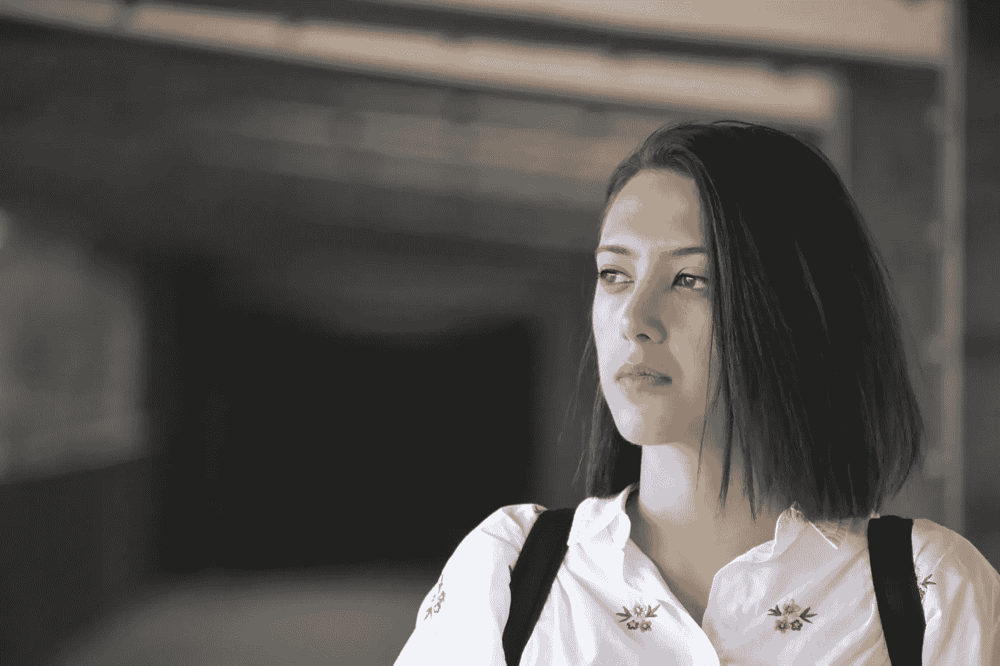

# 自由职业生活与办公室生活:以下是我对此的看法

> 原文：<https://medium.com/hackernoon/freelance-life-vs-office-based-my-take-on-this-sh-t-57a90804e2d0>

A random photo of me in Tbilisi, Georgia (September 2017)

澄清一下:我已经做自由职业者和/或远程工作超过 6 年了，直到我得到一个邀请，加入埃里温一家成长中的软件开发公司，担任他们的品牌故事员。

> 说这是一个艰难的决定意味着什么也不说！

Source: giphy.com

但是我有理由从自由职业者转到办公室工作，很明显，我接受了这个提议，而且我已经在这家公司工作了一个月零 10 天。

你可能会认为一个月零 10 天对于完整的画面来说太短了。同意。但是现在，我有一些东西可以比较。所以请容忍我。

# 工作

*自由撰稿人*

在我的自由职业生涯中，我做了很多有趣的事情，比如写博客、写作、策划广告活动等等。我在一家音乐初创公司的上一份自由职业工作中，甚至做了一些产品经理通常会做的事情。我与客户交谈，并帮助高管们做出与产品/功能相关的决策。那很有趣，我有很多学习和成长的空间。

*办公室型*

我在这家公司讲述人们的故事，维护和发展他们的社交媒体账户，尝试员工品牌。这不同于我在自由职业生涯中所做的事情，因为现在我试图向潜在员工“推销”一家公司，向他们展示在这里工作有多酷。到目前为止，我喜欢这样做。这份工作最让我喜欢的一点是，我不用花太多力气去说服人们这是一家好公司，也是一个适合发展的地方。这里的大多数员工都非常擅长自己的工作，从他们身上可以学到很多东西。我所要做的就是用各种方式展示这些人有多棒(创造性的方式，主要是:D)

# 生活方式

*自由职业者*

作为一名自由职业者，我没有固定的时间表。我根本没有时间表。我会在早上 9:55 醒来，一直工作到凌晨 3 点。这听起来可能很可怕，但有几天我甚至不出门，也不在院子里散步。我知道，很吓人。我会像僵尸一样在浴室或厨房短暂休息，然后回到我的卧室继续工作。

但好消息是我也有一些社交生活。我会开车 35 公里去见一两个朋友。通常在晚上。这真是令人耳目一新。

*基于办公室的*

我现在有一个严格的时间表。我的起床时间是早上 8 点到 9 点，而且我必须在 10 点钟到办公室。我们在办公室吃午餐，因为我们很酷，而且我们有送来的午餐券。但有时我会在办公室外的某个地方吃午饭时遇到一个朋友。我在晚上 7 点到 8 点后离开办公室。这些人经常在下班后组织一些很酷的活动，比如看电影、玩棋盘游戏或做技术演讲。所以，我有时会晚于晚上 8 点离开办公室。但这没什么，因为你总是有某种收获，无论是乐趣还是你学到的新东西。

关于社交生活的观点仍然存在:我通常在晚上和朋友一起喝茶或喝葡萄酒。

Source: giphy.com

这里最棒的是我下班后走路回家。这 30 分钟是我在漫长的一天工作中能遇到的最好的事情。

我回到家神清气爽，开心又饿当然是:D

# 被欺负

*自由撰稿人*

在做自由职业者的时候，你经常花很多时间在网上，你试图同时做多项工作，比如和几个人聊天，同时做你的工作。我不认为这是一件伟大的事情，但我打赌我们很多人都这样做。所以，当你试图专注于你的工作，但你没有足够的睡眠，或者你一天没有出去，你真的很容易被操纵或玩弄(在这个词:D 的最形象化的意义上)。我想说的是，你在网上可能很脆弱，甚至你的朋友可能会欺负你，而你甚至没有注意到这一点(这很难解释，我只是希望你明白)。

Source: giphy.com

*办公室型*

在办公室生活中，也有自私自利的小霸王。他们可能是你的一些同事，他们只是不喜欢你的肤色，你的黑眼圈，你的短发或者其他一些关于你的随意的东西。但好消息是，你忙于工作、会议、头脑风暴会议和写作，以至于忘记了这些小怪物试图传播的负面情绪。就是这样。如此简单！

# 抑郁

*自由职业者*

内心的恶魔、怀疑、破裂的关系、失去的朋友——这都是关于自由职业者的生活。至少，自由职业让我想起了这些事情。你的自由职业生活不必像我一样，:D，别担心。

虽然你有很多钱，你可以用它做任何你想到的事情，但很多时候你会感到非常孤独。我认为这是自由职业的唯一缺点。如果你能够保持工作与生活的平衡，并与你的朋友和爱人保持良好的关系，那么你继续做自由职业者是没问题的。

对我来说，我的世界正在崩溃，我必须做些什么，改变一些事情，从我的工作/生活环境开始，到那里的人们(主要是)。

Source: giphy.com

*基于办公室的*

“你的抑郁症怎么样了？”

我每天早上都会从我们的人力资源主管那里收到这个问题(顺便说一句，她很酷)。很自然地，我们几乎笑得在地上打滚。你知道为什么吗？因为在办公室里，有工作要做！没时间听你那些“失落的一代”和“失落的感觉”的废话了。

# 最后，最后的笔记

我不会像一些西藏僧侣那样给你一些深思熟虑的建议。我还没那么聪明，:D，请记住，你的生活，你的情感，你的幸福，你比其他任何东西都重要。尝试不同的事情，直到你找到最适合你的。不要为了金钱、朋友、工作或其他任何事情而妥协。努力过快乐健康的生活就好。无论是自由职业者还是办公室职员，都要努力让自己快乐。