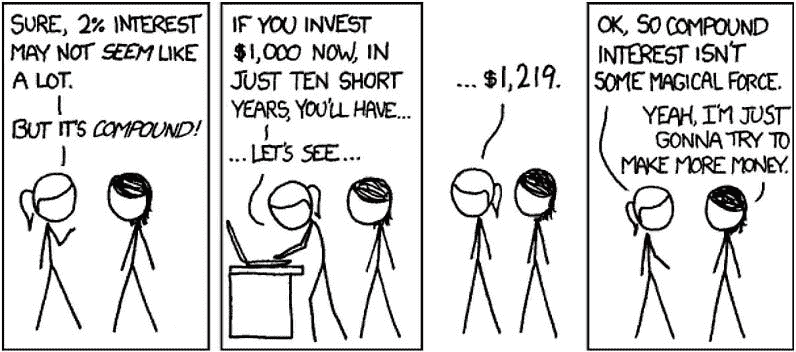
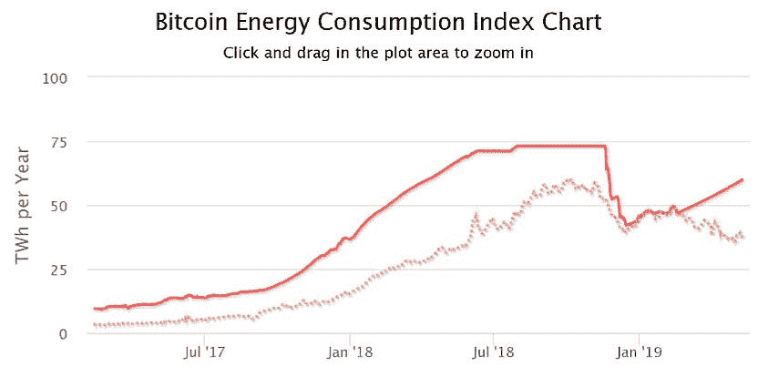
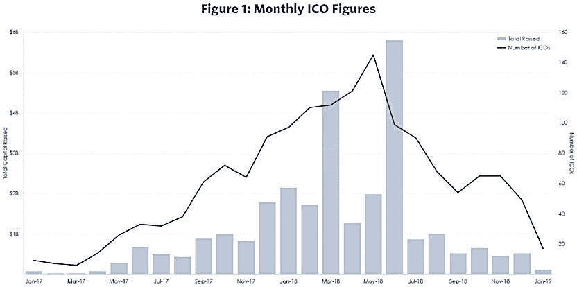

# 从秘密采矿到采矿作业的可编程所有权

> 原文：<https://medium.com/hackernoon/from-crypto-mining-to-programmable-ownership-of-mining-operations-16570853df38>

[https://icons8.com/ouch/illustration/arabica-7](https://icons8.com/ouch/illustration/arabica-7)

采矿是许多区块链网络运转的动力。如果几年前，当只有少数几种加密货币存在时，这种说法是正确的，那么今天它正在慢慢消失。投资昂贵的加密货币采矿硬件根本不再值得，特别是当区块链成为投资门户，为个人投资者带来让富人更富的机会时。

在这篇文章中，我们将了解为什么秘密采矿从长期来看是不可持续的，以及像蓝山基金会、T2、T4 和这样的项目如何提供了一种替代投资:在传统市场领域的共同所有权，几十年来，这种所有权一直是合格投资者的专属。不再有了！

[https://xkcd.com/](https://xkcd.com/)

# 加密货币挖掘正在变得过时

有史以来发明的第一种加密货币比特币基于一个验证系统，该系统需要一个持续的过程来保持其网络的活力。这个过程被称为[工作证明](https://en.bitcoin.it/wiki/Proof_of_work)。物理硬件正在夜以继日地工作(挖矿)生产比特币。电力是生产比特币成本的 90%，因此可以肯定地认为，加密货币中的“开采”意味着通过消耗电力来生产一种数字资产。

虽然工作证明甚至在今天也在为比特币的网络提供动力，但大多数项目都在用一个新的验证系统来取代它:[股权证明](https://blockgeeks.com/guides/proof-of-work-vs-proof-of-stake/)。我们在这里不打算深入探讨这两者之间的技术差异，但是有一个变化需要强调:在股权证明模型下不存在矿工。

[https://digiconomist.net/bitcoin-energy-consumption](https://digiconomist.net/bitcoin-energy-consumption)

[自区块链技术发明以来，10 年已经过去了](https://ftalphaville.ft.com/2019/05/13/1557754510000/Bitcoin-is-the-10-year-Treasury-of-our-time/)，即使不提两者之间的能耗差异，很明显这项技术正在不断发展，并朝着新的创新迈进。事实上，以太坊，第二大加密货币，开始是一个工作证明网络，已经在计划向利益证明过渡。

加密货币开采不仅像几年前一样有利可图，而且也即将灭绝。2019 年投资这样的硬件，风险巨大，没有诱人的利润。

你甚至可以考虑投资真正的采矿业务，这些业务不是生产数字资产，而是从地壳中提取有形的、有价值的金属。曾经被认为是艰苦和肮脏的活动现在是一种[高科技操作](https://www.mining-technology.com/)，它使用电脑遥控设备和复杂的机械，由训练有素的人员操作。

加密货币挖矿和矿产挖矿仅仅是因为一个命名上的相似而走到了一起。然而，作为一名加密货币用户，投资这样一个传统领域正在成为现实，这要归功于你所热衷的区块链技术。

# 区块链:新投资机会的大门

如果说早期的互联网资产是无形的，比如电子邮件或文章只是对有价值信息的支持，那么现代互联网处理的是具有直接价值的数字资产:加密货币。区块链网络上新增加的编码数据简化了业务，加快了操作，减少了错误，并消除了中间人。

处理数据的分散方式正在超越在电脑后面挖掘自己的硬币的“极客时代”，走向成为全球人口(你)获得新投资机会的门户。这是一种在前几十年让富人更富的投资。

[https://tradeblock.com/blog/the-hard-fork-weekly-market-commentary-11](https://tradeblock.com/blog/the-hard-fork-weekly-market-commentary-11)

[蓝山基金会](https://bluehillfoundation.com/)是蓝山矿的共有人，蓝山矿是位于蒙古国的一家真正的采矿公司，据预测，该公司拥有亚洲最大的铜矿储量。

B.H .基金会拥有 24%的采矿业务，它希望通过发行一种利益分成的加密货币:BHM 代币来提供共同所有权的机会。传统上，这种操作应该以传统的方式在纸上完成。然而，通过利用区块链技术，他们用有限的、资产支持的、无限可扩展的令牌在数字空间中移动整个过程；每个代币都有权(0.00000004%)共同拥有蓝山煤矿。

最近，我们看到越来越多的此类公司向个人提供新的分散投资机会。

Propy 可能是这个领域的新成员，其首次发行硬币(ICO)刚刚在 2017 年结束，但很明显，作为一个国际房地产市场，这家公司正在改变我们对财产所有权的看法。

他们对区块链的使用使得任何人都可以通过代币获得房产的部分所有权，从而进入房地产投资领域。这些代币可以代表基础实物资产的所有权、拥有该资产的合法结构中的权益、由不动产担保的债务中的权益或基于该资产现金流的收入流。

微券是另一个故事，但目标相同。这家公司专门做监管众筹，是指一种股权众筹的形式，允许所有人投资，而不仅仅是认可的投资者。如果该公司注册为经认证的“经纪交易商”，这是可能的。

它可能不会使用区块链作为其核心，但通过他们帮助筹集资金的初创公司和小企业，有许多公司在他们的平台上积极使用区块链，并通过 ico 分发他们的令牌。虽然网上有许多其他加密投资平台，但这并不意味着它们完全合法。MicroVentures 通过各种相关权威机构的认证，使自己与众不同。

**这是迈向金融包容性的一大步。虽然加密货币开采正在慢慢消亡，但可以通过区块链从其他来源获得诱人的利润。**

# 每个人都可以获得证券(代币)!

区块链是数字关系形成和保护的地方。最初的硬币发行允许创业公司筹集资金，以换取加密货币。随着 2017 年的加密炒作和许多公司寻求获得资金，而无意开发真正的产品，这种关系失去了用户的信任。

传统行业有简单的未来股权协议(SAFE)，合格投资者可以通过该协议购买一家公司的未来股权，类似于权证。在 crypto 中，有[未来代币简单协议(SAFTs)](/@argongroup/explaining-the-simple-agreement-for-future-tokens-framework-15d5e7543323) 允许投资者购买代币，这些代币将在稍后的日期收到，并在项目平台上用作公用设施。对于后者，即使令牌是分布式的，在大多数情况下，底层平台在实现时也会失败。在这种情况下，这些代币有什么价值？

这就是安全代币帮助投资者的地方。任何由外部可交易资产支持的代币都可以被归类为证券，当然也可以作为证券受到[的监管。在我们的例子中，如果代币是由一家估值可以随时间增长(取决于其业绩)的公司发行的，这些数字资产的所有者将继承基础公司的可编程所有权。一项现在受证券法保护的投资。](https://www.sec.gov/news/testimony/testimony-virtual-currencies-oversight-role-us-securities-and-exchange-commission)

美国证券交易委员会主席 Jay Clayton 在[的](https://www.sec.gov/news/testimony/testimony-virtual-currencies-oversight-role-us-securities-and-exchange-commission)中说:“当投资者被提供和出售证券时，他们有权享受州和联邦证券法的好处，卖方和其他市场参与者必须遵守这些法律。”。

MicroVentures 有自己的内部过滤程序，只列出那些被投资者认为最安全的投资机会。这个过程是如此的有选择性，以至于“进入哈佛比在小额贷款网站上市更容易”

Propy 曾经是一家运营 ICO 的前期产品公司，现在有了一个功能齐全的市场，用户可以用代币投资房地产机会。然而，从本文探讨的三个例子来看，蓝山基金会似乎是最接近投资未来的一个。

B.H .基金会正在管理一个前 STO。如前所述，BHM 令牌是蓝山矿共同所有权的数字证明。这是一种证券，一种完全受监管的资产支持证券。根据证券法，它只提供给合格的投资者，对吗？没错。这就是为什么，对于作为主流投资者的你来说，B.H .基金会提供了另一个令牌，BHF 令牌，这是一个不受监管的资产支持令牌，在蓝山矿业独家 STO 之前，任何人都可以在他们的网站上购买。在 STO 发布会上，BHF 代币可以(1:1)兑换成 BHM 代币。两全其美！

然而，像任何投资一样，它也有自己的风险。BHM-代币不受监管。即使 B.H .基金会承诺进行交易，在你成为完全受监管的 BHM 代币的所有者之前，作为投资者，你不受任何证券法的保护。为了合法地成为蓝山矿的部分所有者，B.H.Mining-STO 应该得到 FINMA(瑞士金融市场监管局)的批准。如果 B.H.Mining-STO 没有从 FINMA 或任何类似机构获得所需的许可证，根据他们的[条款和条件](https://www.bluehillfoundation.com/docs/terms-conditions.pdf)，每个投资者将从股票市场出售蓝山矿获得 0.000000004%的 BHF 股票。这是最坏的情况，但你应该确保你知道你可能投资的所有风险因素。

# 结论

区块链作为一种金融工具为个人投资者打开了巨大的机会，包括进入曾经封闭的领域，如采矿、房地产或股票等传统行业。这一新程序，以及 STO 模式，为投资者提供了更具流动性的机会，在未来，甚至可能使认证制度变得过时或不必要。

投资不是一个简单的过程，它需要有法律、税务、审计和技术经验的专业人士的充分咨询和指导。在这个过程中看到更多的开放和全球化是件好事，但最终，你需要做自己的研究，永远不要投资你不能失去的钱。