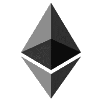
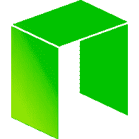

# 从以太坊到无限。符合社区要求的功能智能合同

> 原文：<https://medium.com/hackernoon/from-ethereum-to-infinity-functional-smart-contracts-compliance-with-community-requirements-c5bc05eccc48>

有什么比自动化流程更好的方式来消除中介、官僚作风并节省整个企业预算呢？只有经过良好调整的算法才能正常工作并保证执行。

以太坊平台向世界开放了智能合约，向人类呈现了新一代区块链。

应该认识到，在以太坊虚拟机上创建的智能合约远非理想，因此今天我们将了解以下内容:

*   什么是智能合约；
*   已知哪些漏洞；
*   以太坊平台有什么替代品吗？

# 通用智能合同理解

简而言之，智能合同是自动执行的不变合同义务，以电子协议形式呈现，使用计算机代码编写。

智能合同的目的是确保双方达成的交易得以执行，在此过程中完全没有人为干预。当然，每份协议的基础都是信任，因此，如果参与其中的至少一方不确定对方是否会履行自己的义务，交易就无法执行。在编制标准文件时，律师的参与是不言而喻的，因为他们提供安全的交易，然而，这种程序格式需要额外的时间和金钱支出。

反过来，智能合同的使用完全消除了交易过程中的调解，提供了一个值得信赖的背景和促进资产交换程序。

由于智能合约存在于分散系统中，因此它必须在指定的时间框架内以独立、确定的方式运行。

创建智能合约最著名的平台是以太坊、EOS、Stellar、Cardano、NEO 和 Waves。

## 确定性智能合同

一个算法被称为确定性的，如果它总是完全相同地执行，并产生相同的预定义结果，服从相同的输入数据集。

决定论这个术语可以在一个最简单的例子上解释清楚:5 + 1 = 6，其中 5 + 1 是输入数据，6 是它的结果。即引入一个 5 + 1 的例子，每次都会显示相同的结果— 6(是预定义的，总是相同的)。

因此，如果程序在不同的设备上产生相同的输入数据集，那么该算法可以被称为确定性的。

同时，例如，如果调用非确定性函数、使用非确定性数据或进行动态调用，则存在算法确定性不一致的可能性。

## 在明确规定的期限内执行

在 20 世纪初，Alan Turing 指出，可以预先确定在某个时间算法执行的完成。

未能执行智能合同是它们进入无休止循环的主要原因，也是唯一原因。

但是，有几种方法可以避免这种漏洞。

*   **图灵——不完整。**

在这种情况下，使用有限的功能，因此将不执行循环。

*   **柜台**

安装的附加功能可以控制一定数量命令的执行。当达到最大可用步数时，算法将不得不重新开始。

*   **定时器**

如果智能合约没有在明确指定的时间内执行，则强制停止。

## 隔离

众所周知，每个人都有机会在任何支持这一功能的公共区块链中编写和部署自己的智能契约。与此同时，并非所有智能合同都写得完美无缺，数百甚至数千份数字合同都包含病毒和错误。如果易受攻击的契约不是孤立的，那么不仅仅是它，整个系统都可能处于危险之中。

# **以太坊智能合约最常见的问题**

**代码漏洞**

当使用模板并考虑在以太坊平台上创建智能合约的简单性时，会出现新合约创建者接管先前创建的合约的错误的情况。

**语言障碍**

总部位于 EVM 的智能合约所使用的语言“稳健”出现在不久前。由于它的年轻，它有一些缺陷。例如，由于一些构造的不可读，开发人员经常会在代码中出现错误，因此，智能合约的安全性可能仍然是一个大问题。

**概念问题**

不幸的是，主要问题甚至不是智能合同的技术实现。项目创建者并不总是意识到他们需要智能合同的目的，他们甚至不知道他们的可能性以及智能合同永远不能做什么。

# **对比平台特征**

# **以太坊**

第一个使用智能合约开发分散式应用程序的平台，能够创建您自己的智能合约，提供可由开发人员根据其目标实现情况进行更改的模板。

**编程语言** : Solidity，Serpent，Mutan，LLL

**缺点**:

*   启动后无法进行修改。如果在以太坊上创建的智能契约不能正确执行，开发者将无法修复它。唯一的出路就是推出新的数字合约。
*   难以确定出错的具体位置。如果智能合约不能正常工作，开发人员将无法看到代码中的错误。
*   智能合约进入无限循环时的气体浪费。如果智能合同没有完成，它将被启动无限次，直到开发商账户上需要支付的天然气量结束。

# **EOS**

一个与以太坊竞争的平台，其创造者是 BitShares 和 Steemit 开发者。EOS 使用石墨烯技术，内置共识机制和委托信任(DPOS)。在 EOS 中，块生产者有特权从网络中排除一个不方便的合同或纠正他们自己发现的任何错误。

**编程语言**:с++。

**缺点**:

*   网络分散化不足，因为 21 个参与者影响了 EOS 网络。DPoS 算法限制了其他用户参与变更介绍的能力；
*   无法即时跟踪脆弱时刻。

# **恒星**

该网络是涟漪分叉的结果，用于货币交易。在 Stellar 智能合同中，实现多重签名、事务原子性和时间约束的可能性被实现。

**编程语言:** PHP、JavaScript、Golang、Python

**缺点**:

*   与以太坊相比，智能合约的灵活性不足

# **卡尔达诺**

两级区块链平台，能够创建灵活、安全的智能合同。

编程语言:Haskell

**缺点**:

*   该平台尚未完全投入使用，因为它还处于早期开发阶段。

# **尼奥**

这是第一个开源智能资产平台，也是整个区块链项目。

**编程语言:** C #，Java，Go，Python

**缺点**:

*   应用程序隔离不足。在 NEO 令牌标准之一的资产中发现的威胁已经危及该标准的所有其他令牌的用户。

# **波浪**

内置 LPoS(租赁你的资产的共识算法)的区块链平台。Waves 智能合约即将完成。

**编程语言** : RIDE，RIDEON

**缺点**:

*   由于最近的主网发布，Waves 智能合约功能尚未完全测试。

# **结论**

本文揭示了智能合约的主要功能特性和需求。同时，通过初步了解在以太坊虚拟机上引入智能合约的问题，可以追溯所开发平台的演变。随着新解决方案的推出，关键漏洞得以根除。本地的竞争和制造一个体面的、被要求的产品的愿望迫使开发人员越来越多地工作，积极地工作在他们自己和他人的错误上。这就是从个体到群体的进化过程，每一个版本都在改进技术。