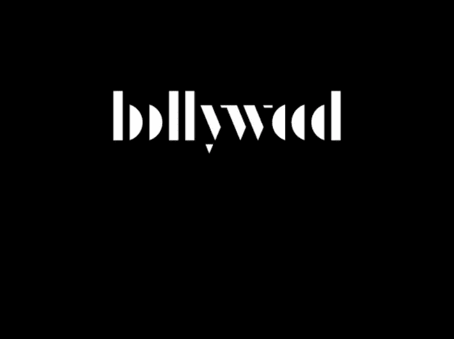

# 创业公司和电视节目:重叠的世界🎥

> 原文：<https://medium.com/hackernoon/from-silicon-valley-to-bollywood-402c1a1cdcc3>

我一直对投资创业公司和制作电视节目之间的许多相似之处感到惊讶。去年夏天，我从投资和建立初创公司转型到经营一家长篇内容公司。在过去的一年里，我建立了一个创意团队，领导了 6 个网络系列的脚本，制作了 4 个节目，并建立了 15+个想法的管道，我们正在积极地向平台推销。