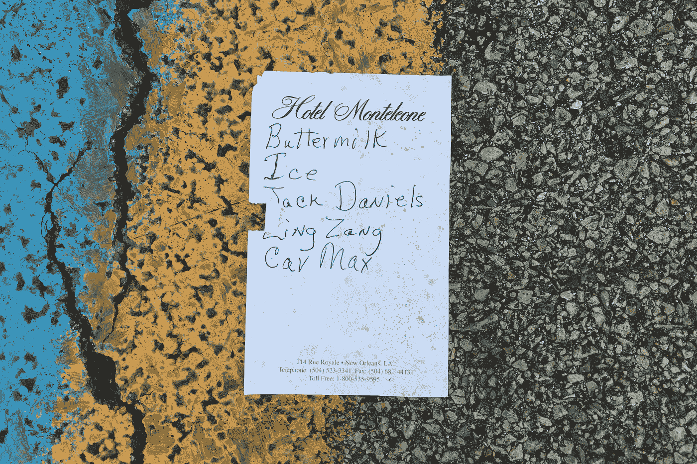
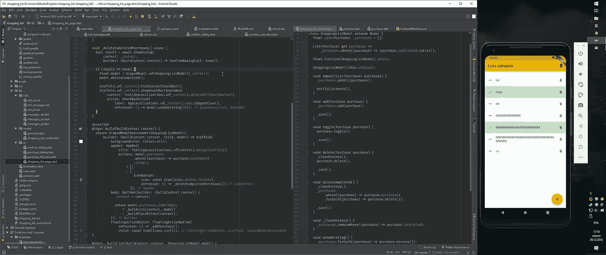
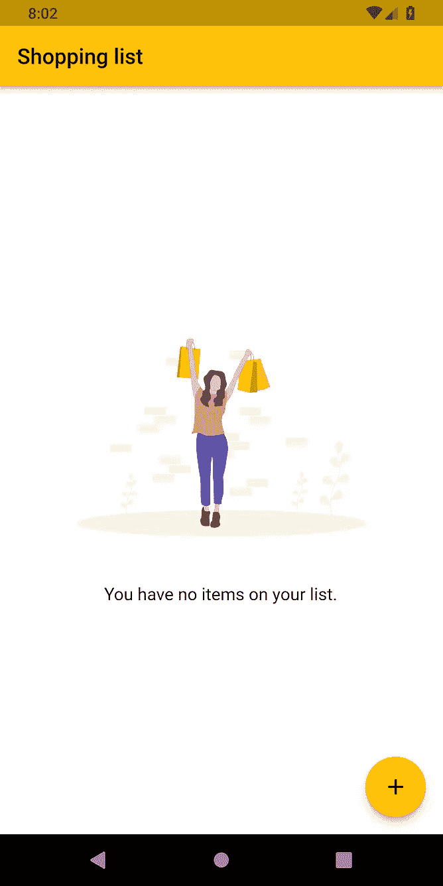
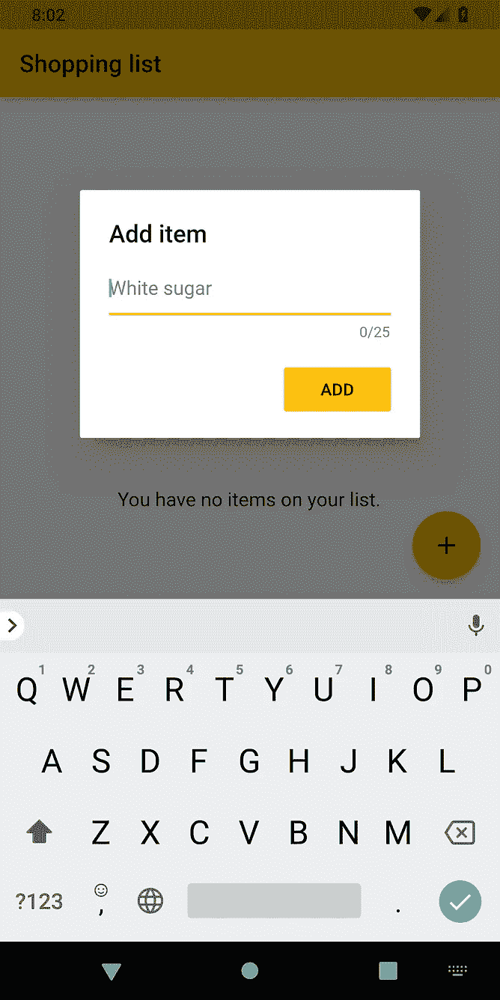
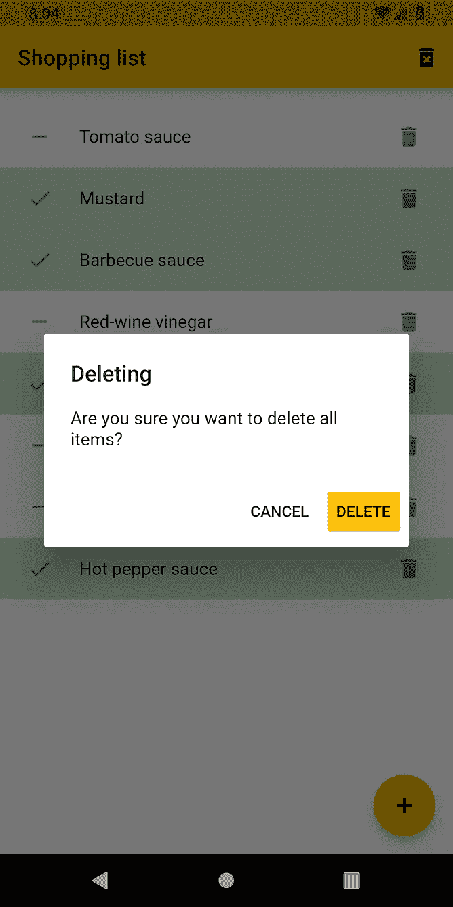
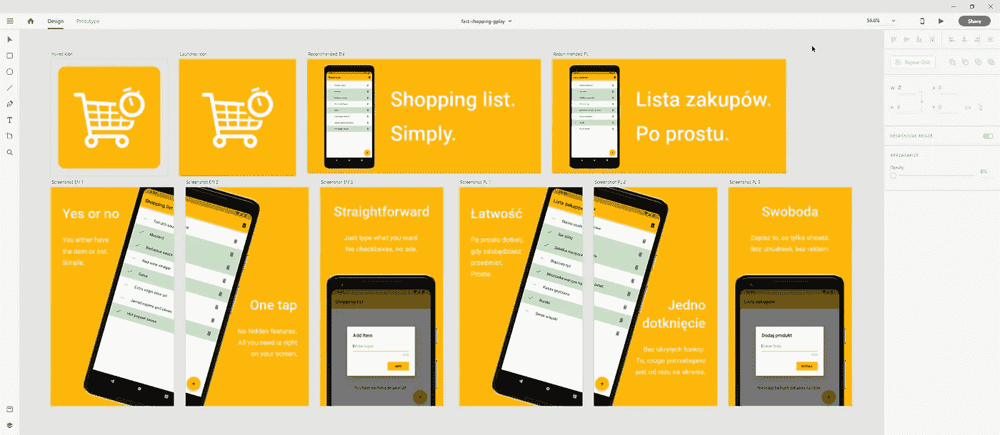
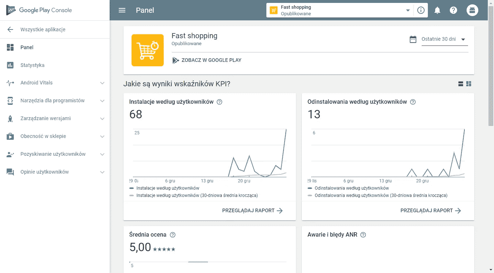

# 从解决问题到用 Flutter 在 Google Play 上发布

> 原文：<https://medium.com/hackernoon/from-solving-a-problem-to-google-play-publishing-with-flutter-e0b4716c2394>

当我对 Flutter 感兴趣的时候，我正在寻找一个简单的应用程序来解决问题。

> 这篇文章是写完第一行代码两周后的回顾。

# 问题

首先，我们需要解决一个问题。

我和妈妈在市场购物。我们在为即将到来的圣诞节买些东西。她在一张纸上列出了要购买的产品清单。除了一个例外，一切都没问题。在篮子里放了一些产品后，我意识到我们已经从市场的一端到另一端好几次了。我看了这份清单，发现了问题所在。

Photo by [Joshua Rawson-Harris](https://unsplash.com/@joshrh19?utm_source=medium&utm_medium=referral) on [Unsplash](https://unsplash.com?utm_source=medium&utm_medium=referral)

这份清单写得不太好，阅读它需要一些努力。因此，不可能很快地看一下清单上的所有项目，并在你看到它们的时候就把它们放进篮子里。每次收集完一件商品后，你都必须阅读清单，因为你不会自动记住清单上的其他东西。

此外，你应该永远记得带着这个清单。如果你碰巧忘记了，那你就有问题了。你要么试着提醒自己里面是什么，要么打电话给家里的人把它寄给你。

我观察到的最后一个问题是看什么已经在篮子里，什么没有。我敢打赌，你没有带笔来检查或划掉已经收集的项目。正因为如此，你不时地查看你的清单，看看你已经拥有了什么，还需要什么。这会分散你购物的注意力，浪费你的时间。

# 想法

我解决这些问题的想法非常简单。简单的想法是最好的。

> 我妈妈需要一份清晰易读的购物清单。

Photo by [David Ballew](https://unsplash.com/@daveballew?utm_source=medium&utm_medium=referral) on [Unsplash](https://unsplash.com?utm_source=medium&utm_medium=referral)

就是这样。问题的根源是阅读列表并确保总是带着它所需要的努力。如果列表易于阅读，你会把注意力集中在收集列表中的条目，而不是列表本身。

简单直观的控件也有助于区分篮子中已经存在的项目和尚未收集的项目。

所有这些都可以通过使用解决所有问题的移动应用程序来轻松解决。

# 履行

我需要创建一个应用程序。第一，这将是非常容易使用，直观，清晰，而不是压倒一切。

说到技术，答案很简单。我选择了颤动。我需要简单的功能。只有一个屏幕和两个对话框。

*   显示所有项目的屏幕。
*   允许您添加新项目的对话框。
*   确认您要删除项目的对话框。

My development suite.

我实现了这个东西。唯一的一个屏幕由一个显示`ListTile`中每个项目的`ListView`组成。点击它将使主要图标从破折号变为复选标记，并将磁贴的背景更改为绿色。再次点击则相反。尾随窗口小部件是一个移除`IconButton`，在对话框中确认后，从列表中删除该项目。除此之外，还有一个`FloatingActionButton`负责显示添加新项目对话框。

在列表为空的情况下，会显示一个未绘制的插图。

项目被保存在应用程序状态的列表中。每次操作后，列表都会以 JSON 的形式保存到 Shared Preferences 中，并在应用程序启动时加载。

之后，我实现了本地化，因为我希望这个应用程序是我的母语(波兰语)和英语。这篇文章帮助了我。

 [## 颤振—本地化:一步一步来

### 如果你正在读这篇文章，你可能已经知道制作国际化应用的好处，比如扩展你的…

proandroiddev.com](https://proandroiddev.com/flutter-localization-step-by-step-30f95d06018d) 

就应用程序本身而言，就是这样。我创建了启动器图标(白色背景上的橙色文本)并在 Google Play 控制台中编写了文本。我把它发布到阿尔法频道，发给几个朋友，等待他们的反馈。他们没有遇到任何问题，喜欢它的简单性。

我发布了第一个生产版本。我让我的同学测试了一下，然后给我妈妈看。我的同学和我妈妈都喜欢它。嗯，她对此感到惊讶，*强迫*她的同事也下载了它。😁

我一点也不喜欢这个应用的截图和启动图标。当我有时间的时候，我在 Adobe Xd 中玩了一会儿模型、图标和文本，想出了一些像样的图标和新的“截图”。我把 Iconfinder 上的两个免费的商业用图标结合起来，制作了 Google Play 和启动器图标。“截图”包含我在网上找到的免费使用谷歌像素 2 XL 样机。我发布了 1.0.1 版本，更新了启动器图标。

Adobe Xd showing all my graphics for Google Play.

几天后，我想到了可以添加的新功能。该应用程序必须像以前一样简单，但有一些小问题。我妈妈向我解释说，有一次她检查了一些完整的项目，她点击了*删除所有*的想法，这将只删除选中的项目，但她丢失了她的整个列表。

我将*删除所有*按钮的效果改为*删除完成*，因为我认为这是更直观的行为。我还添加了一个*撤销*功能。在你删除一个项目(或所有完成的项目)后，一个 snackbar 会弹出几秒钟告诉你，并显示一个*撤销*按钮。

在引擎盖下，我重新实现了产品如何存储在内存中。我将使用状态重构为使用`ScopedModel`。之后，我发布了 1.1.0 版本，这是目前该应用程序的最新版本。

可以下载 app 自己查看一下！

 [## 快速购物 Google Play 上的应用

### 当你列购物清单时，你需要简单。当你看你的购物清单时，你需要清晰。快速…

play.google.com](https://play.google.com/store/apps/details?id=me.wolszon.fastshopping) 

几天后下载统计并没有那么糟糕。我仍在寻找向更广泛的受众推广我的应用的方法。

你也可以在 GitHub 上找到源代码，欢迎明星。😏

 [## Albert 221/快速购物

### 简单的应用程序，方便每个人制作购物清单。—Albert 221/快速购物

github.com](https://github.com/Albert221/FastShopping)