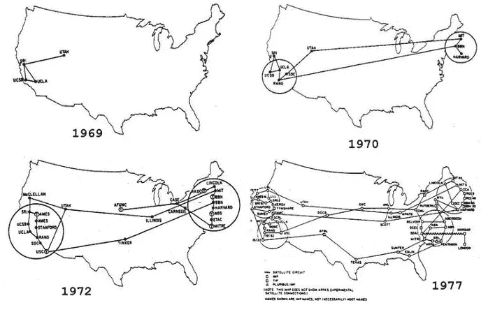
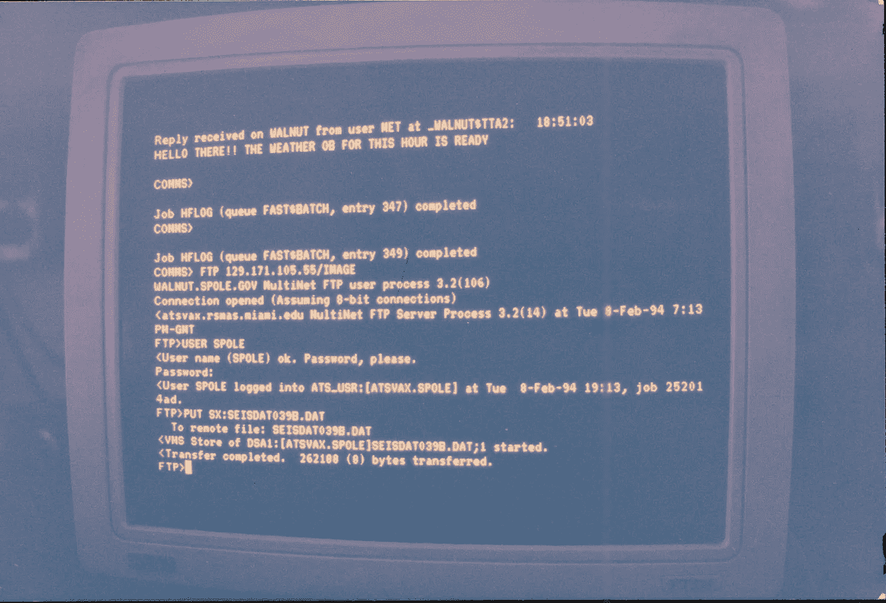
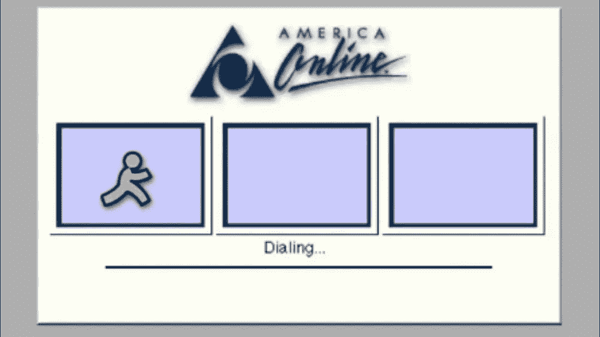
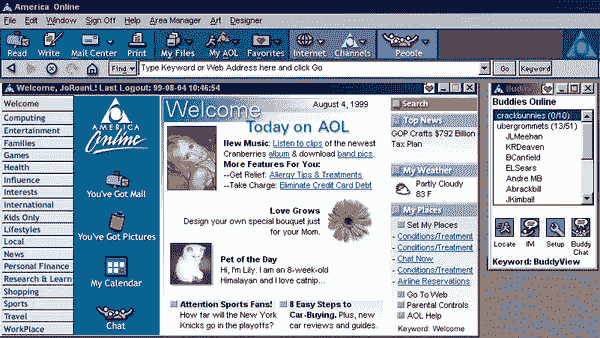
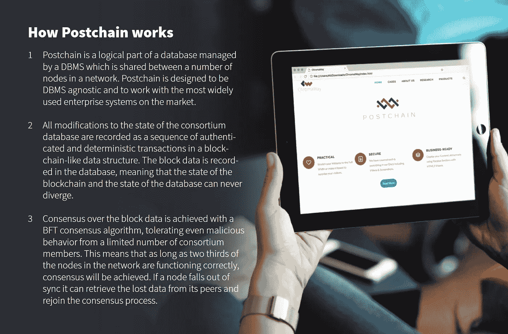

# 从 Web 0.1 到 Web 3.0:一家公司如何计划大规模采用 dApps

> 原文：<https://medium.com/hackernoon/from-web-0-1-to-web-3-0-how-chromia-plans-to-bring-mass-adoption-to-dapps-5de660a07853>

关系数据库，以其通用 SQL(结构化查询语言)而闻名，无疑将枯燥、静态的互联网推向了一个欣欣向荣的全球信息交换网络。当我们开始冒险进入令人兴奋的 Web 3.0 时代时，项目现在正期待**关系型区块链**迎来下一个去中心化 Web 时代。

# 正如我们今天所知，关系数据库是如何塑造网络的

关系数据库并不是在 20 世纪 90 年代和 21 世纪初的互联网热潮中构想的新概念。IBM 在 1974 年将第一个关系系统数据库概念化，称为 System R，这比互联网开始获得牵引力早了几十年。System R 是 SQL 的第一个实现，其基本但重要的操作称为 CRUD:创建、读取、更新和删除。这四个简单的操作将在未来几十年改变世界，催生无数的 RDBMS(关系数据库管理系统)。

## web 0.1——互联网的诞生

ARPANET’s Growth Over a Decade

大多数从事科技/ [区块链产业](https://lunardigitalassets.com/consulting-blockchain-crypto/)的人可能听说过 ARPANET——第一个“互联网”基本上是四台大学计算机组成的网络，它们可以相互发送信息。

随着时间的推移，更多的大学和机构加入了网络，奠定了从 TCP/IP 到 HTTP 的互联网发展的基础。不可否认，网络很难使用，也不美观，UI/UX 在当时甚至还不是一个研究领域。在早期阶段，几乎所有的东西都是基于命令行的，对于那些不熟悉这些他们称之为计算机的巨型机器的人来说，这是一种威胁。

Linux CLI’s got nothing on ARPANET

## Web 1.0 —静态、非交互式的信息交换媒介

随着个人家用电脑和拨号上网的兴起，事情开始变得有趣起来……算是吧。20 世纪 90 年代真正开启了互联网主流应用的开端，令人兴奋的图形用户界面(GUI)和消费者几乎可以即时向少数早期用户的朋友和亲戚发送电子邮件的能力。每个家庭都被 AOL 的“免费试用”CD 轰炸，拨号调制解调器连接到互联网的独特噪音以及“你有邮件！”时至今日，声波已经深入到了每一个互联网用户的心中。

在互联网上你没什么可做的。有几个新闻网站，一些链接目录，聊天室，电子邮件，当然还有色情和地理城市。尽管如此，互联网继续发展。

## Web 2.0 —动态、交互式网站！

长话短说，Javascript、Macromedia Flash 和标准化 web 标准等技术的快速发展导致了互联网领域令人难以置信的变化。时至今日，这些技术(有些已经退役——RIP Flash)正以令人难以置信的速度得到改进，这主要归功于开源软件的概念。

然而，这个难题有一个重要的部分基本上保持不变，可以说是对 Web 2.0 发展帮助最大的部分——关系数据库。PHP 和 MySQL 主导了 Web 2.0 的早期，直到今天仍然如此。让我们快速浏览一下早期我们最喜欢的网站和软件:

*   Xanga — PHP 和 MySQL
*   新理由— PHP 和 MySQL
*   DeviantArt — PHP 和 MySQL
*   Photobucket — PHP 和 MySQL
*   添加游戏— PHP 和 MySQL
*   所有你喜欢的论坛(vBulletin，phpBB，SMF)——所有 PHP 和 MySQL

关系数据库，特别是 MySQL，完全改变了这一局面，至今仍是最主要的 RDBMS。关系数据库将数据组织成表，表中包含列和行，用唯一的键标识每条记录。这为数据的存储、更新和检索提供了简单、高效和合理的方式。如果没有这项看似简单，但如此强大的数据存储技术，今天的互联网将会完全不同。

# web 3.0——大规模采用分散式应用的竞赛

我们都同意，区块链技术不仅对技术世界，而且对各行各业都是一份神奇而迷人的礼物。然而，当涉及到某些事情时，不可否认存在不足之处。

根据定义，区块链是网络参与者商定的不可改变的分类账，其中记录了所有交易。这对于某些用例来说很棒，但是对于其他用例来说可能会很笨重。这些区块链可能会变得非常大([比特币的](https://lunardigitalassets.com/tag/bitcoin/)接近 160 GB)，检索数据可能会很慢，成本很高，而且效率非常低。如果像 CryptoKitties 这样的单个 dapp 可以使网络陷入瘫痪，那么该网络就没有准备好大规模采用 dApp。

现在，让我们后退一步，提醒自己 Web 2.0 为什么以及如何快速发展。**关系数据库。**网站和用户几乎可以即时存储、更新、删除和访问他们需要的确切数据。为了使 dApps 真正成为主流，区块链工业需要类似或更好的方法来达到这些结果。

## 关系区块链的诞生

是的，你没看错——关系区块链。ChromaWay 是一家瑞典公司，自 2013 年以来以其区块链研究和人道主义努力而闻名。去年，该公司取得了巨大的突破，开发了世界上第一个名为 Postchain 的关系区块链。

Postchain 是关系数据库和区块链的结合，后者基于 SQL，灵活、安全且易于使用。换句话说，它提供了两个世界的精华。

[克劳莉娅](https://chromapolis.com)将于 5 月 28 日在 Kucoin 的聚光灯下推出其 [IEO，它利用 Postchain 和 Rell(一种简化的查询和编程语言)作为其主干，允许没有区块链开发经验的开发者轻松创建 dapp，不仅可扩展，而且非常灵活，熟悉常规应用开发。](https://www.kucoin.com/news/en-announcement-of-chromia-chr-token-sale-on-kucoin-spotlight)

克劳莉娅网络拥有令人印象深刻的接近实时的 1 秒确认时间，每个 dApp 每秒 500 多个交易，使用 Postchain 每秒 100K 多个读/写更新。它还为开发者提供了如何货币化(或不货币化)dApp 的自由，允许他们从经典模式、订阅模式、免费增值模式、补贴模式、基于捐赠的模式等中进行选择。

在首席技术官 Alex Mizrahi 的带领下——他是第一个通过彩色硬币项目在比特币上标记资产的人，并随后启发 Vitalik Buterin 开始了[以太坊](https://lunardigitalassets.com/tag/ethereum)项目——克劳莉娅团队在区块链开发和研究方面拥有数十年的综合经验。克劳莉娅的母公司 ChromaWay 有一个令人印象深刻的顾问名单，包括 Litecoin 的查理·李和思域的文尼·林厄姆。

*最初发布于* [*农历数字资产*](https://lunardigitalassets.com/insights/project-analysis/web-3-0-how-chromia-plans-to-bring-mass-adoption-to-dapps/) *。*