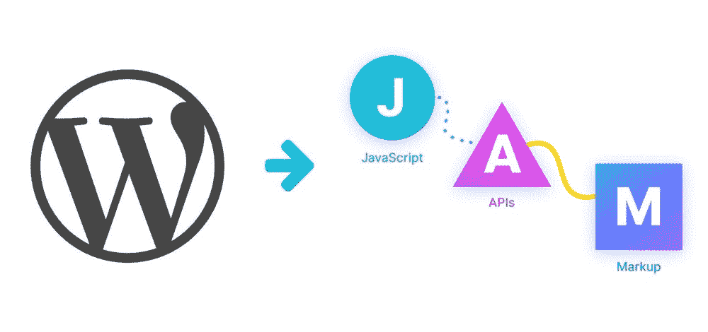
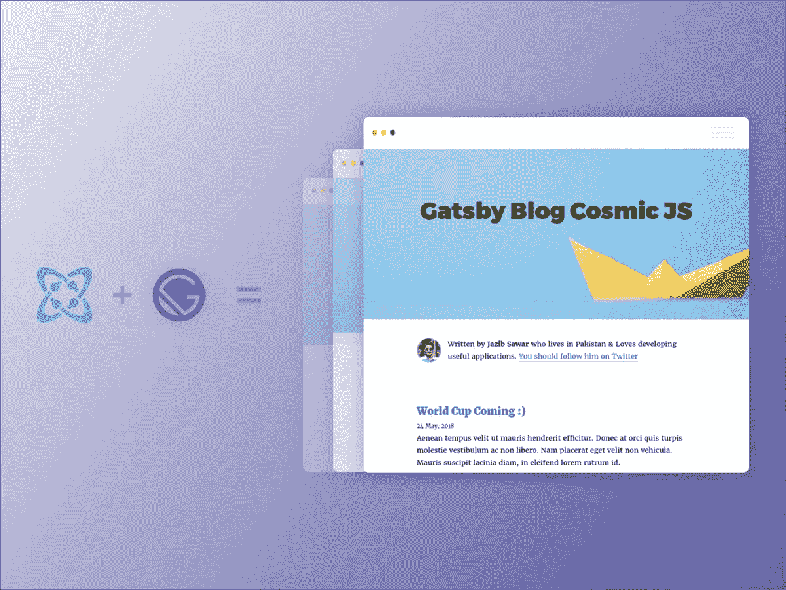
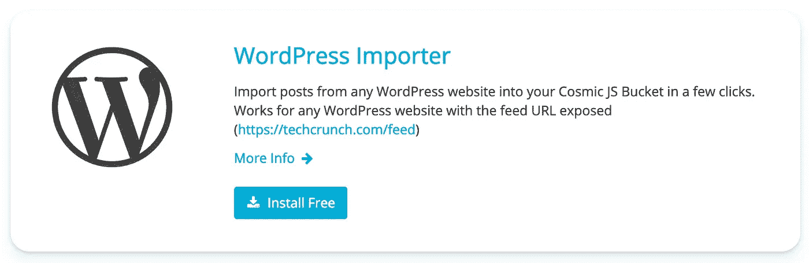
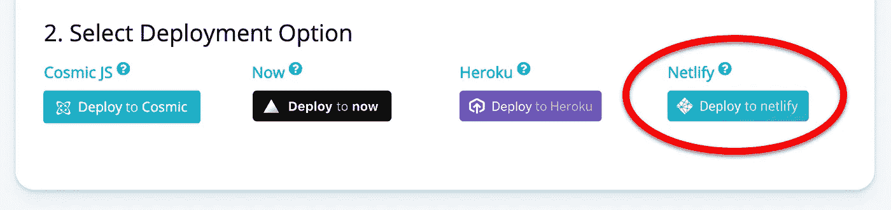
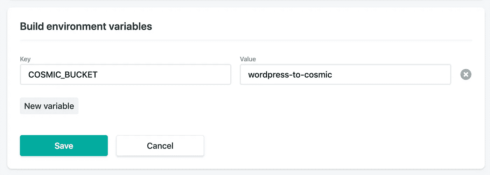
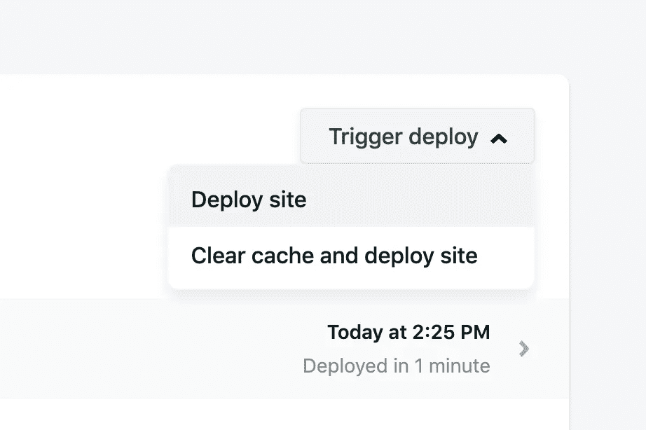
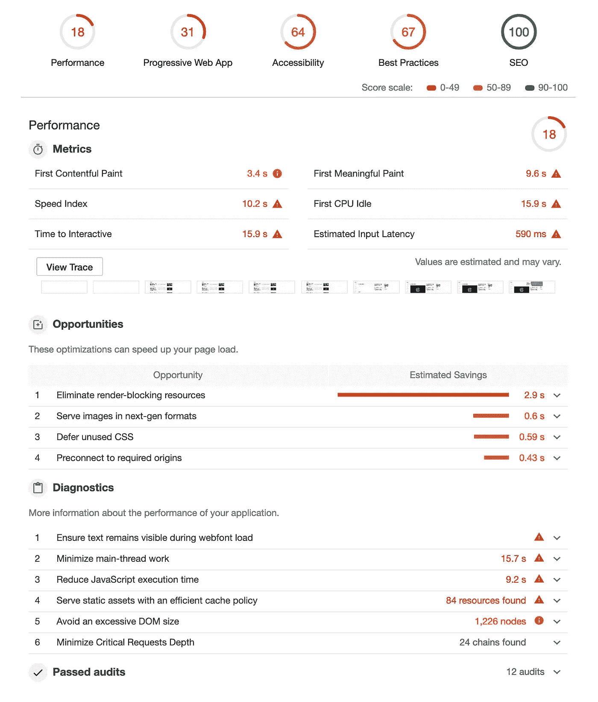
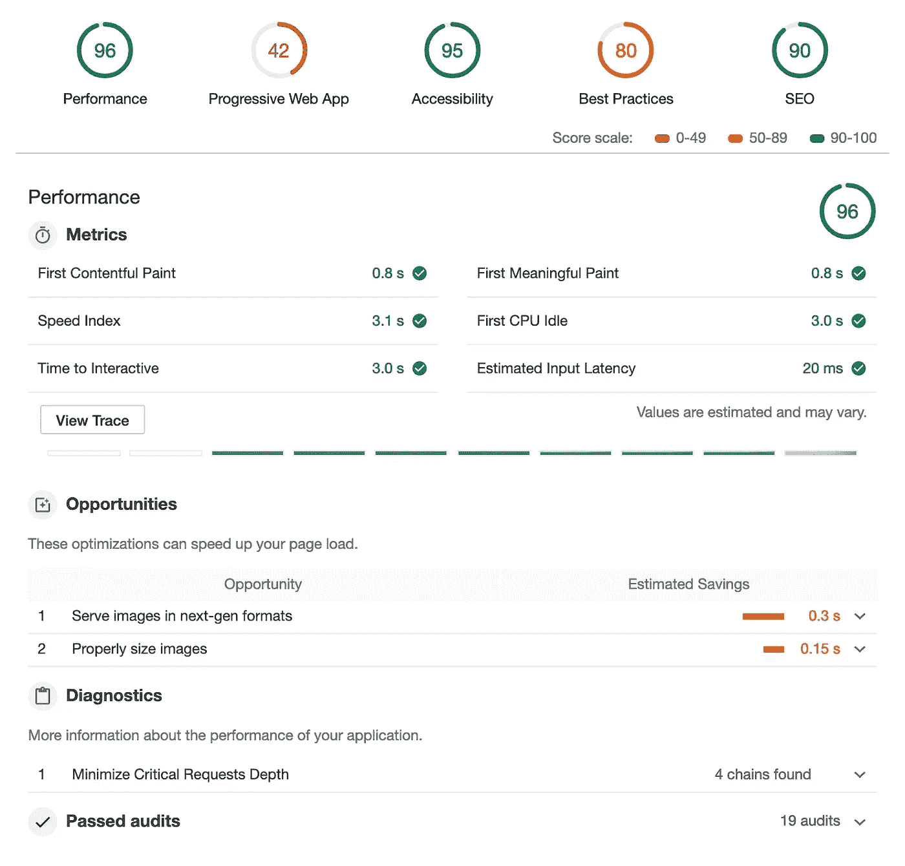

# 从 WordPress 到 JAMstack:如何让你的网站快 10 倍

> 原文：<https://medium.com/hackernoon/from-wordpress-to-jamstack-how-to-make-your-website-10x-faster-e363abc46e2d>

性能很重要。如果你熟悉 [JAMstack](https://jamstack.org/) ，这一运动鼓励完全避免服务器端渲染，支持预构建的纯静态 HTML 页面。通过在 CDN 上只提供 JavaScript、API 和 Markdown (JAM ),网站的性能显著提高，从而带来更好的用户体验。

如果你有一个现有的 WordPress 网站，你可能对缓慢的页面加载很熟悉。这可能是由于服务器端的进程甚至在到达 HTML 之前就发生了。如果你想为你的用户带来更好的体验，现在是时候转到 JAMstack 网站了。做出改变可能比你想象的要容易。

在本教程中，我们将把现有的 WordPress 内容导入 JAMstack 网站，部署到 [Netlify](https://www.netlify.com/) ，然后对两个版本进行 Lighthouse 测试，以确定是否有任何显著的性能提升。(提示:有😁)

# TL；速度三角形定位法(dead reckoning)

1.安装[盖茨比博客](https://cosmicjs.com/apps/gatsby-blog)，一个现成的 JAMstack 网站，由盖茨比和[宇宙 JS 无头 CMS](https://cosmicjs.com/) 提供支持。
2。使用 [WordPress 导入器](https://cosmicjs.com/extensions/wordpress-importer)将现有的 WordPress 文章导入到 Cosmic JS 中。
3。将 Cosmic-powered 网站部署到[网络。](https://www.netlify.com/)

# 入门指南

首先，我们需要安装在宇宙 JS 应用市场上的 [Gatsby 博客](https://cosmicjs.com/apps/gatsby-blog)。

在我们将应用程序安装到一个新的桶之后，我们需要安装 [WordPress 导入器扩展](https://cosmicjs.com/extensions/wordpress-importer)。这可以通过导航到*你的桶>设置> WordPress 导入器*找到。

按照扩展中的指示导入你的 WordPress 文章。

导入你的文章后，你会看到我们的文章对象类型现在包括了导入的 WordPress 文章，这很容易！现在让我们展开这个吸盘。

# 部署🚀

有几个选项来部署我们的网站位于*桶>设置>部署*。我们将继续部署到 [Netlify](https://www.netlify.com/) ，因为他们已经完善了 JAMstack 托管的艺术，加上[他们发明了 JAMstack 术语来帮助我们理解这个概念](https://www.netlify.com/blog/2019/01/17/the-importance-of-developer-experience-with-github-founder-tom-preston-werner/)。

在我们将我们的 [Gatsby 博客 GitHub repo](https://github.com/cosmicjs/gatsby-blog-cosmicjs) 添加到 Netlify 之后，我们需要在 Netlify 中设置我们的环境变量，以便在部署之前连接到 Cosmic JS。转到*站点设置>构建和部署*将环境变量`COSMIC_BUCKET`的值设置为您的 Bucket slug。如果您在存储桶设置中设置了读取键，请在此处也将其添加为`COSMIC_READ_KEY`。

现在转到部署选项卡并触发部署🚀🚀🚀

# 比较🧐

现在我们新的 JAMstack 网站已经部署好了，让我们比较一下旧的 WordPress 网站和新的 Cosmic-powered JAMstack 网站的性能。打开 Chrome 控制台，在每个网站上运行 [Lighthouse](https://developers.google.com/web/tools/lighthouse/) 测试。看看下面的结果(虽然设计不同，但页面上的帖子数量大致相同)。

**WordPress TechCrunch**
[**https://techcrunch.com**](https://techcrunch.com/)

【https://wordpress-to-cosmic.netlify.com 盖茨比

****

**正如你在运行 Lighthouse 测试后所看到的，我们的宇宙动力 Gatsby JAMstack 网站大大提升了 WordPress 网站的性能。检查一下 JAMstack 版本上页面之间的过渡🔥**

# **结论**

**我希望你喜欢这篇关于我们如何通过从 WordPress 转移到一个宇宙 JS 支持的 JAMstack 网站来建立一个显著更快的网络体验的教程。亲自尝试一下，你可能会惊讶地发现做出改变是多么容易。你的用户会感谢你的。**

**加入围绕 API 驱动的内容管理、JAMstack 和 Slack 上的新网络技术[的对话](https://cosmicjs.com/community)和 Twitter 上的[联系 Cosmic JS](https://twitter.com/cosmic_js)。**