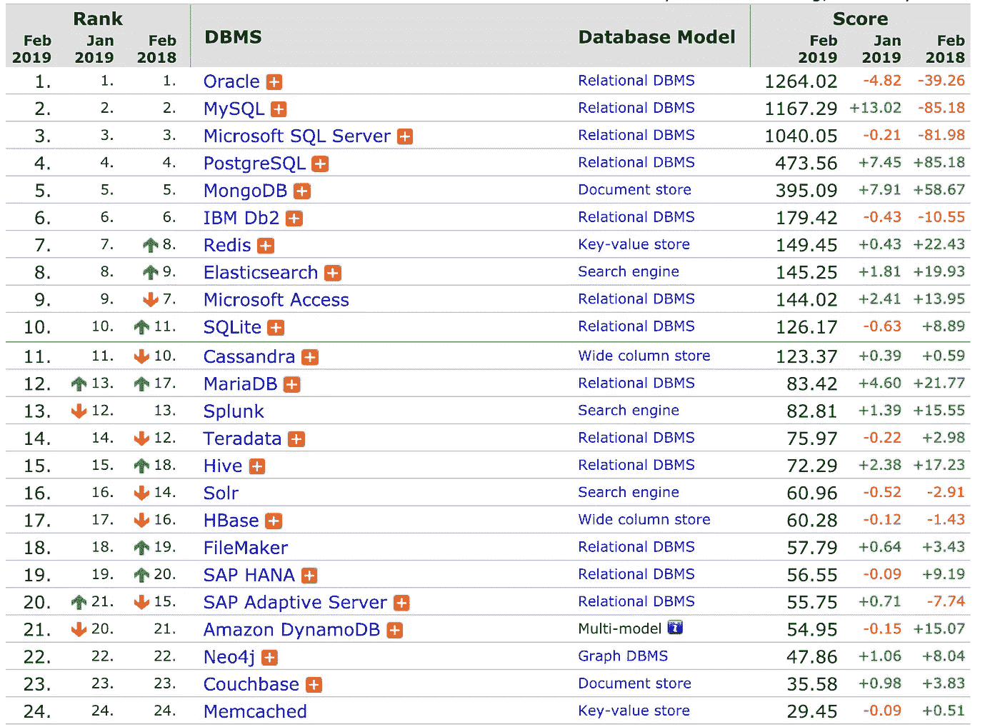
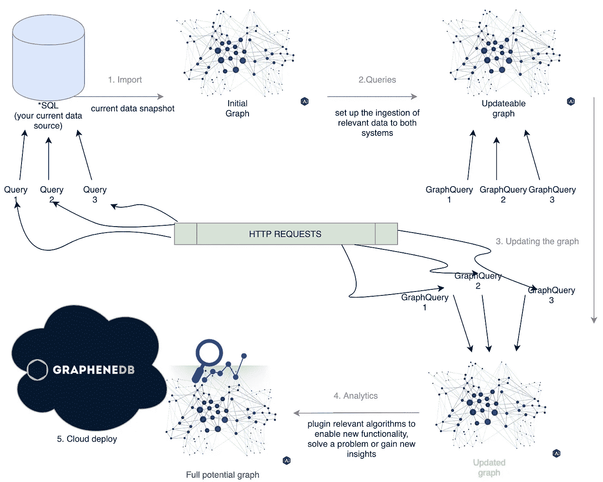
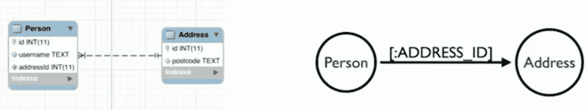
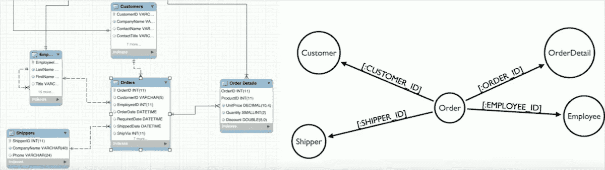

# 从零到图英雄，5 天 5 步

> 原文：<https://medium.com/hackernoon/from-zero-to-graph-hero-in-5-days-and-5-steps-34a1853b75c8>

分享我的图形数据库项目剧本。很乐意回答任何问题或提供建议。

问 Siri 谁是纽约喷气机队的四分卫，你马上就会得到当前四分卫的名单。问 Siri 谁是泰勒斯威夫特的男朋友，它就知道了。

问谁是爱尔兰乐队酋长乐队的成员，Siri 不知道。即使你问爱尔兰乐队 U2 的成员是谁，它也不知道。它可以给你提供关于 Bono 的信息，但是不知道 U2 的成员。

不过，谷歌助手知道回答上面的问题。你能猜到发生了什么吗？

尽管图表的年增长率接近 50%，但该技术只占数据库市场份额的一小部分。然而，它的功能、灵活性和开发速度都是数一数二的。更好的是，它引领了我所使用过的任何其他系统都无法掌控的用例。

Source: [https://db-engines.com/en/ranking](https://db-engines.com/en/ranking)

作为过去 7 年的独立顾问，我制作了一本剧本，可以帮助你在 5 天内掌握图表的力量。把它想象成一个高性能的工厂。下面，你会找到需要的步骤以及如何去做。

让我们看看你的公司或产品如何利用这项技术。你能经历的步骤是什么，在这个过程的最后你能期待什么样的结果？

## 概观

1.  导入您当前的数据
2.  基本查询
3.  处理数据重复
4.  网络分析/高级图形算法
5.  部署

## 1.导入

你已经有一个或几个数据库(mysql/postgresql，mongodb，Cassandra 等。).此阶段的目标是探索数据的当前结构，并将其转换为图表。这个阶段的一部分也被称为 ETL(提取-转换-加载)。

如果与外部顾问合作，在移交之前，确保加密/混淆敏感数据并准备好 NDA。

使用正确的工具，这可以在一天之内完成。当然，实际加载图表中的数据可能会随时间而变化。对于每 10GB，预计让系统运行大约 30 分钟。很少需要导入所有的数据，所以在开始工作之前进行良好的沟通会有很大的帮助。

From 2 tables in a relational database, to nodes and relationships in a graph database.

副作用:非技术人员可以理解数据的结构，因为图形数据库对白板非常友好。

## 2.基本查询

我们需要保持新数据的同步，因此我们需要将现有的创建、更新或删除表格数据库系统中的项目的操作连接到新的图形数据库。

在这一步中，我们简单地评估您当前的 SQL 查询，并将它们转换成 Cypher。

这一步通常会激发一些美好的顿悟时刻。在表格视图中不可能的事情(实时地在一行中进行 5 次连接)现在是非常容易实现的。

如果我们谈论的是 10 个查询和 4 个需要将数据导向图的管道，这可以在一天内完成。否则，可能会有所不同。

**测试**可以通过并行运行两个系统来完成。让我们将这两个数据库命名为 SQL1 和 Neo2。以下是测试这一步是否正确的方法:

1.  从 SQL1 导入到 Neo2。
2.  对两个系统应用一系列查询。示例:Query1、Query2、Query1 到 SQL1 和 GraphQuery1、GraphQuery2、GraphQuery1 到 Neo2。
3.  将 SQL1 导入 Neo2。断言两个数据库包含相同的数据。

**基准测试**这两个系统将证明哪一个能更好地处理特定的查询。一些以前 SQL 无法实现的功能将在 Cypher 中实现。

**副作用奖励**:对图形工作原理的理解。第一批新的可能性开始显现。

## 3.数据复制

获取步骤 2 中的查询，并将它们连接到您当前的系统。这些可能是在微服务、数据库触发器等中处理 http 调用的方法。

一定要使用线程或一些异步机制，这样数据提交到数据库的过程是并行的。

提示:如果实时更新 Neo4j 不是优先考虑的事情(使用它进行分析、呈现信息集合、不需要新数据的推荐系统等)，您可以使用较小的数据库实例并使用队列(Kafka、RabbitMQ)来限制更新/使用。

## 4.网络分析和高级图形算法

我在图表上应用了 200 多种算法。是的，这是科学，但这也是关于拥有什么是可能的直觉和知道如何问正确的问题(就像在现实生活中一样)。

在我的咨询项目中，只有一次我不得不从头开始编写一个复杂的算法。通常，在许可的开源许可下，你会找到你需要的一切。

如果您的工程师知道他们在做什么，这可能需要不到 2 天。

为了更深入的了解和直觉，看看[图表数据库的五大有趣应用](/@mihairaulea/top-5-applications-of-graph-databases-b186c3105fd1)。

## 5.部署

**部署到云是当今的热门话题，LinkedIn 预测今年技术人员最热门的技能将是云知识。**LinkedIn 在打造中文版的时候，使用了领先的图谱数据库 Neo4j。他们的结论是，他们能够非常快速地移动，并且不需要数据库管理员。

部署到托管云服务可以在几个小时内完成。部署您自己的管道可能需要几天时间。

最后一个技巧:虽然你不需要管理员，但是你需要一个云部署，我在我的大多数项目中使用了 GrapheneDB。

祝你好运，我希望你构建的新功能能带来天文数字的投资回报。如果你想确定的话，[现在就雇佣我吧](https://mihairaulea.github.io/GraphConsultingServices/)！