# 关于 svm 的整篇文章，从分类到核选择再到离群点检测，用 R 和 python 编写代码

> 原文：<https://medium.com/hackernoon/full-article-on-svm-from-classification-to-kernel-selection-to-outlier-detection-with-code-in-r-7f069fcaf820>

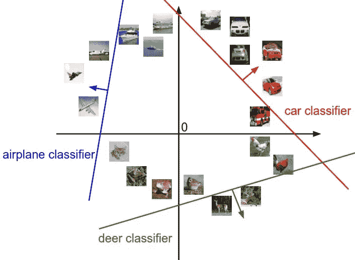

# 基本信息:

**支持向量机**是一套监督学习方法，用于[分类](https://scikit-learn.org/stable/modules/svm.html#svm-classification)、[回归](https://scikit-learn.org/stable/modules/svm.html#svm-regression)和[离群点检测](https://scikit-learn.org/stable/modules/svm.html#svm-outlier-detection)。

支持向量机的优势在于:

*   在高维空间有效。
*   在维数大于样本数的情况下仍然有效。
*   在决策函数中使用训练点的子集(称为支持向量)，因此它也是内存高效的。
*   通用:可以为决策函数指定不同的[内核函数](https://scikit-learn.org/stable/modules/svm.html#svm-kernels)。提供了通用内核，但是也可以指定定制内核。

支持向量机的缺点包括:

*   如果特征的数量远大于样本的数量，在选择[核函数](https://scikit-learn.org/stable/modules/svm.html#svm-kernels)时避免过度拟合，正则项至关重要。
*   支持向量机不直接提供概率估计，而是使用昂贵的五重交叉验证来计算。

sci kit-learn(ML 的 python 包)中的支持向量机既支持密集(`numpy.ndarray`并可通过`numpy.asarray`转换)样本向量，也支持稀疏(【任何】T2)样本向量作为输入。但是，要使用 SVM 对稀疏数据进行预测，它必须适合此类数据。为了获得最佳性能，使用 C 排序的`numpy.ndarray`(密集)或`scipy.sparse.csr_matrix`(稀疏)和`dtype=float64`。

## 什么是支持向量机？

支持向量机算法用于在 N 维空间(N-特征的数量)中寻找超平面，该超平面清楚地分类数据点。

watch this video by caltech’s Professor Yaser Abu-Mostafa to understand the math behind it

支持向量机(SVM)是一种由分离超平面形式定义的判别分类器。换句话说，给定标记的训练数据(监督学习)，算法输出一个分类新例子的最佳超平面。

SVM 模型是将示例表示为空间中的点，通过映射，各个类别的示例被尽可能宽的间隙分开。除了执行线性分类，支持向量机还可以有效地执行非线性分类，将它们的输入隐式地映射到高维特征空间。现在你想知道一个线性专家是如何解决非线性问题的，让我用一个简单的例子来说明，这样你就能明白我懂一些数学。

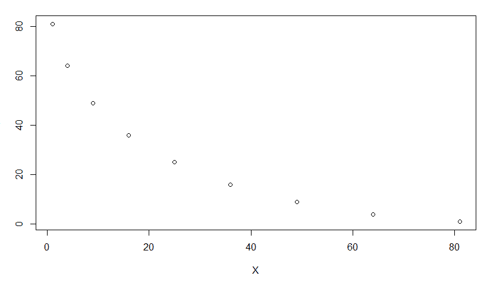

这是一个典型的 x，y 坐标图，在一个 x -y 平面上，但是如果你把这个平面换成另一个平面，这个图就会变成这样

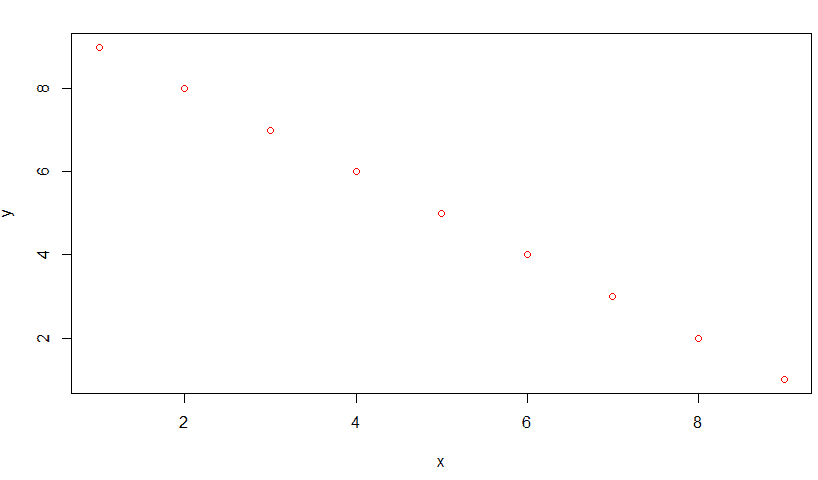

给定一组训练样本，每个样本被标记为属于两个类别中的一个或另一个，SVM 训练算法建立一个模型，将新样本分配给一个类别或另一个类别，使其成为非概率二元线性分类器。

# 超平面:

超平面是帮助分类数据点的决策边界。落在超平面任一侧的数据点可以归属于不同的类别。此外，超平面的维数取决于特征的数量。如果输入特征的数量是 2，那么超平面只是一条线。如果输入特征的数量是 3，则超平面变成二维平面。当特征的数量超过 3 时，变得难以想象。

# Svm 分类器如何工作？

对于由特征集和标签集组成的数据集，SVM 分类器建立模型来预测新示例的类。它将新的示例/数据点分配给其中一个类。如果只有两个类，那么它可以被称为二进制 SVM 分类器。

有两种 SVM 分类器:

1.  **线性 SVM 分类器**
2.  **非线性 SVM 分类器**

## Svm 线性分类器:

在线性分类器模型中，我们假设训练样本在空间中绘制。预计这些数据点之间会有明显的差距。它预测了划分两个类的直超平面。绘制超平面时的主要焦点是最大化从超平面到任一类的最近数据点的距离。画出的超平面称为最大边缘超平面。

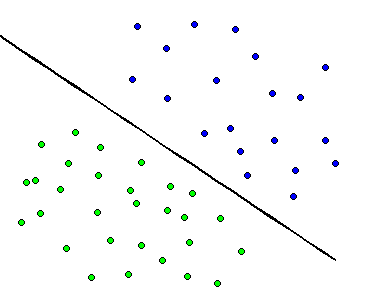

## SVM 非线性分类器；

在现实世界中，我们的数据集通常在一定程度上是分散的。为了解决这个问题，基于直的线性超平面将数据分成不同的类被认为不是一个好的选择。为此，Vapnik 建议通过对最大间隔超平面应用核技巧来创建非线性分类器。在非线性 SVM 分类中，在更高维度空间中绘制的数据点。

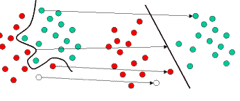

# 线性支持向量机分类器

在线性分类器中，一个数据点被认为是一个 p 维向量(p 数列表),我们使用(p-1)维超平面来分隔点。可以有许多超平面以线性顺序分隔数据，但是最佳超平面被认为是最大化裕度的超平面，裕度即超平面和任一类的最近数据点之间的距离。

最大边际超平面由最接近它的数据点决定。因为我们必须最大化超平面和数据点之间的距离。这些影响我们超平面的数据点被称为支持向量。

# 非线性支持向量机分类器

经常发生的情况是，我们的数据点在 p 维(有限)空间中不是线性可分的。为了解决这个问题，有人提出将 p 维空间映射到一个更高维的空间。我们可以使用核技巧来绘制定制的/非线性的超平面。每个核都有一个非线性核函数。

该函数有助于建立高维特征空间。已经开发了很多内核。一些标准内核是:

1.  **多项式(齐次)核:**多项式核函数可以用上面的表达式来表示。

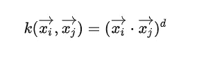

其中 k(xi，xj)是核函数，xi 和 xj 是特征空间的向量，d 是多项式函数的次数。

**2。多项式(非齐次)核:**
在非齐次核中，还增加了一个常数项。

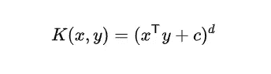

常数项“c”也称为自由参数。它影响特征的组合。x 和 y 是特征空间的向量。

**径向基函数核:**
又称为 RBF 核。它是最受欢迎的内核之一。对于距离度量平方，这里使用欧几里得距离。它用于绘制完全非线性的超平面。

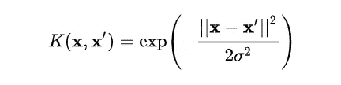

其中 x & x’是特征空间的向量。是一个自由参数。参数的选择是一个关键的选择。使用参数的典型值会导致数据过度拟合。

# 支持向量机库/包:

为了在数据集上实现支持向量机，我们可以使用库。有许多可用的库或包可以帮助我们顺利实现 SVM。我们只需要根据需要调用带参数的函数。

在 Python 中，我们可以使用 sklearn 这样的库。对于分类，Sklearn 提供了类似 SVC、NuSVC & LinearSVC 这样的函数。

**SVC()** 和 **NuSVC()** 方法几乎相似，只是在参数上有所不同。我们传递核心参数、gamma 和 C 参数等的值。默认情况下，内核参数使用“rbf”作为它的值，但我们可以传递像“poly”，“linear”，“sigmoid”或可调用函数的值。

**LinearSVC()** 是一个只使用线性核的分类 SVC。在 **LinearSVC()** 中，我们不传递内核的值，因为它专门用于线性分类。

在 R 编程语言中，我们可以使用“e1071”或“caret”这样的包。要使用一个包，我们需要先安装它。要安装“e1071”，我们可以在控制台中键入 install . packages(“e 1071”)。
e1071 提供了一个 **SVM()** 方法，它既可以用于回归，也可以用于分类。 **SVM()** 方法接受数据、伽玛值和内核等。

## SVM 的成本函数和梯度:

我们希望最大化数据点和超平面之间的差距。有助于最大化裕量的损失函数是铰链损失。如果预测值和实际值符号相同，则成本为 0。如果不是，我们就计算损失值。我们还在代价函数中加入了一个正则化参数。正则化参数的目标是平衡余量最大化和损失。添加正则化参数后，成本函数如下所示。


现在我们有了损失函数，我们对权重求偏导数来求梯度。使用梯度，我们可以更新我们的权重。

现在让我们编写代码来实现我们的学习:

**PYTHON:**

让我们从婴儿的例子鸢尾开始，你知道，如果你遵循决策树，你会有一个很好的想法，如何用层次格式分类不同的物种，只有当你必须分类时，才会出现问题，因为我们有神经网络，但再次让我们看看花瓣长度和萼片长度的分布，宽度得到激励，然后我们将使用不同的核，如上所述，以获得 svm 分类。

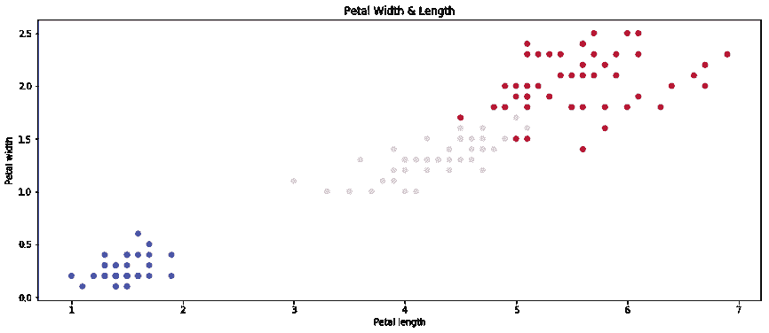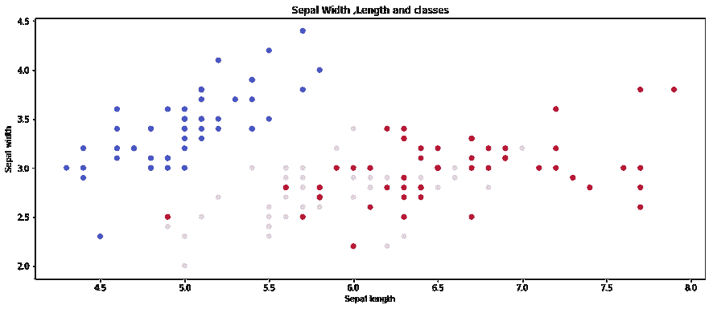

最后使用支持向量机分类器

```
X = iris_dataset.data[:,:]  
y = iris_dataset.target
C = 1.0  *# SVM regularization parameter*

*# SVC with linear kernel*
svc = svm.SVC(kernel='linear', C=C).fit(X, y)
*# LinearSVC (linear kernel)*
lin_svc = svm.LinearSVC(C=C).fit(X, y)
*# SVC with RBF kernel*
rbf_svc = svm.SVC(kernel='rbf', gamma=0.7, C=C).fit(X, y)
*# SVC with polynomial (degree 3) kernel*
poly_svc3 = svm.SVC(kernel='poly', degree=3, C=C).fit(X, y)*# SVC with polynomial (degree 4) kernel*
poly_svc4 = svm.SVC(kernel='poly', degree=4, C=C).fit(X, y)
```

现在我们将处理来自 cs.toronto 的图像分类问题 CIFAR-10[这里](http://www.cs.toronto.edu/~kriz/cifar.html)数据集看起来如何

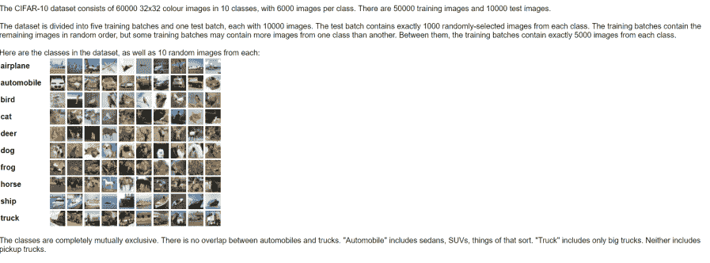

在终端中运行 get_datasets.sh 下载数据集，或者从 [Alex Krizhevsky](http://www.cs.toronto.edu/~kriz/cifar.html) 下载。

get_datasets.sh

`# Get CIFAR10`

`wget [http://www.cs.toronto.edu/](http://www.cs.toronto.edu/)~kriz/cifar-10-python.tar.gz`

`tar -xzvf cifar-10-python.tar.gz`

`rm cifar-10-python.tar.gz`

下载的结果如下图所示。

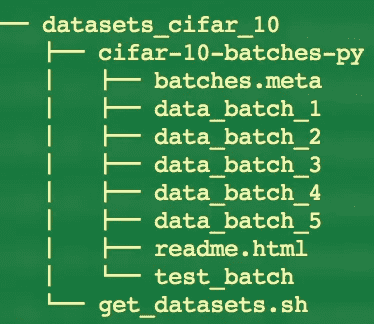

编写完加载数据的代码后，您可以编写自定义可视化代码

```
**def** visualize_sample(X_train, y_train, classes, samples_per_class=7):
    *"""visualize some samples in the training datasets """*
    num_classes = len(classes)
    **for** y, cls **in** enumerate(classes):
        idxs = np.flatnonzero(y_train == y) *# get all the indexes of cls*
        idxs = np.random.choice(idxs, samples_per_class, replace=False)
        **for** i, idx **in** enumerate(idxs): *# plot the image one by one*
            plt_idx = i * num_classes + y + 1 *# i*num_classes and y+1 determine the row and column respectively*
            plt.subplot(samples_per_class, num_classes, plt_idx)
            plt.imshow(X_train[idx].astype('uint8'))
            plt.axis('off')
            **if** i == 0:
                plt.title(cls)
    plt.show()
```

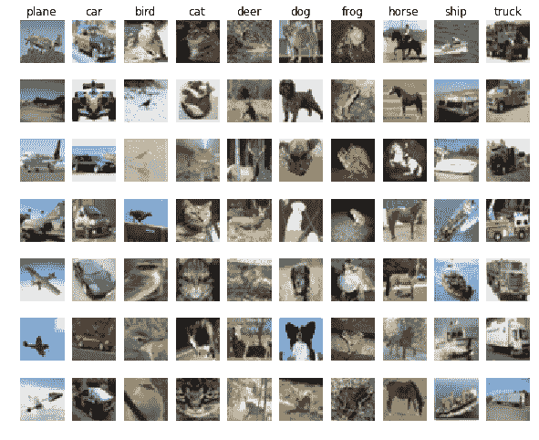

然后你可以写分类器函数

```
*# Test the loss and gradient*
**from** **algorithms.classifiers** **import** loss_grad_svm_vectorized
**import** **time***# generate a rand weights W* 
W = np.random.randn(10, X_train.shape[0]) * 0.001tic = time.time()
loss_vec, grad_vect = loss_grad_svm_vectorized(W, X_train, y_train, 0)
toc = time.time()
**print** 'Vectorized loss: **%f**, and gradient: computed in **%f**s' % (loss_vec, toc - tic)
```

计算梯度损失后，您可以在测试数据集上检查性能

```
y_test_predict_result = best_svm.predict(X_test)
y_test_predict = y_test_predict_result[0]
test_accuracy = np.mean(y_test == y_test_predict)
**print** 'The test accuracy is: **%f**' % test_accuracy
```

# 稀有

要使用 svm，我们需要来自 R

让我们从使用泰坦尼克号数据集开始，如果你不熟悉泰坦尼克号数据集，你可以在这里看到。

我们将只采用年龄和费用栏来预测存活率

train_f

we will use linear kernel for prediction

classifier = svm(formula = Survived ~ .,
data = train_c，
type = 'C-classification '，
kernel = 'linear')
分类器调用会给我们关于调用的细节

> 分类者

调用:
svm(公式=幸存~。，data = train_c，type = "C-classification "，kernel = "linear ")

参数:
SVM 类型:C 分类
SVM 内核:线性
代价:1
伽玛:0.5

支持向量数量:517

支持向量边界看起来像这样

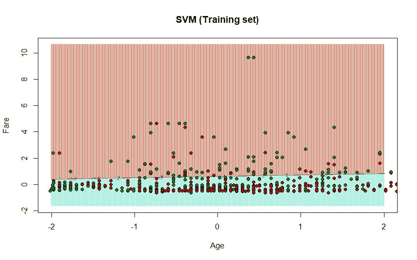

你现在能做什么

1.  下载库 git 克隆[https://github.com/MachineLearningWithHuman/R](https://github.com/MachineLearningWithHuman/R)和 git 克隆[https://github.com/MachineLearningWithHuman/python](https://github.com/MachineLearningWithHuman/python)
2.  去各自的 svm 文件夹玩数据集，看看你的 SVM 核点和边界如何变化。

参考:

*   [https://www . data camp . com/community/tutorials/support-vector-machines-r](https://www.datacamp.com/community/tutorials/support-vector-machines-r)
*   [http://cs231n.github.io/](http://cs231n.github.io/)
*   [https://www . geeks forgeeks . org/classified-data-using-support-vector-machines SVMs-in-python/](https://www.geeksforgeeks.org/classifying-data-using-support-vector-machinessvms-in-python/)