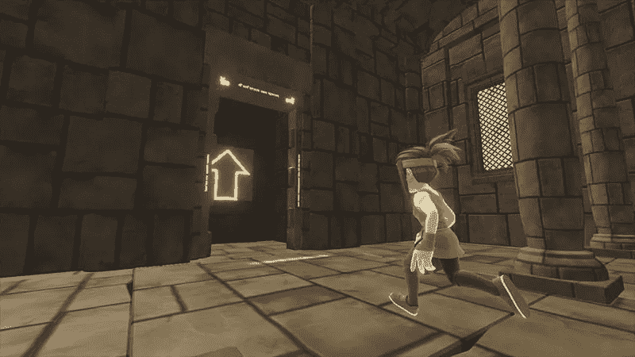

# 未来:人工智能和游戏

> 原文：<https://medium.com/hackernoon/future-ai-and-games-3576c233e909>

自从 1997 年深蓝(IBM 的计算机程序)[在一场国际象棋比赛中击败加里·卡斯帕罗夫](https://en.wikipedia.org/wiki/Deep_Blue_versus_Garry_Kasparov)以来，人工智能在游戏世界的应用得到了极大的推动。人工智能技术从来都不是夸张的说法，它现在是视频游戏的基础。从糖果粉碎这样的简单游戏到新趋势 PUBG，人工智能一直在创造吸引和挑战我们的游戏体验。在当今世界，基于人工智能的游戏比以往任何时候都更加复杂，并且正在创造用户从未遇到过的体验。人工智能驱动的工具使游戏更加生动和真实，而这仅仅是个开始。

# 目前游戏中的人工智能

你以前一定玩过电子游戏吧？如果是的话，那么，你已经和 AI 在游戏中互动过了。今天，每个视频游戏都以某种形式使用人工智能。如果我们谈论现在，AI 游戏有两个核心组成部分:

**寻路**:这在几乎所有游戏中都有实现，AI 在两点之间勾勒出最小的路径。一个例子是‘PUBG’中的播放器，它使用度数来选择要往哪个方向走。

**有限状态机**:这就是复杂行为的定义。它为游戏中不可玩的角色提供能量。尤其是像《塞尔达:野性的呼吸》或《红色死亡救赎 2》这样的开放世界角色扮演游戏。

不过，这些技术并不新鲜，早在 20 世纪 80 年代就有了。显然，这些技术的处理能力已经随着时间而提高，但是基本概念和基本原理几乎没有改变。

# 人工智能能给游戏带来什么

## 它有助于在更短的时间内创建游戏

首先，人工智能可以减少开发人员建立不同层次和工艺环境的时间。此外，它甚至可以从零开始创建完整的游戏。简而言之，这意味着——在更复杂的环境中立刻创造更大更好的游戏。如果出现这种情况，对资源较少的小型 [android 游戏](https://appsaraby.com/android-games)设计人员肯定是有好处的。

## 让游戏更加个性化和个性化

人工智能可以使游戏规则更加多变，以便每个用户都有不同的个人体验。例如，在 PUBG 中，你可以自定义控件、外观、武器和许多其他东西。虽然这只是开始，但在未来，游戏甚至会学习个人玩家的不喜欢和喜欢，以提供个性化的体验。

## 带来自学的角色

这需要几年的时间，但有一天我们可能会在电子游戏中获得自学的角色。这些角色可以像我们人类一样学习、成长和改变。

# 人工智能对手机游戏发展的影响

通过检查玩家行为，人工智能可以在[手机游戏](https://appsaraby.com/games)的开发中发挥作用。人工智能可以让设计师分析游戏玩家如何与 android 游戏互动。
数据很重要，人工智能可以收集数据，使之成为体验的一部分。游戏给人们带来了与他人不断接触的共享体验。在未来，人工智能可以根据联邦数据改变游戏本身。
例如，一名玩家因为停留在特定的关卡而变得沮丧。在这里，人工智能将通过给玩家提示来扮演这个角色，而不会影响玩家对游戏关卡的满意度。
也就是说，你不必在简单、普通或困难的游戏等级之间做出选择，而是人工智能会简单地对你的游戏做出反应，并根据玩家的情况进行开发。所以，在不久的将来，你将会以一个完全不同的角色玩 [FIFA mobile](https://appsaraby.com/fifa-19/) ，这取决于你之前的游戏。

人工智能具有自动化密集型任务的能力，使开发人员能够专注于游戏开发的生产部分。对于小型游戏工作室来说，人工智能可以帮助创建音乐、图形和角色，使他们能够构建比以前更有吸引力的游戏。

从一开始，人工智能就已经成为游戏世界的一个主要部分，并且这项技术发展非常迅速。毫无疑问，主机和 PC 游戏正在引领游戏领域的人工智能，但这不会是最终情况。随着手机游戏的流行，AI 手机游戏革命开始的时间不会太久了。