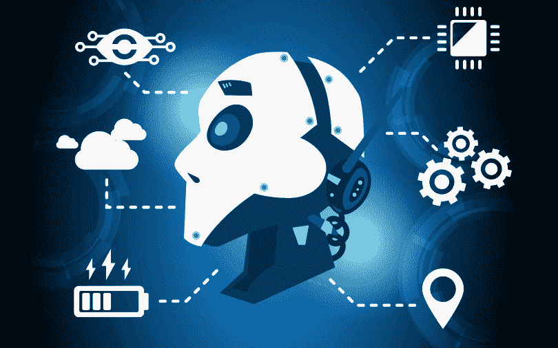

# 2019 年你应该关注的 9 大人工智能趋势

> 原文：<https://medium.com/hackernoon/future-artificial-intelligence-2019-1cd09cc491c7>

人工智能已经成为科技界的热门话题。它不仅改变了我们的生活，也颠覆了你能想到的每一个行业。尽管如此，人们对它有不同的看法。有些人可能会认为这是一件坏事，因为他们被告知，在不久的将来，这将夺走你的工作。另一方面，人工智能倡导者继续认为人工智能是一个使能器，它将通过自动化事情来减轻你的负担并使你的生活变得容易。

不管你喜不喜欢人工智能，如果你对人工智能的未来感兴趣，那么你来对地方了。在这篇文章中，我们将看看将在 2019 年占据主导地位的一些最大的人工智能趋势。

# 1)人工智能芯片将成为主流

与其他技术和软件工具不同，人工智能非常依赖专门的处理器。为了满足人工智能的复杂需求，芯片制造商将制造能够运行人工智能应用程序的专用芯片。

甚至像谷歌、脸书和亚马逊这样的科技巨头也会在这些专用芯片上花更多的钱。这些芯片将用于涉及人工智能的专门用途，如自然语言处理、计算机视觉和语音识别。

# 2) AI 和 IoT 在边缘相遇

2019 年将是我们看到不同技术与人工智能融合的一年。IoT 将携手 AI 在边缘计算层。工业物联网将利用人工智能的力量进行根本原因分析，对机器进行预测性维护，并自动检测问题。

我们将在 2019 年看到[分布式 AI](https://en.wikipedia.org/wiki/Distributed_artificial_intelligence) 的崛起。智能将被分散，并将位于更靠近执行例行检查的资产和设备的位置。由神经网络驱动的高度复杂的机器学习模型将被优化为在 edge 上运行。

# 3)向 AutoML 问好

主导 2019 年人工智能行业的最大趋势之一将是自动化机器[学习](https://hackernoon.com/tagged/learning) ( **AutoML** )。借助自动化学习能力，开发人员将能够修补机器学习模型，并创建新的机器学习模型，以应对未来的人工智能挑战。

AutoML 将在认知 API 和定制机器学习平台之间找到中间地带。自动化机器学习的最大优势在于，它为开发人员提供了他们需要的定制选项，而无需强迫他们经历复杂的工作流程。当你把数据和可移植性结合起来时，AutoML 可以给你其他人工智能技术所没有的灵活性。

# 4)欢迎来到 AIOps

当人工智能应用于我们如何开发应用程序时，它将改变我们过去管理基础设施的方式。开发运维将被 AIOps 取代，它将使您的 it 部门员工能够进行精确的根本原因分析。此外，它会让你很容易从庞大的数据集中找到有用的见解和模式。大型企业和云供应商将受益于 DevOps 与 AI 的融合。

# 5)神经网络集成

人工智能开发人员在开发神经[网络](https://hackernoon.com/tagged/network)模型时将面临的最大挑战之一是选择最佳框架。市场上有几十种人工智能工具，选择最好的人工智能工具可能不像以前那么容易了。

不同神经网络工具包之间缺乏集成和兼容性阻碍了人工智能的采用。微软和脸书等科技巨头已经在致力于开发一种**开放式神经网络交换** (ONNX)。这将让开发人员跨多个框架重用神经网络模型。

# 6)专门的人工智能系统成为现实

2019 年对专业化系统的需求将呈指数级增长。组织可支配数据有限，但他们需要的是专业数据。

这将迫使企业获得可以帮助他们在内部生成高质量人工智能数据的工具。2019 年，重点将从数据数量转向数据质量。这将为人工智能在现实世界中工作奠定基础。公司将寻求专业的人工智能解决方案提供商，这些提供商能够访问关键数据源，并能够帮助他们从非结构化数据中获得意义。

# 7) AI 技能将决定你的命运

尽管人工智能已经改变了你能想到的每一个行业，但仍然缺乏大量拥有人工智能技能的人才。 [Espressive](https://www.espressive.com/) 的首席执行官帕特·卡尔霍恩(Pat Calhoun)表示:“**大多数组织都希望将人工智能作为其数字化转型的一部分，但没有开发人员、人工智能专家和语言学家来开发自己的解决方案，甚至没有培训预建解决方案的引擎来实现承诺**。”

Awake Security 首席执行官 Rahul Kashyap 补充道:“**有如此多的‘人工智能’解决方案可用于解决无数的业务问题，是时候让企业更加智能地了解他们的人工智能解决方案的‘黑匣子’中正在发生的事情了。“他继续说道，“**人工智能算法的训练、结构化或通知方式会导致输出的显著差异。对一家公司合适的等式不会对另一家公司合适。****

# 8) AI 会落入坏人之手

就像硬币有两面一样，艾也有积极的一面和消极的一面。IT 安全专业人员将使用人工智能快速检测恶意活动。借助人工智能驱动的响应和机器学习算法，您可以将误报率降低 90%。人工智能将落入坏人之手，怀有恶意设计的网络罪犯将滥用它来实现他们的动机。有了自动化，大批网络攻击者可以更成功地发动致命攻击。这将迫使企业以毒攻毒，并投资于人工智能驱动的安全解决方案，以保护他们免受这种人工智能驱动的攻击。

# 9)人工智能驱动的数字化转型

2019 年，AI 将无处不在。从网络应用到医疗保健系统，从航空公司到酒店预订系统等等，我们将到处看到人工智能的影子，它将处于数字化转型的前沿。

IT 部门主席兼夏威夷大学教授 Tung Bui 博士表示:“**与大多数关于自动驾驶汽车和机器人最终将如何影响就业市场的预测和讨论不同——这是事实，但由于制度、政治和社会原因，这需要时间——我认为人工智能的最大趋势将是数字化转型的加速，使现有的商业系统更加智能**。”

> 本文来源:[科技中心](https://www.techsciencehub.com/future-artificial-intelligence-news-trends/)