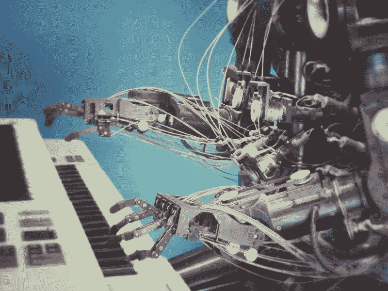
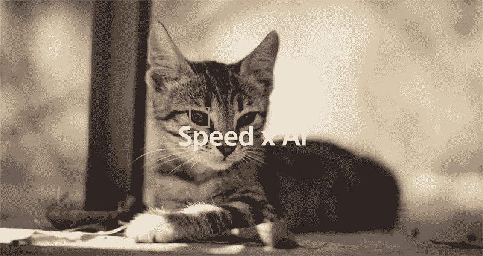
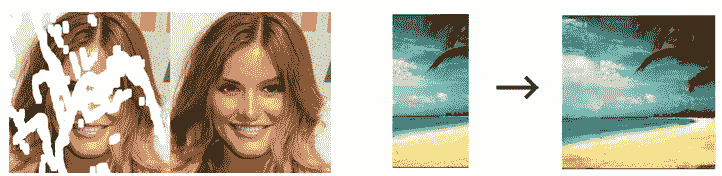
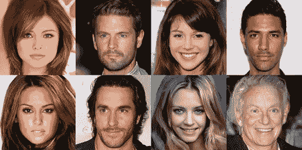
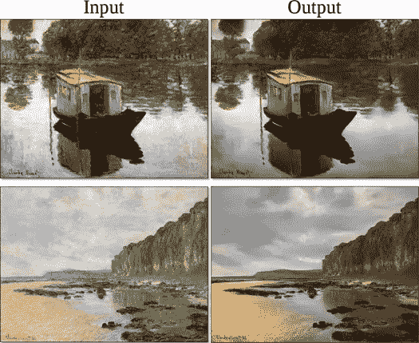

# 未来:人工智能和摄影

> 原文：<https://medium.com/hackernoon/future-artificial-intelligence-and-photography-3346457970f0>

很长一段时间以来，人工智能一直是这个现代世界的时髦词汇。当我们谈论像“人工智能”、“机器人”或“机器学习”这样的词时，许多人开始想到说话和行走的机器人——这要归功于我们的科幻电影。但事实上，人工智能并不属于这一类，它已经伴随我们很多年了。它存在于你的智能手机、手机银行应用程序、汽车的全球定位系统、[头发更换系统](https://www.hollywoodlace.com/)，甚至存在于你用来出售汽车的网站上，比如 carsellzone.com 的。它存在于每个领域，摄影也不例外。事实上，我们已经在智能手机的相机中使用人工智能进行摄影，而你可能还不知道。现在，摄影不再仅仅是相机、镜头、[照片编辑软件](https://skylum.com/luminar)和传感器——它是一组算法，可以立即操纵图像，产生摄影结果，否则需要使用一些软件工具进行数小时的修改。人工智能一直在将摄影转化为一种计算过程。摄影师已经在利用人工智能驱动的 photoshop 动作来减少编辑照片所花费的时间。而这仅仅是开始。未来五到十年，摄影将完全是人工智能和机器学习。

# 人工智能与摄影

几乎你看到的每一张照片，都是由一个活生生的人拍摄或创作的。毫无疑问，有数以千计的工具来创建图像，但大多数都需要人类的参与来引导整个过程。但如果我们谈论进步——微软创造了一个人工智能艺术家，名为“[绘图机器人](https://techcrunch.com/2018/01/18/microsofts-new-drawing-bot-is-an-a-i-artist/)”这个机器人可以从一个物体的书面描述中创建图像。这个机器人还总结了一些没有输入文本的图像细节，象征着人工智能已经有了自己的一点想象力。这让我想到在不久的将来，你只需要在一个应用程序中输入一些指令，比如“我需要一张我站在自由女神像前的照片”，瞧，这就可以完成了。与此同时，我们可以使用[最好的初学者照片编辑软件](https://gotoandlearn.com/photo-editing-software/best-photo-editing-program-for-beginners-mac/)并等待这种人工智能机器的更高级版本。

# 人工智能对摄影师的影响

随着未来更多的技术进步，人工智能工具可能会开始取代摄影所需的技术技能。谷歌剪辑(Google Clips)是一款人工智能驱动的相机，它可以决定何时照明或构图具有美感。这表明我们离完全自动化的摄影师不远了。对谷歌剪辑的评论并不是很好，但种子肯定已经播下。此外，随着图像生成技术的不断发展，企业可能会在未来创建自己的图像，而不是雇佣专业摄影师。

# 索尼 a6400:能识别动物眼睛的人工智能

索尼最新的相机索尼 a6400 具有人工智能(AI)功能，可以帮助摄影师比以往任何时候都更多地聚焦拍摄。索尼 a6400 是索尼首款推出“实时眼动自动对焦”的相机，该相机利用基于人工智能(AI)的对象识别来实时检测和处理人眼数据，从而提高自动对焦精度、速度和跟踪性能，这在消费相机或专业相机中是前所未有的。
索尼的实时眼睛自动对焦功能增加了一种新的算法，除了支持人类，还支持动物。这使得能够快速、精确、自动地检测和跟踪各种动物的眼睛，但是当双眼都可见时效果最佳。当然，这种奇特的技术将需要一些大范围的高质量[索尼 a6400 镜头](https://www.alphashooters.com/cameras/a6400/lenses/)，这将允许你在几乎任何环境或情况下拍摄。

# 生成性对抗网络与摄影

> 用 Yann LeCun -
> 的话说，“GANs 是 ML 过去 10 年里最有趣的想法”

GAN Functioning

[GANs](https://en.wikipedia.org/wiki/Generative_adversarial_network) 是广泛的神经网络架构，由两个网络组成，一个靠着另一个(“对抗性”)。这是合成图像生成的基础。在蒙特利尔大学， [Ian Goodfellow](https://en.wikipedia.org/wiki/Ian_Goodfellow) 和其他研究人员在 2014 年引入了 GANs，从那以后，它成为了深度学习中最广泛使用和最迷人的方面。gan 也可以归类为一组生成模型。Gans 在摄影和其他领域有巨大的潜力，因为它可以学习模仿任何一组数据。Gans 可以被定义为机器人艺术家，到目前为止输出一直很好。甘斯创作的一幅[肖像以 43.2 万美元成交。这种技术的应用可以在修补和去修补、人脸合成和组织中看到。](https://www.theverge.com/2018/10/23/18013190/ai-art-portrait-auction-christies-belamy-obvious-robbie-barrat-gans)

Results of Image inpainting(left) and outpainting(right) [Source:Github]

Generated faces of imaginary celebrities by a Progressive GAN. (Image Credits : NVIDIA)

## 绘画到照片的翻译

GANs 也可以用来使照片更加真实，或者简单地将一幅画变成一幅新照片。在这个过程中，使用了一种不同类型的 GAN，称为 CycleGAN。这使用了两个鉴别器和两个发生器。

# 我们期望从这里得到什么？

在不久的将来，人工智能肯定会对摄影和成像产生巨大的影响。像 GAN 这样的技术能够从文本输入中生成照片。你不能否认这个事实，在可预见的未来，这样的技术将能够通过简单的命令生成高分辨率的照片和视频。想想在 GAN 里喂一些代码创作的一整个视频，是不是很棒？在未来，可能不需要像 CorelDRAW 和 Photoshop 这样的工具来增强图像。唯一困扰我的是——这将是真正摄影的终结吗？