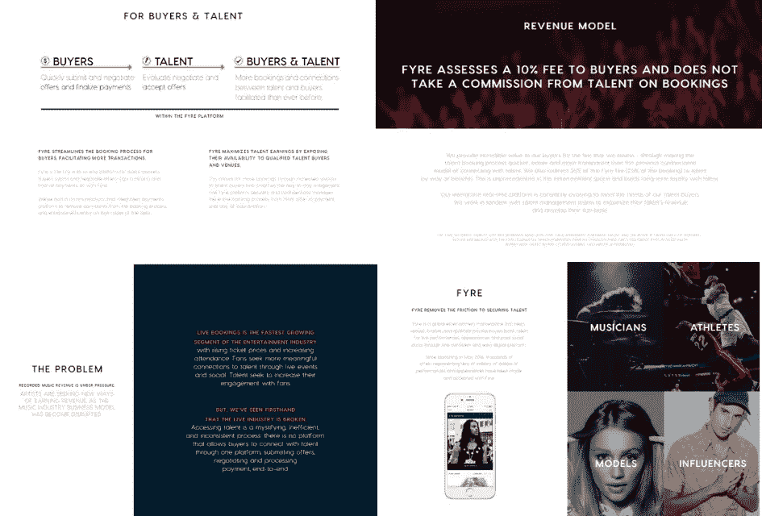
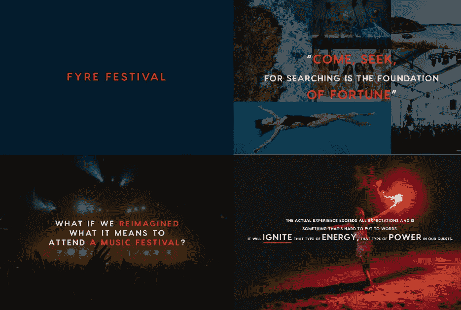
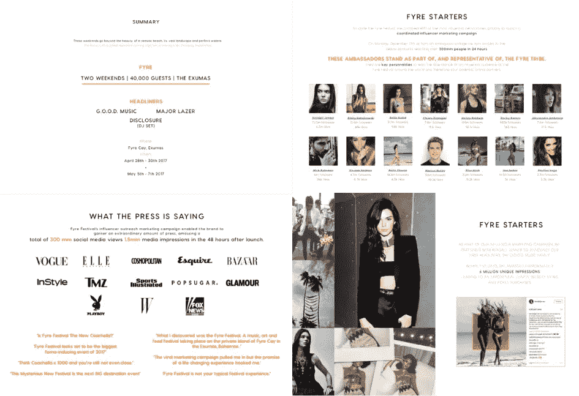
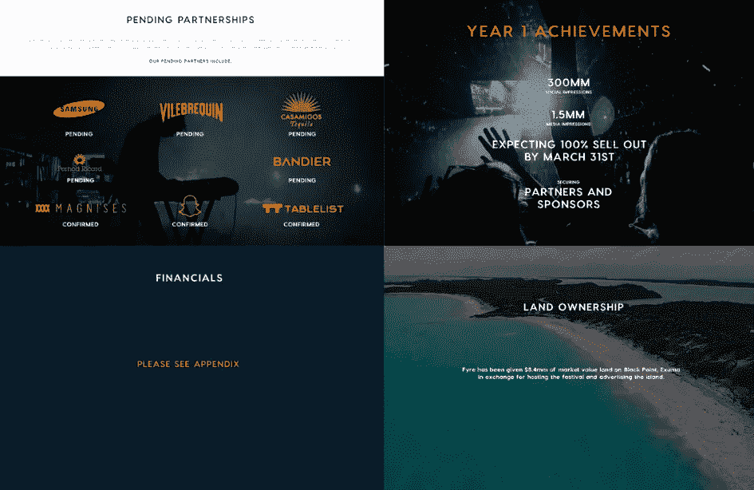
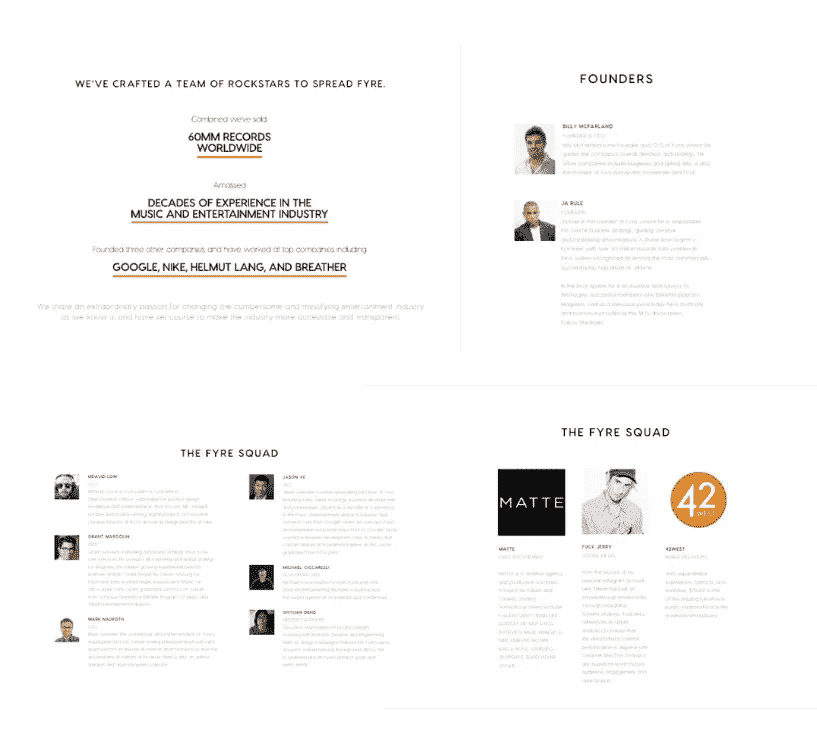

# 解构 Fyre 节日宣传资料

> 原文：<https://medium.com/hackernoon/fyre-festival-pitch-deconstruct-91f24d73575b>

Supposedly one of the biggest things of the year - [Reference: The Verge](https://www.theverge.com/2018/4/16/17243802/hulu-fyre-festival-documentary-series-ja-rule-billy-mcfarland)

到现在为止，我们大多数人都应该听说过 2017 年臭名昭著的 Fyre Festival，投资者损失了超过 2740 万美元。2019 年，电影节的摊位在网上重新出现，并被标记为[‘超越模仿’](https://www.vanityfair.com/news/2017/05/fyre-festival-pitch-deck)。

创始人比利·麦克法兰有一个举办“豪华音乐节”的想法，这将有助于他们音乐预订应用的推出。它应该是独一无二的，有助于制造巨大的轰动效应。

*它确实……因为错误的原因*。

整件事最终很快土崩瓦解，让投资者损失了数百万美元的投资资金。

**但宣传平台真的有助于获得那笔资金，还是只是一个警告信号，预示着接下来的厄运即将来临？**

让我们来看看。

# 第一部分:什么是 Fyre？

第一部分介绍所有球场平台**的一般情况，包括**

*   **工作原理**
*   **问题陈述**
*   **解决方案**
*   **收益模式**

一切看起来都很标准，尽管它很罗嗦，这可能意味着在这个阶段可以在没有叙述的情况下分发这副牌。

这些幻灯片中描述了一个明显的问题，并提供了一个解决方案，概述了如何解决所述问题。

这些幻灯片表明的一件重要事情是**该公司具有吸引力**，这有待验证，但对国家而言仍然很重要。(*我们后来发现这个宣传其实是假的，他们只有 55，700 美元的预订，而不是他们声称的几百万美元*)

总的来说，它仍然以一种易于理解的方式很好地呈现出来。

# **第二节:节日**

这是它开始走向另一个方向的地方。

它从大量的文字和事实转换成大量“鼓舞人心”的引语。

它试图通过让观众想象 Fyre 的节日目标来带领观众踏上一段旅程。

现在你可能会认为他们要求**数百万美元的资金**通过一个节日来推广他们的应用程序是荒谬的，但是如果你看看节日的历史，就会明白一些。

Fyre 音乐节被宣传为“私人岛屿上的 Coachella”。

> [根据 Billboard-2017 年科切拉音乐节有 25 万人参加，总收入为 1.146 亿美元。](https://www.billboard.com/articles/business/8005736/coachella-festival-2017-114-million-gross)

节日很难正确执行，因为许多事情可能会出错(讽刺的是，这将是最好的例子之一)，但它有优点，因为如果成功，它实际上可能是有利可图的，作为一个额外的奖励，也促进了他们的核心业务。

# **第三节:促销**

像凯莉·詹娜这样的名人和一群有影响力的人被支付推广 Fyre 音乐节，这本来是一些最大的名字参加的最大的节日。

虽然影响者营销是一种合法的策略，但当你雇佣超过 100 名影响者(包括凯莉·詹娜)在第一年推广一个节日时，这也是令人担忧的。

[**据估计，仅凯莉·詹娜一个职位就花费了 25 万美元。**](https://www.bbc.com/news/46945662)

总的来说，战略是明确的，但它是如此的地方，有许多可能提出的问题，包括整个影响者的合法性。

公关和影响者营销是可靠的策略，特别是对于像这样的千禧目标事件，但它们也很难证明。

事实上，他们预测到 3 月 31 日将达到 100%的销售额，公关是他们的主要营销工具，这是令人担忧的。应检查预订单编号，以了解索赔的实际可行性。

值得注意的是，即使在 Fyre Festival 失败后，包括对凯莉·詹娜的诉讼，许多有影响的人仍受到强烈反对。任何有影响力的人在选择他们支持的东西时都需要小心，这是一个很明显的例子。

# **第 4 部分:财务和合作关系**

这一部分有很多内容需要讨论，因此我将浏览每张幻灯片上的要点。

# **合作关系**

待定？

为什么它们悬而未决？

我发现这些幻灯片是一种浪费，尤其是在大多数合作关系“悬而未决”的情况下，比如像三星这样的大公司。

伙伴关系也可以意味着很少或没有意义，尤其是如果它对事业的贡献微乎其微。这需要清楚地阐明，包括伙伴关系为双方提供了什么。

# **财务**

财务应该是推介材料中最重要的部分之一。

它应该概述他们的收入模式是什么(如果还没有解释的话)，并展示他们目前获得了多少收入以及他们的运营率或估计的运营率。

投资者喜欢看到 2 倍和 3 倍的增长图表。

但是在所有 56 张幻灯片中，只有一张是关于这个的，而且它甚至不是一张金融幻灯片。这是参考附录幻灯片。

现在这很好，但这也表明他们可能不想深究他们的数字，这是拼写问题。

# **土地所有权**

这里的幻灯片简单明了，看起来令人印象深刻。如果合法，这将是一个伟大的节日 nab。

这肯定需要验证，尤其是因为它是免费的，而且这个岛价值 840 万美元。

# **成就幻灯片**

总的来说，这张幻灯片表面上看起来令人印象深刻，但当您深入了解这些数字的含义时，就会发现其中缺少很多信息。

**印象**总是被认为是一种虚荣的衡量标准，尤其是没有确凿的证据证明它能转化为投资回报。简单地陈述一堆令人印象深刻的数字似乎很无力，尤其是社交媒体和媒体的两倍。

**期待在 3 月 31 日**售罄又一次像合作部分一样不靠谱。如果它能更清楚地显示目前为止的运行速度，包括目前售出的门票，这将会更好地表现出来。

**问题是为什么都是‘期待’或‘待定’或‘将要’的？**

# 第五部分:提问

每一个投球都需要一个提问，就像《鲨鱼池》一样。在这里——抬高 25 毫米。

围绕这一点有几个问题，包括为什么是这个特定的数量？估值是怎么做的？

这张幻灯片中有许多未回答的问题，这也是因为它没有解释他们如何得出这个数字的背景。

专属经理到底是什么？我们为什么需要 500 台，它们为 Fyre 的业务带来了什么？

在这一点上，幻灯片看起来很可怕，有太多没有答案的问题。

# **第六节:团队**

老实说，这看起来确实是一个令人印象深刻的团队。

这个团队有很多相关的人才，我实际上很喜欢这个部分的布局，因为我们都知道一个好的团队是如何创造或毁灭一个创业公司的！

从产品、工程、营销到销售，团队的每个部分都在公司中发挥着重要作用，这些幻灯片很好地说明了这一点。

# 最终意见

总的来说，有一些不错的幻灯片，但大多数是绒毛。

球场上有很多问题，包括大量没有证据或额外细节的索赔。

后来，它重新浮出水面，许多索赔是虚假的(从实际预订金额到合作关系)。

最后，Fyre 本身是一个很好的主意，但是由于欺骗的细节，错误的计划和更多的原因，这个节日悲惨地失败了。

幻灯片应该是电影节可能失败的预警，尽管它设法获得了数百万美元的资金(大量资金是通过伪造数字获得的)。

不过，有一点是清楚的，那就是这些幻灯片很可能并没有解释 Fyre 是如何获得大量资金的。

## [拿起我的免费中型清单和提示包！](https://tinyurl.com/mediumkit)