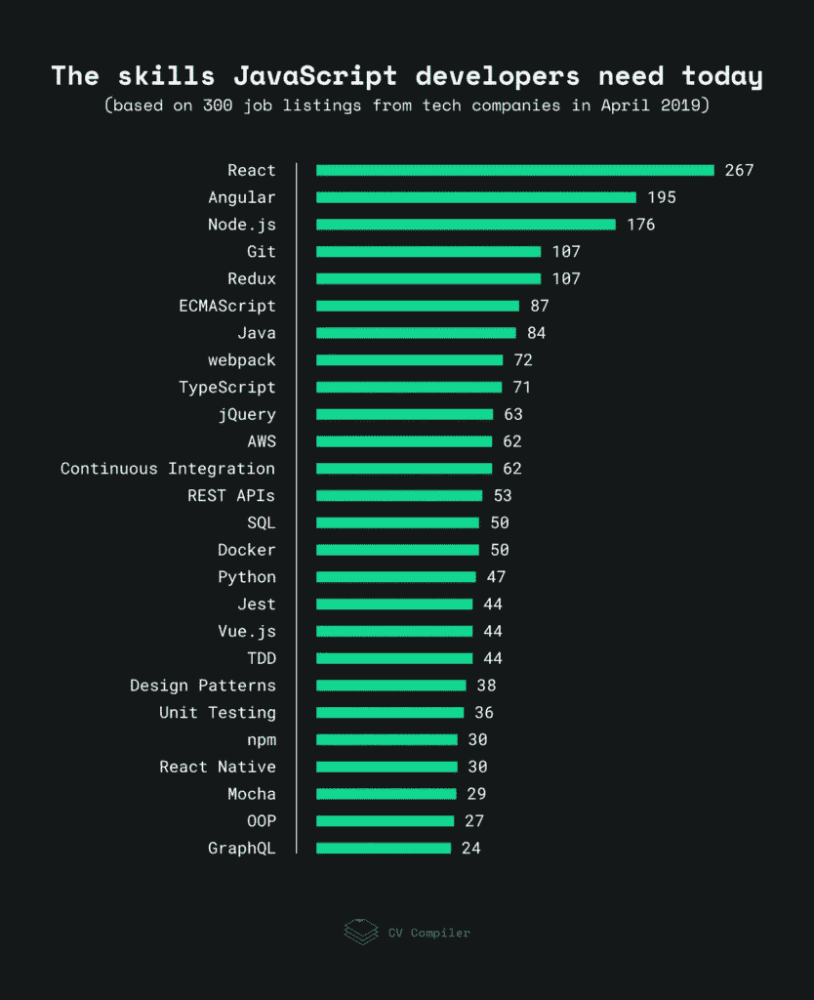

# 框架的游戏:2019 年的 JavaScript 趋势

> 原文：<https://medium.com/hackernoon/game-of-frameworks-javascript-trends-of-2019-1a303fa3aaa7>

JavaScript 生态系统让我想起了一个战场。 *TypeScript vs. ES6，React vs. Angular，Jest vs . Mocha……*就像一部热门电视剧一样，所有这些对抗让 JS 爱好者急切地等待更新，自问: ***接下来该学什么用？*** 与此同时，各路科技的追随者只剩下蠢蠢欲动的锅了:)

在 [CV Compiler](https://cvcompiler.com/?ref=hackernoon) 这里，我们每周帮助改善几十个 JS 开发者的简历，所以我们也跟踪这个框架游戏，定期分析雇主的需求。但是在本文中，我不会支持或批评任何一种技术——我只是从外部的角度来看 JavaScript 的当前趋势。

# JS 开发人员今天需要的技能:我们的数据驱动研究

我们从 AngelList、StackOverflow、LinkedIn 和全球快速增长的科技公司的职业页面上收集了 300 份 JavaScript 开发人员的工作规范。使用我们自己的文本分析工具，我们找出了最常被提及的术语，如下所示。(数字指的是它们被提及的频率。)

**注**:这是对以 JavaScript 为主要语言的工作岗位的一般技能评分。当然，我并不是说后端开发人员应该知道完美的反应，等等。而且这个图只是反映了目前的市场需求，可能和 JS devs 自己的喜好有所不同。(我们将在下一节讨论它们。)

# 主要要点

在非 JS 语言中，没有出现在我们的评级中，最常被提及的是 **C#** (24)和 **PHP** (16)。至于数据库管理系统， **MySQL** (23)和 **MongoDB** (23)正在打破图表。令人惊讶的是，经常被讨论的 **Express.js** (24)被提及的频率较低，同样被提及的还有 **Flow** (23)。

虽然图表中没有提到术语**敏捷** (150)，但它甚至比 **Git** 或 **Redux** 更受欢迎，这使得它可以与每个 JS 开发人员应该获得的硬技能相媲美。UX (101)也是如此。当然，你不一定要参加高级的 UX 课程(如果可以的话就更好了)，但作为一名前端开发人员，你需要知道如何通过技术手段让用户的旅程更顺畅，而不被设计师发现。

我们遇到诸如**可伸缩性** (70)、**云计算** (44)、以及**安全性** (29)这样的术语的事实代表了 JS 倾向完全继承了开发者行业的倾向。

你可能已经注意到了， **Vue.js** 在我们的技能评分中并不是很高。我想这可能有几个原因。首先，并不是每个公司都准备把自己的项目转移到 Vue.js 上，抛弃更稳定、更通用的前端解决方案。其次，用人单位可能希望开发者边工作边学习 Vue.js，所以在最初的需求列表中没有提及。

然而，根据全球研究， **Vue.js** 非常受欢迎——2018 年 JavaScript 调查的[状态中，28.8%的受访者使用过它，并希望再次使用它。另一个有趣的观察:同一调查中 34%的受访者表示他们已经尝试过 **Angular** ，但再也不会使用。然而，这并不意味着这三种技术中的任何一种(React、Angular 或 Vue.js)会举起白旗。前端框架的选择由许多因素决定，如项目的规模、架构或公司的地理位置。](https://2018.stateofjs.com/front-end-frameworks/overview/)

GraphQL 的情况也是如此。虽然它不在图表的顶端，但它确实在快速增长。21%的 2018 Node.js 用户调查受访者已经在工作中使用它。2018 年 4 月 30 日， **52** 人下载阿波罗，(GraphQL 客户端)。整整一年后，**10794 人做了同样的事情。**

至于搭建工具，还有一个有趣的对抗:**Parcel**vs .**web pack**。 [2018 JavaScript 新星](https://risingstars.js.org/2018/en/#section-build)研究显示，前者正在从后者手中夺走人气。然而，即使 Parcel 有几个有吸引力的内置功能，如开箱即用的配置、开发服务器和热模块替换，它仍然没有取代好的 ol' Webpack。JS 2018 的[状态超过 16k 个回答者使用 Webpack 来构建他们的项目。至于我们的研究，我们还没有在 300 个空缺中的任何一个中遇到帕尔。](https://2018.stateofjs.com/other-tools/)

# 在不久的将来事情会有什么变化？专家的意见

以下是专家对 JS 发展趋势的看法。

> 对我来说，React 将在未来几年保持其强势地位。GraphQL 也会如此，而 REST APIs 会下降一个档次。此外，TypeScript 可能会超越 ECMAScript。至于新的术语，我希望最终能在这样的技能等级中看到理性、包裹和设计系统。(不过，也许不会在 2020 年之前。)
> 
> 再观察一下——我认为 Redux 将在未来五年内下降，因为开发人员正在积极地发现前端的替代方法。

*Juho vepslnen、* [*创始人、【生存】JS*](https://twitter.com/survivejs) *、* [*React 芬兰*](https://twitter.com/ReactFinland) *、
蓝箭奖得主。* [*推特*](https://twitter.com/bebraw) *|* [*网站*](https://survivejs.com/)

> 这个列表显示了前端框架如 React、Angular 和 Node.js 在 JavaScript 生态系统中的持续优势。这种情况可能会继续下去，开发人员最好至少深入学习其中一种框架。TypeScript 和 GraphQL 也在上升，并可能继续增长。
> 
> 对于后端工程师来说，Node.js 的受欢迎程度持续上升。但是，许多公司仍然希望 JavaScript 开发人员能够使用像 Java 和 Python 这样的语言，在多语言环境中工作。列表的其余部分证明，仅仅知道 JavaScript 是一种语言是不够的，使用 Git、CI 和 TDD 等常见的行业实践是必须的。

*凯文·鲍尔、
Web 前端顾问和培训师、
ZenDev***创始人。* [*推特*](https://twitter.com/kbal11) *|* [*博客*](https://zendev.com/blog.html)*

> *我很惊讶没有在这个图表的顶部看到 Express.js，因为它是编写 Node.js 后端应用程序的主要框架。也许这是因为 JavaScript 的大部分空缺都是面向前端开发人员的，但技术本身绝对不在冷门之列。*
> 
> *至于前端领域，我觉得 React 会长期保持霸主地位。该框架快速响应用户的需求，定期向市场推出新的想法，并得到脸书的大力支持。TypeScript 是另一个大趋势——我猜在 3 年内，我们不会看到任何没有使用 TS 的大项目。由于与 React 紧密相关，这两种技术将继续繁荣发展。*
> 
> *绝对需要改变的是项目构建过程的复杂性。更有可能的是，我们很快就会看到这个问题的有效解决方案，比如 codesandbox 或者 Parcel。*
> 
> *总的来说，JavaScript 已经成为一种相当“成熟”和稳定的语言，所以我不认为我们会在最近的将来看到激烈的“技术之战”。*

**丹尼斯雷丁，
技术负责人*[*focus reactive*](https://focusreactive.com/)*。* [*Twitter*](http://twitter.com/pixelscommander)*|*[*GitHub*](http://github.com/pixelscommander)*

> *JavaScript 是一种发展非常迅速的语言，每周都会有新的框架问世。虽然这曾经是真的，但它肯定正在放缓，尽管最近我们看到了更多像盖茨比这样的“框架上的框架”。*
> 
> *深刻理解 ES6 的底层语法非常重要。理解 JavaScript 是如何被解释的以及各种浏览器的局限性是至关重要的。最后，艾滋病人和服务人员的增加也值得关注。JavaScript 应用程序的潜在市场遍布全球，了解如何为这些客户构建应用程序至关重要。*

**劳里·巴斯，
演讲者，博客作者，教师，
十英里广场科技公司的顾问。* [*推特*](https://twitter.com/laurieontech) *|* [*博客*](https://dev.to/laurieontech) *|* [*网站*](https://laurieontech.com/)*

> *基于我们自己在 Cypress.io 的需求，我们看到 GraphQL + TypeScript 主导了 2020 年所需技能的列表。我还预测，像 Next.js、Nuxt.js 和 Gatsby.js 这样的混合框架会抢占一大块项目，所以 JavaScript 开发人员必须了解这些工具。*

**格列布·巴赫穆托夫，*
[赛普拉斯. io](https://www.cypress.io/) 工程副总裁。
[推特](https://twitter.com/bahmutov) | [网站](https://gleb.dev/)*

> *JavaScript 生态系统在不断发展，它可能会势不可挡。然而，我认为这是一个学习和扩展自己知识的好机会。同时，它也是语言进化的一个重要标志。拥有 React.js 和 Node.js 对你的简历是一个巨大的加分，也是获得一份体面工作的关键之一。*

**Tanya Butenko，
hire up(澳洲)软件工程师，
Muses Code JS Inc .创始人兼首席执行官* [*Twitter*](https://twitter.com/ButenkoMe)*|*[*网站*](https://musescodejs.org/)*

*总的来说，现在是 JavaScript 开发者的最佳时机。JS 和它的框架是全球最受欢迎和最广泛使用的技术的榜首。尽管存在框架之争，但常用工具集相当稳定，因此您可以专注于利用您最喜欢的技术，而不是选择类似的技术。*

*我希望这篇文章能帮助你建立 2019 年剩余时间的学习曲线。祝你在寻找新的职业机会时好运！*

*这篇文章是由 CV 编译器团队带给你的，这是一个机器学习驱动的简历增强工具，面向 JavaScript 爱好者、前端开发人员和其他技术人员。如果你需要一份完美的简历，点击这里。(查看简历分数免费。)*