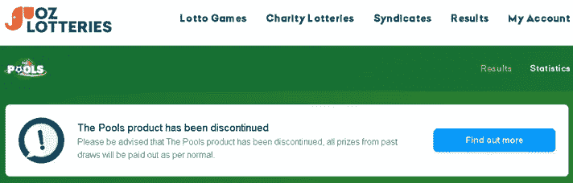
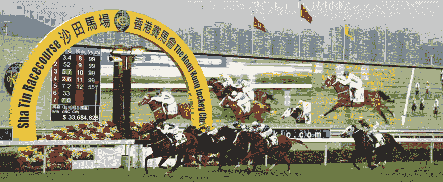
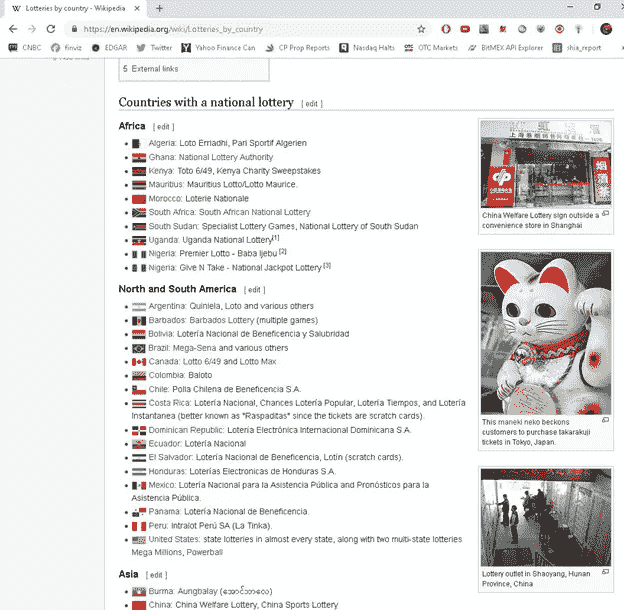
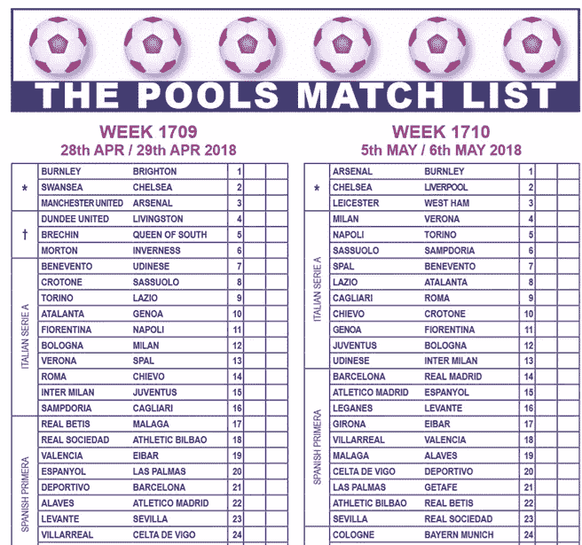
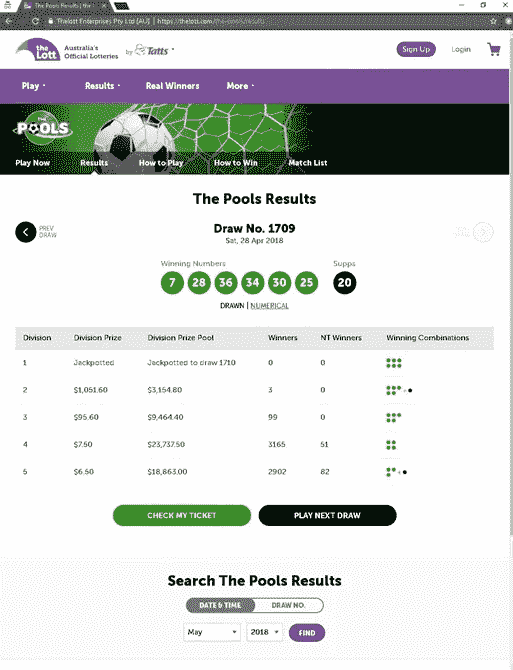
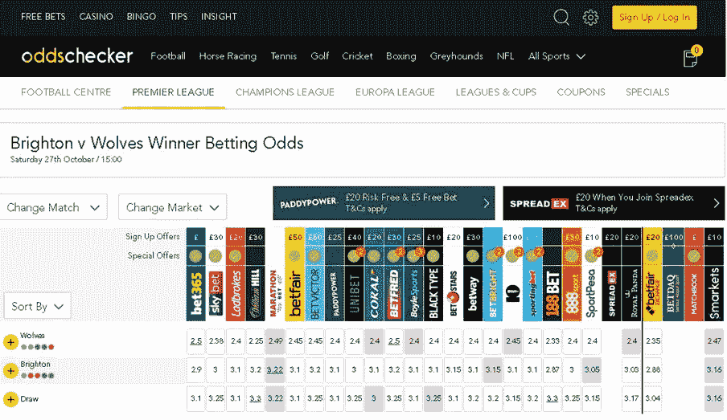
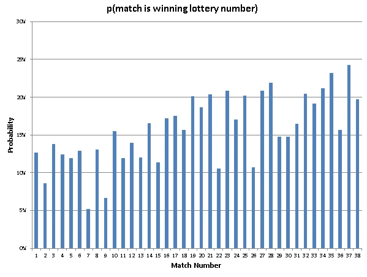
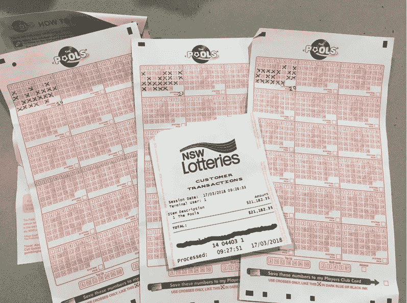
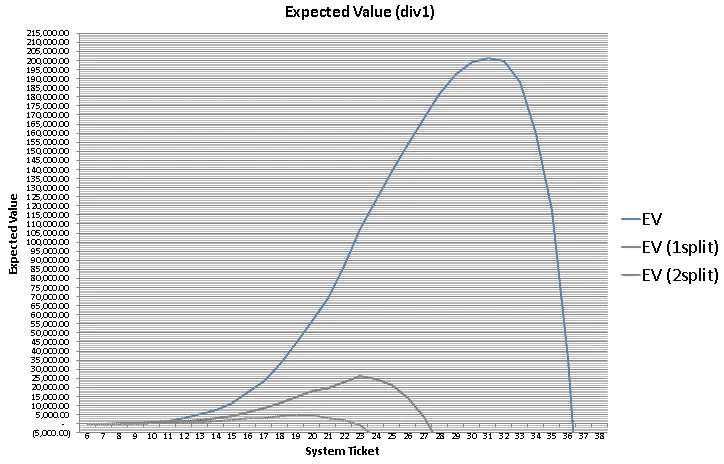
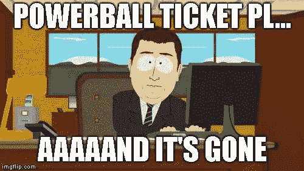

# 博彩彩票:一个赢家如何利用数学来克服困难

> 原文：<https://medium.com/hackernoon/gaming-the-lottery-how-one-winner-used-math-to-overcome-the-odds-71c8f688cedd>

Three out of every two people struggle with fractions

过去 6 年(2012 年至 2018 年)的每个星期，我都在玩彩票中奖。不仅仅是*希望*赢——玩“正期望值”(一种数学上的期望，平均来说，是赢而不是输)。2018 年 6 月，这个特殊的机会之窗关闭了，所以我决定分享更多关于获胜模式的信息，并揭示一些来自职业赌博秘密世界的严守秘密。

Oz Lotteries ‘Pools’ website one day after the game was discontinued

# 赢家走在我们中间

我们都听说过这样一句格言:“庄家永远赢”。这是*典型的*真实。

但是我们如何解释麻省理工学院的[学生](https://www.theatlantic.com/business/archive/2016/02/how-mit-students-gamed-the-lottery/470349/)或密歇根的[退休人员](https://highline.huffingtonpost.com/articles/en/lotto-winners/)在马萨诸塞州彩票中赢了数百万美元……很多很多次？有[俄罗斯数学家](https://www.wired.com/2017/02/russians-engineer-brilliant-slot-machine-cheat-casinos-no-fix/)在老虎机上逆向设计了随机数发生器(pRNG)。或者艾德·索普和突袭拉斯维加斯赌场的 21 点团队。谁能忘记那些在香港赛马会上赌马而成为亿万富翁的少数赌马者？

这些职业赌徒都去哪里切牙？他们如何学会打败这些碰运气的游戏？

Famous betting syndicates won billions of dollars betting on horse races at the Hong Kong Jockey Club

好消息是什么？这种东西没有大学文凭——几乎所有这些玩家都是自学成才的骗子。但是他们做功课。作业，和有意的练习。花足够的时间想出赚钱的方法，考虑各种角度，寻找弱点……通过努力、时间和一点运气，你会发现盔甲上的裂缝。

另一个好消息呢？这些游戏中的大多数都受统计规律的支配。因此，有了对数学和概率的(基本)理解，你也可以走上致富之路。

# 起源

那是 2012 年，我刚大学毕业，在香港做衍生品交易员。生活是美好的！周三晚上，我们会在跑马场喝啤酒，夏天的周末，我们会乘渡船去澳门(“东方的拉斯维加斯”)参加硬石酒店的泳池派对。

Macau casinos hosted Summer pool parties

然而，在业余时间，我越来越着迷于概率和统计数据。我被概率游戏和赌注所吸引。在阅读了本特和他的赌马辛迪加之后，我投入了更多的精力来研究和构建获胜的赌博模型。那年晚些时候，我与一位机器学习专家合作，试图模仿这些偶像，希望获得他们成功的一小部分。

# 实地考察旅行

有一次，在读完彼得·利斯顿(Peter Liston)的书《百万美元老虎机》(Million Dollar Slots)后，我受到启发，和一个朋友开始了为期数周的澳门赌场之旅，寻找被称为“极限累积奖金神秘渐进者”的特定老虎机。对于研究，我们:

*   从亚马逊上购买间谍相机笔

Spy camera pen used for filming slot machine reels

*   当我们玩$0.01 旋转游戏时，从我们的口袋中取出拍摄的吃角子老虎机卷轴
*   将镜头运送给 [upwork](https://www.upwork.com/) 的承包商，让他们手动将信息转录成. csv 文件
*   当机器提供正期望值时，使用数据来模拟精确的临界点

研究工作完成后，我们在接下来的周末回来，期待着一次征服。我们的每台目标吃角子老虎机的累积奖金都必须增加，所以我们坐下来等待其他玩家为我们做这项工作，他们的每一次旋转都将更多的钱注入累积奖金，并使其更接近突破点。最终，在紧张的几个小时后，机器进入了“成熟”状态。我们突袭了。赢得了……50 美元。遗憾的是，虽然这是一次“成功”的冒险，但准时的回报并不足以吸引人们再次光顾。

# 按比例放大

香港赛马会(Hong Kong Jockey Club)是一个政府认可的博彩垄断组织(很像美国的州政府)。他们经营一种叫做[六合彩](https://en.wikipedia.org/wiki/Mark_Six)的彩票，其中*的佣金高得惊人*46 %(在开奖之前，赌场作为他们的‘费用’保留的金额)。百分之四十六！然而，投注者不断回来玩六合彩，一周又一周。

目睹公众如此大规模的非理性行为，让我更加坚信，一定有办法让我从中分一杯羹。但是怎么做呢？我需要仔细看看彩票。但不仅仅是六合彩。

[Lotteries around the world](https://en.wikipedia.org/wiki/Lotteries_by_country)

彩票项目非常吸引人，我直接去工作了。利用谷歌和维基百科的不败组合，我开始编制世界各地的大型彩票清单。我会对每款游戏进行粗略的研究，并根据以下因素对它们进行排名:

1.  被打败的可能性。所有传统的“桶中抽球”型彩票都有众所周知的计算方法。很快就能看出谁的票价更有吸引力，谁更有机会获胜(*剧透:没有*)。奇异的或非随机的游戏(不是基于纯粹运气的游戏)更有吸引力
2.  *易于访问。即使我真的找到了有吸引力的彩票，我还能买票吗？我需要成为公民吗？我在这个国家有可以代表我执行死刑的朋友吗？*
3.  *[腐败的可能性](https://en.wikipedia.org/wiki/Corruption_Perceptions_Index)。也就是说，有些彩票可能不是真正的“随机”的。称之为愤世嫉俗(或现实)，但我通常很快就会认为这是腐败。这是根本不可能赢得一个彩票是预选为州长的表弟的最好的朋友。*

*然后，就在澳大利亚，吸引我眼球的游戏…*

# *Tatts 池*

*Tatts Pools 是基于经典的基于技能的英国游戏[football Pools](https://en.wikipedia.org/wiki/Football_pools)(‘soccer’for the unwashed)。从表面上看，这似乎是一次标准的抽奖，从 38 个选项中选出 6 个随机数(38 选 6)。如果没有中奖者，大奖就会像滚雪球一样越滚越大，还有一系列较小的二等奖。然而有一个*转折*。**所选数字并非完全随机，而是根据预定的欧洲足球比赛结果确定的。***

**

*Pools match list for determining winning numbers*

*深入探究游戏规则，我发现了以下重要信息:*

*   *每个预定的比赛都有一个任意的比赛号码。例如，上图中曼联对阿森纳是第三场比赛。*
*   *比赛进行了，并根据他们的结果排名。排名标准有 3 个部分:*

1.  *平局>客队获胜>主队获胜*

*2.如果不止一场比赛的结果相同，则进球数多>进球数少。例如，2–2 平局> 0–0 平局*

*3.如果结果相同，则选择具有更高匹配数的匹配。例如，如果两场比赛是 2-2 平，比赛#32 >比赛#5*

*   *最后，在按照上述 3 个步骤进行比赛和排名后，排名前 6 位的比赛号码被认为是中奖彩票号码。*

**

*Tatts Pools lottery result based on highest ranked football matches*

*在这一点上，如果你是一个职业赌徒，你可能已经感到刺痛。让我们再看一遍排名标准，深入了解一下思考过程:*

1.  *平局>客队获胜>主队获胜*

**反应:好的，当然。平均来说，这些中的任何一个比其他的更有可能吗？需要核对数据。**

*2.如果不止一场比赛的结果相同，则进球数多>进球数少。例如，2–2 平局> 0–0 平局*

**反应:好的，当然。同样，需要高水平地观察数据以观察匹配分数的分布。**

*3.如果结果相同，则选择具有更高匹配数的匹配。例如，如果两场比赛是 2-2 平，比赛#32 >比赛#5*

**反应:好吧，苏……等什么！？在这一点上，我跳出了我的靴子。对足球比分的基本了解告诉我们，比分往往很低，因此经常是相同的。eg 常见的比分是{0:0，1:0，0:1，1:1}。因此，如果进行 38 场比赛，许多结果完全相同的可能性非常高。这将触发该子句，强制所有排名最高的匹配(中奖彩票号码)成为具有高匹配号码的匹配**

*仅凭以上逻辑，我大概已经有了一个小小的正面预期(足以开始击败游戏)。但是是时候深入挖掘了…*

# *(立博)朋友的一点点帮助*

*下一个合乎逻辑的步骤是从高级数据分析过渡到低级数据分析。具体来说，我没有根据大样本平均值来处理所有的足球比赛，而是使用了额外的信息——我确切地知道哪些球队在比赛，并且可以获得这些球队的信息！比如英超，曼城(强队)很有可能击败哈德斯菲尔德(弱队)。这使得平局，一个根据排名标准排名很高的结果，不太可能。相反，曼城对利物浦是一场势均力敌的比赛，增加了平局的机会。*

*我现在面临两个选择:*

1.  *建立一个模型来预测足球比分(一些输入可能是关于球队获胜记录、进球、角球、球员受伤等的统计数据)**(困难)。***

**或**

*2.让其他人为我建立模型**(智能)**。欧洲已经有数十亿美元的足球博彩行业，每周有数百家博彩公司为每场比赛的结果定价。有了足够的经济刺激+市场的复杂性，大众的智慧应该决定，平均而言，博彩赔率将是对每场比赛结果的合理准确的估计。没有必要把事情搞得太复杂——这些信息是免费的。*

**

*oddschecker.com’s football bookmaker aggregator*

# *模型*

*现在我有了一些参数来构建一个模型。确切地说，我如何估计匹配有多大可能排名最高(并因此赢得彩票号码)？*

*从广义上讲，数学解可以通过分析得出(精确解，用笔和纸，例如解代数方程)，也可以通过数字估计(“猜测和检查”类型的方法，利用计算能力接近真实答案)。*

> *模型是现实的简化版本，就像一张显示你如何从一个城市的一个地方到另一个地方的街道地图——埃德·索普*

*Pools 问题非常复杂，我认为最简单的方法应该是数值方法，通过强力的蒙特卡罗模拟得出一个估计值。这包括:*

*   *编写一个知道匹配排序标准的计算机程序。*
*   *列出一周的所有比赛，并使用博彩公司的数据为每个结果分配特定的概率(平局，主场胜利，客场胜利)。*
*   *模拟所有被玩 500，000 次的匹配，以得出每个匹配落入排名前 6 的匹配的可能性的估计(并因此被认为是中奖彩票号码)。*

**

*Probability each match is a winning lottery number from 2018-03-26\. Note the sum of all columns = 600%, as there are 6 winning lottery numbers selected each week. Note also the positive slope toward the higher match numbers, courtesy of ranking criterion #3*

# *实际问题*

*最后，一旦我对哪些彩票号码可能中奖有了估计，我就必须处理一些现实世界的障碍，比如期望值和执行(购票)。具体来说，我买多少张彩票，什么时候买，怎么买？以下是一些相关的注意事项:*

*   ***奖池**。头奖大到足以吸引人们在本周购买门票吗？如果没有，需要静观其变，希望没有人赢，头奖不断滚雪球。*
*   ***执行**。一旦我知道哪些匹配可能是中奖号码，我就不能只买一张包含前 6 个选项的单个彩票。这将是*非常*不太可能获胜。我需要购买 6 个选项的每一个组合，我计算出它们的期望值都是正的。幸运的是，塔茨普尔有一种叫做“系统 20”的本地组合票。这张票相当于购买 38，760 张个人票(20 选 6)，每周花费 21，182 美元。*

**

*$21,182 System 20 Tatts Pools lottery tickets*

*   ***分裂**。其他人也能赢的概率有多大，我需要平分奖金？这会*损害*期望值。利用每周的门票销售，我会查看奖池的增长情况，计算出那一周售出了多少张门票，然后使用[泊松分布](https://en.wikipedia.org/wiki/Poisson_distribution)来估计我期望与多少其他中奖者分享。*

**

*Expected value drops off a cliff when a jackpot is split with other players*

*   ***其他专业人员**。如果有其他人发现了相同的优势，并在运行类似的模式/系统，那么这几乎肯定会导致奖金分成，并成为两个群体的丑陋命题。令人欣慰的是，对历史普尔奖金的研究表明，没有其他玩家利用这一优势。*
*   ***二等奖**。正确选择 5/6 和 4/6 中奖号码的彩票获得了二等奖。我希望在任何一周都能赢得数百张，所以我需要考虑到票价的折扣。*
*   ***资金**。任何经验丰富的赌徒都非常熟悉[凯利标准](https://en.wikipedia.org/wiki/Kelly_criterion)和资金管理的重要性。在典型的赌局周中，用模型和系统 20 彩票赢得头奖的概率是 5–7%。因为这是一个罕见的事件，我需要做好准备，以失去一大笔钱之前出现胜利。*
*   ***误差幅度**。由于所有博彩公司的赔率只是对真实概率的估计，因此押注于微小的正期望值是不明智的。我需要等待一个足够大的累积奖金，以便有一个舒适的误差幅度，这样即使庄家的赔率不正确，我仍然应该玩这个游戏。*

# *结果*

*上述模型已经生产了 6 年。累积奖金很少吸引人，所以激进的游戏(系统 20)被制作成<50 times. While I won’t reveal the precise number of jackpots or dollars won, I will say the bankroll draw down prior to a jackpot win was -$300k. This was running below expectation, but bad variance needs to be accepted in any probabilistic gambling system.*

# *Conclusion*

*Reflecting on the opening proposition that ‘the house always wins’, I’d like to point out this is still intact. It’s important to realise that the loser in the Tatts Pools game was *而不是* Tatts，他们通常从门票销售中收取费用。累积奖金的资金来自门票收入。输家是那些不老练的玩家，他们通过随机和次优的门票购买，为每周不断增长的累积奖金做出了贡献。*

*本文提到的职业赌博的例子几乎都是如此。如果庄家没有赢，他们会很快发现(毕竟知道这些是他们的事)。因此，大多数职业赌徒通常与赌场分享从非职业玩家那里获得的奖金。*

*我的结论是，在大多数标准彩票中，当你买一张彩票时，你的预期回报是负的 50%。也就是说，平均而言，你在彩票上每花 1 美元，你预计只能得到 0.5 美元的回报。减轻口袋重量的创新方法。但是用一点数学，也许你可以扭转局面，找到彩虹尽头的那罐金子。*

**

**想多聊聊/有个有趣的提议？在 brynsolomonmedium@gmail.com 联系我**