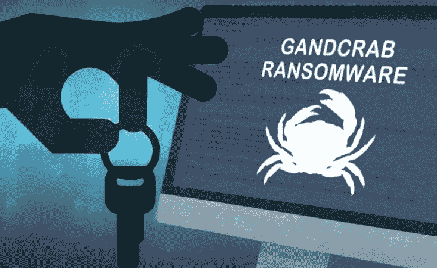

# gand crab-2019 年最流行的勒索软件

> 原文：<https://medium.com/hackernoon/gandcrab-the-most-prevalent-ransomware-in-2019-933a722bb42d>

文件加密勒索软件在过去几年里经历了显著的起伏。由于 2017 年底恶意加密货币挖掘应用的涌入，这一领域的网络犯罪急剧下降，只有最持久的菌株才能存活。一个名为 GandCrab 的样本在这个间隙首次亮相，并成为游戏规则的改变者。

随着 2018 年 1 月记录的第一批感染病例，这一血统迅速获得了牵引力，并开始主导勒索领域。它的原始变种被精心制作，足以防止免费解密，所以用户突然发现他们的个人文件被附加了奇怪的。GDCB 扩展没有机会恢复人质数据以外的赎金方式。随后出现的版本用。螃蟹和。KRAB 字符串，被一系列使用随机受害者特定扩展的害虫角色所取代。

截至 2019 年 3 月，GandCrab 家族已经产生了 9 个不同的变种和颠覆版本，并且[达到了 v5.2](https://myspybot.com/gandcrab-5-2/) 。多亏了 Bitdefender，最近[发布了一个免费的解密器](https://labs.bitdefender.com/2019/02/new-gandcrab-v5-1-decryptor-available-now/)，支持 5.1 的迭代，许多受害者能够恢复他们宝贵的数据资产。然而，目前形式的感染无法通过这种方式解密，这证明研究人员总是落后一步。

# **配送等招数**

以下是 GandCrab 船员在罪犯的进化过程中采用的机制的概述，以大规模传播它，并使可疑的货币化组合多样化。

2019 年 1 月下旬，一场复杂的网络钓鱼活动伪装成[紧急出口地图更新](https://myonlinesecurity.co.uk/gandcrab-5-1-via-up-to-date-emergency-exit-map-rosie-l-ashton/)发送了 GandCrab 有效载荷。这些电子邮件看起来像是一个微调过的指令，要求收件人在发生火灾或任何其他需要疏散的灾难时离开他们的大楼。这样一个棘手的问题促使大多数用户打开附带的 Word 文档，并启用宏来查看内容。这样做启动了一个不起眼的 PowerShell 脚本，在幕后下载了勒索软件。

2019 年 2 月，安全分析师[揭露了](https://www.coveware.com/blog/2018/12/11/beware-of-dishonest-ransomware-recovery-firms)gand crab 运营商和 sketchy 数据恢复公司之间不道德的合作关系。这些公司声称提供无缝文件解密，收费高于赎金的实际数额。许多绞尽脑汁试图找回数字生活的用户选择了这种中介服务，结果却支付了比敲诈者想要的更多的钱。原来，无良中间人可以访问勒索软件 Tor 支付页面上的隐藏折扣功能，从而赚取一些肮脏的额外资金。

尽管 GandCrab 运动大部分是恶意的，但对受困扰的用户也有些许同情。2018 年 10 月中旬，网络罪犯决定[为居住在叙利亚的受害者发布解密密钥](https://www.bleepingcomputer.com/news/security/gandcrab-devs-release-decryption-keys-for-syrian-victims/)。动机是一名叙利亚男子在[的推特](https://twitter.com/kvbNDtxL0kmIqRU/status/1052075557112942592)上声明勒索软件已经锁定了他死去孩子的照片。勒索者上传了一个 ZIP 文件，其中包含一个地下黑客论坛的密钥，并写道，他们应该首先将叙利亚从目标国家名单中排除。安全供应商很快更新了他们的免费解密工具，从而为来自中东国家的用户自动恢复。

GandCrab [的首次爆发表明](https://blog.malwarebytes.com/threat-analysis/2018/01/gandcrab-ransomware-distributed-by-rig-and-grandsoft-exploit-kits/)它不是一种普通的菌株。这是唯一一个与比特币一起接受以隐私为中心的 Dash 加密货币赎金的样本。此外，与大多数勒索木马相反，它通过 Rig 和 GrandSoft 漏洞利用工具包进行传播，这些工具包利用未打补丁的软件中的缺陷来删除有害的二进制文件。这场战役的所有元素都是从头开始精心设计的，表明对手是技术高超的网络黑客。

白帽子在抵御 GandCrab 流行病方面取得了一些突破。这些计划中最早的[在去年二月底成为头条](https://www.europol.europa.eu/newsroom/news/free-data-recovery-kit-for-victims-of-gandcrab-ransomware-now-available-no-more-ransom)。罗马尼亚执法部门策划了一次行动，缴获了勒索软件分销商使用的一些 Command &控制服务器。获得的密钥使 Bitdefender 能够为 GandCrab v1 创建一个解密器。不幸的是，犯罪分子在一周后推出了一种新的变种，该工具无法再破解它。

韩国安全软件提供商 AhnLab 的另一项反勒索举措引发了 GandCrab 制造商的某种[报复](https://www.bleepingcomputer.com/news/security/gandcrab-ransomware-author-bitter-after-security-vendor-releases-vaccine-app/)。2018 年 7 月，分析师们想出了一个阻止加密病毒破坏文件的 kill switch。该应用程序让电脑看起来好像已经感染了这个样本，这迫使 GandCrab 终止了突袭。

攻击者通过为新的勒索软件变种配备针对 AhnLab Lite 防病毒套件的零日漏洞来应对这一策略。理论上，这可能会使反病毒面临拒绝服务问题。在实践中，安全工具在错误可能导致 BSOD 或任何其他损害之前检测并阻止了恶意代码。

GandCrab v5.0 在 2018 年 9 月利用了 Windows 任务调度器的 ALPC(高级本地过程调用)组件中的一个[漏洞](https://blog.barkly.com/windows-task-scheduler-alpc-zero-day-exploit)。通过利用这个零日漏洞，勒索软件实现了权限提升效果，并可以在受感染的计算机上执行任意进程。特别是，它删除了受害者数据的卷影副本，并以这种方式生成了桌面背景警告。虽然微软在同一个月修补了这一漏洞，但由于用户迟迟不应用更新，许多机器仍然暴露在外。

2018 年 9 月初，GandCrab [背后的威胁演员在他们的发行剧目中添加了另一个被称为辐射的利用工具包](https://www.fireeye.com/blog/threat-research/2018/09/fallout-exploit-kit-used-in-malvertising-campaign-to-deliver-gandcrab-ransomware.html)。尽管这种恶意框架仅在一周前出现，但它已经因传播一种名为 SmokeLoader 的恶意软件下载程序和一些讨厌的应用程序而臭名昭著。辐射利用过时版本的 Adobe Flash Player 和 Windows VBScript 引擎中的已知漏洞进行远程代码执行。漏洞利用工具包存放了 GandCrab v4(。KRAB 扩展)作为第二级有效载荷加载到易受攻击的计算机上。

安全研究人员在与 GandCrab 的战斗中取得的[最大胜利](https://www.bleepingcomputer.com/news/security/gandcrab-decrypter-available-for-v51-new-52-variant-already-out/)于 2019 年 2 月形成。Bitdefender 更新了他们的解密工具，现在支持勒索软件的所有主要版本，最高版本为 v5.1。这是由于供应商与欧洲刑警组织和不同国家的执法实体的合作而成为可能。然而，这种快乐是短暂的。几天后，重罪犯发布了无法解密的 GandCrab 5.2 版本。

## **结论**

GandCrab 是目前世界上最大的勒索软件威胁，尽管安全智库做出了各种努力，但它仍在蓬勃发展。虽然在恢复人质数据方面的成就是显著的，绝对值得称赞，但犯罪分子总是有新的锦囊妙计来超越分析师。

在这种情况下，主动防御是保持安全的最佳方式:

用户应该定期备份他们最有价值的文件。

保持操作系统和第三方软件最新

谨慎对待可疑的电子邮件附件和链接。

使用杀毒和 [VPN 软件](https://gobestvpn.com/reviews/nordvpn/)。