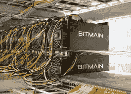
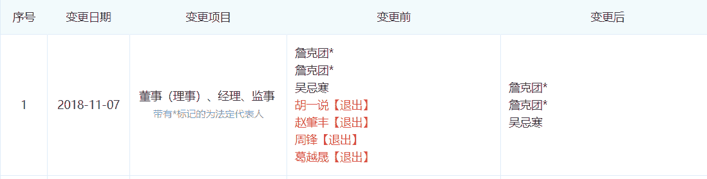

# 比特大陆创造现金流的努力

> 原文：<https://medium.com/hackernoon/gcr-exclusive-bitmains-efforts-to-generate-cash-flow-bitmain-co-founders-micree-zhan-off-to-baab83c904e2>

# 联合创始人和分别创办了一家新的矿业公司和一家名为 Matrix 的区块链公司

今天，中国的一个媒体网站“今日头条”报道了一个由联合创始人詹(Micree Zhan)领导的采矿场突然出现在中国四川。人们猜测 Micree 是否会在离开比特大陆首席执行官的职位后重返采矿业。

然而，据消息人士称，这可能是比特大陆自去年熊市以来的“联合开采”战略的结果。

值得注意的是，这是一个巨大的部署。据悉，詹在汛期到来的前两个月匆忙部署了 10 万个挖矿单位，纯挖矿比特币。如果满载，10 万台矿机相当于 1.33EH/s，约占比特大陆全网计算能力的 3%，相当于火币矿池功率之和。

在过去的六个月里，加密货币领域一直处于下降趋势，大多数与之相关的公司都经历了糟糕的财务状况。比特大陆、迦南、亿邦国际等三大矿商去年赴港申请 IPO，目标是拓展融资渠道。但截至目前，后两家矿商的 IPO 申请已经到期，比特大陆的结果难以预料。

去年年底，今日头条报道称，詹晓宁和韩吉同时辞去了比特大陆 CEO 的职务。随后，比特大陆随着比特币价格继续下滑，大规模拆除其矿山，裁员 50%，等等。

比特大陆官方很少透露其真实经营状况、最新进展等。，所以外界很难真正了解正在发生的事情。但在今年的公司年会上，一张照片显示，詹(Micree Zhan)捂脸哭泣，站在他身边安慰他。或许，这张图片可以显示比特大陆的情况是多么复杂和痛苦。

3 月 4 日，今日一行与一起询问了詹的四川矿区。他们的回应是:“这只是公司之间的一般商业合作，请专注于业务关系，而不是个人历史。”

**比特大陆的 10 万台采矿机器正在为中国的汛期做准备，由 Micree Zhan 接手负责**

“詹出来在四川创建了一个拥有 16 万负载和 10 万个采矿单位的采矿场。”一位名为赵一鸣(化名)的矿业内部人士透露。

在过去的两个月里，比特大陆一直在拆除，出售机器，并进行大规模裁员。但另一方面，该公司仍在前进。

行业资料显示，2018 年 11 月 22 日，一家名为海南大陆方舟数据科技有限公司(以下简称“方舟”)在中国海南注册成立，注册资本 3000 万人民币，一个叫王明的人占 100%的股权。

两个月后，福建创客科技有限公司(以下简称“福建创客”)加入，收购了方舟 40%的股份。福建创科为比特大陆拥有 100%股权的公司，詹被指定为双方的法定代表人。

加入福建创客的还有 Micree Zhan，她自今年 1 月 29 日起担任该公司的高管。

有人认为方舟就在赵一鸣所说的四川矿区的后面。

赵一鸣说，比特大陆在中国国内的电费普遍非常高。最近，他们终于找到了在四川获得便宜电价的方法。这些煤矿将利用水力发电部署在四川，预计将于 5 月开始运营。

五月是四川的洪峰时期，电费可以少于两美分人民币或 0.07 美元。近几年，每到春节/过年之后，总有大量的矿通过搬迁到四川来追逐低电价。

Odaily 还了解到，Micree 旗下的煤矿将运行 Ant mining 机器 S11 和 15 型(S15 和 T15)，这两种机器都是比特大陆所有的煤矿。

**比特大陆的联合采矿模式及其成为轻资产的努力**

那么，这个新的矿池对比特大陆意味着什么呢？

去年 12 月,《今日报》报道称，比特大陆希望开展联合采矿合作，即合作伙伴提供电力和采矿场，比特大陆提供采矿机器。

这是比特大陆寻求摆脱库存的方式，以便在加密的冬天保护资本。

一位知情人士表示:“与比特大陆合作的公司还需要预付电费，以减少在比特大陆的资金投入。”

然而，对于这样的模式，矿主陆源(化名)透露，进展并不顺利:“在这种模式下，比特大陆只提供机器，不支付押金，所以，到目前为止很少有矿主愿意合作。”陆源说。

虽然矿业集团不愿意与比特大陆合作，但显然外人愿意。在 2 月初的春节前，一些业内人士透露，一位房地产行业的高管已经同意与比特大陆合作开采。

值得注意的是，现在由 Micree 经营的 Ark 公司可能会与比特大陆公司在这种“联合开采”模式下进行合作。3 月 4 日，Odaily 就此事询问比特大陆，其官方回应是:“这只是公司之间的一般商业合作，请专注于业务关系，而不是个人历史。”

另外，公司方舟的第一大股东王明也是矿业社区不知道的，很可能是社区外的人。

**在加密寒冬中转向轻资产模式**

目前，比特大陆正经历建国以来最严重的困境。

公开数据显示，1 月 28 日，BTC.com 和比特大陆的蚂蚁池占比特币计算能力的 25%，一度超过 50%。

去年 12 月，比特大陆经历了超过 50%的裁员，近 1700 人，所有 BCH 员工都被解雇了。

根据德克萨斯州当地媒体 12 月的报道，比特大陆已经停止了其在德克萨斯州的采矿业务，就在 5 个月前，它宣布将在该市创造 400 个就业机会并投资 5 亿美元。

而据去年年底的消息，比特大陆将削减所有的采矿业务:“最多留下 10 个人做一些轻资产业务”。然而，经过这么长时间，比特大陆的采矿业务似乎并没有停止，而是转向了资本密集投资较少的“联合采矿”方法。

陆渊向《今日秀》透露，比特大陆一直在努力创造现金流。早在去年 12 月底，知情人士表示，比特大陆正在为一家名为 BitDeer 的客户开发云计算平台，它将把自己的矿机、电力和维护成本一起打包出售给该客户，以换取现金流。

对于业务的调整，陆源说:“以前吴负责矿池，但它不是专业运营的——他们有一堆人坐在那里无所事事，而且他们找不到便宜的电力，运营和维护也不好。现在，他们正把采矿场从比特大陆分离出来，由联合创始人詹(Micree Zhan)管理

通过裁员、联合采矿模式、出售云计算能力和剥离采矿业务，比特大陆希望尽可能减轻其原有的重资产模式，并创造稳定的现金流。另一方面，它继续专注于核心业务，并计划很快推出蚂蚁矿机 S17。

**比特大陆所剩无几；吴去了一家叫矩阵**的新公司

最近，今天收到一张比特大陆年终年会的照片。

在明亮的灯光下，詹看起来像是在流泪，吴在安慰他。

韩吉的推特一直活跃到现在，但他似乎从去年 12 月 18 日就消失了。只在 2 月 18 日发了一条推文介绍 BM1397 芯片。

2 月 26 日，陆源看到詹(Micree Zhan)出现在北京国际机场，从北京飞往深圳。

比特大陆正在慢慢地放弃自己。它正在削减 BCH 团队，削减采矿农场，剥离其非核心人工智能业务，甚至两位创始人都在离开。

去年 12 月 28 日，今日新闻报道，韩吉和詹晓宁将不再担任比特大陆首席执行官。继承人是一个姓王的个人。后来才知道，这个姓王的人就是前产品总监。赵一鸣说，目前，韩吉和米奇里不负责比特大陆的任何具体事务，只是作为股东存在。

“米奇里和韩吉都明白双重 CEO 头衔对比特大陆不利，所以他们放手了。”赵一鸣说。

“联席 CEO 非常容易出问题。在联合首席执行官的历史上，结果并不好。”Litecoin Pool CEO 蒋对今日说。

3 月 1 日消息，据侯科技报道，可能很快会成为一家名为 Matrix 的公司的负责人，由前高级投资总监葛·出任现任 CEO。

Matrix 是今年 2 月左右成立的新公司。从法律角度来看，它与韩吉和比特大陆没有任何关系，而且已经获得了可观的投资。Matrix 的许多员工之前在比特大陆负责 BCH 业务。

值得注意的是，年仅 27 岁的葛于越也曾是比特大陆的联合创始人和执行董事。在该公司成立时的 2013 年年报中，主要股东有五个，其中詹(Micree Zhan)持股 59.2%，第二大股东是通用电气于越，持股 28%。2018 年 11 月，公司发生变动，葛等四名董事退出，只剩下詹和吴两人。

尽管 Matrix 的许多人来自比特大陆·BCH 团队，但主要业务似乎集中在区块链，而不是 BCH。

赵一鸣透露，在筹备新公司之前，韩吉已经被解雇了。但裁员进展并不顺利。“有很多人对上次裁员不满，BCH 大约有 40 名员工，很多人选择不回去(新公司)。”

还有不到一个月的时间，比特大陆在香港的 IPO 申请将迎来截止日期，我们期待看到该公司将向公众披露什么。