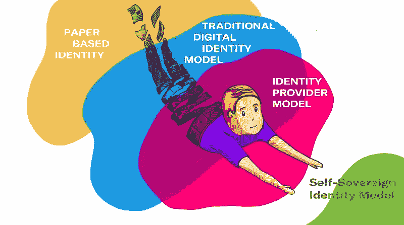
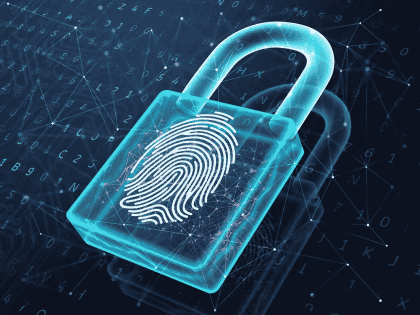
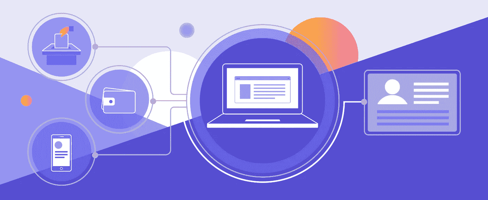
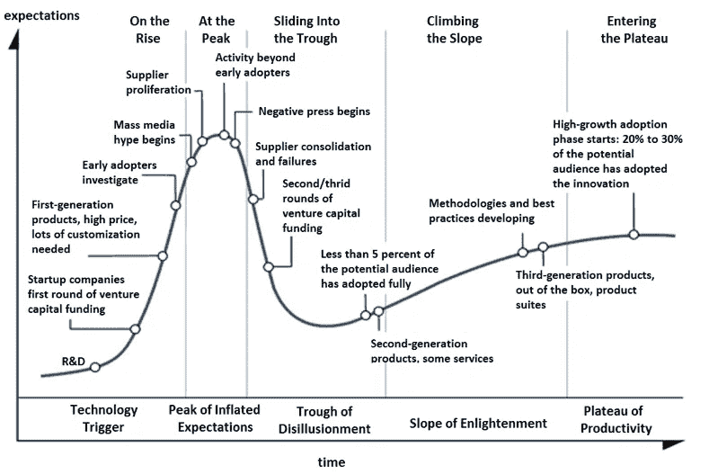

# GDPR 和自我主权认同:未来会怎样

> 原文：<https://medium.com/hackernoon/gdpr-and-self-sovereign-identity-what-lies-ahead-56de20055d5c>

[https://medium.com/metadium/the-evolution-of-identity-and-metadiums-role-db88e70ba79d](/metadium/the-evolution-of-identity-and-metadiums-role-db88e70ba79d)

GDPR 和自我主权身份有很多共同之处。GDPR 教规定了“被遗忘的权利”,自我主权身份使这一权利适用于分散的网络。那么，这两种隐私功能何时以及如何相交呢？

像 [Blockstack](https://blockstack.org/) 、 [Sovrin](https://sovrin.org/) 或以太坊 [uPort](https://www.uport.me/) 这样的自主权和分散身份(DID)解决方案代表了数据所有权的创新机会，它们使用区块链彻底颠覆了当前的集中式身份管理模式。

身份管理是在线应用程序的重要组成部分。通常，当用户注册在线服务时，会为该应用程序创建一个自定义身份。因此，我们注册新的服务，并不断创建新的用户名和密码组合。 ***问题在于身份没有单一的真实来源，因此新用户的加入需要为每个独特的应用程序生成新的用户配置文件。***

[https://bcfocus.com/news/coinbase-engages-in-a-year-long-experiment-to-roll-out-digital-identity-solutions/43957/](https://bcfocus.com/news/coinbase-engages-in-a-year-long-experiment-to-roll-out-digital-identity-solutions/43957/)

# 集中式身份与分散式身份

一些集中式服务，如谷歌和脸书，创建了单点登录和联合 ID 管理系统，以跨第三方连接和网站共享特定的 ID 属性，从而为其平台创建单一身份。然而，在不知情的情况下，用户通常会放弃他们创建单点登录 id 的权利，而第三方会利用这些权利来为自己谋利。

*不是免费提供你所有个人数据的权利来换取服务，而是授权各种区块链系统的用户选择哪些数据* ***(例如*** ***姓名、电话号码、地址等)。*** *)可供分散式应用程序(dApps)使用，持续多长时间，以及在什么条件下数据是可访问的。*

DID 的一个令人兴奋的优势是能够精确地选择哪些数据是可共享的( ***例如，只有你的名字；不是你的电话号码*** )并对其使用设置限制，包括随时撤销分散应用的访问权限。这一进步让用户重新获得控制权，并有助于在未来克服复杂的治理和合规性问题，如 GDPR。

[https://www.ledgerinsights.com/sovrin-hyperledger-indy-blockchain-identity-equifax/](https://www.ledgerinsights.com/sovrin-hyperledger-indy-blockchain-identity-equifax/)

# 自我主权身份是圣杯

DID 的圣杯是自主权 ID，它使用公共区块链和(有时)同态加密技术来安全地保护用户的隐私，从而实现完全的数据所有权。

今天，像脸书和谷歌这样的公司默认拥有你所有的数据，并允许你根据要求下载一些——但不是全部——个人数据。自主 ID 与脸书这样的中央集权竞争对手形成鲜明对比。Blockstack 等自主 ID 解决方案让您可以默认拥有自己的数据，并设置权限让应用程序为特定用途请求个人数据，而不是放弃您的权利。

目前，为了使 DID 解决方案能够与集中的现有者竞争，仍然需要克服几个核心障碍。例如，像 ***密码重置*** 这样的核心功能需要实现和微调。不同于集中式系统，在集中式系统中有管理能力来忽略用户错误和失误，目前没有办法重置在 DID 系统中已经丢失、被盗或损坏的私有密钥。

*因此，就目前而言，集中式、单点登录和联合 ID 管理解决方案在管理数字身份方面仍占上风。虽然我对 DID 重组的承诺感到兴奋，但我相信找到一个中间立场会比当前权力动态的完全逆转更快实现。*

# 标准化的兴衰

正在为分散式身份识别器开发的 W3C 标准显示了一种解决方案的前景，这种解决方案可以帮助从集中式和联合式身份识别器平稳过渡到分散式替代方案，让区块链初创公司和大型技术公司都能创建可互操作的身份管理解决方案。

总的来说，开放标准使一个公平的竞争环境成为可能，并开放通用技术(GPT)供大众使用和改进。例如，HTTP & TCP/IP 协议的开源标准化为大量使用万维网打开了大门，并迎来了 90 年代在线应用程序开发的大爆发。

[https://perfectial.com/blog/self-sovereign-identity-platforms/](https://perfectial.com/blog/self-sovereign-identity-platforms/)

***采用一种能够实现公平、开放和可用标准的 DID 方法，可以帮助那些受到身份管理方面的集中式现任者束缚的用户实现更多的在线隐私和独立性。***

由于几乎所有在线应用程序都使用某种形式的身份，分散身份的发展可能会影响我们今天参与的许多行业和垂直行业(从社交媒体到银行、旅游和酒店以及政府服务)。

# 公共的，私人的，政府的

公共、私人和政府的 DID 使用之间应该有一个重要的区别。今天，政府颁发和维护重要的身份凭证，如出生证明、社会安全卡、驾照和护照。但是，在未来，可能会有不同的动态在起作用。其中 DID 混合了私有、公共和合法域，以根据使用中的应用来认证个人身份的不同属性。我相信 DID 的这个多方路线会在未来几年走到一起。

[https://www.ibm.com/blogs/blockchain/2018/10/decentralized-identity-an-alternative-to-password-based-authentication/](https://www.ibm.com/blogs/blockchain/2018/10/decentralized-identity-an-alternative-to-password-based-authentication/)

总之，这种通用技术的机会是巨大的。当权衡 R&D、实现、易用性和互操作性的成本与收益时，DID 的实际效用问题归结为实用性。

# 早期采用者为更多真实世界的用例打开了大门

DID 的一些早期应用是使用公共区块链( ***例如*** [***民间***](https://civil.co/) ***和***[***po . et***](https://www.po.et))的数字媒体权利管理、许可和所有权证明。目前，使用公共的、不可变的区块链实现 DID 的性质使得很难编辑各种媒体类型的私有属性或修改时间戳记录，如版权和数字权利许可的区块链证明。此外，将现实世界的法律主张与数字版权管理和许可相协调的能力仍然是开放的。

因此，我们目前被困在可想象的效用、技术能力和法律权威之间的十字路口。随着区块链技术和 DID 标准的不断发展，我相信更多的实际应用将进入主流。总的来说，我相信在未来 5 到 10 年内，我们将开始看到 DID 对 GDPR、版权和数字版权许可等计划的现实影响。