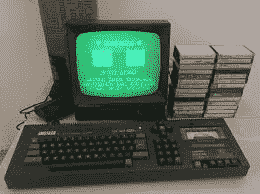
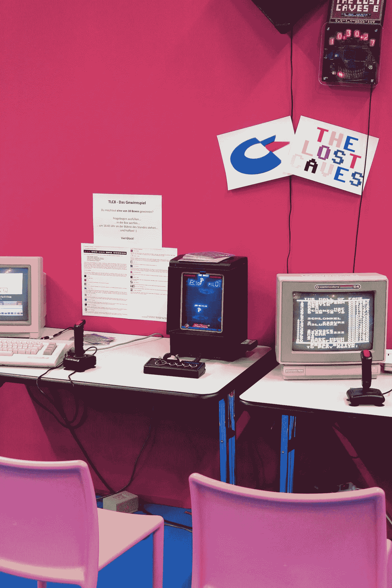
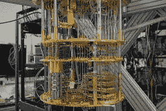
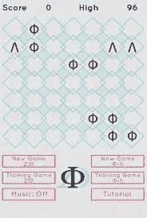

# 极客视频游戏文化接近量子现实

> 原文：<https://medium.com/hackernoon/geek-video-game-culture-verging-on-quantum-reality-99b12d87a887>

## 20 世纪 80 年代的年轻人被电脑游戏迷住了。扮演蝙蝠侠:披着斗篷的十字军，踢小丑的屁股，是我经历的一部分。但是有一个运动，量子计算世界——它将如何塑造未来的游戏？

Photo by [Boudewijn Huysmans](https://unsplash.com/@boudewijn_huysmans?utm_source=unsplash&utm_medium=referral&utm_content=creditCopyText) on [Unsplash](https://unsplash.com/search/photos/joker?utm_source=unsplash&utm_medium=referral&utm_content=creditCopyText)

# 绿屏怀旧

当我想到怀旧的时候，我不会想到互联网，不会想到和朋友一起踢足球，也不会想到周六下午在电视上看《T2》和《T3》。怀旧，我说的是纯粹的怀旧，就是玩电脑游戏。回到 1985 年或者 1986 年，我爷爷给我买了一台二手的 Amstrad CPC 64k 个人电脑。这是一台我珍藏了多年的机器，直到有一天我把它扔掉了。

Oh, my youth, how I miss you. Source: ebay

那时候，当电影《七宝奇谋》在影院上映时，杜兰·杜兰主宰着电视广播，冷战威胁着世界和平，我记得我坐在电脑前玩了几个小时的游戏，比如《Yie Ar Kung Fu》、《Chuckie Egg》、《捉鬼敢死队》和《谁能忘记李小龙》?

> 我最近了解到一些关于电子游戏的有趣的事情。许多年轻人在玩这些游戏中发展了令人难以置信的手、眼和脑的协调能力。空军相信，如果这些孩子驾驶我们的喷气式飞机，他们将成为我们杰出的飞行员。
> 
> 罗纳德·里根，1983 年

我的父母，当时的勒德分子和现在的勒德分子，总是在黑色的好奇心面前看着我，带着一个绿屏显示器，转移了他们儿子的注意力，阻止他定期做家务和作业。

> 太好了，我想。

不过，在我爱上电脑(或者更重要的是电脑游戏)之前，我是一个狂热的读者。我每周会读一两本书:《地下铁路》、《黑美人》、《动物庄园》。年轻人的东西和足够的历史书让我永远忙个不停。至少在 20 世纪 80 年代和 90 年代初的大部分时间里，电脑游戏夺走了这一切。

***后来我成年了，找回了读书的魔咒。但是那些时光的怀旧一直伴随着我。***

作为一个流行文化的粉丝，我现在可以看到计算机和极客文化是如何对这种类型做出不可估量的贡献的。如果没有雅达利这样的公司，没有史蒂夫·乔布斯(Steve Jobs)和史蒂夫·沃兹尼亚克(Steve Wozniak)这样的人，也许科技世界会被推迟一二十年——或者至少几年——给我的童年留下一个冰冷、黑洞般的真空，没有显示器屏幕上史前像素的迷人吸引力，也没有游戏载入卡带播放器时三分钟的哔哔声和尖叫声。

> 那时的生活会是什么样子？

**不说了。**

Photo by [Magnus Reiß](https://unsplash.com/@dabu?utm_source=unsplash&utm_medium=referral&utm_content=creditCopyText) on [Unsplash](https://unsplash.com/search/photos/game-console?utm_source=unsplash&utm_medium=referral&utm_content=creditCopyText)

自从 60 年代计算机时代早期的大型机器出现在大学校园里，由戴着蝴蝶结、带着角质框眼镜、有着笨拙时尚感的人控制，它们的能力和娱乐能力呈指数级增长。起初，它们很贵，超出了普通青少年(及其父母)的支付能力。但到了 20 世纪 70 年代末，情况发生了变化。计算机的民主化开始了。

> 个人电脑诞生了。
> 
> 游戏机也是。

然后还有随之而来的游戏。他们改变了游戏规则。他们在机器和用户之间创造了一种社交氛围。玩扑克成了一项社交活动，一种交友和联系的方式。

## 还有比这更好的吗？

# 我不是黑客

好的，他们也有一个严肃的角度，比如黑客。谁能忘记 1983 年由年轻的马修·布罗德里克领衔主演的[*WarGames*](https://www.imdb.com/title/tt0086567/)——至少对我来说，当我的一个更懂技术、拥有 ZX 频谱的朋友得到一个调制解调器时，它成了我短暂的黑客生涯的催化剂。我们不是黑客，也没有连接到 WOPR 超级计算机或任何其他计算机。

***退休来得早。***

20 世纪 80 年代技术领域的变化令人难以置信。

> 我在几分钟内消耗完了所有多余的生命，我最不喜欢的两个字出现在屏幕上:游戏结束。
> 
> —欧内斯特·克莱恩

滚动三十五年左右，2019 年那些电脑看起来很搞笑。64k 的处理能力在今天一点用都没有，但在当时这已经足够令人印象深刻了。摩尔定律对计算机很有好处。但是它已经过时了。

> 新的权力转移将会不可逆转地改变技术世界。

从最初的游戏到网络的时间顺序是一个巨大的进步。然而，现在我们正在进入一个新的领域，一个远离大多数人所能理解的领域，量子计算。

**随之而来的是，那个让我记忆犹新的时代正在消失。这并不是说电子游戏已经成为过去。不——根据 *Best The News 的报道，游戏产业正在增长，到 2020 年，市场价值将从 2017 年的近 786.1 亿美元增长到超过 900 亿美元。***

> 然而，它们未来会是什么样子呢？

# 量子世界，宝贝！

你已经打开了你的量子计算机，如果你曾经见过的话，这是一件艺术品——不完全是米开朗基罗的艺术品，但也不远了。更接近苹果名人乔尼·艾夫斯的创造力。但是很抱歉，你没有“打开”，而是“做了”你必须做的任何事情来访问它。

你也有一个强大的机器，十个，二十个，甚至五十个超导量子比特在处理器里。

> 但是谁在数呢？

**那里也很冷，冷得让人发抖，几乎是绝对零度，严格来说是零开尔文——如果你是欧洲人，这大约是零下 273 摄氏度，如果你是美国人，这大约是零下 459.67 华氏度。**

> 再说一次，谁在数？

**当然不是我。**

好了，你已经准备好玩了，你按下开始键(如果有开始键的话)。

A quantum computer. Source: digitaltrends.com

这是一台量子计算机。它能解决所有经典计算机不能解决的问题。

但是它是如何工作的呢？

量子世界的微小粒子已经取代了 1 和 0 的二进制系统。电脑逻辑被删除了。一种新的形式出现了。

**虽然科学家们正试图为这些有前途的机器创造游戏，目前这些游戏相当于抛硬币和其他简单的概率游戏，但在未来，计算机科学家和物理学家渴望时尚游戏，这些游戏不仅为用户提供发自内心的娱乐，还让他们有机会在像他们生活的那个世界一样真实的人工智能世界中活动。**

已经有公司开始生产拥有最低数量量子比特能力的基本量子计算机。不幸的是，这些机器目前容易出错。像谷歌、英特尔、IBM 和微软这样的巨头以其数十亿美元的预算和全球影响力遥遥领先。然而也有其他公司，相比之下预算很少，但雄心不减，如 Rigetti、IonQ 和 D-Wave，他们相信他们的系统一样好。

这场量子计算机领域的企业大战将会非常有趣。第一个理解量子世界如何运作背后的困难物理学的竞赛不会很快解决。然而，仅仅是研究人员和公司试图改变现状的想法就令人兴奋。

我们不应该指责简单概率游戏的构建，因为至少这是一个开始，就像 20 世纪中期的早期计算机程序员从他们的游戏开始一样:约瑟夫·卡特斯(Josef Kates)的《大脑伯蒂》(Bertie the Brain)是 1950 年记录的第一个计算机游戏，它让我们回到了 Pong，这让我们在 21 世纪初回到了沃尔芬斯坦城堡，然后在 2018 年回到了红色死亡救赎 2。

> 去想想。

## 那么，是什么让量子计算机与普通计算机如此不同呢？

首先，经典计算机不能分解非常大的数。此外，它们在模拟亚原子粒子的行为方面并不擅长，因为这种操作需要太多的二进制“比特”来完成。

与此同时，量子计算机可以使用量子位来解决这些问题(或者它们对它们来说不是问题，只是琐事),量子位基本上是量子位。

量子比特的工作方式不同于常规比特——常规比特在 0 和 1 的二进制系统中工作——而是介于两者之间，在量子理论的术语中称为“叠加”,本质上这意味着它们可以同时是 0 和 1，或者部分是两者。

> 怪异，是吗？

**爱因斯坦也是这么想的。**

但还有更多——“纠缠”，即被空间现实隔开的两个量子比特，无论彼此相距多远，都可以以某种方式相互影响。

这才是*变戏法*有点让人毛骨悚然！

## 但不像下面的图片那么恐怖:

Photo by [Lucas Ludwig](https://unsplash.com/@luddyphoto?utm_source=unsplash&utm_medium=referral&utm_content=creditCopyText) on [Unsplash](https://unsplash.com/search/photos/ghost?utm_source=unsplash&utm_medium=referral&utm_content=creditCopyText)

有了这个系统，量子计算机将能够在比我们今天拥有的最强大的超级计算机更短的时间内分解非常高的数字。此外，它们将——至少在理论上——复制原子之间的相互连接，这可以帮助我们创造新的分子，甚至令人难以置信的是，创造地球上从未见过的新材料。

人工智能(AI)的前景也很好，各公司正在研究量子计算机如何改善和增强人工智能。

然而不幸的是，这些事情的实现还很遥远，因为量子计算机仍处于发展的初级阶段。

**量子计算机的一个根本缺陷是量子比特本身。可悲的是，量子比特是非常敏感的东西，任何外部因素的干扰都可能剥夺它们的量子本质，从而将它们变成正常的比特。**

> 无聊！

然而，这并没有阻止计算机科学家为机器创造简单的游戏。

# 游戏的大脑

詹姆斯·伍顿博士是苏黎世研究实验室的一名研究人员，他是 IBM 的雇员，也是《介质上的量子计算机》一书的作者之一，他创造了一个名为 Decodoku 的游戏，这是一个基于量子纠错理论的早期游戏，尽管它是在经典计算机上制作的。这是一个简单的游戏。量子战舰是英国物理学家的另一个游戏，它的应用仍然很初级，但像 Decodoku 一样，它是一个开始。

> “我不喜欢它，很抱歉我曾与它有过瓜葛。”
> 
> *——****埃尔温·薛定谔***

另一个游戏，或者更确切地说是“体验”,是伍顿的雇主 IBM 的 Quantum Experience，它使人们能够在其五量子位计算机上编写自己的程序。IBM 表示，要做到这一点，用户不需要科学学位，也不需要任何量子物理学的实质性知识。

> 那算我一个。

这些基于文本的游戏只是某一天会成为大新闻的开始。

Dekodoku, Dr James Wootton brainwork. Source: Twitter

基于文本的游戏固然很好，但当量子原理的技术相对先进到足以向那个方向发展时，视频游戏的未来会是什么样的呢？

大多数业内人士认为，经典计算机仍将执行视频游戏界面的辅助工作，如图形、声音和运动，而如果预测正确，量子计算机很可能会增强游戏的物理引擎和运动力学，使体验的可视化更具直觉。

**然而，在实际的游戏中，量子原理可能会给以前从未见过的游戏增添古怪，例如角色或对手可以非常奇怪地表现出他们的量子能力，同时出现在两个地方，或者存在或不存在，通过纠缠影响彼此，并违反空间和时间的规律。**

## 这对铁杆游戏玩家来说可能是一个福音:

看起来，随机性与电子游戏及其运行方式密切相关。然而，有洞察力的游戏玩家经常在玩了很多次游戏之后，开始看到游戏的处理器算法中的行为模式不是那么随意的，这降低了最终的随机性，最终降低了游戏体验。

> *“量子力学完全没有意义。”*
> 
> *—* **罗杰·彭罗斯**

将量子原理添加到游戏算法中，可以真正创造出随机的游戏性，并添加前所未见的可玩环境和无限独特的角色行为。

> 然而，这都是假设，谁真的知道呢？

不过，有一点不是假设，那就是要达到这一点，需要付出大量的努力，利用业内人士的智慧，让像 Rigetti、IBM 和其他公司一起努力，集中精力改进量子算法。

*到目前为止，所有的话题都是关于软件挑战的，这也是理所当然的。尽管如此，硬件的难题和我们在构建它时可能面临的复杂性是不容忽视的。*

量子比特能力——以及超越经典计算机的运算效率需要什么——是业内专家之间争论的另一个领域。大多数人谈论的标准数量是 50 个量子位，尽管据报道，至少 1000 个量子位的量子机器是适应系统内固有误差的最佳数量。我们甚至声称——毫无疑问很奇怪——位于温哥华的 D-Wave 公司将在 2020 年前制造出完全可操作的 [5000 量子位计算机。要达到这个数量的量子位，需要超人的努力。如果 IBM 全球副总裁森本纪重(Norishige Morimoto)关于全球“量子霸权”的想法能够很快实现，那么时间已经不多了。](https://www.dwavesys.com/press-releases/d-wave-previews-next-generation-quantum-computing-platform)

Are they dreamers or realists of the quantum computer’s future?

**无论发生什么，视频游戏的未来以及它们如何演变都将是一件有趣的事情。随着量子计算机的不断发展，计算机科学家和量子理论家全力以赴发展这门学科，激动人心的时代肯定就在前面。**

量子力学控制的小丑？听起来很有趣，虽然对游戏玩家来说有点不公平。

> 不过，别以为我会打败他！