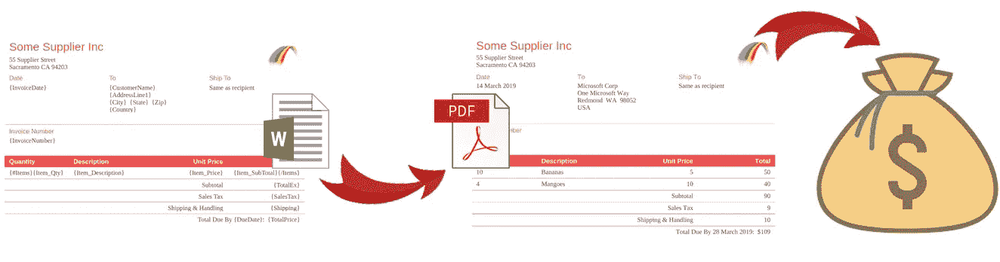
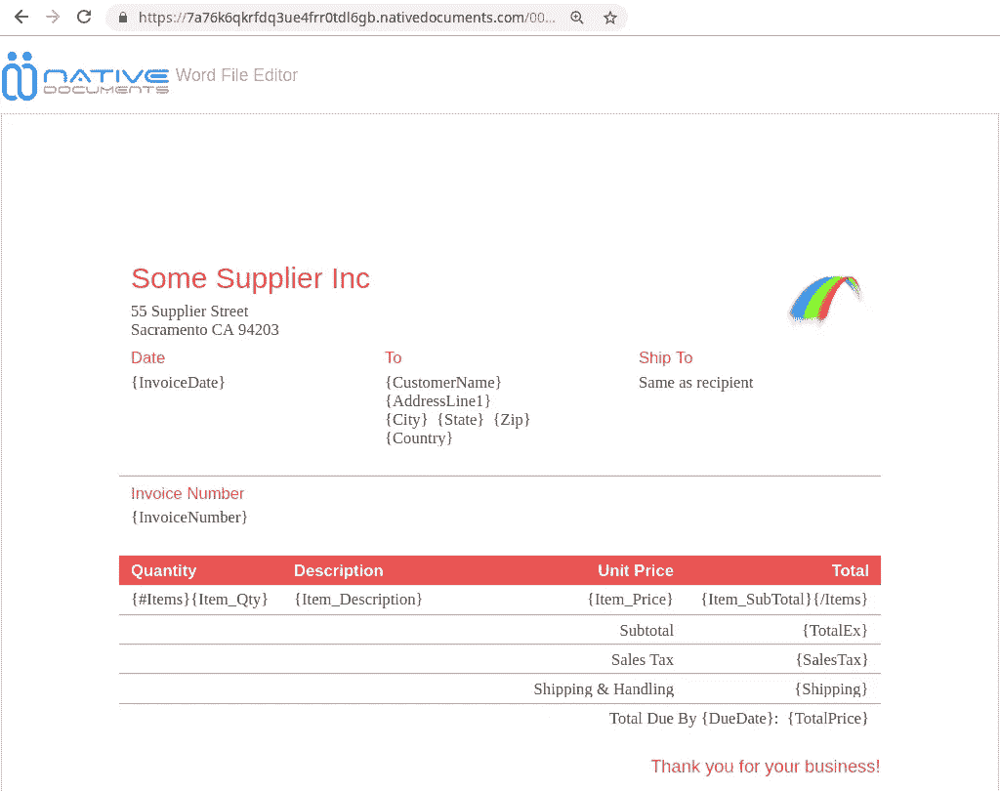

# 用 Javascript 生成 pdf 以获得乐趣和利润！

> 原文：<https://medium.com/hackernoon/generating-pdfs-in-javascript-for-fun-and-profit-c7af594cf697>



直到最近，用 Javascript 创建复杂或优雅的 pdf 仍然是一个挑战。

在这里，我将一步一步地向您展示获得漂亮 pdf 的最小阻力的途径。剧透:最近通过 Javascript 将 docx 转换成 PDF 成为可能:-)

接下来是我将在六月份西雅图 PDF 协会会议上的演讲中涉及的一些内容。

从 1000 英尺开始，你有三个主要选择:

*   第一种是直接创建 PDF，使用 [pdfkit](http://pdfkit.org/) 、 [jsPDF](https://github.com/mrrio/jspdf) ，或者更高级别的 [pdfmake](http://pdfmake.org) 。Pdfkit 就像 Java 世界中的 iText。基于 pdfkit 的 Pdfmake 有自己的格式来表示富文本；它将其转换为 PDF 格式。
*   第二种方法是创建 HTML，然后将其转换为 PDF。这些天大概在用[木偶戏](https://pptr.dev/)。
*   第三种方法是创建一个 docx，然后将其转换为 PDF。

换句话说，您可以直接创建 PDF，或者使用 HTML 或 docx 作为中间格式。

因为现在用 Javascript 将 docx 转换成 PDF 很容易，所以 docx 方法是阻力最小的途径——特别是对于商业文档(提案、发票、合同等)。

首先，内容通常已经是 Word 文档格式，这使您的工作变得容易。

更重要的是，预先考虑持续的维护(内容和格式的改变)是值得的。作为一名开发人员，这是您想要做的事情吗？还是让企业自己来做更好？如果它是一个 Word 文档，那么业务用户可以更新文档而不会打扰你。

几年来，用 Javascript 创建 docx 一直很容易，但直到最近，将它从 Javascript 转换成 PDF 才是症结所在。令人高兴的是，这现在是可行的——不需要调用一些 SAAS API，使用 LibreOffice 或任何类似的东西。

使用 [docx.js](https://docx.js.org/) 你可以以编程方式构建你的 Word 文档(就像 pdfkit 和 jsPDF 允许你构建 PDF 一样)。但这可能不是一个好主意，因为为了最终的 pdf 看起来正确，您想要使用的任何功能都必须在创建 docx 和 docx 到 PDF 步骤中得到支持。例如，合并表格中的单元格，或者添加水印。

我们想要的是一种创建 docx 的简单方法，然后确信我们的 docx 将被干净地转换成 PDF。

对于这一点，一种“模板化”的方法是答案:基本上，你用你想要的布局创建一个 docx 模板——在 Microsoft Word、LibreOffice、Google Docs、Native Docs 或其他什么中——然后使用模板引擎替换“变量”。

**第一步:填充 docx 模板**

这里我们将在 node.js 中使用 [docxtemplater](https://www.npmjs.com/package/docxtemplater)

比如你想要一张 PDF 发票。由于使用 Word 模板的部分原因是商业用户很容易将它变得漂亮，所以让我们从微软设计并包含在 Word 中的一个发票模板开始。

[](https://demo.nativedocuments.com/editUrl?url=https%3A%2F%2Fwww.nativedocuments.com%2Fassets%2Fdocs%2Farticles%2Finvoice-template.docx)

invoice-template.docx

您可以看到我添加了一些变量(按照 docxtemplater 的要求，用花括号表示)。

你可以点击图片在我们的 Word 文件编辑器中查看 docx。点击 [invoice-template.docx](http://www.nativedocuments.com/assets/docs/articles/invoice-template.docx) 下载/使用，代码如下。

作为一个 Javascript 库，docxtemplater 接收 JSON 格式的数据:

请注意项目数组。表格行对每个项目重复。您可以在该表行的开头和结尾看到 docxtemplater 对 repeat/ [循环](https://docxtemplater.readthedocs.io/en/latest/tag_types.html#loops)的标记。

出于演示的目的，我们将在 javascript 中提供:

要试用它，请按照其[说明](https://docxtemplater.readthedocs.io/en/latest/installation.html#node)安装 docxtemplater:

```
npm install docxtemplater
npm install jszip@2
```

那么它只是:

```
node invoice-template-docx.js
```

您会得到一个填充的发票实例:


invoice-instance.docx

请注意，表格行已被重复，所有变量都被替换。

如果您自己运行代码，您可以通过在您最喜欢的 docx 编辑器或我们的编辑器中打开 invoice-instance.docx 来验证结果:[单击此处](https://canary.nativedocuments.com/)然后拖放您的 docx。

**第二步:将 docx 转换为 PDF**

到目前为止一切顺利。现在我们只需要将填充的发票实例转换成 PDF。

为此，我们将使用 docx-wasm，这是我们在今年早些时候发布的 Native Documents 中的一个节点模块。我们在 Native Documents 的面包和黄油是基于 web 的文档编辑/查看组件[，我们在上面的](https://demo.nativedocuments.com/editUrl?url=https%3A%2F%2Fwww.nativedocuments.com%2Fassets%2Fdocs%2Farticles%2Finvoice-template.docx)中使用它来显示 [invoice-template.docx](http://www.nativedocuments.com/assets/docs/articles/invoice-template.docx) ，这个节点模块使用 Word 兼容的页面布局代码生成 PDF 输出。换句话说，页面布局非常接近地再现了 Word 的功能，因此也可以用于高质量的 PDF 输出。

首先，安装它:

```
npm install @nativedocuments/docx-wasm
```

将 node.js buffer 对象中的 docx 转换为 PDF 的过程如下:

你需要一个 ND_DEV_ID，ND_DEV_SECRET 对来使用这个模块。你可以在 https://developers.nativedocuments.com/的[获得免费钥匙](https://developers.nativedocuments.com/)

将它们复制到 docx.init 调用中(或者，您可以将它们设置为环境变量)。

我没有在这里发布 PDF，因为它看起来和发票实例 docx 一样。

**将所有这些放在一起**

下面是结合了步骤 1 和步骤 2 的 Javascript。

要尝试一下，下载 [invoice-template.docx](http://www.nativedocuments.com/assets/docs/articles/invoice-template.docx) 然后:

```
node docx-template-to-pdf.js
```

**部署选项**

在 AWS Lambda 上有一个很好的运行方式。有了 Lambda，你可以轻松地伸缩，而且不用的时候也不用花钱买服务器。更多信息请参见我即将于六月在西雅图举行的 PDF 协会会议上的演讲！同时，[docx-to-PDF-on-AWS-Lambda](https://github.com/NativeDocuments/docx-to-pdf-on-AWS-Lambda)向您展示了如何在 Lambda 上执行 docx-PDF 部分。添加 docx 模板很简单。

现在还可以在浏览器中将 docx 转换成 PDF 格式，减少了服务器的负载，并为离线操作开辟了道路。[docx-wasm-客户端](https://github.com/NativeDocuments/docx-wasm-client-side)向您展示如何在客户端执行 docx 到 PDF 部分。