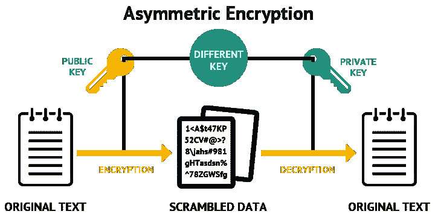

# 生成 RSA 私钥和公钥

> 原文：<https://medium.com/hackernoon/generating-rsa-private-and-public-keys-b82a06db6d1c>

我们使用宋承宪，HTTPS 等。，在日常基础上。这些程序依靠 RSA 非对称密钥加密和解密来提供安全性。

非对称密钥加密涉及两个密钥，**公钥**和**私钥**。公钥用于加密消息，私钥用于解密消息。



在本帖中，我们将研究如何使用简单的数学方法生成公钥和私钥对。

为了简单起见，我们将使用较小的数字。

# 公共密钥

公钥由两个数字组成，分别叫做 **e** 和 **n** 。

## n 代

生成两个素数。

> 质数 1，p = 7
> 
> 质数 2，q = 17
> 
> n = p x q
> 
> n = 7 x 17 = 119

因此 **n = 119**

## e 代

1.  计算 n，ϕ(n 的百分数)= ( p -1) x (q -1)
2.  选择一个与ϕ(n 的最大公约数(gcd)为 1 的随机素数)

> ϕ(n)=(7—1)x(17—1)= 6 x 16 = 96

1 到 96 之间的质数是，

> 2, 3, 5, 7, 11, 13, 17, 19, 23, 29, 31, 37, 41, 43, 47, 53, 59, 61, 67, 71, 73, 79, 83, 89

让我们选择一个 GCD 为 1，96 的随机素数

我们不能用 2，因为 2 是 96 和 2 的 GCD。

我们不能用 3，因为 3 是 96 和 3 的 GCD。

13 是个好数字，因为 1 是 96 和 13 的 GCD。

现在，我们得到了， **e = 13**

***公钥(e，n ) = ( 13，119 )***

# 私钥(d，n)

我们已经生成了 n，也就是 119。现在，我们需要生成 **d** 。

## d 代

*d 是(e)与ϕ(n 的乘法逆运算)*

即求 d，它是 e (13)与 96 的乘法逆

```
e = 13, ϕ(n) = 96

d * e ≡ 1 mod ϕ(n)
d * 13 ≡ 1 mod 96i.e., ( d * 13 )% 96 should yield a remainder of 1
```

这需要一个接一个地计算数字，直到我们找到正确的数字。这很难手工完成，所以让我们使用一个小的 python 程序来生成 d，

```
# Python program to find modular 
# inverse of a under modulo m

# A naive method to find modulor 
# multiplicative inverse of 'e' under modulo 'm'
def modInverse(e, m) :
    e = e % m;
    for x in range(1, m) :
        if ((e * x) % m == 1) :
            return x
    return 1

# Driver Program
e = 13
m = 96
print(modInverse(e, m))
37
```

**d 的计算值为 37**

## 验证 d

```
d * e ≡ 1 mod ϕ(n)d = 37
d * e = 37 * 13 = 481
96 * 5 = 480481 % 96 = 1thus 
d * e ≡ 1 mod ϕ(n)
```

***私钥(d，n ) = ( 37，119 )***

# 迄今为止

我们已经使用简单的数学方法生成了一个公钥和一个私钥。

> 公钥(e，n ) = ( 13，119)
> 
> 私钥(d，n ) = ( 37，119)