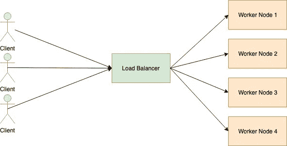
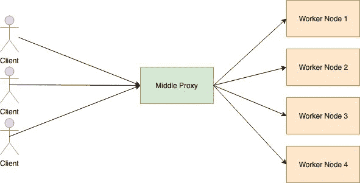
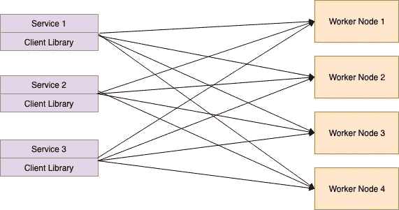
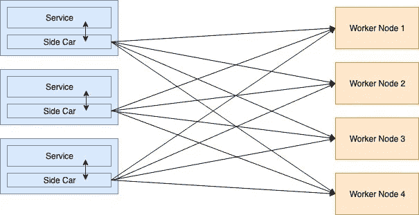
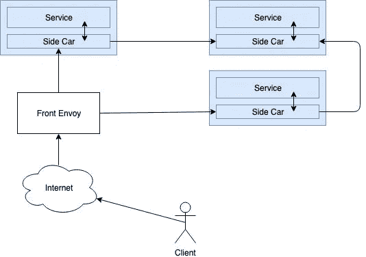
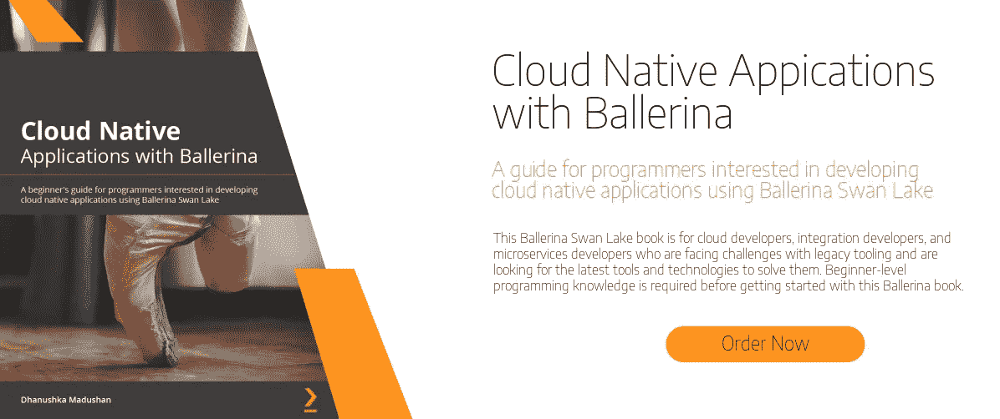

# Envoy 代理和负载平衡简介

> 原文：<https://medium.com/hackernoon/gentle-introduction-to-the-envoy-proxy-and-load-balancing-b3e3eb72c71f>

对于一个 DevOps 工程师来说，负载均衡是一个很流行的词。您需要找到一种方法来扩展系统，以便当大量流量进入您的系统时，系统能够正确地管理它。一种替代方法是提高正在运行的单个节点的效率。添加更多节点并在这些节点之间分配作业是另一种选择。拥有许多节点还有另一个高可用性的好处。

Envoy proxy 是一种代理服务，在不断增长的趋势下，它已被用作服务网格。在这篇博文中，我们将看到 Envoy 代理的负载平衡方面。

# 负载平衡器

负载平衡器是一个端点，它监听进入计算集群的请求。当应用程序进入负载平衡器时，它会检查可访问的工作节点，并在工作节点之间分发请求。负载平衡器具有以下特征。

*   服务发现:检查可用的工作节点
*   健康检查:定期检查工作节点的健康状况。
*   负载平衡:在工作节点之间分发请求。

# 代理人

代理是存在于两个端点之间的中间元素。代理服务将接受来自客户端的请求，并将它们转发到目标服务器。有两种代理。正向代理和反向代理。除了将应用程序直接发送到端点，我们还可以通过代理发送它。这种代理类型称为转发代理。转发代理通常用于绕过防火墙限制，访问被阻止的网站。

反向代理是代理服务的一种形式，它接受传入的客户端请求，并将其传输到能够满足这些请求的服务器。结果将被路由回客户端。此外，代理还提供了对客户端请求的更多控制。它还可以缓存应用程序并加快网络的效率。反向代理用于

*   作为一种安全措施，当网站不允许直接连接时，启用间接访问。
*   向互联网用户传输内部内容。
*   以允许服务器之间的负载平衡。
*   禁用对网站的访问。

# 负载平衡拓扑

代理站在客户端端点和后端端点之间。根据代理服务的位置，负载平衡可以分为以下几种拓扑。

# 中间代理

来自客户端的所有请求都进入中间代理。中间代理将请求路由到工作节点。这种负载平衡器简单明了。

# 嵌入式客户端库

中间代理的最大问题是单点故障。如果中间代理服务器停机，那么客户端服务就无法访问后端设施。在这种形式的代理中，负载平衡是由客户端自己执行的，而不是主负载平衡。使用 gRPC 库，可以引入这种类型的机制。

在这种负载平衡器中，不断增长的复杂性成为一个问题。开发人员还需要为每个服务安装负载平衡组件。

# 边车代理

嵌入式客户端库中最大的问题是为每个服务构造通信元素的复杂性。客户机库被划分为容器，最新的趋势是使用容器技术。在设计分散式负载平衡器时，没有固定的编程语言。这就是所谓的边车。这种类型的代理服务应用程序被称为服务网格。SideCar 负责将客户请求发送到合适的后端服务。

Envoy 是 Lyft 用 C++语言发布的高质量反向代理。在服务网格中使用特使来互连服务。以下是特使代理使用的常用术语。

*   主机:能够进行网络通信的实体。
*   下游:向特使代理发送请求的主机。
*   上游:接收来自特使代理的请求的主机。
*   侦听器:可以通过下游连接到特使代理的命名网络位置。
*   集群:集群是一组逻辑相同的上游主机，envoy 可以连接这些主机。特使可以通过使用服务发现来发现集群。

# 前线特使代理人

从侧车代理端口，特使也可以配置为前端代理。前端代理被配置为来自公共互联网的请求的主要负载平衡器。这个代理也称为边缘代理。服务网格的整体架构如下。

这里，前端代理被用作输入互联网流量的负载平衡器。此外，在此执行 TLS 终止。然后通过边车代理请求路由到适当的设施。服务网格可以识别通过服务发现可访问的服务。它还为处理故障转移提供了电路制动特性。总的来说，Envoy 提供了许多特性来实现服务网格。

# **特使代理中负载平衡器的类型**

当代理需要获取到上游集群中主机的连接时，集群管理器使用以下策略来路由流量。

*   Round Robbin Rout 负载到每个工作节点(上游主机)的循环顺序。所有工作节点被认为是相同的，并且所有节点获得相同的负载量。
*   随机选择工作节点并路由流量。众所周知，这比循环 Robbin 策略执行得更好。
*   加权最小请求此策略基于负载平衡时保持的连接数。假设有两个规格相同的工作节点。由于某种原因，第一个工作节点需要更长的时间来响应。因此，它还必须保持与第一个工作节点的连接时间长于与第二个节点的连接时间。在这种情况下，负载平衡器可以将更多的权重放在第二个工作节点上，而不是将流量发送到第一个节点。
*   原始目的地当给定的连接需要连接到某个特定的上游主机时，使用这种类型的负载平衡器。通过读取客户端的元数据选择的主机。

除了负载平衡，Envoy 还提供了以下特性来实现服务网格。

*   动态服务发现
*   TLS 终止
*   HTTP/2 和 gRPC 代理
*   断路器
*   健康检查
*   基于%流量分割的分阶段部署
*   故障注入
*   丰富的指标

我们将在下一篇文章中讨论这些特性。这篇文章将为您提供关于 Envoy 代理的基本介绍，以及它如何实现负载平衡。另一篇文章再见。干杯:)

# 参考

*   [https://devform . netlify . com/introduction-to-envoy-proxy-load-balancing/](https://devform.netlify.com/introduction-to-envoy-proxy-load-balancing/)
*   [https://www . envoy proxy . io/docs/envoy/v 1 . 5 . 0/intro/arch _ overview/load _ balancing](https://www.envoyproxy.io/docs/envoy/v1.5.0/intro/arch_overview/load_balancing)
*   【https://www.jscape.com/blog/load-balancing-algorithms 
*   [https://blog . envoy proxy . io/introduction-to-modern-network-load-balancing-and-proxy-a57f 6 ff 80236](https://blog.envoyproxy.io/introduction-to-modern-network-load-balancing-and-proxying-a57f6ff80236)

[现在你可以在亚马逊上预订芭蕾舞书的云原生应用。点击此处预购该书。](https://www.amazon.com/-/en/Dhanushka-Madushan-ebook/dp/B0912GTBPQ/)