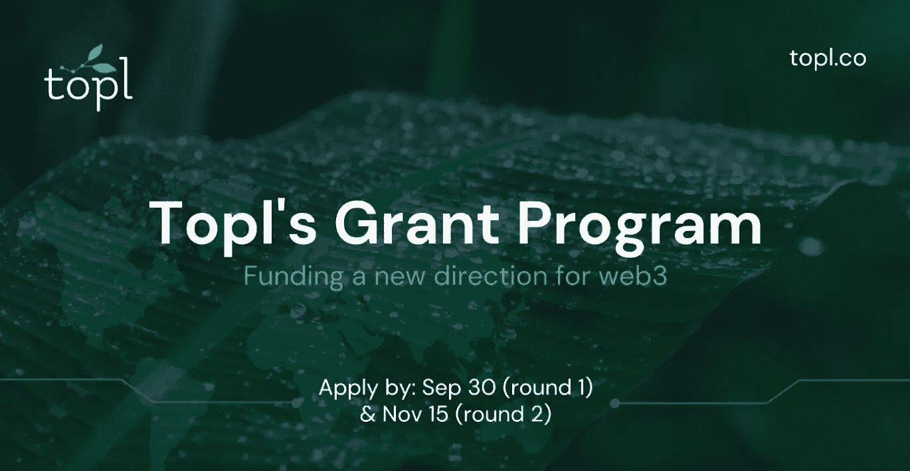
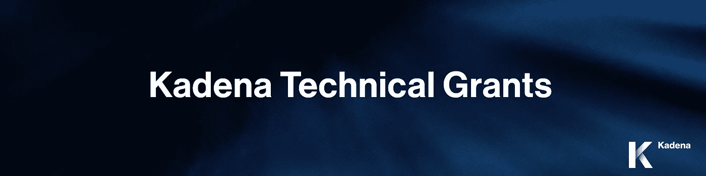
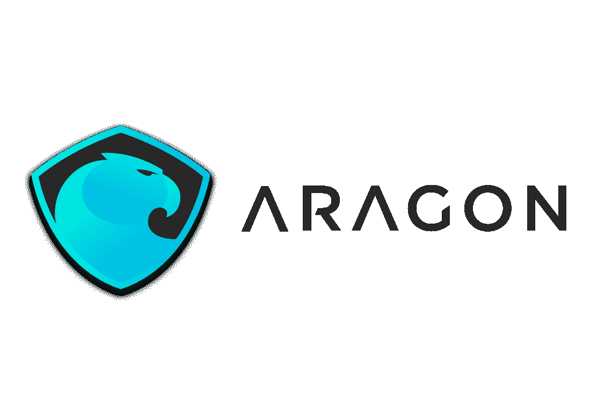
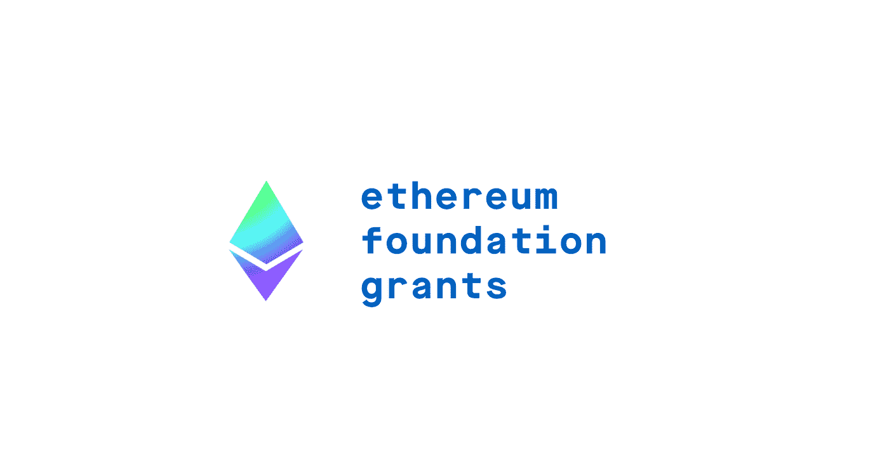
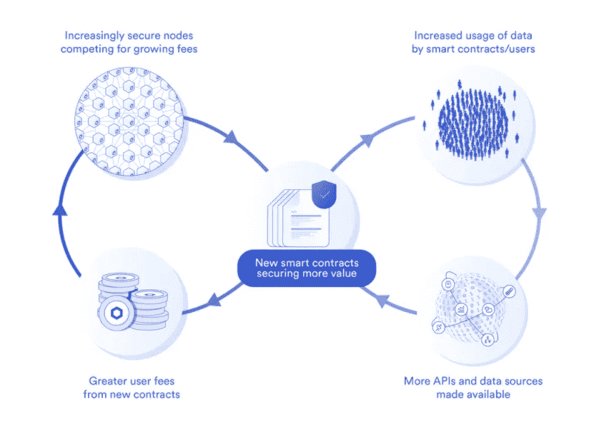
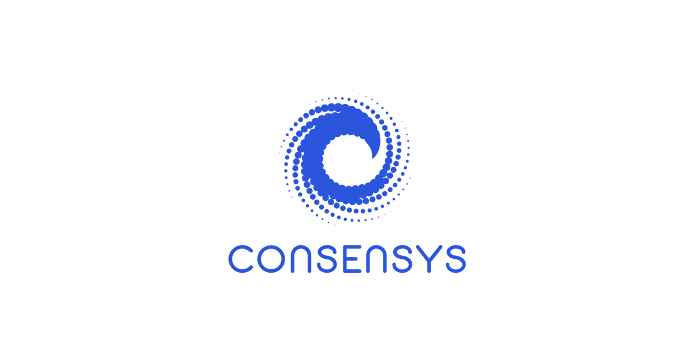
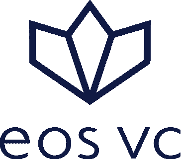
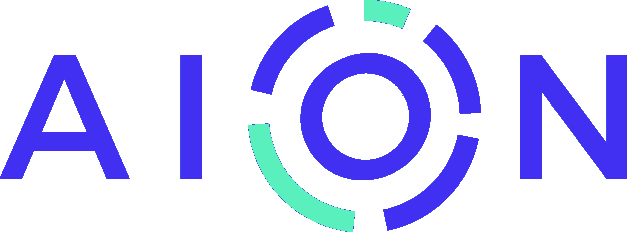
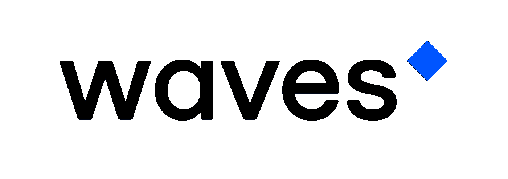
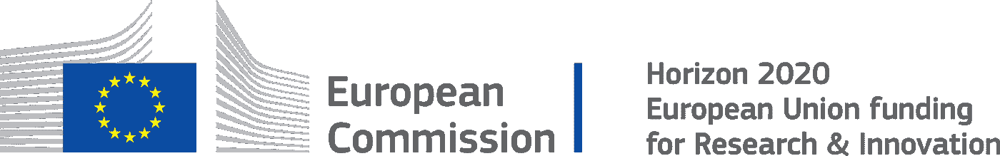

# UPD 22:为构建区块链生态系统获得报酬:最新资助清单(2021)

> 原文：<https://medium.com/hackernoon/get-paid-for-building-the-blockchain-ecosystem-an-up-to-date-list-of-grants-6ed5bd9a0e03>

*关于作者:Denys Andrushchenko 是为 it 公司提供文案服务的* [*WTFBit*](http://wtfbit.com) *的所有者。他探索围绕 Web 3.0 的技术，并帮助公司将技术理念转化为引人入胜的故事。*

你是一个随需应变的区块链开发人员，还是刚刚学会如何编程分布式账本系统？利用这些区块链发展基金获得真正的实践和财政支持。几乎所有的区块链项目都需要开发者的支持，所以他们中的一些人正在实践一种资助的方式来参与社区并兑现他们的承诺。这可能是你参与的机会。

# Topl 为影响驱动的区块链建设提供 100 万美元的首次资助计划

最后， [SDG 的人们](https://www.globalgoals.org)在他们的街道上开了一个派对！在 2022 年底之前， [Topl 正在寻求资助](/topl-blog/announcing-topls-1-million-inaugural-grant-program-for-impact-driven-blockchain-building-70e66f7994ff)第一轮*设计师、远见卓识者和变革者*，旨在彻底改变做生意的方式和市场的运作方式——其中*影响力是关键驱动力*。

**项目可以处于任何阶段；他们只有三个要求:**

*   你的项目将**建立在 Topl 的**独特的 L0 区块链协议上，但是可以结合其他 web3 技术。
*   补助资金将用于推动**具体的发展里程碑**，最理想的结果是至少启动你的 MVP。
*   如果你成功了，这个世界将会变得更加美好。

**这里有一个特别的重点**:

*   移动无障碍；
*   可持续性；
*   影响非功能性测试；
*   身份证明；
*   互操作性。

**资助**:2022 年总资助金额为 100 万美元:50 万美元现金，50 万美元代币(2023 年第四季度可使用)。

**关于资格标准**和其他细节，请参考[官方公告](/topl-blog/announcing-topls-1-million-inaugural-grant-program-for-impact-driven-blockchain-building-70e66f7994ff)。

**截止日期**:两轮——2022 年 9 月 30 日和 11 月 15 日。

**申请表**:[https://topl.typeform.com/to/u1gCxpFe](https://topl.typeform.com/to/u1gCxpFe)

# 嘉手纳技术赠款

技术赠款资助通过降低准入门槛、提供新用途、打开新市场等方式支持 [Kadena](https://www.kadena.io) 生态系统发展的项目。这些资助通过激励性和非激励性资助类别来鼓励创新，并奖励取得成果的参与者。

**如何提交申请资助的建议书？**

Kadena 的技术资助流程分为两个阶段:资助申请和资助交付。

流程总结

*   [资助申请](https://github.com/kadena-io/technical-grants)

1.  确定焦点区域
2.  提交申请
3.  审查和决定
4.  双方协议

*   赠款交付

1.  里程碑进度报告
2.  完成情况和奖励分配

**资助**:单个项目的最高资助额设定为**5 万美元，**较小的申请获得*更快的批准*。

**截止日期**:进行中。

# 阿拉贡的鸟巢计划[已关闭]

Aragon 项目是一个社区，其使命是通过为分散组织的蓬勃发展创造工具来赋予自由。阿拉贡社区一直在寻找想要帮助争取自由的个人。

**如何提交资助申请？**

*   阅读介绍阿拉贡巢穴的公告
*   浏览当前[提案](https://github.com/aragon/nest/issues)寻求资助
*   浏览当前的[资金申请](https://github.com/aragon/nest/pulls)
*   确保赠款提案中没有与你的想法或项目相似的现有提案
*   请参见[指南以提交](https://github.com/aragon/nest/blob/master/Guide_for_submitting_a_request_for_funding.md)新的资金申请
*   创建一个拉请求，将您的提交合并到嵌套存储库中

**注:**

在提案阶段，公司决定是否实施该想法，以及是否应该考虑给予资助。在资金申请阶段，项目重点在于确定团队是否能够交付成果，以及时间表、里程碑和交付成果的可行性。

如果有一个提议与你的想法或项目很接近，加入到那个提议的讨论中，看看你的想法或项目是否可以整合到现有的提议中，或者你是否应该创建一个新的提议。

**资金:**高达 150，000 美元的 DAI，分成若干部分，按实现的交付成果支付。最高 30，000 ANT，在所有交付物准备就绪且项目成功完成时发放。

**截止日期:**拨款[分阶段](https://aragon.org/blog/nest-grants-by-the-numbers)。

# 以太坊的开发人员[UPD:现在是一个超感者]

DEVgrants 是一个为以太坊平台和基于以太坊的项目提供资助的项目。现在，它已经更名为[生态系统支持计划](https://esp.ethereum.foundation/en/)或 ESP。它为那些对以太坊生态系统感兴趣的开发者提供了一个在他们的项目上花费大量时间并完成它的机会。

**如何提交资助申请？**

*   [进行调查](https://esp.ethereum.foundation/en/inquire/)并概述预期工作
*   展示详细说明时间表和预计工作时间的项目计划
*   提供报告项目进展和成果的方法
*   如果您还有疑问，请联系发展基金管理员([grants@ethereum.org](mailto:grants@ethereum.org))

**注:**

赠款专门用于推动已经在进行的努力。换句话说，如果你还没有开始你的项目，你应该在申请之前*开始。*

**供资:**发展赠款(ESP)的目标是每个项目需要 1，000 至 10，000 美元。

截止日期:进行中。

# IPFS 创新资助计划[目前已结束]

为了继续推动去中心化网络的发展，不可阻挡的域名团队宣布了 IPFS 创新基金项目，以支持利用 IPFS 的开创性项目。

**要求:**

*   你的产品使用 IPFS 技术
*   你是一个开发者(或一组开发者)，可以(在 2021 年 3 月 15 日之前)发布产品
*   你有一个活的产品，一个工作原型，或者一个 MVP

**资助:**高达 2，500 美元+额外福利:

*   免费资格。密码还是。zil 域
*   通过 Unstoppable Domain 的社交渠道和用户向 20 万以上的潜在用户营销您的产品
*   顶级区块链企业家的指导，如我们的联合创始人 Brad Kam

**截止日期:**2021 年**2 月 28 日**前申请**；该产品必须在 2021 年 3 月 15 日前推出。**

**若要申请，请前往[https://unstoppabledomains.com/grants](https://unstoppabledomains.com/grants)并输入您的信息。请务必在描述中提及“ *IPFS 项目计划”*。**

****

# **链接赠款计划[新]**

**在 [Chainlink 的网站](https://chain.link/community/grants)上可以找到几种类型的资助:**

*   **[社区补助](https://chainlinkgrants.typeform.com/to/efEbsq)**
*   **[整合资助](https://form.typeform.com/to/hXk0hruN)**
*   **[Bug 赏金计划](https://hackerone.com/chainlink?type=team)**
*   **研究项目(电子邮件[research@chainlinklabs.com](mailto:research@chainlinklabs.com)**
*   **[社会影响赠款](https://form.typeform.com/to/pAL9WhQa)**

****截止日期:**正在进行**。****

****

# **理事会赠款(目前已关闭)**

**ConsenSys 是一家全球性的区块链技术公司，致力于为去中心化的世界构建基础设施、应用和实践。ConsenSys Grants 将资助建设基础设施、工具和组件的项目，以改善以太坊的开发者和用户体验。**

**如何提交资助申请？**

*   **选择授权类别**
*   **浏览当前的授权标准**
*   **提交您的[资助申请](https://consensysgrants.submittable.com/submit)(检查它现在是否可用)**
*   **期待接受通知**

****注:****

**项目必须有利于整个生态系统，而不是一个单一的实体。发布软件的项目最终必须在适当的 OSI 许可下开源，并且必须有一个协作的社区治理模型或一个定义良好的实现路径。**

****资助:**在整个 2019 年，ConsenSys 通过 GitCoin 发放了价值 55 万美元的赠款，金额分别为 1 万美元和 2.5 万美元。**

**截止日期:2020 年 1 月 14 日。**

****

# **EOS VC(目前不接受)**

**欢迎早期项目和已成立的公司通过 [EOS 风险投资计划](https://vc.eos.io)申请资金。EOS VC 专注于开发 eos.io 生态系统，并对利用 eos.io 区块链软件的项目进行风险投资。**

****如何提交资助申请？****

*   **浏览风险投资伙伴关系的愿景**
*   **用[提交你的项目，用](https://docs.google.com/forms/d/e/1FAIpQLSemBIYCtBlMttHj5wxVECmcj5k-JdutLr4Jtj0BrfFWZlI_5g/viewform)申请资助**
*   **使用[模板](https://docs.google.com/presentation/d/1mzuyZZ7ZLO2ck1EYwd4I7d4V0EgJbXwhBPfaaN2gQQk/edit%23slide=id.g36575987aa_9_0)来规划你的想法**

****注:**提供一份简短的执行摘要和一份建议书推介材料，内容涵盖您发现的问题以及如何使用 eos.io 区块链软件解决该问题。基金经理将使用自己的选择标准来决定哪些创新的区块链技术项目将获得支持。**

****经费:**刚好够。**

****截止日期:**进行中。**

****

# **儿童基金会(截止日期临近)**

**[联合国儿童基金会创新基金](http://www.unicefinnovationfund.org)是一个集资工具，用于快速评估、资助和发展在新兴市场开发的开源解决方案。虽然它超越了区块链技术，但它是团队(包括开发人员和企业家)可以使用的工具之一。**

****如何提交资助提案？****

*   **查看有关最新基金公告的信息**
*   **检查所有资格要求**
*   **阅读完整的**意向书(REI)** 文档，了解提交流程**
*   **要为你的科技创业申请资金，请访问**提交页面****
*   **填写表格，提交您的意向**

****注:**将定期审查提交的材料。入围公司将在提交后三个月内收到通知。只有入围的供应商将被联系，然后被纳入下一阶段的程序。**

****融资:**该基金目前已经筹集了 1790 万美元，主要投资于三个投资领域:青少年产品、基础设施和实时信息。**

****截止日期:**进行中(最晚是 2022 年 1 月 1 日)。**

****

# **永恒之塔的奖金和赠款**

**Aion 网络是一个多层区块链网络，旨在支持未来许多区块链的存在，以解决独特的行业问题，并为现代世界的服务提供动力。**

****如何参与当前的奖金&补助？****

*   **了解[更多关于](https://learn.aion.network/docs/claim-bounties-or-submit-grant-proposals) AION 任务、流程如何运作、不同类别的资助等等**
*   **查看[奖金页面](https://aion.network/bounty/)或[开放奖金](https://aion.network/bounty/)以查看当前社区可用的提议**
*   **如果你看不到你想做的事情，请随时[提交建议](https://aionnetwork.typeform.com/to/RSz4EL)**
*   **付款将在项目评估后处理。你将被告知你的申请状态**

****注意:**激励计划的任务是资助那些将会发展一个关注主流采用的健康开源社区的项目和计划。以下是一些关键原则:**

*   **直接有利于 Aion 生态系统和更广泛的社区作为一个整体**
*   **共同创建有助于开发人员构建 dApps 的项目**
*   **促进开源**
*   **与社区内的其他项目协作**

**奖金属于但不限于以下类别:新功能；文件；捕虫；翻译；研究(技术性和非技术性)；测试覆盖率。**

****资助金额:**5000 美元以上**

****截止日期:**进行中。**

****

# **恒星伙伴计划**

**Stellar 是一个连接银行、支付系统和人的平台。[Stellar.org](https://www.stellar.org/lumens/stellar-partnership-grant-program/)正在接受领先组织的提案，这些组织正在构建恒星网络，以改善全球金融格局并促进金融包容性。**

****如何提交资助提案？****

*   **如需查看过去赠款获得者的名单，请点击[此处](https://www.stellar.org/partnership-grant-recipients)**
*   **出于考虑，请填写此[申请表](https://stellarform.typeform.com/to/ZcBxs6)**
*   **赠款管理员将选择最有希望的提案，并安排电话或面谈**
*   **申请人将在 15 天内收到通知**

****注:**赠款规模取决于伙伴关系为生态系统增加的价值。授予取决于某些里程碑和要求的最终完成。该计划的主要重点是目前的锚和交流。**

****资助:**恒星发展基金会已经为该计划拨款 250 亿流明(XML ),以激励做出杰出贡献的机构。**

****截止日期:**进行中。**

****

# **Waves 赠款**

**[Waves Labs](https://waveslabs.com/grants.html) 是一项支持有才华的开发者和有前途的初创公司的计划，这些公司专注于构建将形成 Web 3.0 主干的分散技术。Waves Grants 是一个面向对基于 Waves 技术开发新产品感兴趣的创业公司和个人开发者的项目。**

****如何参与当前的资助计划？****

*   **填写一份[申请表](https://airtable.com/shr6gbeELDvmYGX31)，尽可能详细地描述你的经历**
*   **附上一份简历和作品样本**
*   **申请过程中可能需要面试**
*   **所有申请人将通过电子邮件被告知决定**

****注:** Waves Labs 寻找对区块链的大规模采用至关重要的几个特定用例的解决方案:**

*   **加密和代币支付**
*   **受管制代币**
*   **托管**
*   **忠诚度计划研究**
*   **加密和代币支付**

****截止日期:**进行中。**

****

# **欧盟委员会[活跃，在 ngi.eu 查看新的截止日期]**

**在与下一代互联网(NGI)的合作中，欧盟通过其 Horizon 2020 计划提供了一系列资助。查看他们网站上的公开电话:[https://www.ngi.eu/opencalls/](https://www.ngi.eu/opencalls/)**

## **[旧]**

**在“地平线 2020”计划下，欧盟联合资助研究和创新，在全欧洲范围内实施。该计划提供了一套简化的规则，并从根本上最大限度地减少官僚程序。该计划支持广泛的活动:从研究到示范项目和准备进入市场的创新。**

**其中一项活动名为“*区块链社会公益活动”，设立了五个奖项，每个奖项价值 100 万€，奖励给利用区块链技术开发分散解决方案、带来积极社会变革的创新者。***

*****如何申请？*****

*   ***查看竞赛规则***
*   ***使用[应用模板](https://ec.europa.eu/research/participants/data/ref/h2020/other/prizes/contest_at/h2020-prizes-at-bc-social-good_en.pdf)***
*   ***比赛结束后，将根据评审团的决定颁发奖项***

*****注:**大赛面向个人、团体、组织、公司。主要要求:***

*   ***对社会、环境和/或经济的积极影响——通过大量公民的采用得到证明；***
*   ***透明度、问责制和隐私方面的改进；***
*   ***可用性和包容性——适用于所有人的解决方案；***
*   ***大规模可行性——解决技术限制；***
*   ***欧洲附加值—比传统解决方案更有效、更高效的解决方案。***

*****资助:**€500 万，分五批发放，€各 100 万。***

*****截止日期:【2019 年 4 月 2 日——是利益登记的截止日期。*****

***2019 年 9 月 3 日—提交申请的截止日期。***

## ***相似(美国)***

***美国财政部金融创新和改革办公室启动了两个创新项目，旨在简化政府的金融流程，***

*   ***数字端到端效率(DEEE)***
*   ***用于赠款支付的区块链***

***他们的目标是每年节省数百万美元的财务管理成本。这两个项目都将通过战略性地使用新兴技术来重新想象联邦政府如何开展业务。***

***要了解更多信息，请联系[cindy.good@fiscal.treasury.gov](mailto:cindy.good@fiscal.treasury.gov)(DEEE)或[craig.fischer@fiscal.treasury.gov](mailto:craig.fischer@fiscal.treasury.gov)(资助支付区块链)。摘自[Treasury.gov](https://www.fiscal.treasury.gov/fit/updates/deee-blockchain-fit-update.html)。***

# ***如何使用智能合约自行发放补助金？***

***Gitcoin Grants 是一个社区，开发者可以通过奖金在开源项目中合作并将其技能货币化。有了 Gitcoin 的资助，你可以支持激动人心的项目。您还可以在任何 ERC20 令牌中创建 gitcoin 授权。目前，在 [Gitcoin Grants](https://gitcoin.co/grants/) 上有近 50 项资助可用。***

***[GivETH](https://giveth.io/) 是一个致力于通过使用区块链技术让世界变得更美好的社区。其旗舰产品 Giveth 捐赠应用程序(DApp)正在努力将新的治理模式引入非营利领域。Giveth Galaxy 的创建是为了培养一个更大的组织网络，帮助“建立一个真正去中心化的捐赠未来”***

****想要更多资助还是你知道其他资助？请在评论中告诉我。*[*wtf bit Media*](http://wtfbit.com)*以深入浅出的方式，用幽默的手法，写下了区块链和新兴科技。我们还与不同的客户合作，帮助他们有效地向受众传递信息。****