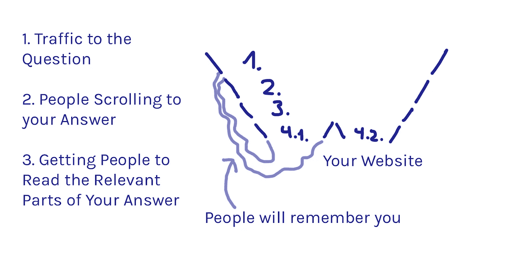

# 从 Quora 获取流量

> 原文：<https://medium.com/hackernoon/get-traffic-from-quora-6daf2cf10c0a>

Quora 营销由许多部分组成:

*   决定 Quora 如何适应你的营销计划
*   树立良好的形象
*   寻找正确的问题
*   写出人们想看的答案
*   从你的回答中获取流量

这篇文章关注的是如何最好地让人们离开 Quora，来到你的网站。这是免费电子书《Quora 营销终极指南》的摘录。这篇文章假设你已经知道了 Quora 的基础知识，以及如何开始 Quora 营销。如果不是这样，我的书可以帮你很多！😊现在来看看流量:

# 我如何让人们改变信仰？

现在让我们来定义你的漏斗。在 Quora 上你可以有两个目标:创造知名度和产生流量。这两者并不相互排斥，所以无论如何你都应该努力让人难忘。

一个单一的答案往往卖不出去，或者更糟，甚至不会让读者点击你答案中的链接，即使他们喜欢他们所读的内容。

营销人员经常说，你需要七个接触点才能让一个人转变。如果你的读者记得你的答案，他们更有可能转化，因为他们已经多次看过你的内容。

# 对于那些不跟随漏斗的人

如果他们现在不需要你的解决方案，他们仍然应该记得你，因为他们可能会记得你。当他们遇到你解决的问题时，你应该是他们考虑的人。当他们不读你的答案时，你应该给他们找到你的方法。让你的一件事容易被记住。确保当他们以后想起你的时候，他们知道在哪里可以找到你。

**什么是漏斗？**让我从一本我喜欢的书中抄下一页来定义漏斗是什么:

> *“每个漏斗都有始有终。一开始，我们有大量从未听说过我们产品的人。最后，我们拥有最小的数量——这个星球上所有购买我们产品的人。*
> 
> *因此，一个完美的漏斗的图形表示是一个始端和末端直径相同的管道。这意味着 100%的人买了你的产品。*
> 
> *最好的漏斗中最好的是一个永不停止的管道。这意味着人们总是一次又一次地回来购买你的产品。*
> 
> *成长黑客的终极目标是始终争取最佳漏斗中的最佳。如果你的漏斗在某个地方变窄了或者不是无限的，那么这就是它需要改进的地方。”–*阿拉丁快乐

# 让他们点击

让我们从你的目标开始:如果你想让人们转化，你需要他们点击某个地方的链接。这可能在你的答案或你的个人资料中。他们也可能从你的主题简历中复制信息。你的主题简历中不能有链接。

这就产生了两个问题:

*   他们如何找到链接？
*   他们为什么要点击它？

为了获得有针对性的流量，你应该集中精力从显示你的答案的问题页面收集你的观点。因此，为了获得更多的观点，你必须选择正确的问题并写出好的答案。这两个在本书中有各自的章节。

为了让人们进一步转化，他们必须点击一个链接。但这并不是它们旅程的终点。你还必须非常小心地把它们送到哪里。如果你想让他们成为你的客户，你需要把他们发送到一个可以让他们转化的页面。

你要发送的页面也应该和 Quora 的问题相关。Quora 的流量非常大，因为它允许你个性化你的网站。你不仅知道他们来自 Quora，还知道他们具体有什么问题。

漏斗表明，你应该选择流量大的问题，同时确保你的排名足够高。你经常需要在这两者之间找到一个好的平衡。剩下的就看你的回答了(还有题目生物)。你应该让人们阅读你的答案，记住你，这样他们更有可能阅读未来的答案，并让他们点击进入你的网站。你不应该就此打住。想想你的整个营销策略，以及你如何整合 Quora。

最困难的是让他们点击链接。实现这一点的主要因素是写好内容。那件事我帮不了你太多。你必须了解潜在客户的需求。

在本书的后面，我会给你更多关于你想在 Quora 上写的风格的建议。一般来说，卖得很软。仅仅因为你知道有人正在寻找问题的解决方案，并不意味着你应该立即推销你的产品。先暖和一下。不要要求太多。

# 在你的答案中哪里放链接

关于这一点的观点到处都是。有人说，你应该在每个答案的结尾提到你的业务，而且只能在答案的结尾。我不完全同意这一点。我认为，你应该这样做，如果你没有任何其他相关的网站链接。你应该试着以一种自然的方式在你的文本中传播链接。不要用太多。

# 从首页视图到客户

根据你想卖的东西，人们不会在看了一个答案后就签约购买你的产品。这就是为什么把它们发到你的博客上而不仅仅是你的主页上通常是个好主意。

把 Quora 营销和邮件营销结合起来也是个不错的主意。你的回答可能不足以让他们注册，但可能足以让他们收到邮件。你可以通过提供某种回报来增加收到电子邮件的机会，比如销售线索磁铁。

无论你把来自 Quora 的人送到哪里，都要注意这一点。

Quora 营销应该是你营销计划的一部分，而不是独立的东西。

如果你喜欢这篇文章，你肯定也会喜欢我的免费电子书:[“Quora 营销终极指南”](https://findbetterquestions.com/book)。

*最初发表于*[T5【findbetterquestions.com】](https://findbetterquestions.com/blog/get-traffic-from-quora)*。*